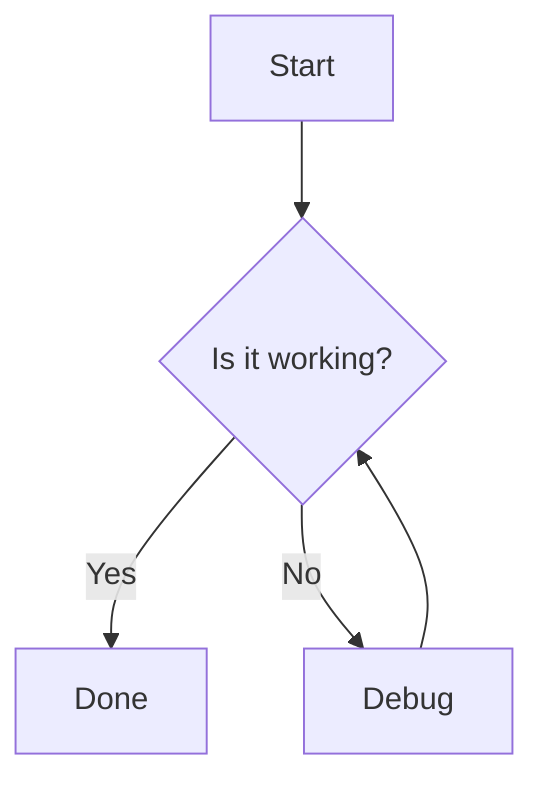

# Markdown Showcase

This fixture exercises every Markdown block and inline style the native
AppKit renderer must support. It is used by the parser and layout tests.

## Headings

### H3 heading

#### H4 heading

##### H5 heading

###### H6 heading

## Emphasis

*italic text* and **bold text** and ***bold italic*** and `inline code`.

~~strikethrough~~ and <u>underline</u> and a [link to example](https://example.com).

## Lists

### Unordered

- first item
- second item
  - nested item A
  - nested item B
- third item

### Ordered

1. step one
2. step two
3. step three

### Task list

- [x] done item
- [ ] pending item
- [ ] another pending item

## Blockquotes

> A short quote.
>
> > Nested quote with **bold** and `code`.

## Thematic break

---

## Fenced code

```swift
struct Greeting {
    let name: String
    func say() -> String { "Hello, \(name)" }
}
```

```text
plain text block without syntax highlighting
```

## Table

| Name   | Type  | Description        |
|--------|-------|--------------------|
| `id`   | UUID  | Unique identifier  |
| `name` | String | Display name      |
| `age`  | Int   | Age in years       |

## Mermaid



## Long CJK paragraph

这是一段很长的中文段落，用来验证 CJK 换行、行高测量与布局缓存。它包含多行
文本，并且夹带着一些 `inline code`、**加粗**和[链接](https://example.com)，
确保混排场景下也能正确渲染和测量。

## Final line

End of showcase.
