# Prototype Element Reference to Conversation Implementation Plan

> **For Claude:** REQUIRED SUB-SKILL: Use superpowers:executing-plans to implement this plan task-by-task.

**Goal:** Allow a user to right-click an exact element in a prototype preview, choose that element or a meaningful ancestor, and insert a precise, editable reference into the current conversation without taking a screenshot.

**Architecture:** JavaScript injected into `WKWebView` performs DOM hit-testing and returns a bounded list of element references. Swift validates the payload, presents a native macOS `NSMenu`, and asks `PluginPrototypeDesigner` to append a structured draft to `ConversationInputProviding`; the user remains in control of the final send. The generic WebView bridge lives in `KitHTMLPreview`, while project/screen context, prompt formatting, and Prototype Designer policy stay inside `PluginPrototypeDesigner`.

**Tech Stack:** Swift 6, SwiftUI, AppKit `NSMenu`, WebKit `WKWebView`/`WKScriptMessageHandler`, Swift Testing, Swift Package Manager.

---

## 1. Executive summary

The repository already contains most of the transport needed for this feature:

- `PrototypeDesignerView` renders the selected screen with `HTMLPreviewView`.
- `KitHTMLPreview` injects JavaScript, receives a `WKScriptMessage`, and exposes `PromoBlockSelection`.
- `PrototypeDesignerRuntime` resolves `ConversationInputProviding`.
- `PrototypeDesignerView.sendBlockToChat` appends a draft and focuses the composer.
- Prototype templates, lint rules, and the bundled skill already encourage `data-block` and `data-block-label`.

The existing implementation is not sufficient as the final design because it:

1. suppresses the context menu and inserts a floating HTML button instead of showing a native menu;
2. modifies the selected element by appending the floating button, which can contaminate `outerHTML`;
3. only exposes the nearest annotated/semantic block, so the user cannot choose a smaller child or a larger parent;
4. uses promo-specific names in a shared package;
5. sends only a block ID, label, and `outerHTML`, without a unique selector, source path, parent editing scope, schema version, or payload limits;
6. injects the bridge even when the caller has no selection callback;
7. has no focused tests for decoding hostile or oversized WebKit messages, selector stability, menu construction, or draft generation.

The proposed implementation keeps the proven “prefill and focus, never auto-send” behavior. It replaces the floating control with a native `NSMenu`, adds element and ancestor choices, makes the bridge generic, and retains the old `onBlockSelected` API so `PluginAppStorePromoDesigner` does not change behavior during this project.

## 2. Product requirements

### 2.1 Functional requirements

1. A secondary click or Control-click inside the Prototype Designer preview opens a native macOS context menu.
2. The element under the pointer is highlighted before the menu appears.
3. The first menu item sends the most specific meaningful element to the conversation.
4. Up to four meaningful ancestors are offered as additional “send this region” choices.
5. A `button`, `a`, form control, or element with an explicit ARIA role wins over decorative descendants such as `span`, `svg`, or `path`.
6. An explicit `data-block` is treated as a stable prototype editing boundary and appears in the ancestor choices.
7. Choosing an item appends a structured reference to the current composer and focuses it. It must not submit the message.
8. Existing composer text is preserved; the reference is appended with one blank line.
9. The reference identifies project, screen, source file, selected selector, stable block ID when present, selected HTML, and nearest annotated editing scope.
10. Clicking outside, pressing Escape, navigating, or reloading clears the highlight and pending menu state.
11. If no conversation input provider is available, the menu item is disabled and explains why through a localized title or help text; the app must not crash.
12. The feature works at every preview scale used by the supported prototype devices.

### 2.2 Non-functional requirements

- **Precision:** an annotated element must be addressable by a selector that resolves to exactly one live DOM node.
- **Safety:** untrusted local HTML cannot make Swift allocate or insert an unbounded message.
- **Isolation:** injected UI must not change the captured `outerHTML` or exported prototype.
- **Compatibility:** the current App Store Promo Designer behavior remains unchanged in this implementation.
- **Accessibility:** the menu is keyboard navigable and exposes native menu item titles to VoiceOver.
- **Localization:** all user-visible strings come from Swift localization resources, never hard-coded injected JavaScript.
- **Performance:** secondary-click handling should feel immediate; target p95 is under 100 ms from WebKit event to menu display for a 2 MB allowed prototype document.
- **Maintainability:** DOM extraction, payload decoding, menu presentation, and conversation formatting are separately testable.

### 2.3 Non-goals

- Automatically sending the message.
- Editing DOM live inside the preview.
- Building a persistent Figma-style layer inspector.
- Supporting remote pages, iframes, or author-provided scripts; Prototype Designer already forbids them.
- Capturing a screenshot crop as part of the first version. A crop can be added later as optional visual context, but source identity remains authoritative.
- Replacing the general conversation composer with a rich attachment/chip system.
- Migrating `PluginAppStorePromoDesigner` to the new interaction in the same change.

## 3. User interaction specification

### 3.1 Default target selection

On `contextmenu`, start from `event.composedPath()` and choose the first element belonging to the prototype document. Normalize the target as follows:

1. Ignore bridge-owned overlay nodes.
2. If the hit is inside `button`, `a`, `input`, `select`, `textarea`, `[role]`, or `[data-prototype-link]`, choose that interactive ancestor.
3. If the hit is `svg`, `path`, `use`, or a purely decorative `span`, climb to the first parent with visible text, an accessibility label, `data-block`, an interactive role, or a box larger than 16×16 CSS pixels.
4. Otherwise choose the directly hit element.
5. Never offer `html`, `head`, `script`, `style`, the bridge overlay host, or an element with an empty/invisible client rect.

This policy makes a click on an icon inside a button select the button, while still allowing a user to select a specific text, image, list item, card, or section.

### 3.2 Ancestor choices

Build a leaf-to-root chain and retain at most five candidates total:

- the normalized target;
- the nearest parent with `data-block`;
- meaningful structural ancestors such as `li`, `article`, `section`, `header`, `main`, `nav`, `footer`, or `[role]`;
- at most one generic layout parent when it has a distinct accessible label or class-derived label.

Deduplicate candidates that produce the same selector or the same bounding rect. Stop before `body`. The first candidate is the default element; an annotated `data-block` is the preferred editing scope.

### 3.3 Native menu

The recommended implementation uses `NSMenu`, not an HTML imitation:

```text
发送“开始结账”到对话
────────────────────
发送父级“底部操作区”到对话
发送区块“结算摘要”到对话
```

Rules:

- Use `text.bubble` for the primary item and `square.dashed.inset.filled` for ancestor items where supported.
- Truncate display labels to 48 user-perceived characters, but retain the complete bounded label in the payload.
- Menu titles are generated and localized in Swift.
- The default target gets a 2 px accent outline. Do not insert controls into the target element.
- When an ancestor menu item becomes highlighted, optionally update the outline to that ancestor. This hover preview is desirable but may be deferred until the base menu works reliably.
- Dismissing the menu without a choice clears the outline. After choosing an item, keep the outline for 600 ms as feedback, then clear it.

### 3.4 Conversation draft

The composer remains plain text in version 1. Insert a concise header plus machine-usable details and source HTML:

````markdown
请修改这个原型元素，我会在下面补充具体要求。

原型元素引用（v1）
- 项目：收银台（checkout-flow）
- 屏幕：首页（01-home）
- 文件：.lumi/prototype/tasks/checkout-flow/01-home/index.html
- 元素：开始结账
- 定位：button[data-block="primary-action"]
- 区块：primary-action（主操作）

当前元素 HTML：
```html
<button data-block="primary-action">开始结账</button>
```
````

Formatting rules:

- Do not start with “帮我改一下”; the user has not stated the requested change yet.
- Use a dynamic Markdown fence longer than the longest backtick run in captured HTML.
- Prefer a project-relative path. Never expose an unrelated absolute filesystem path.
- If the element is larger than the capture limit, state that HTML was truncated and instruct the agent metadata/rule to call `prototype_read_html` before editing.
- If the selected element is inside a different annotated block, include the block ID and label but do not duplicate the entire parent HTML unless needed for disambiguation.
- Always include `projectId`, `screenId`, and selector in the draft even if `data-block` exists.

## 4. Architecture

```mermaid
flowchart LR
    U[Secondary click in preview] --> JS[Injected DOM hit-test bridge]
    JS -->|bounded JSON request| C[KitHTMLPreview Coordinator]
    C --> V[Payload decoder and validator]
    V --> M[Native NSMenu]
    M -->|chosen reference| P[PrototypeDesignerView]
    P --> D[PrototypeElementConversationDraftBuilder]
    D --> I[ConversationInputProviding]
    I --> Q[Composer: prefilled and focused]
```



### 4.1 Responsibility boundaries

#### `KitHTMLPreview`

Owns generic preview concerns:

- DOM hit-testing and candidate extraction;
- selector construction and uniqueness checking against the live DOM;
- bounded WebKit message decoding;
- native menu construction and positioning;
- temporary visual highlight;
- the generic callback `onElementReferenceSelected`.

It must not know about prototype projects, screens, prompt wording, agent tools, or conversation providers.

#### `PluginPrototypeDesigner`

Owns product semantics:

- enabling element-reference mode only for prototype previews;
- adding project, screen, device, and source path context;
- formatting and appending the conversation draft;
- localization specific to prototype editing;
- updating the bundled agent rule and skill so the LLM consumes the reference correctly.

#### `KitPrototype`

Owns authoring and validation conventions:

- `data-block` and `data-block-label` remain the stable editing annotations;
- lint warns about duplicate/empty block IDs and missing labels;
- templates continue to generate unique IDs per screen.

### 4.2 Data contracts

Add a generic public reference model to `KitHTMLPreview`:

```swift
public struct HTMLPreviewElementReference: Sendable, Equatable, Codable {
    public static let currentSchemaVersion = 1

    public let schemaVersion: Int
    public let selector: String
    public let tagName: String
    public let label: String
    public let textPreview: String?
    public let outerHTML: String
    public let isOuterHTMLTruncated: Bool
    public let blockID: String?
    public let blockLabel: String?
    public let attributes: [String: String]
}
```

The JavaScript-to-Swift request is internal:

```swift
struct HTMLPreviewContextMenuRequest: Decodable, Equatable {
    let schemaVersion: Int
    let action: String                 // must equal "openContextMenu"
    let requestID: String
    let clientX: Double
    let clientY: Double
    let candidates: [HTMLPreviewElementReference]
}
```

Validation limits:

| Field | Limit |
|---|---:|
| Raw serialized message | 128 KiB |
| Candidates | 5 |
| Selector | 2,048 UTF-8 bytes |
| Label | 256 characters |
| Text preview | 512 characters |
| `outerHTML` per candidate | 24 KiB UTF-8 |
| Attribute count | 16 |
| Attribute key/value | 128 / 1,024 characters |

Allow only useful attributes: `id`, `class`, `role`, `aria-label`, `name`, `type`, `alt`, `title`, `data-block`, `data-block-label`, `data-prototype-link`, and `data-prototype-label`. Never collect inline event handlers, form values, arbitrary `data-*`, or computed styles.

When `outerHTML` exceeds 24 KiB, truncate at a valid Swift/JavaScript string boundary and set `isOuterHTMLTruncated`. The selector and block metadata remain usable; the agent must read the full screen before patching.

### 4.3 Selector policy

Build selectors in this order and verify `document.querySelectorAll(selector).length === 1` before returning them:

1. unique `[data-block="escaped-value"]`;
2. unique `#escaped-id`;
3. unique combination of stable tag plus allowlisted attributes;
4. a structural path using `:nth-of-type`, stopping at the closest unique `data-block` or ID;
5. a full `body > ... > tag:nth-of-type(n)` path as the last resort.

Use `CSS.escape` when available and ship a small local escape fallback. Do not use class names alone unless uniqueness is verified; utility classes are unstable and often repeated.

The selector identifies the current DOM snapshot. `data-block` is the long-lived identity across edits. The draft contains both when available.

### 4.4 Overlay isolation

Create one fixed-position overlay host directly under `document.documentElement` with an open Shadow DOM. Put the highlight rectangles in the shadow root and mark the host with a private random token known by the bridge. The host must:

- use `position: fixed`, `inset: 0`, `pointer-events: none`, and maximum z-index;
- never be appended inside the selected element;
- be excluded from hit-testing and serialization;
- be removed on bridge disposal and navigation;
- recompute its rectangle on scroll and resize while a selection is active.

This fixes the current contamination bug where the floating button is appended to the selected node before `outerHTML` is sent.

## 5. Key decisions and trade-offs

### ADR-001: Use a native AppKit menu

**Decision:** JavaScript reports candidates and pointer coordinates; Swift presents `NSMenu`.

**Alternatives considered:**

1. An HTML/CSS context menu is simpler to position and can preview ancestors on hover, but duplicates platform behavior, requires custom keyboard/VoiceOver handling, and risks leaking injected UI into captures.
2. A permanent inspector mode is powerful for repeated edits, but adds state, toolbar surface, and a learning curve that are unnecessary for this request.
3. Keeping the floating button is the smallest patch, but does not match the requested interaction and already mutates the selected subtree.

**Consequences:** There is an asynchronous JS-to-Swift hop, so menu positioning must be tested under SwiftUI scaling. Native accessibility, localization, appearance, and keyboard navigation outweigh that complexity.

### ADR-002: Keep generic extraction in `KitHTMLPreview`

**Decision:** Introduce generic element-reference types and an opt-in callback in the shared preview kit.

**Alternatives considered:** Forking a Prototype-specific WebView wrapper avoids touching shared code but duplicates loading, navigation, scaling, and message-handler lifecycle logic.

**Consequences:** Shared names must not mention promos or prototypes. The legacy promo callback remains supported until a separate migration.

### ADR-003: Prefill instead of auto-send

**Decision:** Append the reference to the composer, focus it, and wait for the user.

**Rationale:** Selecting a target and describing the desired change are distinct actions. Auto-send would create accidental turns and prevent the user from adding intent.

### ADR-004: Treat `data-block` as stable identity, selector as snapshot identity

**Decision:** Prefer unique `data-block` values for authored prototypes, while always returning a verified selector for arbitrary DOM.

**Consequences:** Existing documents without annotations still work. Lint warnings and skill guidance improve future precision without making old prototypes invalid.

## 6. Failure modes and recovery

| Failure | User-visible behavior | Logging/recovery |
|---|---|---|
| No meaningful element at click point | Leave the normal WebView menu available, or show no custom entries | Debug log only |
| Payload fails decoding/validation | Do not show the custom menu | Log one privacy-safe error; do not log HTML |
| Payload exceeds limits | Use truncated HTML flag if possible; otherwise omit custom menu | Log byte counts only |
| Selector is not unique | Fall back to verified structural path | Unit/integration test |
| WebView navigates before menu choice | Discard request using `requestID`/navigation generation | Clear highlight and pending candidates |
| Menu coordinate is wrong after scaling | Fall back to current mouse location in screen coordinates | Manual matrix test across devices |
| Conversation input provider is missing | Show disabled localized menu item | No crash; debug log |
| Existing draft is non-empty | Append after a blank line | Preserve cursor/focus contract |
| Captured HTML contains backticks | Use a longer Markdown fence | Unit test |
| Selected HTML occurs multiple times | Agent uses selector/block context after reading full HTML | Agent rule requires `prototype_read_html` |
| `data-block` values are duplicated | Lint warning and structural selector fallback | Do not block preview/save |
| Menu is cancelled | Clear pending candidates and overlay | No composer mutation |

Privacy requirements:

- Do not log `outerHTML`, visible text, project titles, or filesystem paths.
- Log schema version, byte size, candidate count, and error category only.
- Do not write captured element data to disk.
- Do not use pasteboard as a transport.

## 7. Detailed implementation plan

### Task 1: Add generic element-reference contracts and payload validation

**Files:**

- Create: `Packages/KitHTMLPreview/Sources/HTMLPreviewElementReference.swift`
- Create: `Packages/KitHTMLPreview/Sources/HTMLPreviewContextMenuRequest.swift`
- Create: `Packages/KitHTMLPreview/Tests/HTMLPreviewContextMenuRequestTests.swift`
- Preserve: `Packages/KitHTMLPreview/Sources/PromoBlockSelection.swift`

**Step 1: Write failing model/decoder tests**

Cover these cases:

- valid version-1 request decodes;
- unsupported schema version is rejected;
- action other than `openContextMenu` is rejected;
- zero candidates and more than five candidates are rejected;
- non-finite or out-of-range coordinates are rejected;
- labels/selectors/attributes over their limits are rejected or normalized according to one documented rule;
- `outerHTML` at the limit succeeds and oversized content is rejected unless `isOuterHTMLTruncated == true` and the body is already bounded;
- unknown attributes are discarded;
- control characters are removed from menu labels.

**Step 2: Run tests and verify failure**

```bash
swift test --package-path Packages/KitHTMLPreview --filter HTMLPreviewContextMenuRequestTests
```

Expected: compilation failure because the new types do not exist.

**Step 3: Implement the public reference and an internal validating decoder**

Keep raw `[String: Any]` handling out of `HTMLPreviewView.Coordinator`. Convert `message.body` through `JSONSerialization` into `Data`, enforce the raw byte limit, decode, normalize, then validate.

Do not silently accept future schema versions. Return a typed internal error suitable for privacy-safe logging.

**Step 4: Run focused and package tests**

```bash
swift test --package-path Packages/KitHTMLPreview --filter HTMLPreviewContextMenuRequestTests
swift test --package-path Packages/KitHTMLPreview
```

Expected: PASS.

**Step 5: Commit**

```bash
git add Packages/KitHTMLPreview/Sources/HTMLPreviewElementReference.swift \
  Packages/KitHTMLPreview/Sources/HTMLPreviewContextMenuRequest.swift \
  Packages/KitHTMLPreview/Tests/HTMLPreviewContextMenuRequestTests.swift
git commit -m "feat(KitHTMLPreview): add validated element references"
```

### Task 2: Extract and test the DOM hit-test bridge

**Files:**

- Create: `Packages/KitHTMLPreview/Sources/HTMLPreviewElementBridgeScript.swift`
- Create: `Packages/KitHTMLPreview/Tests/HTMLPreviewElementBridgeTests.swift`
- Modify: `Packages/KitHTMLPreview/Sources/HTMLPreviewView.swift`

**Step 1: Add failing WebKit integration tests**

Use a small local HTML fixture loaded into `WKWebView` and evaluate the bridge in the test. Cover:

- clicking a `span` inside a button produces the button first;
- a child plus annotated parent are returned leaf-to-root;
- duplicate ancestors are removed;
- a unique `data-block` selector is preferred;
- duplicate `data-block` values fall back to a unique structural selector;
- selectors resolve to exactly one node;
- no candidate includes `html`, `body`, bridge nodes, hidden nodes, or zero-sized nodes;
- a huge element sets `isOuterHTMLTruncated` and stays within the byte limit;
- captured `outerHTML` never contains bridge markup;
- reinjection disposes the previous listener instead of sending duplicate messages;
- Escape and disposal remove the overlay.

Expose only an internal test hook such as `HTMLPreviewElementBridgeScript.source`; do not make bridge internals public API.

**Step 2: Run and verify failure**

```bash
swift test --package-path Packages/KitHTMLPreview --filter HTMLPreviewElementBridgeTests
```

Expected: FAIL because the bridge script is not extracted.

**Step 3: Implement the isolated bridge**

Implement:

- composed-path target resolution;
- interactive/decorative normalization;
- candidate collection and labeling;
- selector generation with uniqueness checks;
- bounded serialization;
- Shadow DOM highlight overlay;
- `contextmenu`, Escape, scroll, resize, and disposal listeners;
- a navigation-generation/request ID in each request.

The JavaScript must contain no user-visible menu text.

**Step 4: Make bridge installation opt-in**

In `HTMLPreviewView`, do not register the new script handler or inject the new bridge unless `onElementReferenceSelected` is non-nil. Keep the legacy block bridge path for `onBlockSelected` until its separate migration.

**Step 5: Run tests**

```bash
swift test --package-path Packages/KitHTMLPreview --filter HTMLPreviewElementBridgeTests
swift test --package-path Packages/KitHTMLPreview
```

Expected: PASS with no duplicate message callbacks across reloads.

**Step 6: Commit**

```bash
git add Packages/KitHTMLPreview/Sources/HTMLPreviewElementBridgeScript.swift \
  Packages/KitHTMLPreview/Sources/HTMLPreviewView.swift \
  Packages/KitHTMLPreview/Tests/HTMLPreviewElementBridgeTests.swift
git commit -m "feat(KitHTMLPreview): resolve DOM elements from context clicks"
```

### Task 3: Present a native menu and manage highlight lifecycle

**Files:**

- Create: `Packages/KitHTMLPreview/Sources/HTMLPreviewElementContextMenu.swift`
- Create: `Packages/KitHTMLPreview/Tests/HTMLPreviewElementContextMenuTests.swift`
- Modify: `Packages/KitHTMLPreview/Sources/HTMLPreviewView.swift`
- Modify: `Packages/KitHTMLPreview/Resources/Localizable.xcstrings`

**Step 1: Write failing menu-model tests**

Extract menu-item descriptions from AppKit construction so most behavior can be tested without displaying a menu. Verify:

- first item is the target and remaining items are ordered nearest ancestor first;
- repeated labels include a distinguishing tag or block ID;
- titles are truncated safely by grapheme cluster;
- disabled provider state yields a disabled item;
- a selected item returns exactly the reference represented by that item;
- dismissing without selection produces no callback.

**Step 2: Run and verify failure**

```bash
swift test --package-path Packages/KitHTMLPreview --filter HTMLPreviewElementContextMenuTests
```

Expected: FAIL because the menu presenter does not exist.

**Step 3: Implement `NSMenu` presentation**

Add to `HTMLPreviewView`:

```swift
public init(
    htmlText: String,
    fileURL: URL? = nil,
    contentSize: CGSize? = nil,
    onWebViewResolved: ((WKWebView) -> Void)? = nil,
    onBlockSelected: ((PromoBlockSelection) -> Void)? = nil,
    onElementReferenceSelected: ((HTMLPreviewElementReference) -> Void)? = nil
)
```

Keep `onBlockSelected` source-compatible. When the new callback is present:

1. decode and validate `openContextMenu`;
2. discard requests from an obsolete navigation generation;
3. convert WebKit client coordinates into the WebView/AppKit coordinate system;
4. present `NSMenu` from the coordinator;
5. retain pending candidates only for the menu lifetime;
6. invoke the callback for the represented reference;
7. tell JavaScript to clear or briefly retain the highlight;
8. clear state on navigation, teardown, and cancellation.

If coordinate conversion fails, use the current mouse location converted from screen coordinates instead of refusing to show the menu.

**Step 4: Add localizations**

Add English, Simplified Chinese, Traditional Chinese, Hong Kong Chinese, and Taiwan Chinese values for:

- `Send “%@” to Conversation`
- `Send Parent “%@” to Conversation`
- `Conversation Unavailable`
- generic labels such as `Unnamed Button`, `Unnamed Section`, and `Element`

**Step 5: Run tests**

```bash
swift test --package-path Packages/KitHTMLPreview --filter HTMLPreviewElementContextMenuTests
swift test --package-path Packages/KitHTMLPreview
```

Expected: PASS.

**Step 6: Commit**

```bash
git add Packages/KitHTMLPreview/Sources/HTMLPreviewElementContextMenu.swift \
  Packages/KitHTMLPreview/Sources/HTMLPreviewView.swift \
  Packages/KitHTMLPreview/Resources/Localizable.xcstrings \
  Packages/KitHTMLPreview/Tests/HTMLPreviewElementContextMenuTests.swift
git commit -m "feat(KitHTMLPreview): show native element context menu"
```

### Task 4: Build a testable Prototype Designer conversation draft

**Files:**

- Create: `Packages/PluginPrototypeDesigner/Sources/PluginPrototypeDesigner/Conversation/PrototypeElementConversationDraftBuilder.swift`
- Create: `Packages/PluginPrototypeDesigner/Tests/PluginPrototypeDesignerTests/PrototypeElementConversationDraftBuilderTests.swift`
- Modify: `Packages/PluginPrototypeDesigner/Package.swift`

**Step 1: Write failing draft tests**

Cover:

- project title/ID, screen title/ID, device, relative file path, label, selector, block ID/label, and HTML appear correctly;
- missing block metadata is omitted cleanly;
- absolute paths outside the current project are reduced to a filename rather than disclosed;
- HTML containing triple backticks gets a safe longer fence;
- truncated HTML adds the explicit read-before-edit instruction;
- empty existing composer text receives only the draft;
- non-empty text is preserved and separated by exactly one blank line;
- the builder does not include injected overlay markup;
- very large final drafts are rejected with a localized error instead of freezing the composer.

Use a maximum generated draft size of 48 KiB. This is greater than the element capture limit and leaves room for metadata and the user’s instruction.

**Step 2: Run and verify failure**

```bash
swift test --package-path Packages/PluginPrototypeDesigner \
  --filter PrototypeElementConversationDraftBuilderTests
```

Expected: compilation failure because the builder does not exist.

**Step 3: Implement a pure builder**

The builder must be free of SwiftUI and global runtime state. Suggested interface:

```swift
struct PrototypeElementConversationContext: Equatable, Sendable {
    let projectTitle: String
    let projectID: String
    let screenTitle: String
    let screenID: String
    let deviceName: String
    let sourcePath: String
}

enum PrototypeElementConversationDraftBuilder {
    static func draft(
        reference: HTMLPreviewElementReference,
        context: PrototypeElementConversationContext
    ) throws -> String

    static func appending(_ draft: String, to existing: String) -> String
}
```

**Step 4: Add `KitHTMLPreview` to the test target**

The production target already depends on it. Add the test dependency explicitly if SwiftPM does not expose it transitively.

**Step 5: Run tests**

```bash
swift test --package-path Packages/PluginPrototypeDesigner \
  --filter PrototypeElementConversationDraftBuilderTests
swift test --package-path Packages/PluginPrototypeDesigner
```

Expected: PASS.

**Step 6: Commit**

```bash
git add Packages/PluginPrototypeDesigner/Sources/PluginPrototypeDesigner/Conversation/PrototypeElementConversationDraftBuilder.swift \
  Packages/PluginPrototypeDesigner/Tests/PluginPrototypeDesignerTests/PrototypeElementConversationDraftBuilderTests.swift \
  Packages/PluginPrototypeDesigner/Package.swift
git commit -m "feat(PluginPrototypeDesigner): build element conversation references"
```

### Task 5: Wire the reference into the prototype preview

**Files:**

- Modify: `Packages/PluginPrototypeDesigner/Sources/PluginPrototypeDesigner/Views/PrototypeDesignerView.swift`
- Modify: `Packages/PluginPrototypeDesigner/Sources/PluginPrototypeDesigner/Services/PrototypeDesignerRuntime.swift`
- Modify: `Packages/PluginPrototypeDesigner/Resources/Localizable.xcstrings`
- Modify: `Packages/PluginPrototypeDesigner/Tests/PluginPrototypeDesignerTests/PrototypeDesignerPluginTests.swift`

**Step 1: Add failing integration-level tests**

Extract the composer mutation into a small `@MainActor` helper if necessary and test:

- selecting a reference appends, focuses, and does not send;
- an unavailable input provider does not mutate state or crash;
- a builder size error is surfaced through `workspace.lastError`;
- repeated selections append in order;
- switching screens before choosing a stale menu item discards the selection.

The stale-selection test should compare a captured screen identity/navigation generation with the currently selected screen before mutating the composer.

**Step 2: Run and verify failure**

```bash
swift test --package-path Packages/PluginPrototypeDesigner \
  --filter PrototypeDesignerPluginTests
```

Expected: FAIL for the new scenarios.

**Step 3: Opt Prototype Designer into the new API**

Replace the current `onBlockSelected` use in `PrototypeDesignerView` with `onElementReferenceSelected`. Build context from the same immutable `resolved` value used to render that WebView. Before appending, verify that its project and screen IDs still match `workspace.selectedScreen`.

Remove the private `sendBlockToChat(_:resolved:)` only after the new helper and tests pass.

**Step 4: Handle missing conversation provider**

Pass whether the action is available into the preview/menu configuration. Do not rely solely on a guard after the user chooses the item. The menu should communicate unavailability before the click.

**Step 5: Localize Prototype-specific draft labels and errors**

Add all supported Chinese variants plus English. Do not embed Chinese literals in the builder.

**Step 6: Run tests**

```bash
swift test --package-path Packages/PluginPrototypeDesigner
```

Expected: PASS.

**Step 7: Commit**

```bash
git add Packages/PluginPrototypeDesigner/Sources/PluginPrototypeDesigner/Views/PrototypeDesignerView.swift \
  Packages/PluginPrototypeDesigner/Sources/PluginPrototypeDesigner/Services/PrototypeDesignerRuntime.swift \
  Packages/PluginPrototypeDesigner/Resources/Localizable.xcstrings \
  Packages/PluginPrototypeDesigner/Tests/PluginPrototypeDesignerTests/PrototypeDesignerPluginTests.swift
git commit -m "feat(PluginPrototypeDesigner): send preview elements to conversation"
```

### Task 6: Strengthen stable block authoring and lint guidance

**Files:**

- Modify: `Packages/KitPrototype/Sources/KitPrototype/PrototypeHTMLLinter.swift`
- Modify: `Packages/KitPrototype/Tests/KitPrototypeTests/KitPrototypeTests.swift`
- Modify: `Packages/PluginPrototypeDesigner/Resources/Skills/prototype-designer/SKILL.md`
- Modify: `Packages/PluginPrototypeDesigner/Resources/AgentRules/prototype-designer-workflow.md`
- Modify if necessary: `Packages/KitPrototype/Sources/KitPrototype/PrototypeTemplateFactory.swift`

**Step 1: Add failing lint tests**

Add warning-only rules:

- `duplicate_block_id` when the same non-empty `data-block` value appears more than once in a screen;
- `empty_block_id` for empty or whitespace-only values;
- `missing_block_label` when a `data-block` lacks `data-block-label`;
- valid unique labeled blocks produce none of these warnings.

Keep these as warnings so existing prototypes remain editable and exportable.

**Step 2: Run and verify failure**

```bash
swift test --package-path Packages/KitPrototype --filter KitPrototypeTests
```

Expected: FAIL because the new rules are absent.

**Step 3: Implement lint rules**

Use a compiled, case-insensitive regular expression consistent with the current lightweight linter. Decode basic HTML entities in attribute values before comparing IDs, or explicitly document that entity-equivalent values are not normalized in version 1.

**Step 4: Update authoring guidance**

State that:

- `data-block` must be unique within one screen;
- meaningful interactive controls that users may discuss should also be annotated;
- after receiving an “原型元素引用（v1）”, the agent must call `prototype_read_html`, locate by `data-block` first and selector/context second, make the smallest possible patch, then preview the screen;
- a truncated reference is never sufficient source for editing;
- the agent must not assume the captured HTML is current if a later turn may have edited the screen.

**Step 5: Verify templates and tests**

```bash
swift test --package-path Packages/KitPrototype
swift test --package-path Packages/PluginPrototypeDesigner
```

Expected: PASS and no new warnings for generated templates.

**Step 6: Commit**

```bash
git add Packages/KitPrototype/Sources/KitPrototype/PrototypeHTMLLinter.swift \
  Packages/KitPrototype/Tests/KitPrototypeTests/KitPrototypeTests.swift \
  Packages/PluginPrototypeDesigner/Resources/Skills/prototype-designer/SKILL.md \
  Packages/PluginPrototypeDesigner/Resources/AgentRules/prototype-designer-workflow.md \
  Packages/KitPrototype/Sources/KitPrototype/PrototypeTemplateFactory.swift
git commit -m "feat(KitPrototype): validate stable editable block metadata"
```

### Task 7: Compatibility, full verification, and manual acceptance

**Files:**

- Modify as needed: `Packages/KitHTMLPreview/README.md`
- Modify as needed: `Packages/PluginPrototypeDesigner/docs/2026-09-20-element-reference-to-conversation-implementation-plan.md`
- Do not modify `PluginAppStorePromoDesigner` unless a compatibility test reveals a regression.

**Step 1: Add a legacy compatibility test**

Verify that constructing `HTMLPreviewView(..., onBlockSelected:)` still compiles and that the legacy `PromoBlockSelection` decoder behavior remains intact. The new native-menu behavior must only activate for `onElementReferenceSelected`.

**Step 2: Run package tests**

```bash
swift test --package-path Packages/KitHTMLPreview
swift test --package-path Packages/KitPrototype
swift test --package-path Packages/PluginPrototypeDesigner
swift test --package-path Packages/PluginAppStorePromoDesigner
```

Expected: PASS.

**Step 3: Build the macOS app**

```bash
xcodebuild -project Lumi.xcodeproj \
  -scheme Lumi \
  -configuration Debug \
  -destination 'platform=macOS' \
  build
```

Expected: `** BUILD SUCCEEDED **`.

**Step 4: Perform the manual interaction matrix**

Test at minimum:

| Case | Expected result |
|---|---|
| Right-click text inside a button | Button is the default target |
| Right-click an image in a card | Image is default; card/block appears as parent choice |
| Right-click whitespace in a section | Section or meaningful layout parent is selected |
| Control-click | Same result as secondary click |
| Cancel menu | No composer change; highlight clears |
| Choose child | Draft contains child selector/HTML and containing block metadata |
| Choose parent | Draft contains the chosen parent, not the child |
| Existing composer text | Existing text remains before the reference |
| Switch screen while menu is open | Stale choice is ignored |
| iPhone SE, iPhone 15 Pro, iPad 11, desktop | Menu appears at the pointer despite preview scaling |
| Light/dark/high-contrast appearance | Native menu and outline remain legible |
| VoiceOver | Menu item titles are announced and keyboard selectable |
| 2 MB valid HTML | Right-click remains responsive and payload stays bounded |
| Duplicate `data-block` | Structural selector remains unique; lint warns |
| Very large selected subtree | Draft states truncation; app remains responsive |
| App Store Promo Designer preview | Existing floating-button behavior still works |

**Step 5: Review privacy and lifecycle with Instruments**

- Open and close Prototype Designer repeatedly.
- Reload and switch screens at least 50 times.
- Confirm coordinators/WebViews are released and script messages are not duplicated.
- Confirm no captured HTML appears in unified logs.

**Step 6: Update documentation with any verified coordinate caveat**

If scaled positioning needs a fallback, document the final conversion formula and its regression test. Do not leave implementation-only discoveries undocumented.

**Step 7: Commit**

```bash
git add Packages/KitHTMLPreview/README.md \
  Packages/PluginPrototypeDesigner/docs/2026-09-20-element-reference-to-conversation-implementation-plan.md
git commit -m "docs(PluginPrototypeDesigner): document element reference workflow"
```

## 8. Acceptance criteria

The feature is complete only when all of the following are true:

- [ ] Right-click opens a native macOS menu at the correct visual location.
- [ ] The default element and up to four meaningful parents can be sent.
- [ ] The selected outline never changes captured `outerHTML`.
- [ ] Every returned selector resolves to exactly one current DOM node.
- [ ] Unique `data-block` is preferred as stable identity.
- [ ] The composer is appended and focused but never auto-submitted.
- [ ] Project, screen, relative file, selector, block metadata, and bounded HTML reach the LLM.
- [ ] Stale menu requests cannot reference a newly selected screen.
- [ ] Payload size, candidate count, labels, selectors, and attributes are bounded and validated.
- [ ] No HTML or project content is written to logs or disk.
- [ ] English and supported Chinese localizations are present.
- [ ] VoiceOver and keyboard selection work through the native menu.
- [ ] All four package test suites and the macOS application build pass.
- [ ] App Store Promo Designer retains its current interaction.
- [ ] The bundled Prototype Designer skill tells the agent how to consume the new reference.

## 9. Rollout and follow-up

Ship this as an opt-in Prototype Designer feature behind the presence of `onElementReferenceSelected`; no runtime feature flag is necessary because the old callback remains independent. If field feedback shows menu positioning problems under SwiftUI transforms, temporarily fall back to the current mouse screen coordinate while retaining the same data contract.

Potential follow-ups, explicitly outside this implementation:

1. Migrate App Store Promo Designer from `PromoBlockSelection` to `HTMLPreviewElementReference`, then deprecate the promo-named API.
2. Add a first-class `ConversationContextReference` attachment/chip to the composer so the visible draft can collapse to one line while the model still receives structured metadata.
3. Add an optional element screenshot crop for visual-only properties such as spacing, color, and alignment.
4. Add a persistent inspect mode for repeated element selection.
5. Add an agent tool that resolves a stable block directly and performs a guarded DOM-aware replacement, reducing dependence on text patch uniqueness.

These follow-ups must not delay the core right-click-to-conversation workflow.

## 10. Implementation notes for the next session

- The working tree may contain unrelated editor package migration changes. Do not stage, revert, or reformat them.
- Start by recording the current package test baseline; distinguish pre-existing failures from regressions.
- Prefer small commits matching the tasks above.
- Do not delete `PromoBlockSelection` or change App Store Promo Designer behavior in this work.
- Keep user-visible menu strings out of JavaScript.
- Treat WebKit message content as untrusted input even though prototypes are local.
- Never implement selection by mutating the chosen element.
