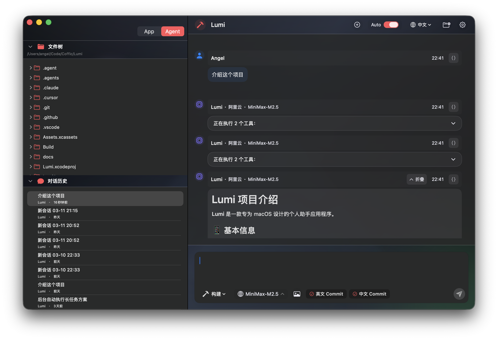
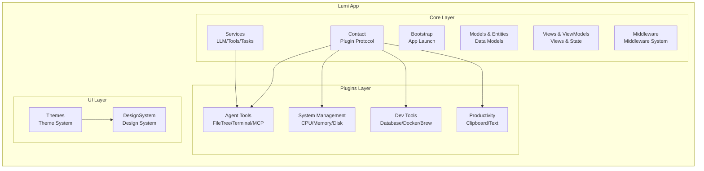
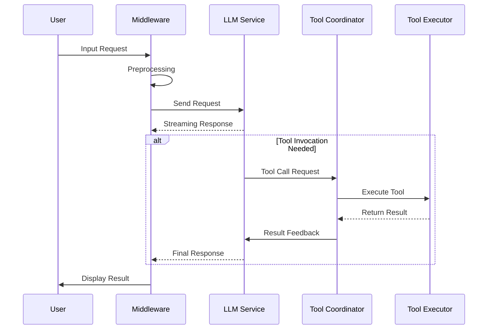

# Lumi

Lumi is an AI-powered personal desktop assistant application for macOS.

📖 [中文版](README_zh.md) | English

[](https://swift.org)
[](https://developer.apple.com/macos/)
[](LICENSE)



## 🏗️ Architecture

### Application Architecture



### Plugin System

- **SuperPlugin Protocol**: Base protocol for all plugins, defining lifecycle and UI contribution points
- **Extension Points**: Navigation bar, toolbar, status bar, settings page, Agent views, etc.
- **Middleware**: Intercept and modify message sending, conversation turns, and other events
- **Agent Tools**: Plugins can register custom tools for AI invocation

### AI/Agent Workflow



- **LLMProvider Protocol**: Unified LLM interface supporting multiple providers
- **ToolService**: Tool registration, discovery, and execution
- **WorkerAgent**: Background task execution agent

## 📋 Requirements

- macOS 13.0+
- Xcode 15.0+
- Swift 5.9+

## 🚀 Build & Run

### 1. Clone the Repository

```bash
git clone https://github.com/Coffic/Lumi.git
cd Lumi
```

### 2. Open in Xcode

```bash
open Lumi.xcodeproj
```

### 3. Build and Run

- Select the macOS target
- Build (⌘B) and run (⌘R)


## 📄 License

This project is licensed under the GNU General Public License v3.0 - see [LICENSE](LICENSE) file for details.
