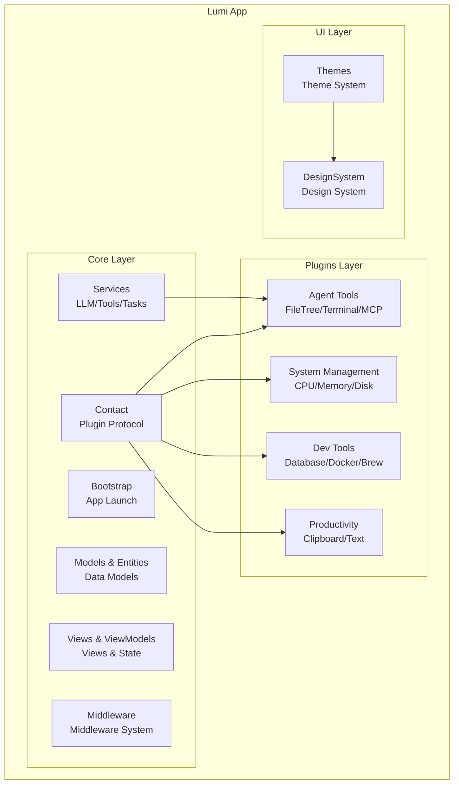
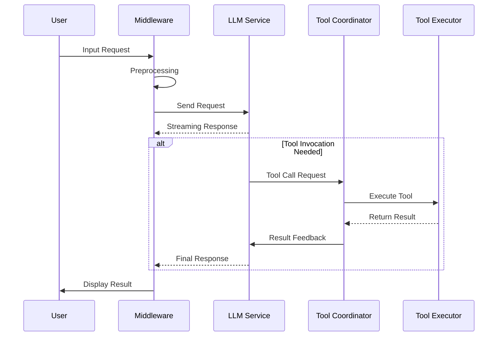

# Lumi

Lumi is an AI-powered personal desktop assistant application for macOS.

📖 [中文版](README_zh.md) | English

[](https://swift.org)
[](https://developer.apple.com/macos/)
[](LICENSE)


## ✨ Features

Lumi adopts a plugin-based architecture, providing the following core capabilities:

### 🤖 AI Agent System

- **Intelligent Conversation**: Multi-turn conversations, streaming responses, thinking process visualization
- **Tool Invocation**: Agent can automatically invoke file operations, terminal commands, database queries, and more
- **Multi-LLM Support**: Compatible with mainstream models including OpenAI, Anthropic, Aliyun, Zhipu AI, DeepSeek, etc.
- **Context Management**: Intelligent code context selection to optimize token usage

### 🔌 Plugin Architecture

- **Highly Modular**: All functions are implemented as plugins based on SuperPlugin protocol
- **Flexible Configuration**: Enable/disable plugins in settings to customize your feature set
- **Hot-swappable Design**: Supports dynamic plugin loading without restarting the application
- **Infinite Extensibility**: Complete plugin development API and middleware system for easy custom functionality

### 💻 System Monitoring & Management

- **Device Status**: Real-time monitoring of CPU, memory, disk, battery, network, and other key metrics
- **Process Management**: View and manage running applications and processes
- **Port Management**: Monitor port occupancy
- **Hosts Editor**: Visual management of system Hosts file
- **Caffeinate Control**: One-click prevent system sleep with timer and mode switching

### 🛠️ Developer Tools

- **Terminal Emulator**: Built-in terminal with command execution and history
- **Database Management**: Support for MySQL, Redis and other database connections and queries
- **Docker Management**: View and manage containers and images
- **Brew Management**: Visual interface for macOS Homebrew package manager
- **Xcode Cleaner**: Clean Xcode cache and derived data
- **GitHub Integration**: Repository browsing, Issue management, Trending view

### ⚡ Productivity Tools

- **Clipboard History**: Automatically record clipboard content with quick search
- **Text Actions**: Intelligent text transformation and formatting
- **File Browser**: Quick navigation through project file trees
- **Status Bar Assistant**: Menu bar persistent display of key information

## 🏗️ Architecture

### Application Architecture



### Plugin System

- **SuperPlugin Protocol**: Base protocol for all plugins, defining lifecycle and UI contribution points
- **Extension Points**: Navigation bar, toolbar, status bar, settings page, Agent views, etc.
- **Middleware**: Intercept and modify message sending, conversation turns, and other events
- **Agent Tools**: Plugins can register custom tools for AI invocation

### AI/Agent Workflow



- **LLMProvider Protocol**: Unified LLM interface supporting multiple providers
- **ToolService**: Tool registration, discovery, and execution
- **WorkerAgent**: Background task execution agent

## 📦 Core Plugins

Lumi comes with rich built-in core plugins covering four categories: AI, system management, developer tools, and productivity tools. Through the plugin architecture, you can easily extend infinite possibilities.

### Agent Tools (Core)

| Plugin Name | Description |
|-------------|-------------|
| AgentCoreTools | File read/write, search, code analysis, and other core tools |
| AgentFileTree | Project file tree browsing and navigation |
| TerminalPlugin | Terminal command execution |
| AgentMCPTools | MCP (Model Context Protocol) tool integration |

### System Management (Core)

| Plugin Name | Description |
|-------------|-------------|
| CPUManagerPlugin | CPU usage monitoring |
| MemoryManagerPlugin | Memory usage monitoring |
| DiskManagerPlugin | Disk space analysis and Xcode cleaning |
| NetworkManagerPlugin | Network status monitoring |
| CaffeinatePlugin | Caffeinate control (prevent sleep) |

### Developer Tools (Core)

| Plugin Name | Description |
|-------------|-------------|
| DatabaseManagerPlugin | MySQL, Redis database management |
| DockerManagerPlugin | Docker container and image management |
| BrewManagerPlugin | Homebrew package management |
| GitHubToolsPlugin | GitHub API integration (Repo/Issue/Trending) |

### Productivity Tools (Core)

| Plugin Name | Description |
|-------------|-------------|
| ClipboardManagerPlugin | Clipboard history |
| TextActionsPlugin | Intelligent text operations |
| InputPlugin | Input method management |

> 💡 **Note**: The above are core plugins only. Lumi's plugin system supports infinite extensibility. You can easily create custom plugins based on the SuperPlugin protocol to meet personalized needs.

## 📋 Requirements

- macOS 13.0+
- Xcode 15.0+
- Swift 5.9+

## 🚀 Build & Run

### 1. Clone the Repository

```bash
git clone https://github.com/Coffic/Lumi.git
cd Lumi
```

### 2. Open in Xcode

```bash
open Lumi.xcodeproj
```

### 3. Build and Run

- Select the macOS target
- Build (⌘B) and run (⌘R)

### 4. Configure LLM (Required)

LLM service configuration is required for first-time use:

1. Open **Settings** → **Provider Settings**
2. Select LLM provider (OpenAI / Anthropic / Aliyun / Zhipu / DeepSeek, etc.)
3. Enter API Key
4. Select model (e.g., gpt-4, claude-3-5-sonnet, etc.)
5. Save configuration

> 💡 **Tip**: It's recommended to use models that support tool invocation for the complete Agent experience.

### 5. Plugin Management

In **Settings** → **Plugin Settings**:

- Enable/disable plugins
- Configure plugin parameters (e.g., GitHub Token, database connections, etc.)
- View plugin descriptions

## 🛠️ Development Guide

### Project Structure

```text
Lumi/
├── LumiApp/
│   ├── Core/              # Core application logic
│   │   ├── Bootstrap/     # App launch
│   │   ├── Services/      # Service layer (LLM, tools, etc.)
│   │   ├── Models/        # Data models
│   │   ├── Entities/      # Entity definitions
│   │   ├── Views/         # Common views
│   │   ├── ViewModels/    # View state management
│   │   ├── Middleware/    # Middleware system
│   │   └── Contact/       # Plugin protocol
│   ├── Plugins/           # Plugin implementations
│   │   ├── Agent*/        # Agent-related plugins
│   │   ├── *ManagerPlugin/# System management plugins
│   │   └── */Views/       # Plugin views
│   └── UI/                # UI themes and design system
├── docs/                  # Project documentation
└── README*.md            # README files
```

### Creating New Plugins

Refer to existing plugin implementations (such as `GitHubToolsPlugin`, `CPUManagerPlugin`, etc.) to create new plugins in the `LumiApp/Plugins/` directory and implement the `SuperPlugin` protocol.

### Debugging

- Use Xcode console to view logs
- Enable debug mode in settings
- Use `DebugCommand` menu command

## 📄 License

This project is licensed under the GNU General Public License v3.0 - see [LICENSE](LICENSE) file for details.
