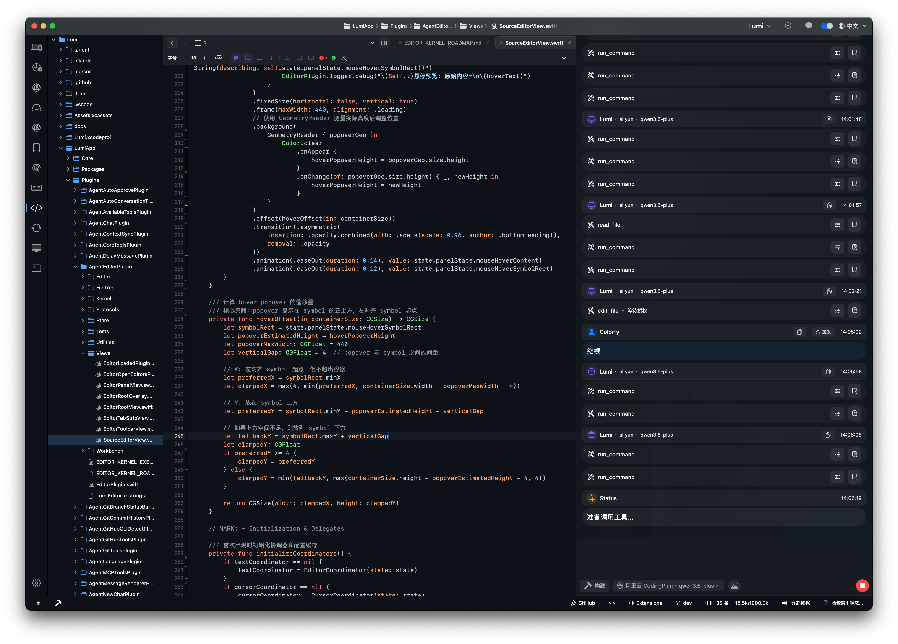
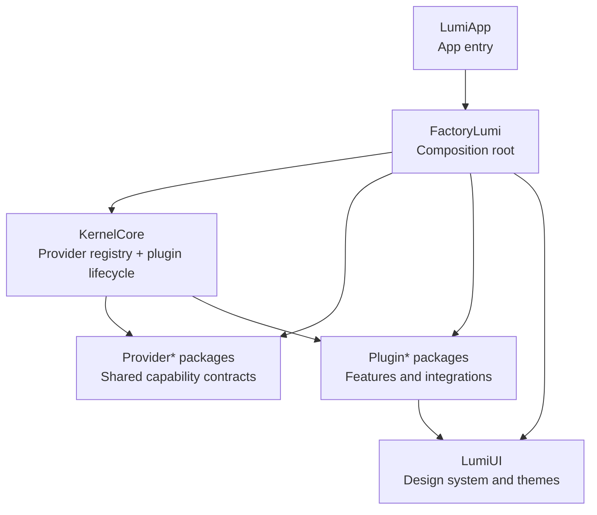
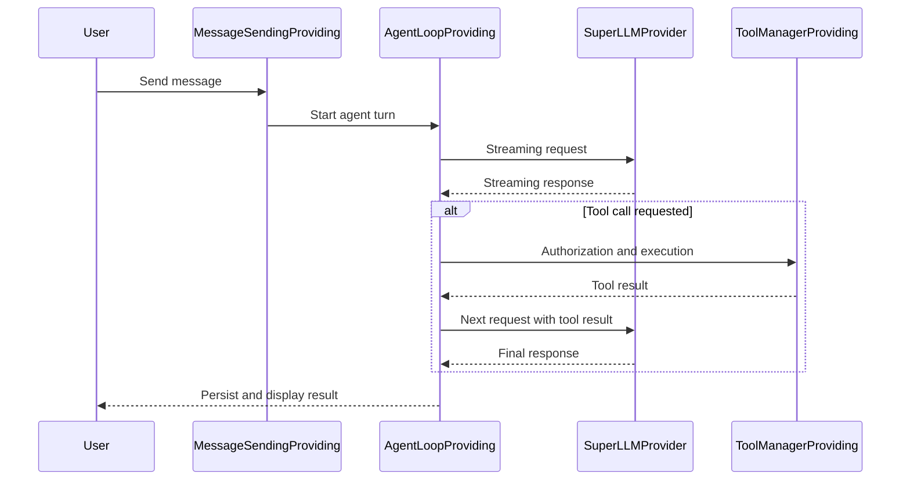

# Lumi

Lumi is an AI-powered personal desktop assistant for macOS. It combines LLM chat, an agent with tool use, a code editor, a terminal, and a broad set of system and developer utilities in a plugin-driven application.

📖 English | [中文版](README_zh.md)

[](https://swift.org)
[](https://developer.apple.com/macos/)
[](LICENSE)
[](https://github.com/CofficLab/Lumi/releases)



## Features

- **Multi-provider LLM chat** — 20+ built-in provider integrations, including OpenAI, Anthropic, DeepSeek, Zhipu, MiniMax, Kimi Code, Aliyun, StepFun, Xiaomi, OpenRouter, Codex, and local MLX models. Several integrations expose more than one provider implementation.
- **Agent with tool use** — read and edit files, run shell commands, fetch and search the web, use browser and computer-control tools, inspect images, and request user input during a task.
- **Built-in code editor** — project file tree, syntax highlighting, fuzzy file search, outline, references, call hierarchy, problems, language services, and Markdown preview.
- **Developer tools** — native terminal, Git/GitHub integration, SQLite/MySQL/PostgreSQL/Redis database tools, Docker, Homebrew, ports and hosts management, and project diagnostics.
- **System utilities** — clipboard history, disk and network monitoring, screen recording, OCR, display control, anti-sleep, downloads, and more.
- **Project intelligence** — project-scoped agent rules, skills, memory, project file search, and local vector-based RAG for code-oriented questions.
- **Themes and customization** — more than 100 default plugins, runtime plugin enable/disable support, and 22 built-in themes.
- **Local HTTP API** — the built-in web server listens on the local loopback interface and aggregates routes contributed by enabled plugins.

> MCP client support is not currently shipped in the default application. The repository contains MCP-related compatibility comments, but no MCP package or stdio/SSE transport implementation yet.

## Download

Download the latest DMG from the [Releases](https://github.com/CofficLab/Lumi/releases) page. Release automation produces architecture-specific `arm64` and `x86_64` DMGs. The direct-distribution build uses [Sparkle](https://sparkle-project.org) for updates; Debug builds disable app updates.

The Mac App Store distribution and the direct-distribution build can differ in entitlements and update integration. Check the release notes for the exact contents of each build.

## Architecture

### Application architecture


```mermaid
graph TB
    APP[LumiApp<br/>App entry]
    FL[FactoryLumi<br/>Composition root]
    K[KernelCore<br/>Provider registry + plugin lifecycle]
    PF[Provider* packages<br/>Shared capability contracts]
    PL[Plugin* packages<br/>Features and integrations]
    UI[LumiUI<br/>Design system and themes]

    APP --> FL
    FL --> K
    FL --> PF
    FL --> PL
    K --> PF
    K --> PL
    FL --> UI
    PL --> UI
```

- **LumiApp** is the application entry point. It creates the shared kernel and hosts the main, settings, onboarding, and menu-bar surfaces.
- **FactoryLumi** is the composition root. `KernelFactory` assembles providers, starts the default plugin catalog, and builds the main and settings views.
- **KernelCore** is the small generic kernel. It provides typed provider registration/resolution and plugin lifecycle management without knowing concrete application services.
- **Provider packages** define shared capability contracts such as conversations, LLMs, tools, projects, storage, web routes, and UI contributions.
- **Plugin packages** implement product features and integrations. The default catalog is defined by [`DefaultPluginFactory`](Packages/FactoryLumi/Sources/FactoryLumi/PluginFactory.swift).
- **LumiUI** contains shared SwiftUI components and theme rendering.

### Plugin system

Plugins conform to [`SuperPlugin`](Packages/KernelCore/Sources/KernelCore/Contracts/SuperPlugin.swift). A plugin can participate in registration, boot, ready, enable/disable, shutdown, and unregister phases, and can contribute providers, tools, commands, views, settings, editor extensions, menus, web routes, and other application surfaces.

The main implementation layers are:

- [`FactoryLumi`](Packages/FactoryLumi) — composition and dependency wiring.
- [`PluginAgentLoop`](Packages/PluginAgentLoop) — agent-loop integration.
- [`PluginToolManager`](Packages/PluginToolManager) — tool registration, authorization, execution, and records.
- [`KitLLM`](Packages/KitLLM) and the `ProviderLLMVendors` package — shared LLM models, adapters, and provider contracts.
- [`PluginProjectRAG`](Packages/PluginProjectRAG) — project indexing and local vector search.
- [`PluginWebServer`](Packages/PluginWebServer) — plugin route registration for the local web server.

### Agent workflow


```mermaid
sequenceDiagram
    participant U as User
    participant S as MessageSendingProviding
    participant R as AgentLoopProviding
    participant L as SuperLLMProvider
    participant T as ToolManagerProviding

    U->>S: Send message
    S->>R: Start agent turn
    R->>L: Streaming request
    L-->>R: Streaming response
    alt Tool call requested
        R->>T: Authorization and execution
        T-->>R: Tool result
        R->>L: Next request with tool result
        L-->>R: Final response
    end
    R-->>U: Persist and display result
```

The concrete provider contracts live under `Packages/Provider*`; the feature implementations live under `Packages/Plugin*`. This keeps the agent loop, tool execution, persistence, and UI responsibilities separate.

## Requirements

- macOS 14.0 or later
- Xcode 26.x (the release workflow currently uses Xcode 26.3)
- Swift 6.0 or later

Some features require additional macOS permissions. For example, Computer Use and screen capture require the corresponding Accessibility, Automation, or Screen Recording permissions.

## Build and run

### Open in Xcode

```bash
git clone https://github.com/CofficLab/Lumi.git
cd Lumi
open Lumi.xcodeproj
```

Select the **Lumi** scheme, then build and run with ⌘B / ⌘R. On first launch, configure an LLM provider and its API key in Settings.

### Build from the command line

For a reproducible local Debug build using the checked-in package resolutions:

```bash
xcodebuild \
  -project Lumi.xcodeproj \
  -scheme Lumi \
  -configuration Debug \
  -sdk macosx \
  -disableAutomaticPackageResolution \
  -onlyUsePackageVersionsFromResolvedFile \
  build
```

Package tests are run from their individual package directories, for example:

```bash
swift test --package-path Packages/FactoryLumi
swift test --package-path Packages/PluginAgentLoop
```

There is no root `Package.swift`; the application is built through `Lumi.xcodeproj`, while the reusable components are Swift packages under [`Packages/`](Packages/).

## Contributing

Issues and pull requests are welcome at [CofficLab/Lumi](https://github.com/CofficLab/Lumi). New features are generally implemented as `Plugin*` packages and composed in [`DefaultPluginFactory`](Packages/FactoryLumi/Sources/FactoryLumi/PluginFactory.swift). Start with [`SuperPlugin`](Packages/KernelCore/Sources/KernelCore/Contracts/SuperPlugin.swift), an existing plugin, and the relevant `Provider*` contract.

## License

This project is licensed under the GNU General Public License v3.0. See [LICENSE](LICENSE) for details.
