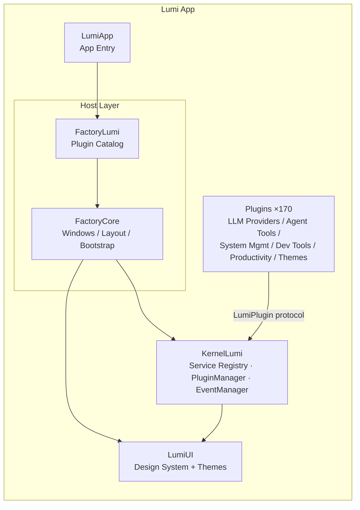
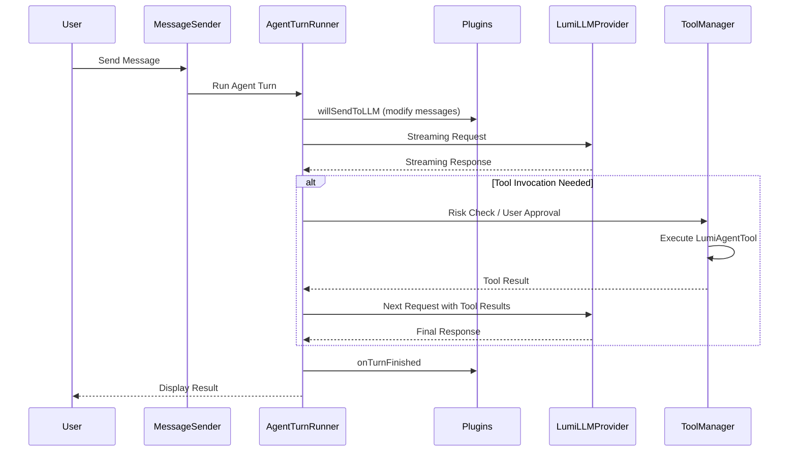

# Lumi

Lumi is an AI-powered personal desktop assistant for macOS. It brings LLM chat, an agent with tool use, a code editor, a terminal, and a rich toolbox of system and developer utilities into one plugin-driven app.

📖 English | [中文版](README_zh.md)

[](https://swift.org)
[](https://developer.apple.com/macos/)
[](LICENSE)
[](https://github.com/CofficLab/Lumi/releases)


## ✨ Features

- **Multi-provider LLM chat** — 25+ built-in providers, including OpenAI, Anthropic (Claude), DeepSeek, Zhipu (GLM), MiniMax, Kimi, Aliyun (DashScope), StepFun, Xiaomi (MiMo), OpenRouter, and local models via MLX. See [Plugins/](Plugins/) for the full list.
- **Agent with tool use** — the agent can browse files, run terminal commands, fetch web pages, search the web, automate the browser, take screenshots, and answer questions mid-task.
- **MCP support** — connect external [Model Context Protocol](https://modelcontextprotocol.io) servers (stdio and SSE transports) to extend the agent with more tools.
- **Built-in code editor** — tree-sitter syntax highlighting, fuzzy file search, outline, references, call hierarchy, problems panel, and Markdown preview.
- **Developer tools** — native terminal, Git/GitHub integration, database manager (SQLite/MySQL/PostgreSQL/Redis), Docker, Homebrew, ports and hosts management.
- **System utilities** — clipboard history, disk/network monitoring, screen recorder, OCR, display control (DDC), anti-sleep, and more.
- **Project intelligence** — per-project agent rules, skills, memory, and local retrieval-augmented generation (RAG).
- **Highly customizable** — 170+ plugins that can be enabled/disabled at runtime, and 20+ built-in themes.
- **Local HTTP API** — enabled plugins expose routes on a localhost-only web server for automation.

## 📥 Download

Download the latest DMG from the [Releases](https://github.com/CofficLab/Lumi/releases) page (universal, arm64, and x86_64 builds available). The app updates itself via [Sparkle](https://sparkle-project.org).

> The Mac App Store build does not include Sparkle auto-update or the embedded vector-search RAG component; everything else is identical.

## 🏗️ Architecture

### Application Architecture


```mermaid
graph BT
    subgraph "Lumi App"
        APP[LumiApp<br/>App Entry]
        subgraph "Host Layer"
            FL[FactoryLumi<br/>Plugin Catalog]
            FC[FactoryCore<br/>Windows / Layout / Bootstrap]
        end
        K[KernelLumi<br/>Service Registry · PluginManager · EventManager]
        P[Plugins ×170<br/>LLM Providers / Agent Tools /<br/>System Mgmt / Dev Tools / Productivity / Themes]
        UI[LumiUI<br/>Design System + Themes]
    end

    APP --> FL
    FL --> FC
    FC --> K
    P -->|LumiPlugin protocol| K
    K --> UI
    FC --> UI
```

- **LumiApp**: the app entry point; injects distribution-sensitive plugins (auto-update, RAG)
- **FactoryLumi / FactoryCore**: compile-time plugin catalog and the plugin-free host engine (windows, layout, bootstrap)
- **KernelLumi**: the kernel — service registry, plugin lifecycle management, and event dispatch
- **LumiUI**: shared design system and theme rendering

### Plugin System

- **LumiPlugin protocol**: the base protocol for all plugins, defined in [KernelLumi](Packages/KernelLumi), covering lifecycle (`onBoot` / `onReady` / `onEnable` / `onDisable`) and UI contribution points
- **Extension points**: menu bar, toolbar, status bar, settings pages, chat sections, editor extensions, onboarding pages, local web routes, and more
- **Plugin hooks**: `willSendToLLM` lets any plugin modify messages before each LLM request (e.g. inject system prompts); `onTurnFinished` is called after every agent turn
- **Agent tools**: plugins can register custom tools (`LumiAgentTool`) for AI invocation

### AI/Agent Workflow


```mermaid
sequenceDiagram
    participant U as User
    participant S as MessageSender
    participant R as AgentTurnRunner
    participant P as Plugins
    participant L as LumiLLMProvider
    participant T as ToolManager

    U->>S: Send Message
    S->>R: Run Agent Turn
    R->>P: willSendToLLM (modify messages)
    R->>L: Streaming Request
    L-->>R: Streaming Response
    alt Tool Invocation Needed
        R->>T: Risk Check / User Approval
        T->>T: Execute LumiAgentTool
        T-->>R: Tool Result
        R->>L: Next Request with Tool Results
        L-->>R: Final Response
    end
    R->>P: onTurnFinished
    R-->>U: Display Result
```

- **MessageSender** (`MessageSending`): persists messages and starts the agent turn
- **AgentTurnRunner** (`AgentTurnManaging`): the agent loop — builds requests, streams responses, and executes tool calls until the turn completes
- **LumiLLMProvider**: unified streaming LLM interface; 25+ provider plugins built on top of [LLMKit](Packages/LLMKit)
- **ToolManager** (`ToolManaging`): tool registration, risk checks, user approval for risky tools, and execution of `LumiAgentTool`

## 📋 Requirements

- macOS 14.0+
- Xcode 16.0+
- Swift 6.0+

## 🚀 Build & Run

### 1. Clone the Repository

```bash
git clone https://github.com/CofficLab/Lumi.git
cd Lumi
```

### 2. Open in Xcode

```bash
open Lumi.xcodeproj
```

### 3. Build and Run

- Select the **Lumi** scheme and the macOS target
- Build (⌘B) and run (⌘R)

## 🤝 Contributing

Issues and pull requests are welcome at [CofficLab/Lumi](https://github.com/CofficLab/Lumi). New features are usually developed as plugins — see the [LumiPlugin protocol](Packages/KernelLumi/Sources/KernelLumi/Contracts/LumiPlugin.swift) and existing plugins under [Plugins/](Plugins/) for reference.

## 📄 License

This project is licensed under the GNU General Public License v3.0 — see the [LICENSE](LICENSE) file for details.
