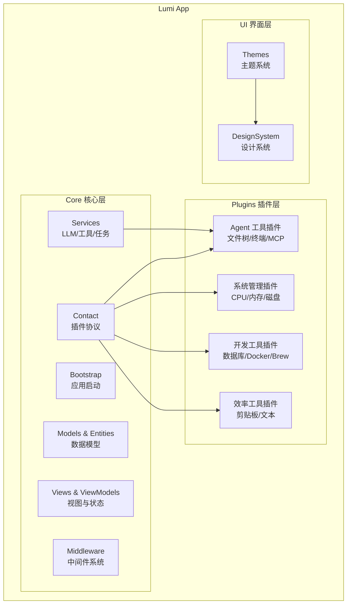
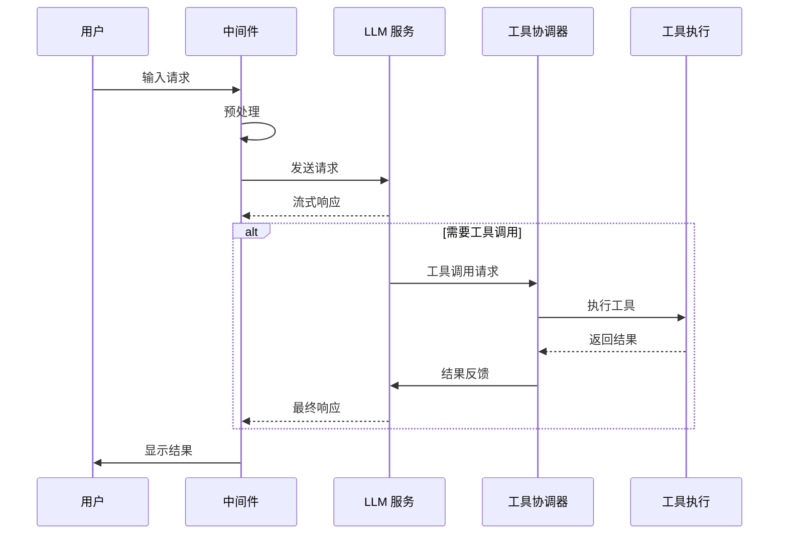

# Lumi

Lumi 是一款面向 macOS 的 AI 驱动的个人桌面助理应用。

📖 中文版 | [English](README.md)

[](https://swift.org)
[](https://developer.apple.com/macos/)
[](LICENSE)


## ✨ 功能特性

Lumi 采用插件化架构，提供以下核心能力：

### 🤖 AI Agent 系统

- **智能对话**：支持多轮对话、流式响应、思考过程可视化
- **工具调用**：Agent 可自动调用文件操作、终端命令、数据库查询等工具
- **多 LLM 支持**：兼容 OpenAI、Anthropic、阿里通义、智谱 AI、DeepSeek 等主流模型
- **上下文管理**：智能代码上下文选择，优化 token 使用

### 🔌 插件化架构

- **高度模块化**：基于 SuperPlugin 协议，所有功能均以插件形式实现
- **灵活配置**：可在设置中启用/禁用插件，自定义功能组合
- **热插拔设计**：支持插件动态加载，无需重启应用
- **无限扩展**：提供完整的插件开发 API 和中间件系统，可轻松添加自定义功能

### 💻 系统监控与管理

- **设备状态**：实时监控 CPU、内存、磁盘、电池、网络等关键指标
- **进程管理**：查看和管理运行中的应用与进程
- **端口管理**：监控端口占用情况
- **Hosts 编辑**：可视化管理系统 Hosts 文件
- **防休眠控制**：一键阻止系统休眠，支持定时和模式切换

### 🛠️ 开发者工具

- **终端模拟器**：内置终端，支持命令执行和历史记录
- **数据库管理**：支持 MySQL、Redis 等数据库的连接和查询
- **Docker 管理**：查看和管理容器、镜像
- **Brew 管理**：macOS 包管理器 Homebrew 的可视化界面
- **Xcode 清理**：清理 Xcode 缓存和衍生数据
- **GitHub 集成**：仓库浏览、Issue 管理、Trending 查看

### ⚡ 效率工具

- **剪贴板历史**：自动记录剪贴板内容，支持快速检索
- **文本操作**：智能文本转换、格式化
- **文件浏览**：项目文件树快速导航
- **状态栏助理**：菜单栏常驻显示关键信息

## 🏗️ 架构设计

### 应用架构



### 插件系统

- **SuperPlugin 协议**：所有插件的基础协议，定义生命周期和 UI 贡献点
- **扩展点**：导航栏、工具栏、状态栏、设置页、Agent 视图等
- **中间件**：支持拦截和修改消息发送、对话轮次等事件
- **Agent 工具**：插件可注册自定义工具供 AI 调用

### AI/Agent 工作流程



- **LLMProvider 协议**：统一的 LLM 接口，支持多供应商
- **ToolService**：工具注册、发现和执行
- **WorkerAgent**：后台任务执行代理

## 📦 核心插件

Lumi 内置了丰富的核心插件，覆盖 AI、系统管理、开发工具和效率工具四大类。通过插件化架构，你可以轻松扩展无限可能。

### Agent 工具类（核心）

| 插件名称 | 功能描述 |
|---------|---------|
| AgentCoreTools | 文件读写、搜索、代码分析等核心工具 |
| AgentFileTree | 项目文件树浏览和导航 |
| TerminalPlugin | 终端命令执行 |
| AgentMCPTools | MCP (Model Context Protocol) 工具集成 |

### 系统管理类（核心）

| 插件名称 | 功能描述 |
|---------|---------|
| CPUManagerPlugin | CPU 使用率监控 |
| MemoryManagerPlugin | 内存使用监控 |
| DiskManagerPlugin | 磁盘空间分析和 Xcode 清理 |
| NetworkManagerPlugin | 网络状态监控 |
| CaffeinatePlugin | 防休眠控制 |

### 开发工具类（核心）

| 插件名称 | 功能描述 |
|---------|---------|
| DatabaseManagerPlugin | MySQL、Redis 数据库管理 |
| DockerManagerPlugin | Docker 容器和镜像管理 |
| BrewManagerPlugin | Homebrew 包管理 |
| GitHubToolsPlugin | GitHub API 集成（仓库/Issue/Trending） |

### 效率工具类（核心）

| 插件名称 | 功能描述 |
|---------|---------|
| ClipboardManagerPlugin | 剪贴板历史记录 |
| TextActionsPlugin | 文本智能操作 |
| InputPlugin | 输入法管理 |

> 💡 **提示**：以上仅为核心插件，Lumi 的插件系统支持无限扩展。你可以基于 SuperPlugin 协议轻松创建自定义插件，满足个性化需求。

## 📋 系统要求

- macOS 13.0+
- Xcode 15.0+
- Swift 5.9+

## 🚀 构建与运行

### 1. 克隆仓库

```bash
git clone https://github.com/Coffic/Lumi.git
cd Lumi
```

### 2. 在 Xcode 中打开

```bash
open Lumi.xcodeproj
```

### 3. 构建与运行

- 选择合适的 macOS 目标
- 构建 (⌘B) 并运行 (⌘R)

### 4. 配置 LLM（必需）

首次使用需要配置 LLM 服务：

1. 打开 **设置** → **提供商设置**
2. 选择 LLM 提供商（OpenAI / Anthropic / 阿里 / 智谱 / DeepSeek 等）
3. 输入 API Key
4. 选择模型（如 gpt-4, claude-3-5-sonnet 等）
5. 保存配置

> 💡 **提示**：建议使用支持工具调用的模型以获得完整的 Agent 体验。

### 5. 插件管理

在 **设置** → **插件设置** 中：

- 启用/禁用插件
- 配置插件参数（如 GitHub Token、数据库连接等）
- 查看插件说明

## 🛠️ 开发指南

### 项目结构

```text
Lumi/
├── LumiApp/
│   ├── Core/              # 核心应用逻辑
│   │   ├── Bootstrap/     # 应用启动
│   │   ├── Services/      # 服务层（LLM、工具等）
│   │   ├── Models/        # 数据模型
│   │   ├── Entities/      # 实体定义
│   │   ├── Views/         # 通用视图
│   │   ├── ViewModels/    # 视图状态
│   │   ├── Middleware/    # 中间件系统
│   │   └── Contact/       # 插件协议
│   ├── Plugins/           # 插件实现
│   │   ├── Agent*/        # Agent 相关插件
│   │   ├── *ManagerPlugin/# 系统管理插件
│   │   └── */Views/       # 插件视图
│   └── UI/                # UI 主题和设计系统
├── docs/                  # 项目文档
└── README*.md            # 说明文档
```

### 创建新插件

参考现有插件（如 `GitHubToolsPlugin`、`CPUManagerPlugin` 等）的实现方式，在 `LumiApp/Plugins/` 目录下创建新插件并实现 `SuperPlugin` 协议即可。

### 调试方法

- 使用 Xcode 控制台查看日志
- 在设置中启用调试模式
- 使用 `DebugCommand` 菜单命令

## 📄 许可证

本项目采用 GNU 通用公共许可证 v3.0 - 查看 [LICENSE](LICENSE) 文件了解详情。
