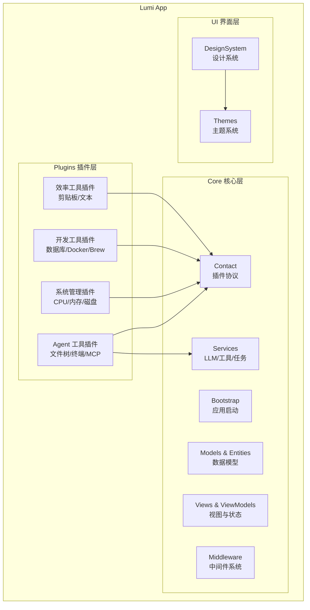
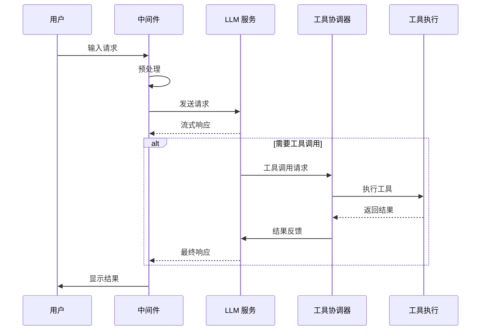

# Lumi

Lumi 是一款面向 macOS 的 AI 驱动的个人桌面助理应用。

📖 中文版 | [English](README.md)

[](https://swift.org)
[](https://developer.apple.com/macos/)
[](LICENSE)


## 🏗️ 架构设计

### 应用架构



### 插件系统

- **SuperPlugin 协议**：所有插件的基础协议，定义生命周期和 UI 贡献点
- **扩展点**：导航栏、工具栏、状态栏、设置页、Agent 视图等
- **中间件**：支持拦截和修改消息发送、对话轮次等事件
- **Agent 工具**：插件可注册自定义工具供 AI 调用

### AI/Agent 工作流程



- **LLMProvider 协议**：统一的 LLM 接口，支持多供应商
- **ToolService**：工具注册、发现和执行
- **WorkerAgent**：后台任务执行代理

## 📋 系统要求

- macOS 13.0+
- Xcode 15.0+
- Swift 5.9+

## 🚀 构建与运行

### 1. 克隆仓库

```bash
git clone https://github.com/Coffic/Lumi.git
cd Lumi
```

### 2. 在 Xcode 中打开

```bash
open Lumi.xcodeproj
```

### 3. 构建与运行

- 选择合适的 macOS 目标
- 构建 (⌘B) 并运行 (⌘R)

## 📄 许可证

本项目采用 GNU 通用公共许可证 v3.0 - 查看 [LICENSE](LICENSE) 文件了解详情。
