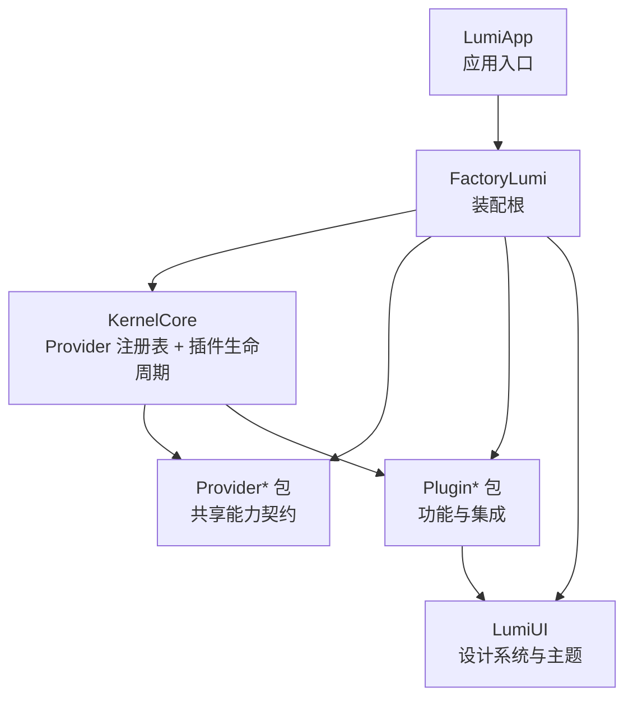
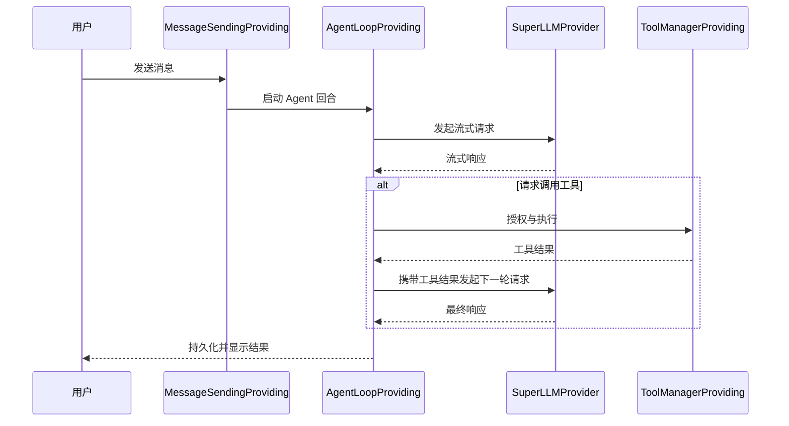

# Lumi

Lumi 是一款面向 macOS 的 AI 驱动个人桌面助理应用。它将 LLM 对话、带工具调用的 Agent、代码编辑器、终端以及丰富的系统与开发者工具整合到一个插件化应用中。

📖 [中文版](README_zh.md) | [English](README.md)

[](https://swift.org)
[](https://developer.apple.com/macos/)
[](LICENSE)
[](https://github.com/CofficLab/Lumi/releases)


## 功能特性

- **多供应商 LLM 对话** — 内置 20+ 个供应商集成，包括 OpenAI、Anthropic、DeepSeek、智谱、MiniMax、Kimi Code、阿里云、阶跃星辰、小米、OpenRouter、Codex，以及通过 MLX 运行的本地模型。部分集成会提供多个 Provider 实现。
- **带工具调用的 Agent** — 读取和编辑文件、执行 Shell 命令、抓取和搜索网页、使用浏览器与电脑控制工具、读取图片，并可在任务中途向用户提问。
- **内置代码编辑器** — 项目文件树、语法高亮、模糊文件搜索、大纲、引用查找、调用层级、问题面板、语言服务与 Markdown 预览。
- **开发者工具** — 原生终端、Git/GitHub 集成、SQLite/MySQL/PostgreSQL/Redis 数据库工具、Docker、Homebrew、端口与 hosts 管理，以及项目诊断。
- **系统实用工具** — 剪贴板历史、磁盘与网络监控、屏幕录制、OCR、显示器控制、防休眠、下载等。
- **项目智能化** — 按项目配置的 Agent 规则、技能、记忆、项目文件搜索，以及面向代码问题的本地向量 RAG。
- **主题与定制** — 100+ 个默认插件，支持运行时启用/禁用插件，并内置 22 个主题。
- **本地 HTTP API** — 内置 Web Server 仅监听本机回环地址，并聚合已启用插件贡献的路由。

> 当前默认应用尚未提供 MCP 客户端支持。仓库中只有少量 MCP 兼容性注释，还没有 MCP 包或 stdio/SSE 传输实现。

## 下载

从 [Releases](https://github.com/CofficLab/Lumi/releases) 页面下载最新 DMG。发布流程会生成架构独立的 `arm64` 和 `x86_64` DMG。直营分发版本通过 [Sparkle](https://sparkle-project.org) 更新；Debug 构建会关闭应用更新。

Mac App Store 分发版本与直营分发版本在 entitlements 和更新集成方面可能不同，请以对应版本的发布说明为准。

## 架构设计

### 应用架构


```mermaid
graph TB
    APP[LumiApp<br/>应用入口]
    FL[FactoryLumi<br/>装配根]
    K[KernelCore<br/>Provider 注册表 + 插件生命周期]
    PF[Provider* 包<br/>共享能力契约]
    PL[Plugin* 包<br/>功能与集成]
    UI[LumiUI<br/>设计系统与主题]

    APP --> FL
    FL --> K
    FL --> PF
    FL --> PL
    K --> PF
    K --> PL
    FL --> UI
    PL --> UI
```

- **LumiApp**：应用入口，创建共享内核，并承载主窗口、设置、引导和菜单栏界面。
- **FactoryLumi**：应用装配根。`KernelFactory` 负责装配 Provider、启动默认插件目录，以及构建主视图和设置视图。
- **KernelCore**：轻量通用内核，提供类型安全的 Provider 注册/解析和插件生命周期管理，不了解具体业务服务。
- **Provider 包**：定义对话、LLM、工具、项目、存储、Web 路由和 UI 扩展等共享能力契约。
- **Plugin 包**：实现产品功能和外部集成。默认目录由 [`DefaultPluginFactory`](Packages/FactoryLumi/Sources/FactoryLumi/PluginFactory.swift) 定义。
- **LumiUI**：提供共享 SwiftUI 组件和主题渲染。

### 插件系统

插件遵循 [`SuperPlugin`](Packages/KernelCore/Sources/KernelCore/Contracts/SuperPlugin.swift) 协议，可以参与注册、Boot、Ready、启用/禁用、Shutdown 和注销阶段，并贡献 Provider、工具、命令、视图、设置、编辑器扩展、菜单、本地 Web 路由等能力。

主要实现层包括：

- [`FactoryLumi`](Packages/FactoryLumi)：装配和依赖接线。
- [`PluginAgentLoop`](Packages/PluginAgentLoop)：Agent 循环集成。
- [`PluginToolManager`](Packages/PluginToolManager)：工具注册、授权、执行和记录。
- [`KitLLM`](Packages/KitLLM) 与 `ProviderLLMVendors`：LLM 模型、适配器和供应商契约。
- [`PluginProjectRAG`](Packages/PluginProjectRAG)：项目索引和本地向量检索。
- [`PluginWebServer`](Packages/PluginWebServer)：插件路由注册和本地 Web 服务集成。

### Agent 工作流程


```mermaid
sequenceDiagram
    participant U as 用户
    participant S as MessageSendingProviding
    participant R as AgentLoopProviding
    participant L as SuperLLMProvider
    participant T as ToolManagerProviding

    U->>S: 发送消息
    S->>R: 启动 Agent 回合
    R->>L: 发起流式请求
    L-->>R: 流式响应
    alt 请求调用工具
        R->>T: 授权与执行
        T-->>R: 工具结果
        R->>L: 携带工具结果发起下一轮请求
        L-->>R: 最终响应
    end
    R-->>U: 持久化并显示结果
```

具体的能力契约位于 `Packages/Provider*`，功能实现位于 `Packages/Plugin*`，从而保持 Agent 循环、工具执行、消息持久化和 UI 之间的职责分离。

## 系统要求

- macOS 14.0 或更高版本
- Xcode 26.x（当前发布流程使用 Xcode 26.3）
- Swift 6.0 或更高版本

部分功能需要额外的 macOS 权限。例如 Computer Use 和屏幕捕获需要相应的辅助功能、自动化或屏幕录制权限。

## 构建与运行

### 在 Xcode 中打开

```bash
git clone https://github.com/CofficLab/Lumi.git
cd Lumi
open Lumi.xcodeproj
```

选择 **Lumi** scheme，使用 ⌘B 构建、⌘R 运行。首次启动后，请在设置中配置 LLM 供应商和 API Key。

### 使用命令行构建

使用仓库中锁定的 Package 版本进行可复现的 Debug 构建：

```bash
xcodebuild \
  -project Lumi.xcodeproj \
  -scheme Lumi \
  -configuration Debug \
  -sdk macosx \
  -disableAutomaticPackageResolution \
  -onlyUsePackageVersionsFromResolvedFile \
  build
```

Package 测试需要在各自的包目录中运行，例如：

```bash
swift test --package-path Packages/FactoryLumi
swift test --package-path Packages/PluginAgentLoop
```

仓库根目录没有 `Package.swift`；应用通过 `Lumi.xcodeproj` 构建，可复用组件则位于 [`Packages/`](Packages/) 下的 Swift Package 中。

## 参与贡献

欢迎在 [CofficLab/Lumi](https://github.com/CofficLab/Lumi) 提交 Issue 与 Pull Request。新功能通常实现为 `Plugin*` 包，并在 [`DefaultPluginFactory`](Packages/FactoryLumi/Sources/FactoryLumi/PluginFactory.swift) 中完成装配。建议从 [`SuperPlugin`](Packages/KernelCore/Sources/KernelCore/Contracts/SuperPlugin.swift)、现有插件以及对应的 `Provider*` 契约开始了解。

## 许可证

本项目采用 GNU 通用公共许可证 v3.0，详情请查看 [LICENSE](LICENSE)。
