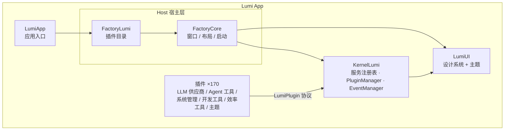
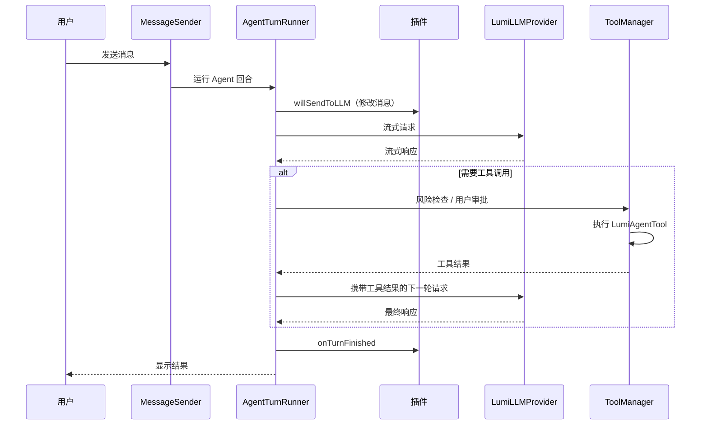

# Lumi

Lumi 是一款面向 macOS 的 AI 驱动个人桌面助理应用。它将 LLM 对话、带工具调用的 Agent、代码编辑器、终端以及丰富的系统与开发者工具箱整合到一个插件化架构的应用中。

📖 [中文版](README_zh.md) | English

[](https://swift.org)
[](https://developer.apple.com/macos/)
[](LICENSE)
[](https://github.com/CofficLab/Lumi/releases)


## ✨ 功能特性

- **多供应商 LLM 对话** — 内置 25+ 个供应商，包括 OpenAI、Anthropic (Claude)、DeepSeek、智谱 (GLM)、MiniMax、Kimi、阿里云 (DashScope)、阶跃星辰 (StepFun)、小米 (MiMo)、OpenRouter，以及通过 MLX 运行的本地模型。完整列表见 [Plugins/](Plugins/)。
- **带工具调用的 Agent** — Agent 可以浏览文件、执行终端命令、抓取网页、搜索网络、自动化浏览器、截屏，并在任务中途向用户提问。
- **MCP 支持** — 接入外部 [Model Context Protocol](https://modelcontextprotocol.io) 服务器（stdio 与 SSE 传输），为 Agent 扩展更多工具。
- **内置代码编辑器** — tree-sitter 语法高亮、模糊文件搜索、大纲、引用查找、调用层级、问题面板与 Markdown 预览。
- **开发者工具** — 原生终端、Git/GitHub 集成、数据库管理器 (SQLite/MySQL/PostgreSQL/Redis)、Docker、Homebrew、端口与 hosts 管理。
- **系统实用工具** — 剪贴板历史、磁盘/网络监控、屏幕录制、OCR、外接显示器控制 (DDC)、防休眠等。
- **项目智能化** — 按项目配置的 Agent 规则、技能、记忆，以及本地检索增强生成 (RAG)。
- **高度可定制** — 170+ 个可在运行时启用/禁用的插件，20+ 个内置主题。
- **本地 HTTP API** — 已启用的插件在仅监听本机的 Web 服务上暴露路由，便于自动化。

## 📥 下载

从 [Releases](https://github.com/CofficLab/Lumi/releases) 页面下载最新 DMG（提供通用、arm64 与 x86_64 版本）。应用通过 [Sparkle](https://sparkle-project.org) 自动更新。

> Mac App Store 版本不包含 Sparkle 自动更新与内置向量检索 RAG 组件，其余功能完全一致。

## 🏗️ 架构设计

### 应用架构


```mermaid
graph TB
    subgraph "Lumi App"
        APP[LumiApp<br/>应用入口]
        subgraph "Host 宿主层"
            FL[FactoryLumi<br/>插件目录]
            FC[FactoryCore<br/>窗口 / 布局 / 启动]
        end
        K[KernelLumi<br/>服务注册表 · PluginManager · EventManager]
        P[插件 ×170<br/>LLM 供应商 / Agent 工具 /<br/>系统管理 / 开发工具 / 效率工具 / 主题]
        UI[LumiUI<br/>设计系统 + 主题]
    end

    APP --> FL
    FL --> FC
    FC --> K
    P -->|LumiPlugin 协议| K
    K --> UI
    FC --> UI
```

- **LumiApp**：应用入口，注入分发渠道敏感的插件（自动更新、RAG）
- **FactoryLumi / FactoryCore**：编译期插件目录与无插件的宿主引擎（窗口、布局、启动）
- **KernelLumi**：内核——服务注册表、插件生命周期管理与事件分发
- **LumiUI**：共享设计系统与主题渲染

### 插件系统

- **LumiPlugin 协议**：所有插件的基础协议，定义于 [KernelLumi](Packages/KernelLumi)，覆盖生命周期（`onBoot` / `onReady` / `onEnable` / `onDisable`）与 UI 贡献点
- **扩展点**：菜单栏、工具栏、状态栏、设置页、聊天分区、编辑器扩展、引导页、本地 Web 路由等
- **插件钩子**：`willSendToLLM` 允许任意插件在每次 LLM 请求前修改消息（如注入 system prompt）；`onTurnFinished` 在每个 Agent 回合结束后回调
- **Agent 工具**：插件可注册自定义工具（`LumiAgentTool`）供 AI 调用

### AI/Agent 工作流程


```mermaid
sequenceDiagram
    participant U as 用户
    participant S as MessageSender
    participant R as AgentTurnRunner
    participant P as 插件
    participant L as LumiLLMProvider
    participant T as ToolManager

    U->>S: 发送消息
    S->>R: 运行 Agent 回合
    R->>P: willSendToLLM（修改消息）
    R->>L: 流式请求
    L-->>R: 流式响应
    alt 需要工具调用
        R->>T: 风险检查 / 用户审批
        T->>T: 执行 LumiAgentTool
        T-->>R: 工具结果
        R->>L: 携带工具结果的下一轮请求
        L-->>R: 最终响应
    end
    R->>P: onTurnFinished
    R-->>U: 显示结果
```

- **MessageSender**（`MessageSending`）：持久化消息并启动 Agent 回合
- **AgentTurnRunner**（`AgentTurnManaging`）：Agent 循环——构造请求、流式输出、执行工具调用，直到回合完成
- **LumiLLMProvider**：统一的流式 LLM 接口；25+ 供应商插件基于 [LLMKit](Packages/LLMKit) 构建
- **ToolManager**（`ToolManaging`）：工具注册、风险检查、高风险工具的用户审批，以及 `LumiAgentTool` 的执行

## 📋 系统要求

- macOS 14.0+
- Xcode 16.0+
- Swift 6.0+

## 🚀 构建与运行

### 1. 克隆仓库

```bash
git clone https://github.com/CofficLab/Lumi.git
cd Lumi
```

### 2. 在 Xcode 中打开

```bash
open Lumi.xcodeproj
```

### 3. 构建与运行

- 选择 **Lumi** scheme 与 macOS 目标
- 构建 (⌘B) 并运行 (⌘R)

## 🤝 参与贡献

欢迎在 [CofficLab/Lumi](https://github.com/CofficLab/Lumi) 提交 Issue 与 Pull Request。新功能通常以插件形式开发——可参考 [LumiPlugin 协议](Packages/KernelLumi/Sources/KernelLumi/Contracts/LumiPlugin.swift) 与 [Plugins/](Plugins/) 下的现有插件。

## 📄 许可证

本项目采用 GNU 通用公共许可证 v3.0 — 查看 [LICENSE](LICENSE) 文件了解详情。
