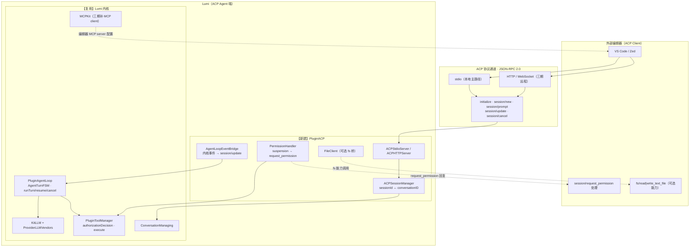
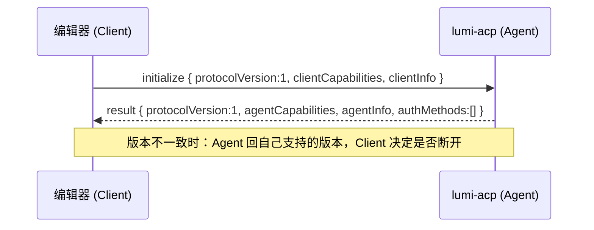
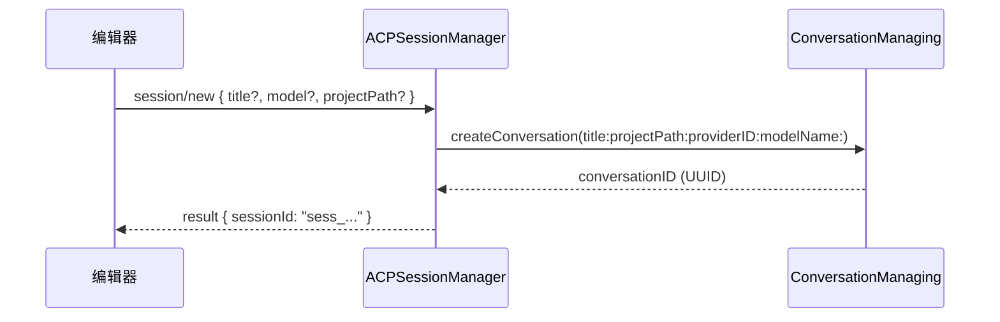
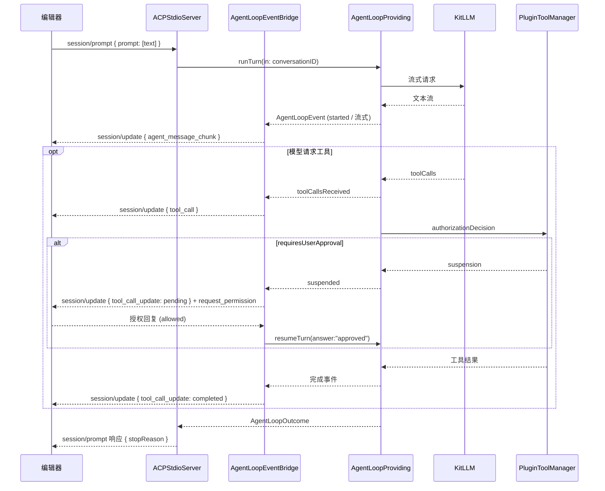
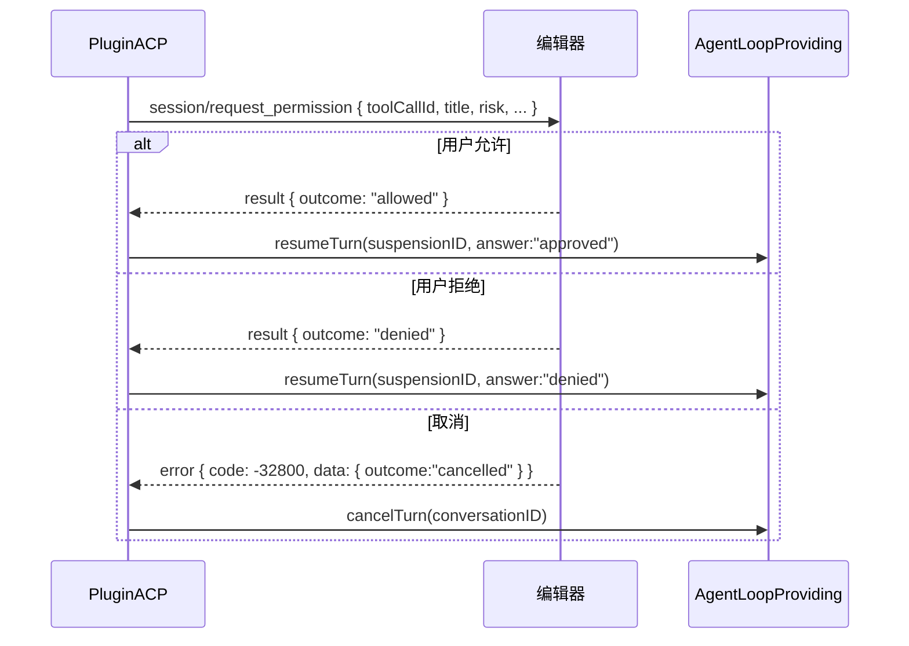

# Lumi 接入 ACP（Agent Client Protocol）实施方案

> 状态：M2 握手已通过（2026-09-18）；M3 回合与流式单测全绿（2026-09-18）；M4 授权与文件已完成并**通过真实 app 环境端到端验证**（2026-09-18，PluginACP 60/60，详见 §9 M5 验证记录）；headless 阻塞问题已定位并修复；lumi-acp 采用方案 B，内嵌 Lumi.app 分发
> 目标：让 Lumi 以 **ACP Agent** 身份接入外部编辑器（VS Code / Zed 等），使外部编辑器中可直接使用 Lumi 的 agent 能力（模型路由、工具系统、项目智能）。
> 关联文档：[ACP Introduction](https://agentclientprotocol.com/get-started/introduction)、[ACP Protocol Overview](https://agentclientprotocol.com/protocol/overview)、[ACP Prompt Turn](https://agentclientprotocol.com/protocol/prompt-turn)

---

## 1. 背景与目标

Lumi 目前是"编辑器 + agent"一体化的 macOS 应用：agent 内核（`PluginAgentLoop`）、工具系统（`PluginToolManager`）、LLM 路由（`KitLLM` + `ProviderLLMVendors`）均已完备，但只能在本应用内使用。用户希望在其他编辑器（VS Code / Zed 等）中直接调用 Lumi 的 agent。

ACP（Agent Client Protocol）正是解决"编辑器 ↔ 编码 agent"互联的标准协议：编辑器是 **Client**，agent 是 **Agent**，双方通过 JSON-RPC 2.0 通信。Lumi 需要扮演 **Agent 端**。

### 目标范围（MVP → 完整）

| 阶段 | 能力 | 说明 |
| --- | --- | --- |
| MVP | `initialize` / `session/new` / `session/prompt` / `session/update` / `session/cancel` / `session/request_permission` | 本地 stdio 传输，单连接多会话，文本提示，流式输出，工具调用与授权 |
| 二期 | `fs/read_text_file`、`fs/write_text_file` 桥接、`session/load`、`session/set_mode` | 编辑器侧文件能力利用、会话续载、模式切换 |
| 三期 | 远程 HTTP/WebSocket、MCP client（`MCPKit`）、图片/音频提示 | ACP 远程模式（官方 WIP）、编辑器 MCP server 配置接入 |

---

## 2. ACP 协议要点（Agent 端视角）

### 2.1 传输与通信模型

- **本地（主路径）**：agent 作为编辑器拉起的子进程，**JSON-RPC 2.0 over stdio**（stdin/stdout，每行一个 JSON 消息，或按 Content-Length 帧——以 ACP 官方 schema 为准）。
- **远程（三期）**：HTTP / WebSocket。
- 一个连接可承载**多个并发 session**（多线程对话）。

### 2.2 Agent 端基线方法与通知

| 方向 | 方法 / 通知 | 必选 | 说明 |
| --- | --- | --- | --- |
| Client → Agent | `initialize` | ✅ | 协商协议版本与能力 |
| Client → Agent | `session/new` | ✅ | 创建会话 |
| Client → Agent | `session/prompt` | ✅ | 发送用户提示（ContentBlock[]），回合直到返回 `StopReason` |
| Client → Agent | `session/cancel`（通知） | ✅ | 取消进行中的回合 |
| Agent → Client | `session/update`（通知） | ✅ | 流式更新：`plan` / `agent_message_chunk` / `tool_call` / `tool_call_update` 等 |
| Agent → Client | `session/request_permission` | ✅（按需） | 工具调用前请求用户授权；Client 必须回复 |
| Client → Agent | `session/load` / `session/set_mode` / `logout` | 可选 | 需对应能力声明 |

- `session/prompt` 响应携带 `stopReason`：`end_turn` / `max_tokens` / `max_turn_requests` / `refusal` / `cancelled`。
- 所有文件路径 **MUST 为绝对路径**；行号 **1-based**。
- 协议版本为整数（当前 `1`），仅破坏性变更才递增。

### 2.3 能力协商

- `initialize` 请求：`protocolVersion`、`clientCapabilities`（`fs.readTextFile`、`fs.writeTextFile`、`terminal` 等）、`clientInfo`。
- `initialize` 响应：`protocolVersion`、`agentCapabilities`（`loadSession`、`promptCapabilities.image/audio/embeddedContext`、`mcpCapabilities.http/sse`、`auth`）、`agentInfo`、`authMethods`。
- 所有未声明的能力一律视为**不支持**。

### 2.4 扩展

- 自定义数据放 `_meta`；自定义方法以 `_` 前缀命名；自定义能力在 `initialize` 的 `_meta` 中声明。

---

## 3. Lumi 现状盘点

### 3.1 可复用资产（已核实）

| 包 / 文件 | 接口 | ACP 用途 |
| --- | --- | --- |
| `PluginAgentLoop`（`AgentTurnFSM.swift`） | `TurnPhase` / `TurnEvent` / `TurnReducer` | 回合状态机：`session/prompt` 生命周期复用 |
| `ProviderAgentLoop`（`AgentLoopProviding.swift`） | `runTurn(in:)` / `resumeTurn(in:request:)` / `cancelTurn(in:)` / `addAgentLoopObserver(_:)` / `suspension(for:)` | 驱动与取消回合；订阅 `AgentLoopEvent` 转 `session/update` |
| `ProviderAgentLoop`（`AgentLoopObservation.swift`） | `AgentLoopEvent`（started / toolCallsReceived / suspended / completed / failed / cancelled） | 事件桥 → `session/update` 通知 |
| `ProviderAgentLoop`（`AgentLoopOutcome.swift`） | `completed` / `failed(String)` / `cancelled` / `suspended(String)` | → `stopReason` 映射 |
| `ProviderAgentLoop`（`AgentLoopSuspension.swift` / `AgentTurnResumeRequest.swift`） | `suspensionID` / `toolCallID` / `kind: "userInput"` / `payload`；`suspensionID` + `answer` | 工具授权挂起/恢复 → `session/request_permission` |
| `ProviderConversation`（`ConversationManaging.swift`） | `createConversation(title:projectPath:providerID:modelName:)` / `selectConversation(id:)` | `session/new` 映射，`sessionId ↔ conversationID` |
| `ProviderToolManager`（`ToolManagerProviding.swift`） | `authorizationDecision(for:conversationID:)`（`blocked` / `autoApproved` / `requiresUserApproval`）、`execute` / `executeAuthorized` / `rejectAuthorized` / `resolveUserResponse` | 工具授权决策与执行 |
| `KitLLM` + `ProviderLLMVendors` | 20+ 提供商路由、`LLMModelRoute` | headless 模型路由 |
| `KitWebServer`（`LumiWebServer.swift`） | `WebServerProviding` / `register(_:forPlugin:)` / `WebRoute` | 三期远程 HTTP 传输复用 |
| `KeychainKit` | Keychain 凭据存取 | headless 进程读取 API key |
| `KernelCore`（`SuperPlugin.swift`） + `FactoryLumi`（`PluginFactory.swift`） | 插件注册/生命周期 | 新 `PluginACP` 挂载点 |
| `LumiApp`（`LumiApp.swift`） | `KernelFactory.makeKernel()` 独立于 SwiftUI 视图 | headless 入口复用内核组装 |

### 3.2 缺口与约束

| 缺口 | 影响 | 处置 |
| --- | --- | --- |
| 无任何 ACP 协议类型/传输实现 | 全部需新建 | 新包 `ProviderACP` |
| 无 ACP 会话管理与事件桥 | 需新建 | 新包 `PluginACP` |
| GUI 应用无 headless 入口 | ACP 本地模式要求 agent 作为子进程被拉起 | 新 target `lumi-acp`（CLI） |
| `MCPKit` 为空壳（仅 `.DS_Store`，README 已声明无 MCP client） | 无法消费编辑器下发的 MCP server 配置 | 三期补 MCP client（stdio/SSE/HTTP） |
| agent loop 为 `@MainActor` 且按 `conversationID` 管理 runtime | 并发 session 天然支持（每会话独立 runtime），但事件桥需在主线程汇聚 | 桥接层统一 `@MainActor`，stdio 读写用独立线程 |

---

## 4. 总体架构

### 4.1 新增组件总览

1. **`Packages/ProviderACP`** —— 纯协议包（无产品逻辑）：ACP 类型、JSON-RPC 编解码、传输抽象（`ACPTransport`）、能力模型。可独立测试。
2. **`Packages/PluginACP`** —— 功能包：会话管理器、agent loop 事件桥、权限处理器、文件能力客户端、stdio 服务器循环。遵循 `SuperPlugin` 生命周期，注册进 `DefaultPluginFactory`。
3. **`Lumi.xcodeproj` 新增 target `lumi-acp`** —— 命令行可执行入口：调用 `KernelFactory.makeKernel()`（不装配 UI），启动最小插件集合 + `PluginACP`，进入 stdio run loop。**分发形态（已决策）：方案 B，内嵌 Lumi.app**，产物位于 `Lumi.app/Contents/MacOS/lumi-acp`，随 DMG 发布、随 Sparkle 更新。

### 4.2 架构图



### 4.3 目录 / 文件规划

```
Packages/ProviderACP/
  Sources/ProviderACP/
    ACPVersion.swift            // 协议版本常量、协商
    ACPTypes.swift              // ContentBlock、SessionUpdate、StopReason、工具调用类型
    ACPCapabilities.swift       // Client/Agent 能力模型
    ACPJSONRPC.swift            // JSON-RPC 2.0 信封编解码（Codable）
    ACPTransport.swift          // 传输抽象：send/recv/回调
    StdioTransport.swift        // stdio 实现（本地）
    HTTPTransport.swift         // HTTP/WS 实现（三期）
  Tests/ProviderACPTests/       // 协议编解码单测（无内核依赖）

Packages/PluginACP/
  Sources/PluginACP/
    PluginACP.swift             // SuperPlugin：onRegister/onBoot 装配
    ACPSessionManager.swift     // ACP session ↔ Conversation 映射、生命周期
    AgentLoopEventBridge.swift  // AgentLoopEvent → session/update 通知
    PermissionHandler.swift     // suspension → session/request_permission → resume
    ACPFileClient.swift         // 编辑器 fs 能力调用（可选）
    ACPStdioServer.swift        // stdio 消息循环与分发
    ACPConfig.swift             // 监听端口、默认模型、自动化级别等
  Tests/PluginACPTests/         // 桥接与状态映射测试

Lumi.xcodeproj → new target: lumi-acp（Command Line Tool，产物内嵌 app bundle）
  lumi-acp/main.swift           // 内核组装 + PluginACP 启动 + run loop
```

---

## 5. 关键映射设计（ACP ↔ Lumi 内核）

| ACP 侧 | Lumi 侧 | 说明 |
| --- | --- | --- |
| `initialize` 请求 | `ACPJSONRPC` 解析 + 版本/能力协商 | 响应 `protocolVersion: 1`；`agentCapabilities`：MVP 声明 `promptCapabilities.text` 基线；`loadSession: false`（二期开） |
| `session/new` 请求 | `ConversationManaging.createConversation(title:projectPath:providerID:modelName:)` | 会话元数据存 `ACPSessionManager`：`sessionId(字符串) → conversationID(UUID)`；`projectPath` 从 prompt 中 resource uri 提取或客户端元数据 |
| `session/prompt` 请求 | `AgentLoopProviding.runTurn(in: conversationID)` | 入参 `ContentBlock[]` → 转 Lumi 消息内容（text / resource 展开为上下文）；响应等 `AgentLoopOutcome` → `stopReason` |
| `session/update`（通知，Agent→Client） | `AgentLoopEvent` + `ToolManagerEvent` 桥接 | `started → agent_message_chunk`（首帧）；`toolCallsReceived → tool_call`；`suspended → plan/权限态`；`completed/failed/cancelled` → 终帧 |
| `session/request_permission`（Agent→Client 请求） | `AgentLoopEvent.suspended`（`kind == "userInput"`） | 载荷携带 `suspensionID`、`toolCallID`、工具名、风险说明；Client 回复 `allowed` / `denied` / `cancelled` |
| 权限回复 → 恢复 | `AgentTurnResumeRequest(suspensionID:answer:)` + `resumeTurn` | `allowed → "approved"`；`denied → "denied"`（配合 `rejectAuthorized`）；`cancelled → cancelTurn` |
| `session/cancel`（通知） | `AgentLoopProviding.cancelTurn(in:)` | 等待 `AgentLoopOutcome.cancelled` 后以 `stopReason: "cancelled"` 响应原 `session/prompt` |
| `fs/read_text_file` / `fs/write_text_file`（Client 能力） | `ACPFileClient`（可选工具实现） | 当编辑器声明 `fs` 能力时，Lumi 文件类工具可改走编辑器桥，保证编辑器的 diff 可见性；否则回退 Lumi 自带文件工具 |
| `session/load`（二期） | `ConversationManaging.fetchConversation(id:)` | 恢复会话并重建 `TurnRuntime` |

### stopReason 映射

| `AgentLoopOutcome` | ACP `stopReason` |
| --- | --- |
| `.completed` | `end_turn` |
| `.failed(reason)` | `refusal`（或 `_meta.failureReason` 携带详情） |
| `.cancelled` | `cancelled` |
| `.suspended` | 不结束回合——挂起等待 `session/request_permission` 回复后 `resumeTurn` |

---

## 6. 模块设计

### 6.1 `ProviderACP`（协议层）

**`ACPJSONRPC`**：`Codable` 信封，支持 request / response / notification / error 四态：

```swift
public enum ACPMessage: Codable, Sendable {
    case request(id: Int, method: String, params: JSONValue?)
    case response(id: Int, result: JSONValue?, error: ACPError?)
    case notification(method: String, params: JSONValue?)
}
```

**`ACPTypes`**：`ContentBlock`（text / resource / image / audio）、`SessionUpdate`（`plan` / `agent_message_chunk` / `tool_call` / `tool_call_update` / `available_commands` / `mode_changed`）、`StopReason`（enum）、`ToolCallKind`。

**`ACPTransport`**：

```swift
public protocol ACPTransport: AnyObject {
    var onMessage: ((Data) -> Void)? { get set }
    func start() throws
    func send(_ data: Data) throws
    func stop()
}
```

`StdioTransport` 用 `FileHandle.standardInput/output`，独立线程读 stdin 防阻塞，写 stdout 加锁。禁用 stderr 输出协议外内容（stderr 保留给日志，避免污染协议流）。

### 6.2 `PluginACP`（功能层）

**`ACPSessionManager`**：维护 `[SessionID: ACPSession]`；`ACPSession` 持有 `conversationID`、创建参数、模型选择。`session/new` 时若编辑器未指定模型，回退 ACP 配置的默认 provider/model（`ACPConfig`）。

**`AgentLoopEventBridge`**：注册 `AgentLoopProviding.addAgentLoopObserver`，把 `AgentLoopEvent` 翻译为 `session/update` 通知并投递到对应 session 的 transport。流式文本：若内核事件不含逐 token 粒度，先以 `agent_message_chunk` 的整段/增量帧发出（对齐现有 `ProviderMessageStreaming` 的流式回调，见 7.3）。

**`PermissionHandler`**：收到 `suspended` 事件（`kind == "userInput"`）后，向 Client 发 `session/request_permission`（JSON-RPC request，带 `id`），按回复分支：
- `allowed` → `resumeTurn(in:request: AgentTurnResumeRequest(suspensionID:answer: "approved"))`
- `denied` → `rejectAuthorized` 或 `resumeTurn(answer: "denied")`
- 回复缺失/超时 → 视为 `denied`，并向内核注入取消

**`ACPStdioServer`**：消息循环：读帧 → 解码 → 按 method 分发 → 异步执行 → 回写响应。`session/prompt` 使用"长请求 + 异步回合"模型：立即返回不阻塞循环，回合完成时补发 `session/prompt` 的 response（符合 ACP：流式期间发通知，最后响应 `stopReason`）。

### 6.3 `lumi-acp`（headless 入口）

```swift
// lumi-acp/main.swift（示意）
let kernel = try KernelFactory.makeKernel()          // 复用内核组装，不装配 UI
// 仅启用最小插件集：LLM/对话/工具/项目 + PluginACP
kernel.resolveProvider((any AgentLoopProviding).self) // 确保 agent loop 就绪
let acp = PluginACP(kernel: kernel, transport: StdioTransport())
try acp.start()                                       // 进入 run loop，直到 stdin EOF
```

- 编译进 `Lumi.xcodeproj` 新 target；产物 `lumi-acp` 打包进 `Lumi.app/Contents/MacOS/lumi-acp`（方案 B，已决策），随 DMG 发布、随 Sparkle 更新，签名公证随 app 一套。
- 编辑器配置路径：`/Applications/Lumi.app/Contents/MacOS/lumi-acp`（首次引导在文档与设置页给出该路径，可用 `xcrun --find` 风格探测或由 Lumi.app 首次启动时写入配置）。
- 配置来源：`ACPConfig`（默认模型、自动化级别、允许的项目根），优先读环境变量（`LUMI_ACP_*`）再回退应用内 Keychain/UserDefaults。
- **需验证**：`KernelFactory.makeKernel()` 及各插件在无 `NSApplication` 环境下能否安全启动（见风险 R1）。

### 6.4 注册与装配

- `PluginACP` 遵循 `SuperPlugin`，在 `DefaultPluginFactory` 的插件列表中追加（紧邻 `WebServerPlugin()` 附近，依赖 `ProviderAgentLoop` / `ProviderConversation` / `ProviderToolManager` 对应插件已启动）。
- GUI 应用内启动时 **不**自动拉起 ACP stdio 服务器（避免与编辑器抢占 stdin）；仅在 `lumi-acp` target 或用户显式开启（如 `LUMI_ACP_HTTP_PORT`）时启用远程模式。

---

## 7. 关键流程时序

### 7.1 initialize 握手



### 7.2 session/new



### 7.3 session/prompt 回合



> 流式细节：若 Lumi 的 `ProviderMessageStreaming` 提供逐 token 回调，桥接层以增量帧发 `agent_message_chunk`；否则按"完成文本分段切帧"，保证客户端可见进度。二期可引入 `plan` 更新（复用 `PluginAgentPlanStorage`）。

### 7.4 工具授权（request_permission）



### 7.5 取消

`session/cancel`（通知）→ `AgentLoopProviding.cancelTurn(in:)` → 等待 `.cancelled` → 以 `stopReason: "cancelled"` 补发 `session/prompt` 响应；期间挂起的 `request_permission` 一律以 `cancelled` 收尾（符合 ACP 要求）。

### 7.6 文件操作与 diff

- **默认**：Lumi 使用自带文件工具（`KitFileSystem` 等），结果以 `tool_call_update` 内容帧回报；编辑器侧 diff 依赖编辑器对 `fs/write_text_file` 的监听——因此推荐打开 `fs` 能力。
- **开启 `fs` 能力时**：`ACPFileClient` 提供 `FSBridgeTool`（实现 `SuperAgentTool`），文件读写经 `fs/read_text_file` / `fs/write_text_file` 走编辑器环境，编辑器的 diff 视图、未保存缓冲区语义天然正确。
- 路径约定：所有路径在桥接层归一化为绝对路径（ACP 强制要求）。

---

## 8. 权限与安全

- **工具授权**：一律经过 `ToolManagerProviding.authorizationDecision(for:conversationID:)`，`blocked` 直接拒绝；`requiresUserApproval` 必须走 `session/request_permission`，禁止静默放行。headless 下自动化级别默认取最保守档（可经 `ACPConfig` 配置）。
- **项目边界**：`session/new` 携带的 `projectPath` 作为会话的项目根；文件工具校验绝对路径是否位于允许的项目根内（防越权读写）。
- **凭据**：API key 存 Keychain（`KeychainKit`）；`lumi-acp` 子进程按当前用户权限运行，不在协议帧或日志中输出密钥。
- **协议层**：stdin/stdout 只承载协议帧；日志一律走 stderr 或日志文件。远程模式（三期）绑定 loopback，默认不开认证；开放远程前必须支持 `authenticate` / token。
- **取消语义**：收到 `session/cancel` 后，`session/request_permission` 挂起项必须全部以 `cancelled` 回复，避免悬挂请求。

---

## 9. 里程碑与验收

### M1 — 协议包（ProviderACP）✅ 已完成（2026-09-17）
- [x] `ACPJSONRPC`（实现为 `ACPMessage`）编解码 + 单测（请求/响应/通知/错误、非法帧拒绝、`result: null` 语义）
- [x] `ACPTypes` / `ACPCapabilities` 完整类型 + 单测（ContentBlock 五种、SessionUpdate 八种变体、ToolCall、Plan、StopReason、能力协商）
- [x] `StdioTransport`（newline-delimited 帧、行缓冲、EOF 处理）——**已实现；传输层由 M2 端到端握手联调覆盖**（管道注入 initialize + session/new 帧验证）
- **验收**：`swift test --package-path Packages/ProviderACP` 全绿（40/40，0 失败）；官方 schema 的 JSON 样例双向编解码通过。
- **实现说明**：信封类型命名为 `ACPMessage`（含 request/response/error/notification 四态），任意 JSON 载荷用 `JSONValue`；工厂方法 `makeRequest` / `makeNotification` / `makeResponse` 提供类型化构造。

### M2 — headless 入口 + 握手 ✅ 握手已通过（2026-09-18）
- [x] `lumi-acp` 原型（`Packages/ACPBootstrap` 可执行入口）编译运行，`KernelFactory.makeKernel()` 在无 NSApplication 环境成功启动完整插件目录
- [x] `initialize` 握手（版本/能力协商）通过
- [x] `session/new` / `sessionId ↔ conversationID` 映射（`PluginACP.ACPSessionManager`）
- **验收**：echo 帧脚本完成 initialize + session/new 完整握手；新会话以 cwd 作为 projectPath 创建。
- **验证记录（2026-09-18）**：
  - R1 冒烟：`ACPBootstrap` 输出 `ACP_BOOTSTRAP_OK agentLoop=AgentLoopManager conversations=0 tools=60`——无 GUI 环境下 `makeKernel()` 全量插件启动成功。
  - 端到端握手：管道注入 initialize + session/new 两帧，stdout 返回协议版本 1 的能力协商结果与 `sess_<32hex>` 会话 ID；`PluginACP` 14/14 单测全绿。
- **实现说明**：`PluginACP`（SuperPlugin，order=250）组合 `ACPSessionManager`（会话映射）+ `ACPProtocolHandler`（方法分发）+ `ACPStdioServer`（MainActor 消息循环）；`StdioTransport` 增补 `onEOF` 回调供宿主干净退出。
- **遗留**：正式 `lumi-acp` Xcode target（内嵌 app 分发、随 DMG+Sparkle 发布）尚未创建；`session/prompt` 等回合逻辑属 M3。

### M3 — 回合与流式 ✅ 单测全绿（2026-09-18）
- [x] `session/prompt` 全流程：文本入参 → `runTurn` → `session/update` 流式 → `stopReason`
  - 新增 `ACPTurnCoordinator`（事件桥）：`AgentLoopEvent.toolCallsReceived → session/update(tool_call, pending)`；回合收尾补发 `tool_call_update(completed/failed)` + 最终 assistant 文本 + `session/prompt` 响应（`end_turn`）。
  - `session/cancel` 通知 → `cancelTurn` → `stopReason: cancelled`；双路径（事件流 / `runTurn` 返回值）以 `finalized` 标志保证只 finalize 一次。
  - **首响应超时兜底（watchdog）**：回合启动后 `LUMI_ACP_TURN_TIMEOUT`（默认 45s）内无任何 LLM 进展（工具调用/终态事件）→ 按失败收尾，避免无模型/LLM 挂起时 Client 悬挂；任何进展事件到达即取消 watchdog。
  - **自动回复抑制**：`AgentLoopProviding` 新增 `setAutoReplySuppressed(_:for:)`（内核默认空实现）；ACP 回合先抑制再插入用户消息，避免内核 `MessageObserver` 自动回复与 ACP 回合双启动竞争；回合结束恢复。
- [x] 工具调用：`tool_call` / `tool_call_update` 通知（`ToolKind` 按工具名推断）
- [x] 取消：`session/cancel` → `stopReason: cancelled`
- [x] 挂起（AskUser → ACP 权限桥）：`yes_no` → `session/request_permission`（是/否）；`choice` → 选项列表；`free_text`/非 JSON → 降级为文本提示 + 取消回合；`selected(optionId)` → `resumeTurn(answer:)`，`cancelled` → 取消。
- **验证**：`swift test --package-path Packages/PluginACP` 全绿（31/31：回合完成、finalize 一次、tool_call/update、yes_no/choice 权限、free_text 降级、取消、watchdog×2、输入校验、纯函数）；`ProviderACP` 40/40；e2e（headless stdio）：initialize + session/new + `session/prompt` → 自动回复抑制生效、回合由 ACP 独占启动、`started` 事件到达。
- **已知局限（记录已更正，2026-09-18）**：原记录称"headless 下真实消息存储挂起、读不到模型配置"导致无法验证完整回合。经实测，**这两点均不成立**（`messagesSnapshot` 正常返回；模型配置可读）。真实阻塞源是 API Key 读取弹窗与通知插件崩溃，已修复，完整回合现已在 headless 环境验证通过（见 M5 验证记录）。
- **遗留**：正式 `lumi-acp` Xcode target（内嵌 app 分发、随 DMG+Sparkle 发布）尚未创建；Zed 实配实测待 M5。

### M4 — 授权与文件 ✅ 已完成（2026-09-18）
- [x] `session/request_permission` 双向：挂起、允许/拒绝/取消三分支、恢复
  - 新增 `ACPClientRequester`（出站请求收发器）：Agent 主动请求（权限 / fs）统一按 id 关联 continuation，响应、错误、超时、会话取消四条路径都恰好 resume 一次；Agent 侧请求 id 从 1000 起，避免与 Client 请求 id 混淆。
  - **工具授权挂起识别**：内核授权挂起以 payload `kind == "permission"` 标记，此前被当作普通 AskUser `yes_no` 处理。现已单独识别，并使用**真实 `toolCallId`**（`suspension.toolCallID`）与规范 optionId（`allow_once` / `reject_once`），与先前上报的 `tool_call` 通知保持一致；授权弹窗携带工具名、`ToolKind` 与原始入参。
  - **允许 → 恢复**：先补发 `tool_call_update(in_progress)`（符合 ACP 规范），再以内核可识别的允许词恢复回合；**拒绝**以非允许词恢复（内核 `resolveUserResponse` 判为拒绝执行）；**取消/超时/错误响应**一律 `cancelTurn`，不悬挂。
  - 权限请求超时默认 300s（`LUMI_ACP_REQUEST_TIMEOUT` 可调，且权限窗口不小于该值），避免无响应的 Client 让回合永久挂起。
- [x] `fs/read_text_file` / `fs/write_text_file` 桥接工具（编辑器声明能力时启用）
  - `ACPClientCapabilitiesStore`：捕获并存储 `initialize` 声明的 `clientCapabilities.fs`（未声明一律视为不支持）。
  - `ACPFileClient`：fs 请求构造与路径校验（**必须绝对路径**；越出会话 `cwd` 的路径与 `..` 穿越一律拒绝，按路径组件比较避免前缀误判）。
  - `ACPReadFileTool` / `ACPWriteFileTool`：覆盖内置 `read_file` / `write_file`，经编辑器读写，使未保存缓冲区与编辑器 diff 视图天然正确；**仅在 Client 声明完整 fs 能力时注册**，否则回退内核自带文件工具；`stopACPServer` 时撤回。
- [x] **回合收尾清理挂起请求**：`finalize` 与 `session/cancel` 都会作废该会话全部挂起权限请求，并把未出结果的工具调用补发 `tool_call_update(cancelled)`，满足 ACP「取消后不得残留挂起请求」的要求。
- **验证**：`swift test --package-path Packages/PluginACP` 全绿（**60/60**，较 M3 的 31 增加 29 条：出站请求器 6、文件客户端 9、能力捕获与响应路由 5、工具授权三分支与超时/失败 5、挂起清理 3、AskUser 回归 1）；`ProviderACP` 40/40。e2e（headless stdio）：`initialize`（声明 fs 能力）+ `session/new` + `session/cancel` 帧往返正常，`ACPBootstrap` 可执行产物构建通过。
- **已知局限（2026-09-18 已补验）**：原记录的"完整回合需 M5 或真实 app 验证"已在 headless 环境完成——文本回合、工具调用、fs 读写、权限允许/拒绝全部通过（见 §9 M5 验证记录）；期间还修掉了一个 M4 装配缺陷——**fs 桥原先从未激活**（安装时机早于 `initialize`），现已改为按 `initialize` 声明的能力安装。fs 桥的路径边界仍依赖 `session/new` 的 `cwd`（R9）。
- **遗留**：正式 `lumi-acp` Xcode target（内嵌 app 分发、随 DMG+Sparkle 发布）尚未创建；Zed 实配实测待 M5。

### M5 — 二期/三期能力（进行中）
- [x] **解除 headless 回合阻塞（2026-09-18）** —— 见下方"验证记录"。此前 M3/M4 记录的"headless 无法验证完整回合"根因判断**不准确**，实测已更正。
- [x] **M4 验收补验（2026-09-18）**：真实 headless agent 上完成文本回合、工具调用生命周期、编辑器 fs 读写、权限允许/拒绝全链路。
- [x] **流式输出（2026-09-18）**：新增 `ACPStreamingBridge` 订阅内核流式 store，回合**进行中**即发 `agent_message_chunk` 增量帧（此前只在收尾整段发送）；已流式的回合收尾不重复整段重发。e2e 实测一次回复产生 **27 个增量帧**。
- [x] **失败语义修正 + 错误路径（2026-09-18）**：`stopReason` 原先只有 `cancelled`/`end_turn` 两态，**失败被伪装成 `end_turn`**（客户端会把错误当成功）。现按方案 §5 映射 `.failed → refusal` 并保留原因文本；`session/prompt` 对未知会话改为**同步**返回 `invalidParams`（此前会因无活动回合而永远不响应，客户端悬挂）。
- [x] **权限文案 i18n（2026-09-18）**：新建 `Resources/Localizable.xcstrings`（en / zh-Hans / zh-Hant / zh-HK / zh-TW）。**关键修正**：展示文案改为本地化，同时把提交内核的 answer 与界面文案**解耦**——原先 yes_no 与授权分别传「是」「允许」作为 answer，而内核只认允许词表，非中文环境下点「允许」会被判为拒绝执行。
- [x] **app 插件装配（2026-09-18）**：`PluginACP` 已注册进 `FactoryLumi` 的 `DefaultPluginFactory`，app 可解析该实例；插件新增 `autoStartsServer`（默认 `false`）——GUI 进程不得抢占 stdin，仅注册不启服务，由 headless 入口显式启动。**顺带修掉一处潜在双注册**：headless 入口原先以 `additionalPlugins` 传入自己的实例，目录里再有同名插件会让内核抛 `pluginAlreadyRegistered` 而无法启动；现改为按 id 从内核解析目录实例。
- [ ] **正式 `lumi-acp` Xcode target**（见下方"未完成项"）
- [ ] `session/load`（会话续载）、`session/set_mode`（模式切换）
- [ ] 远程 HTTP/WebSocket 传输（复用 `LumiWebServer`）
- [ ] `MCPKit` MCP client（stdio/SSE/HTTP），消费编辑器下发的 MCP server 配置
- [ ] `promptCapabilities.image`（粘贴截图提问）

#### M5 未完成项：`lumi-acp` target（受阻于验证手段）

`Packages/ACPBootstrap` 目前是一个 **Package 内可执行 target**，还不是产品形态。**注意：装配这一半已完成**（见上条），剩下的只有工程侧：

- `Lumi.xcodeproj` 中仍没有任何 ACP target（全工程 "ACP" 匹配数为 0）；
- 因此用户**无法通过安装 Lumi.app 使用 ACP**，只能用 `swift run` 驱动仓库内源码。

落地需要：新建 `lumi-acp` command line target、把三个 ACP 包接入工程、嵌入 `Lumi.app/Contents/MacOS/`、处理签名（另有一条更简路径：编进 `Lumi.app` 主二进制、借 `argv[0]` 分派 headless 模式，可省去嵌入与签名）。

**当前阻塞**：本环境 `xcodebuild` 被沙箱拒绝（`sandbox-exec: sandbox_apply: Operation not permitted`），**无法构建或验证**任何 Xcode 工程改动。pbxproj 为手工维护（非 XcodeGen/Tuist 生成），盲改不可验证，故本轮未动，留待能在 Xcode 中构建的环境完成。

#### M5 验证记录（2026-09-18）：headless 回合阻塞的根因与修复

**现象**：headless `session/prompt` 后回合静默消失，连 watchdog 都不触发（MainActor 被同步阻塞）。

**排查方式**：`sample <pid>` 抓取运行中 agent 的调用栈。

**三个真实根因**（互相独立，此前记录均未命中）：

| 根因 | 机制 | 修复 |
| --- | --- | --- |
| API Key 读取弹窗阻塞 | `VendorAPIKeyTools` 在无 Data Protection entitlement 的进程里回退到 file-based Keychain，`SecItemCopyMatching` 触发系统密码对话框并**永久阻塞**该线程（且有非重试状态码如 `errSecAuthFailed` 导致连缓存回退都被跳过） | Keychain 增加**无提示读取**模式（`kSecUseAuthenticationUIFail`）；API Key 解析一律走无提示路径，需要授权时立即失败并回退缓存 |
| 进程崩溃（回合静默消失） | `AgentTurnNotificationPlugin` 在无 bundle 的 CLI 进程中调用 `UNUserNotificationCenter.current()`，抛 `NSInternalInconsistencyException` 直接终止进程 | 无 bundle identifier 时跳过通知投递与订阅 |
| 自动标题争抢 | `ConversationTitlePlugin` 对每条新用户消息发起标题 LLM 请求，与 ACP 回合竞争并拖延 | headless agent 进程（`LUMI_ACP_HEADLESS=1`）禁用自动标题 |

**修复后的端到端结果**（真实 `ACPBootstrap` 二进制 + 真实模型）：

| 场景 | 结果 |
| --- | --- |
| 文本回合 | `agent_message_chunk` + `stopReason: end_turn` ✅ |
| 工具调用生命周期 | `tool_call(pending)` → `tool_call_update(completed, 内容)` ✅ |
| 编辑器 fs 读桥 | 发出 `fs/read_text_file`（id 1000 起），内容为**原始文件内容**而非内置工具的行号格式 ✅ |
| 编辑器 fs 写桥 | 发出 `fs/write_text_file`，文件落盘 ✅ |
| 权限**允许** | `session/request_permission` → `tool_call_update(in_progress)` → 文件被真实修改 → `end_turn` ✅ |
| 权限**拒绝** | 拒绝后文件**未被修改**；`toolCallId` 与上报的 `tool_call` 一致，选项为规范 `allow_once`/`reject_once` ✅ |

**同时修复的 M4 装配缺陷**：fs 桥原先在 `startACPServer` 阶段安装，而此刻 `initialize` 尚未声明 `clientCapabilities`，导致桥**从未激活**（实测工具走了内置实现）。现改为在 `initialize` 回调中按能力安装（幂等）。

---

## 10. 风险与开放问题

| 编号 | 风险/问题 | 影响 | 缓解 |
| --- | --- | --- | --- |
| R1 | 部分插件在无 `NSApplication` 环境可能依赖 AppKit 生命周期 | headless 启动崩溃或功能缺失 | ✅ 已排除（2026-09-18）：`ACPBootstrap` 冒烟证明 `makeKernel()` 无 GUI 全量启动成功，agent loop 与 60 个工具可用 |
| R2 | `AgentLoopEvent` 无逐 token 流式事件（需核对 `ProviderMessageStreaming` 回调粒度） | 客户端只见分段帧，流式体验打折 | 桥接层对接 `ProviderMessageStreaming` 原始回调；实在不可得则整段发送 |
| R3 | 内核为 `@MainActor`，stdio 事件循环在其他线程 | 数据竞争 / 死锁 | 桥接层统一 `@MainActor` 汇聚；传输线程仅做字节搬运；响应回写经 `Task { @MainActor in }` |
| R4 | 多连接（GUI + CLI 同时跑）访问同一 `ConversationManaging` 存储 | 会话状态竞争 | MVP 限定单一 stdio 连接；远程模式（三期）引入连接级会话命名空间 |
| R5 | ACP 协议仍演进中（远程模式 WIP） | 规范变更返工 | `ProviderACP` 只做协议类型映射，产品逻辑不触碰协议细节；版本协商按规范降级 |
| R6 | `MCPKit` 空壳、README 声明无 MCP client | 编辑器生态工具（MCP server）不可用 | 三期补齐；MVP 不受影响 |
| R7 | ~~headless 下内核持久化消息存储（`MessageManager.messagesSnapshot`）与模型配置（UserDefaults 域）不可用~~ | ~~完整 LLM 回合无法在独立 headless 进程验证~~ | ✅ **记录有误，2026-09-18 实测更正**：headless 下 `messagesSnapshot` 正常（`Task.detached` 读取完成后正常返回），模型配置也可读取（实测路由到 `aliyun/qwen3.7-plus`）。真正的阻塞源是 API Key 读取弹窗 + 通知插件崩溃，见 §9 M5 验证记录 |
| R10 | 未签名/无 bundle 的 CLI 进程访问 file-based Keychain 会弹系统密码框并**永久阻塞** | 任何自动触发的凭据读取都可能让线程卡死（headless agent 回合静默消失） | ✅ 已处置（2026-09-18）：Keychain 读取支持无提示模式，凭据解析路径一律不弹窗；`UNUserNotificationCenter` 调用点增加无 bundle 保护 |
| R8 | 内核授权挂起载荷不含模型原始 `toolCallId`（`payload.toolCallId` 为 `approval:<id>`） | 若误用该字段，编辑器授权弹窗与已上报的 `tool_call` 对不上 | ✅ 已处置（2026-09-18）：`ACPTurnCoordinator` 一律取 `suspension.toolCallID`（内核已回填模型原始 id），并新增测试锁定该行为 |
| R9 | fs 桥的路径边界只认 `session/new` 的单个 `cwd` | 多根/多工作区项目下，合法文件路径可能被误判越权 | 当前按单根保守校验（安全优先）；后续按需扩展为多根白名单 |

**开放问题（需产品确认）**

1. ~~`lumi-acp` 分发形态~~ **已决策（2026-09-17）：方案 B，内嵌 Lumi.app。** 产物随 DMG 发布、随 Sparkle 更新，路径 `Lumi.app/Contents/MacOS/lumi-acp`；编辑器配置指向 `/Applications/Lumi.app/Contents/MacOS/lumi-acp`。决策依据：
   - 用户只需安装 Lumi.app 即获得 ACP agent 能力，无额外安装成本；
   - headless 进程直接复用 app 的 Keychain（API key）、模型路由、自动化级别与项目规则，无需维护第二套配置兼容；
   - 复用现有 DMG + Sparkle 发布链路，签名公证一套；
   - 唯一代价是编辑器配置路径较深，需在文档与设置页引导。
   - 若未来出现"不装 GUI 也要用 agent"的纯 CLI 场景，可再拆独立二进制，与当前决策不冲突。
2. headless 默认模型与自动化级别：建议默认沿用用户最近使用的 provider/model，自动化级别取保守档。
3. 是否需要 `authenticate`（登录态）：本地 stdio 场景建议跳过（信任本机用户），远程模式必须支持。

---

## 11. 参考

- ACP Introduction: https://agentclientprotocol.com/get-started/introduction
- ACP Architecture: https://agentclientprotocol.com/get-started/architecture
- ACP Protocol Overview: https://agentclientprotocol.com/protocol/overview
- ACP Initialization: https://agentclientprotocol.com/protocol/initialization
- ACP Prompt Turn: https://agentclientprotocol.com/protocol/prompt-turn
- ACP Agents（社区适配先例）: https://agentclientprotocol.com/get-started/agents
- Lumi 仓库: `Packages/PluginAgentLoop`、`Packages/ProviderAgentLoop`、`Packages/ProviderConversation`、`Packages/ProviderToolManager`、`Packages/KitWebServer`、`Packages/FactoryLumi`、`LumiApp/LumiApp.swift`
