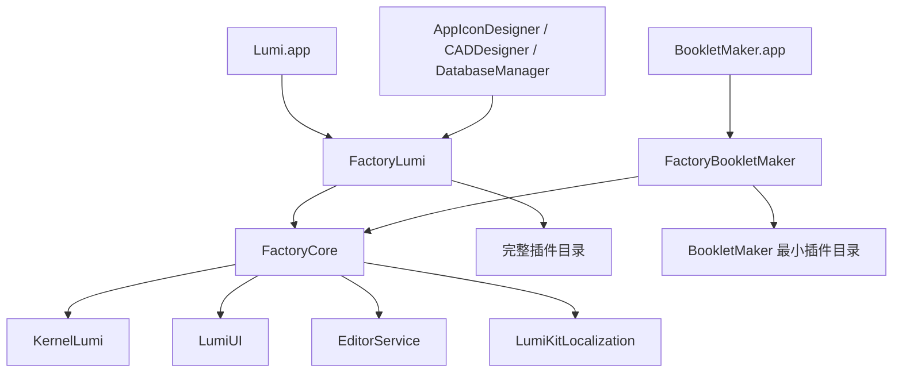

# Factory 体系重构设计

日期：2026-08-11

## 背景

当前所有 macOS 宿主 Target 都依赖 `Packages/LumiFactory`。`LumiFactory` 的 `Package.swift` 在编译期依赖完整插件集合，`PluginService.plugins` 又直接构造所有具体插件。虽然 BookletMaker 通过 `pluginAllowlist` 在运行时只注册少量插件，但编译器仍必须解析、编译和链接完整依赖图，导致 MLX、数据库、全部 LLM Provider 等与 BookletMaker 无关的代码和资源进入构建过程。

本次重构的目标是把“运行时插件筛选”改成“编译期依赖隔离”，建立三个独立 Swift Package：

- `FactoryCore`：不依赖任何具体插件的宿主引擎。
- `FactoryLumi`：完整 Lumi 插件组合。
- `FactoryBookletMaker`：BookletMaker 最小插件组合。

## 目标与非目标

### 目标

1. BookletMaker 的 SwiftPM 依赖图不再包含完整 Lumi 插件集合。
2. Lumi 主应用保持现有插件顺序、启用策略和追加渠道插件的能力。
3. 窗口、布局、设置、命令、应用代理和内核生命周期只维护一份实现。
4. 插件集合由宿主 Factory 在编译期确定，而不是由 Core 在运行时按 ID 过滤。
5. Xcode 中每个应用 Target 明确链接对应的 Factory product。
6. 建立依赖边界测试，防止后续把大型插件重新引入 BookletMaker。

### 非目标

- 本次不重写插件协议或插件生命周期。
- 本次不拆分 `KernelLumi`、`LumiUI`、`EditorService`。
- 本次不为 AppIconDesigner、CADDesigner、DatabaseManager 各建专属 Factory Package。
- 本次不承诺一个固定的最终 MB 数；体积验收以相同架构、相同压缩口径的前后对比为准。

## 高层架构



依赖必须保持单向：

```text
应用 Target -> 宿主 Factory -> FactoryCore -> Kernel/UI 基础包
                              -> 该宿主的具体插件包
```

`FactoryCore` 不得导入 `FactoryLumi`、`FactoryBookletMaker` 或任何 `*Plugin` 模块。`FactoryBookletMaker` 不得依赖 `FactoryLumi`。

## Package 设计

### FactoryCore

路径：`Packages/FactoryCore`

直接依赖仅限公共宿主实现实际使用的基础包：

- `KernelLumi`
- `LumiUI`
- `LumiKitLocalization`
- `KitSuperLog`
- `EditorService`

原 `LumiFactory` 中除 `Services/PluginService.swift` 外的窗口、视图、Bootstrap、资源和生命周期实现迁移到这里。核心入口改名为 `FactoryCore`。

配置对象改为显式接收最终插件数组：

```swift
public struct FactoryConfiguration: @unchecked Sendable {
    public let plugins: [any LumiPlugin]
    public let enabledPluginIDs: Set<String>
    public let initialContainerID: String?
    public let showsStatusBar: Bool
    public let showsActivityBar: Bool
}
```

`FactoryCore.createKernel` 直接初始化 `configuration.plugins`。Core 不再知道“内置插件”“白名单”或“额外插件”的概念，也不负责根据 ID 寻找具体插件。

保留以下公共能力，但把内部对 `LumiFactory.mainKernel` 的引用统一替换为 `FactoryCore.mainKernel`：

- `createKernel` / `createMainKernel`
- `destroyKernel` / `destroyAllKernels`
- `makeMainWindow`
- `makeSettingsWindow`
- `makeCommands`
- `MacAgent`
- `OpenProjectHandler`
- `AppBootstrap`

### FactoryLumi

路径：`Packages/FactoryLumi`

该 Package 依赖 `FactoryCore` 和当前 `LumiFactory/Package.swift` 中的完整具体插件集合。原 `PluginService` 迁移并改名为 `LumiPluginCatalog`，保持插件构造顺序不变。

门面 API：

```swift
@MainActor
public enum FactoryLumi {
    public static func configuration(
        additionalPlugins: [any LumiPlugin] = []
    ) -> FactoryConfiguration

    public static func makeMainWindow(
        additionalPlugins: [any LumiPlugin] = []
    ) -> some View

    public static func makeSettingsWindow() -> some View
    public static func makeCommands() -> some Commands
}
```

`additionalPlugins` 继续支持 Lumi 直营版本显式注入 `AppUpdatePlugin` 和 `ProjectRAGPlugin`。这两个插件仍由 `LumiApp` 直接构造，避免 FactoryLumi 强制所有分发渠道链接它们。

AppIconDesigner、CADDesigner、DatabaseManager 在本次迁移中暂时使用 FactoryLumi 提供的按 ID 选取配置，以保持既有运行时行为。它们仍不会获得体积收益；未来如需优化，应各自建立编译期插件组合，而不是重新把白名单放入 FactoryCore。

### FactoryBookletMaker

路径：`Packages/FactoryBookletMaker`

该 Package 只能依赖 `FactoryCore` 和 BookletMaker 实际需要的具体插件。初始目录以当前白名单为基线：

1. `StoragePlugin`
2. `ProjectsPlugin`
3. `WorkspacePlugin`
4. `CommandPlugin`
5. `MessageSenderPlugin`
6. `LLMProviderManagerPlugin`
7. `AgentTurnRunnerPlugin`
8. `EditorKernelPlugin`
9. `EditorProviderPlugin`
10. `ToolManagerPlugin`
11. `SettingsPlugin`
12. `LogoPlugin`
13. `ThemeManagerPlugin`
14. `ThemeLumiPlugin`
15. `MessageRendererPlugin`
16. `BookletMakerPlugin`

实现前必须运行一次插件依赖校验；如果上述插件的生命周期声明了必要依赖，应显式加入目录和 Package manifest，不能从 FactoryLumi 间接获得。

门面直接生成固定配置，不提供任意白名单 API：

```swift
@MainActor
public enum FactoryBookletMaker {
    public static var configuration: FactoryConfiguration { get }
    public static func makeMainWindow() -> some View
    public static func makeSettingsWindow() -> some View
    public static func makeCommands() -> some Commands
}
```

## 应用迁移

### LumiApp

- `import LumiFactory` 改为 `import FactoryCore` 和 `import FactoryLumi`。
- 保留 `AppUpdatePlugin()`、`ProjectRAGPlugin()` 的显式注入。
- 主窗口由 `FactoryLumi.makeMainWindow(additionalPlugins:)` 创建。
- 设置和命令由 FactoryLumi 门面创建。

### BookletMakerApp

- `import LumiFactory` 改为 `import FactoryCore` 和 `import FactoryBookletMaker`。
- 删除应用内的 `pluginAllowlist`。
- 使用 `FactoryBookletMaker.makeMainWindow()`。
- 继续从 FactoryCore 使用 `MacAgent`、`OpenProjectHandler` 和稳定的设置窗口 ID。

### 其他独立应用

本次先迁移到 FactoryLumi 的兼容筛选入口，保持现有功能。该兼容入口必须标注为过渡 API，且不能被 BookletMaker 使用。

## ADR-001：使用三个独立 Package

### 状态

已决定。

### 决策

采用三个独立 Swift Package，而不是一个 Package 中的三个 Target/Product。

### 理由

- Package manifest 是最清晰的编译依赖边界。
- 可以单独执行 `swift package describe` 和依赖图检查。
- BookletMaker 不会因同 Package 内新增 Target 依赖而悄悄扩大体积。

### 代价

- Xcode 本地 Package 引用增加。
- 公共 API 迁移需要同时修改多个 App Target。
- Package.resolved 和构建缓存会重新生成。

## ADR-002：Core 接收具体插件实例

### 状态

已决定。

### 决策

`FactoryConfiguration` 接收最终 `[any LumiPlugin]`，不在 Core 内维护注册表或按 ID 动态解析插件。

### 理由

- 插件类型引用停留在宿主 Factory，编译器才能裁掉其他插件依赖。
- 数据流简单，没有隐藏的全局注册或反射。
- 测试可直接断言最终插件 ID 和顺序。

### 代价

- 两个宿主 Factory 都需要维护自己的插件目录。
- 共享插件顺序调整可能要改两个目录，但这是明确依赖的合理成本。

## ADR-003：不保留 LumiFactory 兼容 Package

### 状态

已决定。

### 决策

迁移完成后删除 `Packages/LumiFactory` 和 `LumiFactory` product，不建立转发兼容层。

### 理由

兼容层很容易继续携带完整依赖，或者让新代码误用旧入口。一次性完成仓库内调用点迁移更安全。

### 代价

这是破坏性模块改名；所有调用点必须在同一变更中迁移。

## 错误处理与不变量

- FactoryCore 在初始化前校验插件 ID 唯一；重复 ID 应抛出明确错误。
- `enabledPluginIDs` 必须是 `plugins.map(\.id)` 的子集，否则抛出配置错误。
- `initialContainerID` 继续在内核启动后校验。
- 插件启动失败沿用现有错误展示路径，不吞掉错误。
- `mainKernel` 仍只由 MainActor 管理，避免并发访问变化。
- 两个宿主 Factory 不能各自保存内核副本，所有窗口共享 FactoryCore 的单一内核注册表。

## 测试与验收

### 单元测试

- FactoryCore：重复插件 ID、未知 enabled ID、内核注册与销毁。
- FactoryLumi：插件 ID 唯一、顺序快照、核心插件存在。
- FactoryBookletMaker：插件集合精确等于批准列表，ID 唯一，必要插件存在。

### 架构检查

- `rg` 确认仓库中不再出现 `import LumiFactory`。
- `swift package describe --package-path Packages/FactoryCore` 的依赖中不得出现任何具体插件包。
- `swift package describe --package-path Packages/FactoryBookletMaker` 不得出现 `LLMProviderMLXPlugin`、数据库插件、完整 LLM Provider 集合。

### 构建检查

- Debug 构建 Lumi 和 BookletMaker。
- Release archive 构建 Lumi 和 BookletMaker。
- BookletMaker 启动、打开项目、设置窗口、生成小册子流程冒烟测试。
- Lumi 启动、设置、插件管理、AppUpdate、ProjectRAG 冒烟测试。

### 体积检查

使用相同 Xcode、Release 配置、架构和压缩方式比较重构前后：

1. 记录 `.app` 解压体积。
2. 记录 `Contents/MacOS/BookletMaker` 大小。
3. 记录 `Contents/Resources` 大小和最大资源文件。
4. 生成相同格式的单架构 DMG 并比较压缩体积。
5. 上传后在 App Store Connect 的 Build Metadata 中比较同一 Mac variant 的 download/install size。

## 风险与缓解

- **遗漏隐式插件依赖**：先用现有白名单启动测试，再根据内核依赖校验显式补齐。
- **静态全局内核状态串扰测试**：每个测试结束调用 `FactoryCore.destroyAllKernels()`。
- **其他独立 App 行为变化**：本次保留 FactoryLumi 的过渡筛选入口，并分别构建。
- **资源遗漏**：迁移 FactoryCore 的 `Localizable.xcstrings` 后执行 UI 冒烟测试。
- **体积仍偏大**：通过 Link Map、`du` 和 `size -m` 找出 FactoryBookletMaker 的剩余主要贡献者，再决定是否进一步拆分基础服务。

