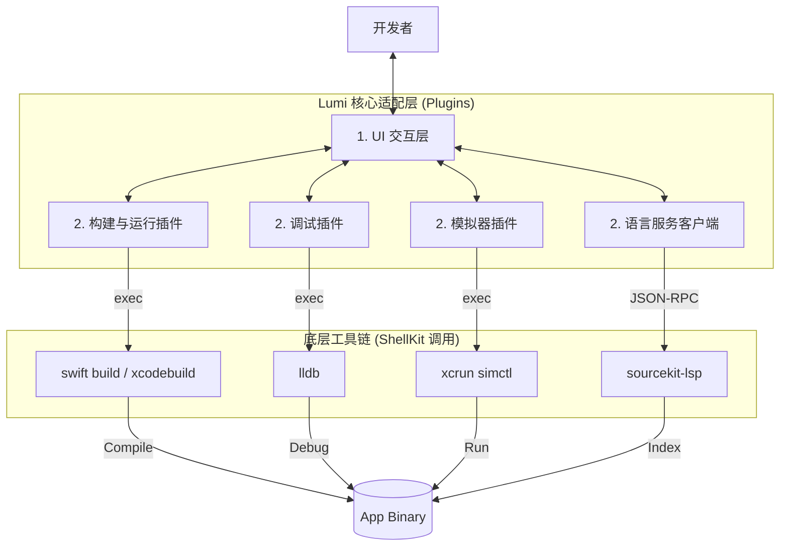

# Lumi 独立 Swift/macOS 开发环境方案 (Lumi-as-an-IDE)

## 1. 愿景 (Vision)

**目标：** 将 Lumi 从“代码编辑器”升级为**独立的 Swift/macOS 开发 IDE**。
让开发者可以在 Lumi 中完成 Swift 项目的**写代码、构建、运行、调试、依赖管理**全流程，无需打开 Xcode。

**核心价值：**
*   **性能**：摆脱 Xcode 沉重的 UI 包袱，实现秒级启动。
*   **专注**：在单一窗口内完成所有开发工作流（代码 + 终端 + 预览 + 调试）。
*   **可定制**：基于 Lumi 的插件架构，打造个性化的 Swift 开发体验。

---

## 2. 核心架构设计 (Architecture)

Lumi 将作为 **Xcode CLI 工具链** 的“指挥官”，通过调用底层工具实现 IDE 功能。

### 2.1 架构分层图



---

## 3. 关键功能模块实现方案

### 3.1 模块一：构建系统 (Build System)

**原理**：通过 `ShellKit` 调用 `swift build` 或 `xcodebuild`，拦截标准输出。

*   **实现步骤**：
    1.  **命令执行**：
        ```bash
        xcrun swift build --package-path /path/to/project 2>&1
        ```
    2.  **流式输出解析 (Streaming Parser)**：
        *   实时捕获 stdout/stderr。
        *   **关键任务**：解析错误日志，提取**文件名、行号、错误类型**。
        *   *正则示例*：`/path/to/File.swift:(\d+):\d+: error: (.+)`
    3.  **问题面板集成**：
        *   将解析出的错误映射为 Lumi 的 `Diagnostic` 对象。
        *   显示在“问题 (Problems)"面板，点击可跳转至对应代码行。

*   **Lumi 依赖**：`ShellKit` (执行), `TerminalCoreKit` (终端模拟), `EditorKernel` (跳转)。

### 3.2 模块二：代码智能 (Code Intelligence - LSP)

**原理**：集成 **SourceKit-LSP** (Apple 官方开源语言服务器)。

*   **实现步骤**：
    1.  **后台进程**：Lumi 启动时，后台运行 `sourcekit-lsp`。
    2.  **协议通信**：使用 **LSP (Language Server Protocol)** 协议（基于 JSON-RPC）与编辑器交互。
    3.  **功能支持**：
        *   **自动补全**：Completion Item。
        *   **跳转定义**：Go to Definition (`textDocument/definition`)。
        *   **符号高亮**：Document Symbols。
        *   **重命名**：Rename (`textDocument/rename`)。
    4.  **索引缓存**：利用 SourceKit 的本地缓存（IndexStore）加速大型项目。

*   **Lumi 依赖**：`EditorKernel` (LSP Client), `LumiCoreKit` (配置管理)。

### 3.3 模块三：模拟器控制 (Simulator Integration)

**原理**：调用 `xcrun simctl` 管理模拟器生命周期。

*   **实现步骤**：
    1.  **设备列表**：`simctl list devices` 获取可用模拟器列表。
    2.  **启动/安装/运行**：
        ```bash
        xcrun simctl boot <device_id>
        xcrun simctl install <device_id> <path_to_app.app>
        xcrun simctl launch <device_id> <bundle_id>
        ```
    3.  **内嵌预览 (可选高阶功能)**：
        *   通过 `simctl io booted screenshot` 获取实时画面（类似 VNC/屏幕共享），嵌入 Lumi 侧边栏。
        *   或者在 macOS 上，直接将 App 运行在宿主环境（`open ./build/debug/LumiApp`），这是最快的方式。

### 3.4 模块四：调试器 (Debugger)

**原理**：封装 **LLDB**。这是最难的部分，建议分阶段实现。

*   **Phase 1 (基础调试)**：
    *   使用 `lldb` 的命令行模式，通过 Pipe 重定向输入输出。
    *   Lumi UI 发送指令（如 `breakpoint set -f File.swift -l 10`）。
    *   解析 `lldb` 输出显示变量值。
*   **Phase 2 (结构化调试)**：
    *   使用 `lldb --json` (如果可用) 或 **DAP (Debug Adapter Protocol)**。
    *   实现结构化数据交互，支持：断点列表、调用栈 (Call Stack)、局部变量 (Variables)、单步执行 (Step Over/Into)。

---

## 4. 开发者工作流设计 (Workflow)

在 Lumi 中开发 Swift App 的典型流程：

1.  **打开项目**：
    *   拖拽包含 `Package.swift` 的文件夹到 Lumi。
    *   Lumi 自动检测到 SPM 项目，启动 `SourceKit-LSP` 索引代码。
2.  **编辑代码**：
    *   享受自动补全、错误红波浪线提示（来自 LSP）。
    *   使用 Cmd+Click 跳转到定义。
3.  **构建与运行 (Cmd+R)**：
    *   Lumi 底部弹出“构建面板”。
    *   实时显示编译进度和日志。
    *   编译成功后，自动调用 `open ./build/debug/App.app` (macOS) 或启动模拟器。
4.  **处理报错**：
    *   如果编译失败，错误列表出现在“问题面板”。
    *   点击错误，光标直接飞到报错行。
5.  **调试 (Cmd+Shift+D)**：
    *   点击行号左侧设置断点。
    *   以 Debug 模式运行。
    *   命中断点时，Lumi 暂停并在 UI 上显示变量值。

---

## 5. 实施路线图 (Roadmap)

### Phase 1: MVP (最小可行性产品)
*   [ ] **SPM 支持**：识别 `Package.swift`，提供项目树。
*   [ ] **SourceKit-LSP 集成**：实现代码补全、跳转、语法高亮。
*   [ ] **构建命令**：调用 `swift build`，实现带错误跳转的日志面板。
*   [ ] **直接运行**：macOS App 编译后直接 `open` 启动。

### Phase 2: 调试增强
*   [ ] **LLDB 封装**：实现基础断点控制 (Break/Continue/Step)。
*   [ ] **变量查看**：在侧边栏显示当前栈帧的局部变量。
*   [ ] **模拟器控制**：通过 `simctl` 启动 iOS 模拟器运行 App。

### Phase 3: 深度 IDE 体验
*   [ ] **SwiftUI Previews**：尝试通过命令行渲染 SwiftUI 预览 (较难，可参考 XcodeGen/Tuist 实现)。
*   [ ] **重构工具**：集成 SourceKit 的 Refactoring 接口。
*   [ ] **CI/CD 集成**：支持在 Lumi 内直接运行 `swift test` 并查看测试报告。

---

## 6. 技术风险与对策 (Risks & Mitigation)

| 风险点 | 影响 | 对策 |
| :--- | :--- | :--- |
| **LLDB 交互不稳定** | 调试器崩溃或无法断点 | 初期依赖 `lldb` 命令行，稳定后考虑引入开源 DAP Server 中间件。 |
| **SourceKit 索引慢** | 打开大项目时卡顿 | 允许后台索引，优先显示已打开文件；复用 IndexStore。 |
| **签名问题** | iOS 真机无法运行 | 初期仅支持 macOS 本地调试（无需签名），iOS 依赖模拟器或开发者证书配置工具。 |
| **SwiftUI Preview** | 难以复现 Xcode 的画布 | 使用 `swift build` 生成 dylib 并在 Lumi 中加载渲染（类似 CodeEdit 的做法）。 |

---

## 7. 结论

Lumi 完全有能力通过**调用 Shell 工具链**的方式，替代 Xcode 完成 **80% 的 Swift/macOS 开发工作**。

这不需要重写编译器，只需要**编写优秀的适配层和 UI 交互**。这将是 Lumi 区别于 VS Code 和 Xcode 的独特卖点——**一个更轻量、更现代化的 Swift 原生 IDE**。
