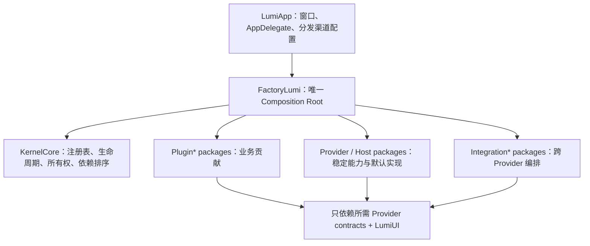

# Lumi 新架构零差异迁移总计划

> 日期：2026-08-16  
> 状态：实施蓝图，不代表当前已完成  
> 旧版基线：`LumiApp` + `FactoryLumi` + `FactoryCore` + `KernelLumi` + `Plugins/*`  
> 新版目标：`LumiMinimalApp`（最终接管 `LumiApp` 身份）+ `FactoryLumi` + `KernelCore` + `Provider*` + `Plugin*`

## 1. 终极目标

这次升级不是“功能大致相同”，而是以用户无感为标准替换应用内部架构：

- 原有用户直接安装新版，不需要手动迁移、重新登录、重新配置或重新选择项目。
- 所有插件、菜单、快捷键、窗口、设置、对话、消息、项目、编辑器、工具调用和系统集成功能保持一致。
- 相同状态下，新旧版的窗口结构、尺寸、间距、颜色、字体、图标、动画、焦点、滚动和原生交互保持一致。
- 原有数据目录、数据库、UserDefaults、Keychain、Security Scoped Bookmark、插件启用状态和布局状态全部兼容。
- 性能、资源占用、可访问性和稳定性不得低于旧版。
- 最终只保留一套生产入口；旧内核与兼容适配器在完成切换和回滚观察期后删除。

“已经创建新版包”不等于“迁移完成”。只有通过本文定义的功能、数据、界面、交互、性能五类验收，插件才可标记为完成。

## 2. 当前基线

### 2.1 规模差距

- `Plugins` 下现有 173 个旧版插件包，包含正式目录、宿主附加插件、可选实现和实验性实现。
- `FactoryLumi` 的生产目录装配了其中大多数插件，`LumiApp` 另行注入 `AppUpdatePlugin` 和 `ProjectRAGPlugin`。
- `FactoryLumi` 当前默认装配 14 个新版插件：
  - `PluginSettingGeneral`
  - `PluginDevice`
  - `PluginAppIconDesigner`
  - `PluginAppStorePromoDesigner`
  - `PluginLogoCoffic`
  - `PluginToolbarSettings`
  - `PluginThemePack`
  - `PluginVideoConverter`
  - `PluginWhiteNoise`
  - `PluginChatPanel`
  - `PluginMessageList`
  - `PluginConversationInput`
  - `PluginConversationList`
  - `PluginConversationNew`
- 上述 14 个包目前均按“部分迁移，待完整对照”管理，不能直接认定为完成。

### 2.2 新内核已有能力

当前已经存在以下独立能力包：

- 宿主 UI：`ProviderRootView`、`ProviderToolbar`、`ProviderActivityBar`、`ProviderRailView`、`ProviderContentView`、`ProviderChatSection`、`ProviderSettingView`。
- 数据与基础设施：`ProviderStorage`、`ProviderTheme`、`ProviderNetwork`、`ProviderProject`、`ProviderConversation`、`ProviderMessage`。
- Agent 基础：`ProviderLLM`、`ProviderAgentLoop`、`ProviderMessageSender`、`ProviderToolManager`。
- 其它贡献：`ProviderDocsView`、`ProviderMenuBar`、`ProviderLogo`、`ProviderToast`、`ProviderWebServer`。
- `ProviderRuntime` 中已有 AgentTurn、ConversationInput、MessageStreaming、MessageRendering、PromptSuggestion、Workspace、Onboarding、Command、IdleTime、LegacyData、PluginControl 等初始契约。

这些能力的存在只证明边界已经开始建立。当前仍有内存实现、空实现、简化视图和未接入真实运行链路，必须逐项与旧版实现对照。

### 2.3 关键架构差距

旧版 `LumiPlugin` 具有完整的异步生命周期、运行时启停、插件元数据、LLM/Agent/消息渲染、菜单、标题栏、Panel、Rail、StatusBar、ChatSection、设置、Overlay、Onboarding、Logo、WebRoute、外部文件打开、Turn Hook 和编辑器贡献能力。

新版 `SuperPlugin` 当前只有同步 `onBoot`、`onReady`、`onShutdown`、依赖和顺序。若直接逐个复制插件，会把旧版业务耦合重新塞入插件或 Factory，必须先补齐可组合的 Provider/Host 能力。

旧版主窗口还包含以下新版尚未完整等价的宿主行为：

- 标题工具栏、ActivityBar、可持久化 Rail、主 Panel、可持久化 ChatSection 分割布局。
- PanelHeader、PanelBottom、StatusBar、根 Overlay 和容器可见性规则。
- 动态插件启停后的贡献重建。
- macOS Commands、外部文件/目录打开、URL Scheme、菜单栏弹窗和多窗口路由。
- 启动 Loading、Onboarding、错误展示、窗口恢复和应用代理行为。

## 3. 不可妥协的验收标准

### 3.1 功能零差异

对每个旧版插件建立行为清单，覆盖：入口、命令、快捷键、设置、菜单栏、工具、Provider、文件打开、后台任务、通知、网络请求和插件间联动。新版必须逐项通过，不能以占位页或 no-op Provider 代替。

### 3.2 数据零损失

- 新版首次启动前后，旧数据原件不得被原地破坏。
- 迁移必须可重复执行、可中断恢复、可校验条数与关联关系。
- 对话、消息、附件、项目、布局、主题、插件状态、模型选择、API Key、工具记录和插件私有数据都要有迁移策略。
- 每个迁移写入版本标记、来源版本、完成时间和校验摘要；不得仅用一个布尔值代表全部数据成功。
- 失败时显示可操作错误，并保持旧版仍可启动。

### 3.3 UI 与交互零差异

同一数据 fixture、同一窗口尺寸、同一系统外观下进行对照：

- 截图像素差异：核心窗口区域自动比对，动态内容建立 mask；未经批准的结构差异为失败。
- Accessibility Tree：控件角色、标题、层级、顺序、enabled/focused/value 保持一致。
- 输入行为：键盘导航、IME、焦点、拖放、右键菜单、hover、popover、sheet、alert、滚动锚点和窗口 resize 一致。
- 主题：所有内置主题以及浅色/深色/系统模式逐一验收。
- 动画：触发条件、时长、曲线、Reduce Motion 行为一致。

### 3.4 性能不回退

以旧版同一构建配置为基线，至少监控：

- 冷启动、恢复窗口、首屏可交互时间。
- 首次打开大对话、流式输出、长列表滚动、Markdown 渲染。
- 打开大型项目、文件树加载、编辑器输入延迟和 LSP 首响应。
- 常驻内存、峰值内存、CPU、磁盘写入、网络并发和后台唤醒。

任何核心路径回退超过 10% 都要有明确批准；滚动掉帧、输入阻塞和主线程 I/O 视为阻断问题。

### 3.5 构建与发布一致

- Debug/Release 均能构建，最终集成以完整 `xcodebuild` 的 `BUILD SUCCEEDED` 为准。
- 保持生产 Bundle ID、Display Name、URL Scheme、文档类型、Entitlements、App Group、Keychain service、Sparkle 配置和签名能力。
- 新版必须接管旧版 `Lumi` 产品身份，不能以 `com.coffic.lumiminimal` 作为正式升级包发布。

## 4. 最终架构



### 4.1 依赖规则

1. `KernelCore` 只管理 Provider 和插件生命周期，不依赖业务领域、具体插件、SwiftData 模型或具体 UI。
2. 每个业务能力使用独立 `ProviderX` 包；协议、Sendable DTO、错误类型和默认实现可以分 Target，避免消费者被迫链接重实现。
3. 跨两个以上 Provider 的编排放进 `IntegrationX`，由 `FactoryLumi` 组装，不能让 Provider 互相形成依赖环。
4. 新插件包统一以 `Plugin` 开头；稳定插件 ID 尽量保持旧值，避免状态、存储和自动化失效。
5. 插件不能直接依赖 `FactoryLumi`，也不能直接解析其它具体插件类型。
6. 高频状态由消费视图窄播观察，禁止通过 Kernel 全局 `objectWillChange` 广播 token、光标、滚动等事件。
7. UI 统一复用 `LumiUI`；为了像素一致允许先复用旧版纯 View/Model，但不得把 `KernelLumi` 依赖带进新版。

### 4.2 KernelCore 必须补齐的通用能力

- 异步 `boot/ready/shutdown`，支持取消、超时、原子回滚和结构化启动错误。
- 运行时 `enable/disable/reload`，依赖检查和被依赖插件保护。
- 插件 metadata：名称、描述、分类、成熟度、启用策略、版本和权限声明。
- 插件贡献所有权：每一项贡献记录 owner plugin ID，卸载时自动撤销。
- 贡献事务：同一插件的 Provider、UI、工具、命令、路由可原子替换。
- 插件状态持久化与 schema/version，支持旧插件 ID 别名。
- 启动诊断：阶段、耗时、失败原因、缺失依赖和降级状态可查询。
- typed event/command bridge；保留旧 Notification raw value 的兼容层，迁移完成后再收敛。

不应把旧 `LumiPlugin` 的几十个方法原样复制到 `SuperPlugin`。各类贡献应由独立 Host 接收，例如 `WorkspaceContributionHosting`、`ChatContributionHosting`、`CommandContributionHosting`、`LLMRegistryProviding` 和 `EditorExtensionHosting`。

## 5. Provider 与 Host 完整蓝图

| 领域 | 当前新版基础 | 必须补齐的最终能力 |
|---|---|---|
| 插件管理 | KernelCore、PluginControl 骨架 | metadata、策略、启停、依赖、错误聚合、贡献重建、设置 UI |
| 存储 | ProviderStorage | 与旧版环境/版本目录完全一致、迁移事务、备份、配额、插件 ID 别名 |
| Workspace/Layout | Root/Activity/Rail/Content/Chat、Workspace 骨架 | ViewContainer、Panel/Header/Bottom、StatusBar、Overlay、分割尺寸、可见性和恢复 |
| 设置 | SettingView | tab、section、深链、搜索、插件详情、manual/about、旧 tab ID 兼容 |
| 命令 | Command 骨架 | macOS Commands、菜单 placement、快捷键冲突、上下文 enabled 状态 |
| 项目 | Project、Workspace 骨架 | 最近项目、bookmark、外部打开、当前文件、Git/worktree、项目切换事务 |
| 对话 | Conversation | SwiftData 持久化、分页、筛选、父子对话、标题、偏好继承、迁移 |
| 消息 | Message | SwiftData 持久化、附件、tool call/result、reasoning、usage、分页和编辑 |
| 输入 | ConversationInput 骨架 | AppKit 编辑器、IME、附件、队列、历史、focus/send/stop 通知兼容 |
| 发送 | MessageSender | 队列、重发、停止、并发保护、选择新对话、失败恢复、hooks |
| 流式 | MessageStreaming 骨架 | SSE 生命周期、增量合并、usage、reasoning、tool call、错误与取消 |
| Agent | AgentLoop、AgentTurn | 完整 loop、工具调度、ask_user 恢复、sub-agent、上下文压缩、记录 |
| LLM | 单一 DefaultLLM | Provider 注册表、选择、模型发现、Keychain、协议适配、fallback、能力协商 |
| 工具 | ToolManager | 工具注册、权限、执行上下文、进度、记录、取消、文件/图像结果 |
| 渲染 | MessageRendering 骨架 | renderer registry、Markdown、代码、图片、附件、工具卡片、错误卡片 |
| Editor | 尚无新版完整 Host | 按 `editor-kernel-plugin-rearchitecture-plan.md` 实现 Editor Host/Session/贡献包 |
| 网络 | ProviderNetwork | 旧请求语义、流式传输、代理、证书、交换记录、脱敏、取消 |
| Web | ProviderWebServer | 路由聚合、启停、冲突检测、loopback、安全和运行时重建 |
| 系统 UI | MenuBar、Logo、Toast、Onboarding | 多项排序、popover 生命周期、状态同步、Overlay、通知和可访问性 |
| 外部打开 | 尚缺 Host | 文件/目录/URL 分发、插件 claim 顺序、冷启动队列和窗口激活 |

## 6. 数据与身份兼容方案

### 6.1 正式切换前必须保持的身份

- 正式 Target 使用旧版生产 `PRODUCT_BUNDLE_IDENTIFIER`、应用名、版本体系和图标资源。
- 复制旧版 `Lumi-Info.plist` 的 URL Types、Document Types、UTType、更新配置和 Lumi 自定义键。
- 复制旧版 Entitlements 中 App Group、network client、screen capture 等能力。
- 主窗口和设置窗口 ID 保持 `lumi.main`、`lumi.settings`；默认尺寸保持 1100×760 和 780×600。
- `MacAgent`、`OpenProjectHandler` 和冷启动文件打开队列必须迁移，不允许仅靠 SwiftUI Scene 默认行为。

### 6.2 数据迁移原则

1. 先建立“旧位置只读快照 → 新位置临时库 → 校验 → 原子切换”的标准迁移器。
2. 如果新实现可以直接安全复用旧 schema 和路径，优先原位兼容，但仍先备份 SQLite、WAL 和 SHM。
3. 插件数据目录使用稳定的旧 plugin storage key；新版类名变化不应改变目录。
4. UserDefaults 和 Keychain 建立旧 key/service 到新 key/service 的映射，读取时迁移，写入后保留回滚期兼容。
5. Security Scoped Bookmark 必须验证 stale bookmark 刷新和权限恢复。
6. 附件、图片、临时文件和项目索引迁移后做存在性与哈希抽查。
7. 每种数据都准备空库、小库、大库、旧 schema、损坏库和中断恢复 fixture。

### 6.3 必须单独审计的数据域

- ConversationStore、MessageStore、AgentTurn 记录、ToolCall 记录、HTTPExchange 记录。
- Legacy v4→v5 标记与快照流程。
- ThemeManager、Workspace Layout、PluginManager 启用状态。
- 所有 LLM Provider API Key、endpoint、model 和高级参数。
- Projects、最近项目、文件 bookmarks、RAG/索引缓存。
- GoalTask、StoryWriter、MindMap、ActivityHeatmap 等插件私有数据库或 JSON。
- AppIconDesigner、PromoDesigner、ResumeDesigner、CADDesigner 等设计项目文件。

## 7. UI 完整对齐方法

### 7.1 先冻结旧版 Golden Master

在迁移更多 UI 前，创建固定数据集和截图脚本，至少覆盖：

- 首次启动、正常启动、启动错误、Onboarding。
- 无项目、有项目、多个最近项目、超长路径。
- 无对话、短对话、长对话、流式输出、工具调用、错误、图片和附件。
- 设置首页、每个设置 tab、插件详情和 LLM Provider 配置。
- 每个 ViewContainer、Rail tab、Panel bottom、popover、sheet 和右键菜单。
- 18 个主题、系统浅/深色、Reduce Motion、不同窗口宽度。

每张基准图记录 macOS 版本、Scale、字体设置、窗口 frame、主题、语言和 fixture ID。

### 7.2 宿主 Shell 必须直接复刻

新版 Root Host 需要对照旧 `AppLayoutView` 重建，而不是继续扩展简化的 `VStack + HStack`：

- `AppTitleToolbar` 和顶部 divider。
- ActivityBar 48pt 体系、滚动、设置齿轮、错误入口、隐藏规则。
- Rail 原生 `HSplitView`、180/240/400 宽度约束、每容器宽度持久化。
- Panel 的 Header/Content/Bottom。
- ChatSection 原生分割、窄/宽布局宽度持久化和显示规则。
- StatusBar、根 Overlay、Toast、窗口主题桥和 safe-area 行为。

当前 Explorer/Project 占位标签只能用于开发期，正式验收前必须由真实插件贡献替换。

### 7.3 UI 验收工具链

- Snapshot tests：固定 frame、locale、color scheme、dynamic data。
- Accessibility tree snapshots：防止看起来相似但键盘和 VoiceOver 行为变化。
- UI event replay：点击、快捷键、拖动 divider、拖放文件、IME、滚动、关闭/重开窗口。
- 图片差异报告：输出差异比例、bounding boxes 和人工批准记录。
- Instruments signpost：启动、选择对话、首 token、消息完成、打开项目、打开文件。

## 8. 实施阶段与依赖顺序

### Phase 0：建立迁移台账和 Golden Master

任务：

1. 为 173 个旧插件生成机器可读 ledger，字段见第 10 节。
2. 从 `LumiPluginCatalog`、App 注入点和 Xcode Target 提取“生产启用/宿主附加/禁用实验”三种状态。
3. 记录每个插件的旧 ID、order、policy、category、stage、依赖、Provider、贡献面、存储和权限。
4. 建立旧版完整行为录屏、截图、AX tree 和性能基线。
5. 给当前 14 个新版插件做反向差距审计，删除“包存在即完成”的误判。

退出条件：任一旧版入口都能在 ledger 中找到 owner、迁移目标、测试和状态；没有“未知插件”。

### Phase 1：补齐 KernelCore 生命周期和贡献基础设施

任务：

1. 把生命周期升级为 async，定义 cancellation、timeout、rollback。
2. 实现 metadata、policy、runtime enable/disable、持久化和依赖诊断。
3. 建立通用 `ContributionToken/ContributionTransaction`，所有 Host 支持按插件撤回。
4. 建立 typed event bridge 和旧 Notification 兼容映射。
5. 建立插件启动/Ready/Shutdown/Enable/Disable 契约测试。
6. 增加依赖边界 CI：KernelCore 不得导入领域 Provider 或插件。

退出条件：可用测试插件证明失败启动无残留、运行时启停无悬挂任务、所有贡献可完整撤回并重建。

### Phase 2：复刻生产宿主 Shell

任务：

1. 新建完整 Workspace/Layout Host，覆盖旧版全部布局贡献面。
2. 迁移 WindowMain、MacAgent、OpenProjectHandler、AppCommands、Loading/Error/Settings window。
3. 接通窗口恢复、外部文件/目录/URL、菜单栏和多窗口共享 Kernel。
4. 复刻 ActivityBar、Rail、Panel、ChatSection、StatusBar、Overlay 的尺寸和原生 divider。
5. 保持所有旧通知名、window ID 和 command shortcut。

退出条件：只使用假内容插件时，主窗口和设置窗口 Shell 已通过像素、AX、键盘和 resize 基线。

### Phase 3：完成持久化与零损升级通道

任务：

1. 让 Storage、LegacyData、Conversation、Message、Workspace、Theme、PluginControl 使用生产持久化实现。
2. 建立迁移 orchestrator、备份、校验、进度、失败恢复和诊断导出。
3. 恢复旧 Bundle/Keychain/App Group 身份，在隔离 fixture 环境验证原地升级。
4. 为所有已知私有存储插件建立迁移 adapter；未迁移插件不得进入正式目录。

退出条件：多版本真实 fixture 升级后，数据计数、ID、关联、附件、偏好和密钥读取一致；重复启动不重复迁移。

### Phase 4：打通完整聊天与 Agent 主链

按依赖顺序迁移：

1. ConversationManager、MessageManager、MessageStreaming、MessageRenderer。
2. ConversationList/New/Title/Input/Attachment/Pending/Fork 及所有统计和偏好插件。
3. MessageSender、AgentTurnRunner、AgentRules、AskUser、ToolManager、StateMonitor、通知和临时存储。
4. ChatPanel、MessageList、ModelSelector、截图、文件附件和 prompt suggestions。
5. Sub-agent、Memory、GoalTask、Skill、ComputerUse 等复杂工具闭环。

退出条件：旧版所有聊天 fixture 可在新版加载；新建、发送、流式、工具、ask_user、停止、排队、重发、fork、附件和恢复均通过端到端测试。

### Phase 5：迁移 LLM Provider 生态

任务：

1. 先迁移 `LLMProviderManagerPlugin`，建立多 Provider 注册表、模型选择、能力协商、设置和 Keychain。
2. 抽取共享 OpenAI/Anthropic/Responses/SSE adapter，禁止 22 个插件复制网络解析逻辑。
3. 逐个迁移全部 Provider，使用旧请求/响应 fixture 和真实 opt-in smoke test。
4. 验证 text、vision、reasoning、tool call、usage、错误映射、取消、超时和自定义 endpoint。

退出条件：每个旧 Provider 都能读取旧配置，并在其支持能力矩阵内产生与旧版等价的请求和事件流。

### Phase 6：项目、工作区、编辑器和开发工具

任务：

1. 迁移 Projects、Workspace、文件树、ProjectFiles、Breadcrumb、Overview、IssueScanner、RAG。
2. 按现有编辑器重构蓝图完成 EditorHost、Editor Session 和贡献包。
3. 迁移 EditorPanel、Swift、Preview、Search、Problems、Outline、References、CallHierarchy、Symbols、StickySymbol、EditorChat。
4. 迁移 Git、Terminal、QuickFileSearch、GitHub 和所有 OpenIn 插件。
5. 验证大项目、Git worktree、外部打开、文件权限、编辑/保存/恢复和 LSP。

退出条件：项目和编辑器主流程行为一致，Project 不再与 Editor 双写当前文件状态，所有旧开发工具入口恢复。

### Phase 7：系统工具、生产力和设计插件

按垂直切片迁移，每个插件同时完成 Provider、业务、UI、存储、设置、菜单和测试：

1. 系统管理：Device、Disk、Hosts、Port、App、Registry、Display、Docker、Brew、Clipboard、Caffeinate、RClick。
2. 网络与自动化：Network、WebServer、WebFetch、WebSearch、Browser、Download、ComputerUse、Command。
3. 文件与内容：TextActions、DocxRead、ShowImage、OCR、ImageToPDF、Input。
4. 设计与创作：AppIcon、Promo、Resume、CAD、Prototype、MindMap、ScreenRecorder、StoryWriter、BookletMaker。
5. 媒体与其它：VideoConverter、WhiteNoise、Netto、QuickLauncher、ActivityHeatmap。

退出条件：第 10 节 ledger 中这些插件全部为 `verified`，无占位入口、无旧 Kernel 依赖。

### Phase 8：设置、主题、插件管理、分发与外围集成

任务：

1. 完整迁移 Settings、PluginManager、Onboarding、Logo、MenuBar、Toast、Debug/FileLog。
2. 验证 ThemeManager 和全部主题在所有宿主 surface 一致。
3. 迁移 AppUpdate、AppUpdateStatusBar、AppStoreConnect 及直营渠道注入策略。
4. 恢复 Finder/URL/document type、RAG 动态库、Sparkle 和代码签名流程。
5. 审计其他 App Target 对新版 Factory 的编译期依赖，不让完整 Lumi 插件回流到独立 App。

退出条件：Release 签名产物可执行全部更新、URL、文件打开、菜单栏和插件管理场景。

### Phase 9：双轨对照与正式切换

任务：

1. 建立可控的旧/新 Host 启动开关，仅用于内部测试，二者读取同一份只读 fixture。
2. 连续运行全量自动化：功能、snapshot、AX、数据迁移、性能、压力、离线、权限拒绝和崩溃恢复。
3. 完成至少一次真实用户数据副本升级演练和一次 Release 候选回滚演练。
4. 将新版 Target 接管 `Lumi` 名称、Bundle ID、Info、Entitlements 和分发配置。
5. 保留一个发布周期的只读备份与诊断能力；禁止两套实现对同一数据库双写。
6. 观察期通过后删除 `KernelLumi`、旧 `FactoryLumi/FactoryCore` UI 和旧插件包。

最终退出条件：第 9 节所有发布 Gate 通过，迁移台账 100% 关闭，旧版代码不存在生产引用。

## 9. 发布 Gate

| Gate | 必须满足 |
|---|---|
| G0 清单完整 | 旧目录、宿主附加、禁用实验插件全部有明确去向 |
| G1 架构 | KernelCore 边界扫描通过，无 Provider 环和具体插件反向依赖 |
| G2 生命周期 | 启停、失败回滚、贡献撤销和任务取消测试全部通过 |
| G3 数据 | 所有 fixture 迁移、校验、重复运行和回滚通过 |
| G4 功能 | 插件 ledger 的行为用例 100% 通过，无占位/no-op |
| G5 UI | 核心 surface snapshot/AX/event replay 通过，差异均有批准记录 |
| G6 性能 | 核心场景无未批准的 >10% 回退，无主线程 I/O/输入卡顿 |
| G7 构建 | 各包测试、Lumi Debug/Release、其它宿主构建和 `diff --check` 通过 |
| G8 发布 | Bundle/权限/签名/更新/URL/文档打开/冷启动验证通过 |
| G9 清理 | 生产二进制不再链接旧 Kernel 和旧插件实现，回滚资产已归档 |

任何 Gate 未通过，都不能用“后续再补”进入正式替换。

## 10. 插件迁移台账规范

建议新增 `docs/lumi-v2-plugin-migration-ledger.json` 作为机器可读事实源；本文只定义格式，Phase 0 实施时生成。

每个插件至少包含：

```json
{
  "legacyPackage": "ConversationInputPlugin",
  "legacyPluginID": "...",
  "legacyCatalogState": "production|hostInjected|disabled|experimental",
  "newPackage": "PluginConversationInput",
  "wave": "P4",
  "owners": [],
  "dependencies": [],
  "providersConsumed": [],
  "providersPublished": [],
  "contributions": [],
  "storage": [],
  "userDefaultsKeys": [],
  "keychainKeys": [],
  "permissions": [],
  "notifications": [],
  "commands": [],
  "testFixtures": [],
  "status": "inventory|contractBlocked|implementing|parityReview|verified|retired",
  "evidence": {
    "packageTests": null,
    "integrationBuild": null,
    "runtime": null,
    "uiDiff": null,
    "migration": null,
    "performance": null
  }
}
```

状态只能单向推进；`verified` 必须有全部证据，不能只填构建成功。

### 10.1 单插件 Definition of Done

- 新包名以 `Plugin` 开头，插件 ID/存储 key/命令 ID 兼容旧版。
- 不导入 `KernelLumi`、旧 Factory 或其它具体插件。
- 所需 Provider 契约已稳定，生命周期和依赖显式声明。
- 所有旧贡献面均已迁移，卸载后无残留视图、任务、监听器和 Provider。
- 旧数据和偏好可直接读取或已完成可回滚迁移。
- UI 使用相同组件、文案、本地化、图标、尺寸、快捷键和可访问性。
- 包测试、Factory 集成测试、完整 App 构建、真实运行、UI diff 和性能证据齐全。
- 旧插件只在新版 `verified` 后从生产目录移除。

## 11. 全量插件迁移矩阵（初始分组）

以下清单覆盖当前 `Plugins` 目录的 173 个插件包。分组表示首选迁移波次，不代表最终依赖；Phase 0 必须从源码和生产目录再次核准。

### 11.1 内核、宿主、设置和基础设施（P1–P3/P8）

`StoragePlugin`、`LegacyDataPlugin`、`WorkspacePlugin`、`ProjectsPlugin`、`CommandPlugin`、`PluginManagerPlugin`、`SettingsPlugin`、`LogoPlugin`、`LogoCofficPlugin`、`LogoSmartLightPlugin`、`ThemeManagerPlugin`、`ToastPlugin`、`MenuBarManagerPlugin`、`MenuBarHelperPlugin`、`NetworkManagerPlugin`、`WebServerPlugin`、`IdleTimePlugin`、`StateMonitorPlugin`、`DebugBadgePlugin`、`FileLogPlugin`、`OnboardingPlugin`。

主题包：`ThemeLumiPlugin`、`ThemeAuroraPlugin`、`ThemeAutumnPlugin`、`ThemeDraculaPlugin`、`ThemeGithubPlugin`、`ThemeMidnightPlugin`、`ThemeMountainPlugin`、`ThemeNebulaPlugin`、`ThemeOneDarkPlugin`、`ThemeOrchardPlugin`、`ThemeRiverPlugin`、`ThemeSkyPlugin`、`ThemeSpringPlugin`、`ThemeSummerPlugin`、`ThemeVoidPlugin`、`ThemeVscodePlugin`、`ThemeWinterPlugin`。

分发与宿主附加：`AppUpdatePlugin`、`AppUpdateStatusBarPlugin`、`AppStoreConnectPlugin`。

### 11.2 聊天、消息和 Agent（P4）

`ChatPanelPlugin`、`ChatScreenshotPlugin`、`ChatFileAttachmentPlugin`、`ConversationManagerPlugin`、`ConversationListPlugin`、`ConversationNewPlugin`、`ConversationTitlePlugin`、`ConversationInputPlugin`、`ConversationAttachmentPlugin`、`ConversationPendingMessagePlugin`、`ConversationForkPlugin`、`ConversationMessageCountPlugin`、`ConversationContextSizePlugin`、`ConversationAgentTurnCountPlugin`、`ConversationCacheHitRatePlugin`、`ConversationReasoningPlugin`、`ConversationVerbosityPlugin`、`ConversationSpeedPlugin`、`ConversationModePlugin`、`ConversationLanguagePlugin`、`MessageManagerPlugin`、`MessageSenderPlugin`、`MessageStreamingPlugin`、`MessageRendererPlugin`、`MessageListPlugin`、`MessageListAppKitPlugin`、`ModelSelectorPlugin`、`AgentTurnRunnerPlugin`、`AgentTurnNotificationPlugin`、`AgentRulesPlugin`、`AgentTempStoragePlugin`、`AskUserPlugin`、`SubAgentProviderPlugin`、`ToolManagerPlugin`、`MemoryPlugin`、`GoalTaskPlugin`、`SkillPlugin`、`InputPlugin`、`VerbosityPlugin`。

### 11.3 LLM Provider（P5）

`LLMProviderManagerPlugin`、`LLMProviderOpenCodePlugin`、`LLMProviderAiRouterPlugin`、`LLMProviderAliyunPlugin`、`LLMProviderAnthropicPlugin`、`LLMProviderCodexPlugin`、`LLMProviderDeepSeekPlugin`、`LLMProviderFeifeimiaoPlugin`、`LLMProviderFlyMuxPlugin`、`LLMProviderFreeModelPlugin`、`LLMProviderHappyCodePlugin`、`LLMProviderHyperAPIPlugin`、`LLMProviderKimiCodePlugin`、`LLMProviderLPgptPlugin`、`LLMProviderMLXPlugin`、`LLMProviderMegaLLMPlugin`、`LLMProviderMiniMaxPlugin`、`LLMProviderOpenAIPlugin`、`LLMProviderOpenRouterPlugin`、`LLMProviderStepFunPlugin`、`LLMProviderSublyxPlugin`、`LLMProviderXiaomiPlugin`、`LLMProviderXybbzPlugin`、`LLMProviderZhipuPlugin`。

### 11.4 项目、编辑器和开发工具（P6）

`ProjectFilesPlugin`、`ProjectFileTreePlugin`、`ProjectFileBreadcrumbPlugin`、`ProjectOverviewPlugin`、`ProjectIssueScannerPlugin`、`ProjectRAGPlugin`、`EditorHostPlugin`、`EditorKernelPlugin`、`EditorProviderPlugin`、`EditorPanelPlugin`、`EditorSwiftPlugin`、`EditorPreviewPlugin`、`EditorSearchPlugin`、`EditorProblemsPlugin`、`EditorOutlinePlugin`、`EditorReferencesPlugin`、`EditorCallHierarchyPlugin`、`EditorSymbolsPlugin`、`EditorStickySymbolBarPlugin`、`EditorChatPlugin`、`GitPlugin`、`GitHubPlugin`、`TerminalPlugin`、`QuickFileSearchPlugin`、`OpenInFinderPlugin`、`OpenInXcodePlugin`、`OpenInCursorPlugin`、`OpenInVSCodePlugin`、`OpenInAntigravityPlugin`、`OpenInGitHubDesktopPlugin`、`OpenInGitOKPlugin`、`OpenRemotePlugin`。

### 11.5 系统管理、网络和自动化工具（P7）

`DeviceInfoPlugin`、`DiskManagerPlugin`、`HostsManagerPlugin`、`PortManagerPlugin`、`AppManagerPlugin`、`RegistryManagerPlugin`、`DatabaseManagerPlugin`、`DisplayControlPlugin`、`DockerManagerPlugin`、`BrewManagerPlugin`、`ClipboardManagerPlugin`、`CaffeinatePlugin`、`RClickPlugin`、`DownloadPlugin`、`BrowserPlugin`、`ComputerUsePlugin`、`WebFetchPlugin`、`WebSearchPlugin`、`TextActionsPlugin`、`DocxReadPlugin`、`ShowImagePlugin`、`OcrPlugin`、`ActivityHeatmapPlugin`。

### 11.6 设计、内容和独立功能（P7）

`AppIconDesignerPlugin`、`AppStorePromoDesignerPlugin`、`ResumeDesignerPlugin`、`CADDesignerPlugin`、`PrototypeDesignerPlugin`、`MindMapPlugin`、`ScreenRecorderPlugin`、`StoryWriterPlugin`、`BookletMakerPlugin`、`ImageToPDFPlugin`、`VideoConverterPlugin`、`WhiteNoisePlugin`、`NettoPlugin`、`QuickLauncherPlugin`。

## 12. 当前新版包的专项回查

在继续迁移新插件前，先对现有 14 个包做以下回查：

| 新版包 | 旧版参考 | 当前必须重点核对 |
|---|---|---|
| PluginSettingGeneral / PluginToolbarSettings | SettingsPlugin、旧宿主设置与标题栏 | 设置结构、窗口尺寸、深链、快捷键、插件 sections |
| PluginDevice | DeviceInfoPlugin | Activity/MenuBar/Settings/Docs、刷新、系统数据和样式 |
| PluginAppIconDesigner | AppIconDesignerPlugin | Rail、编辑状态、导入导出、存储、所有工具与像素级 UI |
| PluginAppStorePromoDesigner | AppStorePromoDesignerPlugin | 运行时桥、模板、导出、存储、Rail 与主内容 |
| PluginLogoCoffic | LogoCofficPlugin/LogoPlugin | 所有 LogoScene、优先级、状态栏外观和动态状态 |
| PluginThemePack | ThemeManager + 17 个主题包 | theme ID、palette、选中持久化、系统外观和全部 surface |
| PluginVideoConverter | VideoConverterPlugin | 转码参数、进度、取消、文件输出、错误和设置 |
| PluginWhiteNoise | WhiteNoisePlugin | 音源、播放状态、菜单栏、后台行为和偏好 |
| PluginChatPanel | ChatPanelPlugin | 旧 Workspace 容器模型、Rail/Panel/Chat 可见性和宽度 |
| PluginMessageList | MessageListPlugin | 全 renderer、分页、流式、滚动锚点、live resize、性能 |
| PluginConversationInput | ConversationInputPlugin | AppKit 编辑器、IME、附件、队列、send/stop、快捷键 |
| PluginConversationList | ConversationListPlugin | 分页、项目筛选、子对话、上下文菜单、重命名删除和样式 |
| PluginConversationNew | ConversationNewPlugin | 新建参数、项目/Provider/Model 继承、选择与 focus |

上述任何包若只是展示简化内容，应继续作为迁移中的同一插件完善，不再创建第二个平行实现。

## 13. 测试分层与持续集成

### 13.1 每次提交

- 受影响 Package 的 `swift test`。
- Provider contract tests、插件生命周期/撤销测试。
- `git diff --check` 和依赖方向扫描。
- 对应 snapshot/AX fixture。

### 13.2 每个迁移波次

- `FactoryLumi` 全量测试。
- `LumiMinimal` Debug 完整 Xcode build。
- 旧数据 fixture 升级测试。
- 相关真实 UI event replay 和性能场景。

### 13.3 Release Candidate

- Lumi Debug + Release、其它 App Target、Finder Extension 和分发依赖构建。
- 签名、notarization、Sparkle、App Group、Keychain、URL Scheme 和 document open。
- 旧版→新版→回滚演练。
- 长时间 Agent、长对话、大项目、离线、权限拒绝、网络错误和强制退出恢复。

## 14. 实施纪律

1. 一次迁移一个可垂直验收的能力簇，不做“先复制全部代码再统一修”。
2. 每开始一个插件，先填写 ledger 和旧行为测试；再补 Provider；最后迁移实现。
3. 不允许为了编译通过加入空 Provider、假数据或永久 placeholder。
4. 不允许旧/新实现同时对同一数据库双写。
5. 不允许在 Factory 中实现业务逻辑；Factory 只负责构造和连接。
6. 不允许以 Package build 代替完整 App build，也不以编译成功代替运行时/UI 证据。
7. 保留无关 worktree 修改；每个波次提交只包含明确范围。
8. 旧插件只有在新版通过 Gate 后才从生产目录移除；删除旧架构是最后一步，不是迁移手段。

## 15. 建议的第一批实施任务

计划确认后，按以下顺序开始：

1. 生成 `lumi-v2-plugin-migration-ledger.json`，从源码自动提取 173 个插件的基础元数据和 Factory 状态。
2. 为旧版建立主窗口、设置、聊天、项目和插件管理 Golden Master fixtures。
3. 设计并实现 async plugin lifecycle、metadata 和 ContributionTransaction。
4. 新建完整 Workspace/Layout Host，直接复刻旧 `AppLayoutView` 的结构和状态模型。
5. 将 Conversation/Message 从内存实现切换为旧版生产持久化实现，并完成数据迁移测试。
6. 再继续 MessageStreaming → Renderer → Sender → AgentTurn → LLM Registry 的聊天主链。

这六项完成后，后续插件迁移才有稳定的落点，也能从第一批开始持续做真实的新旧对照，而不是在迁移末期集中发现架构缺口。
