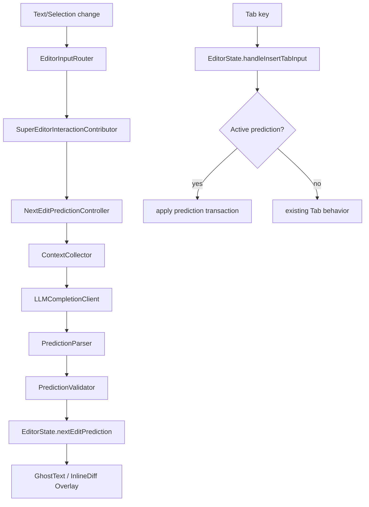

# Next Edit Prediction 设计方案

本文档描述在 Lumi 编辑器中实现类似 Cursor “预测下一步编辑，按 Tab 接受”的功能方案。方案基于当前代码结构：`EditorService` 作为编辑器门面，`EditorInputRouter` 分发文本与选区变化，`EditorKernel` 提供 transaction/TextEdit 应用能力，`EditorPanelPlugin` 内的 overlay 视图提供编辑器浮层，`LumiApp` 已有 `LLMService` 与多供应商模型接入。

## 目标

- 用户在编辑器中输入、移动光标或修改代码后，Lumi 在低延迟路径中预测下一步小范围编辑。
- 预测结果以 ghost text 或轻量 inline diff 展示。
- 用户按 `Tab` 时优先接受预测；没有预测时保留当前 Tab 缩进、snippet 跳转、多光标缩进行为。
- 预测必须可取消、可过期、可验证，不能阻塞主线程和正常输入。
- 初版只支持当前文件的小范围编辑，后续再扩展到跨文件 next edit。

## 当前可复用基础

### 输入与选区事件

- `Packages/EditorService/Sources/EditorService/Editor/EditorInputRouter.swift`
  - `handleTextDidChange` 已经在文本变化后构造 `EditorInteractionContext`，并调用 `editorExtensions.runInteractionTextDidChange`。
  - `handleSelectionDidChange` 已经在选区变化后调用 `editorExtensions.runInteractionSelectionDidChange`。
- `Packages/EditorService/Sources/EditorService/Proto/SuperEditorExtensionContributors.swift`
  - 已有 `SuperEditorInteractionContributor` 扩展点，适合注册预测调度器。

### Tab 与编辑应用

- `Packages/EditorService/Sources/EditorService/Store/EditorState.swift`
  - `handleInsertTabInput` 是 Tab 的核心入口。
  - `applyCompletionEdit`、`applySnippetCompletionEdit`、`applyTextEditsToCurrentDocument` 已经走 transaction 路径。
- `Packages/EditorKernel/Sources/EditorKernel/EditorTransaction.swift`
  - `EditorTransaction` 支持多 replacement 和更新选区。
- `Packages/EditorKernel/Sources/EditorKernel/TextEditTransactionBuilder.swift`
  - 可把 LSP `TextEdit` 转为 transaction。

### 展示层

- `Plugins/EditorPanelPlugin/Sources/Overlay/EditorInlinePresentationsOverlayView.swift`
  - 已有 inline presentation 浮层，但当前 `SourceEditorView` 中相关 overlay 被注释。
- `Packages/EditorService/Sources/EditorService/Kernel/EditorInlinePresentation.swift`
  - 已有 `.diff` 样式，可复用为轻量 “Tab 接受” 提示。

### 模型能力

- `LumiApp/Core/Services/LLMService.swift`
  - 已有统一 LLM 请求服务。
- `LumiApp/Core/Proto/SuperLLMProvider.swift`
  - 多供应商统一接口已经存在。
- `Packages/LLMProviderKit`
  - 已抽出 OpenAI/Anthropic 兼容请求和流式解析。

## 推荐架构

新增一个独立插件：`Plugins/PluginNextEditPredictionEditor`。它只负责智能预测，不混入普通 LSP completion。



### 模块划分

- `NextEditPredictionEditorPlugin`
  - 注册 interaction contributor。
  - 注册设置项和默认开关。
- `NextEditPredictionInteractionContributor`
  - 监听 `onTextDidChange` 和 `onSelectionDidChange`。
  - 只做调度，不直接请求模型。
- `NextEditPredictionController`
  - 管理 debounce、取消、generation id、缓存和状态机。
  - 保存当前候选，负责过期判断。
- `NextEditContextCollector`
  - 收集当前文件、光标附近窗口、最近编辑摘要、诊断、Git diff、相关文件摘要。
- `NextEditPromptBuilder`
  - 构造稳定、短小、结构化 prompt。
- `NextEditLLMClient`
  - 通过现有 `LLMService` 或更轻量的 provider API 请求模型。
- `NextEditPredictionParser`
  - 解析模型 JSON 输出为本地模型。
- `NextEditPredictionValidator`
  - 校验范围、版本、语法边界、diff 大小、与当前文本一致性。
- `NextEditPredictionRenderer`
  - 提供 ghost text / inline diff 展示模型。

## 核心数据模型

建议先放在 `EditorService` 或 `EditorKernel` 中，便于 UI 和插件共享。初版可只支持当前文件。

```swift
public struct EditorNextEditPrediction: Identifiable, Equatable, Sendable {
    public enum Kind: Equatable, Sendable {
        case insertion
        case replacement
        case deletion
    }

    public let id: UUID
    public let fileURL: URL
    public let baseDocumentVersion: Int
    public let triggerCursorOffset: Int
    public let replacementRange: EditorRange
    public let replacementText: String
    public let kind: Kind
    public let displayText: String
    public let confidence: Double
    public let createdAt: Date
}
```

`EditorState` 增加状态：

```swift
@Published public private(set) var nextEditPrediction: EditorNextEditPrediction?
@Published public private(set) var nextEditPredictionStatus: EditorNextEditPredictionStatus = .idle
```

并增加操作：

```swift
public func setNextEditPrediction(_ prediction: EditorNextEditPrediction?)
public func clearNextEditPrediction(reason: String)
public func acceptNextEditPrediction(textViewSelections: [NSRange]) -> Bool
```

`acceptNextEditPrediction` 内部使用 `EditorTransactionController.transactionForInputEdit` 或 `TextEditTransactionBuilder`，最终走现有 `applyEditorTransaction`，原因标记为 `next_edit_accept`。

## 触发策略

### 触发时机

在 `NextEditPredictionInteractionContributor` 中触发：

- 用户输入普通字符后，debounce 150-250ms。
- 用户按 Enter 后，debounce 80-150ms。
- 用户删除、粘贴、接受 completion 后，debounce 200-350ms。
- 光标移动到同文件新位置后，debounce 250-400ms。

不触发：

- 当前没有文件 URL。
- 多光标编辑中。
- 有非空选区但不是 replace 场景。
- 文件过大或当前处于 large file mode。
- 当前语言不支持或未识别。
- 用户正在 composition/输入法候选过程中。
- 当前已有 completion 菜单、inline rename、peek 等高优先级交互。

### 取消与过期

每次请求携带：

- `generationId`
- `fileURL`
- `baseDocumentVersion`
- `cursorOffset`
- `contentHashAroundCursor`

当任一条件变化时丢弃旧结果：

- 当前文件变化。
- 文档版本变化，且不是同一次接受操作导致。
- 光标偏离触发位置超过阈值。
- 用户继续输入且文本不再匹配候选的 base range。
- 请求耗时超过 2 秒。

## 上下文收集

初版上下文控制在 8k-16k tokens 内。

### 必传上下文

- 当前文件 path、language id。
- 当前光标位置。
- 光标前后窗口：前 120 行、后 80 行，或按 token 限制裁剪。
- 当前行、上一行、下一行。
- 当前选区文本。
- Problems 中当前行附近的 diagnostics。
- 最近 5-10 次编辑摘要，而不是完整历史。

### 可选上下文

- Git diff 中当前文件的 hunks。
- 当前 workspace root。
- `DocumentSymbolProvider` 的当前文件符号列表。
- RAG/索引中与当前符号相关的 2-4 个文件摘要。
- LSP completion 的 top candidates，作为模型参考而非直接展示。

### 隐私与成本

默认只发送当前文件局部窗口和 diagnostics。跨文件上下文、Git diff、RAG 相关文件应放在设置中单独开关。

## 模型输出协议

模型必须输出 JSON，不输出解释：

```json
{
  "edits": [
    {
      "file": "/absolute/path/File.swift",
      "range": {
        "startUtf16": 1024,
        "endUtf16": 1042
      },
      "replacement": "new text"
    }
  ],
  "cursorUtf16": 1060,
  "display": "Tab to accept",
  "confidence": 0.73
}
```

初版限制：

- `edits.count == 1`
- `file == currentFileURL`
- replacement range 不超过 2k UTF-16 code units。
- replacement 后文件大小变化不超过 4k chars。
- confidence 低于 0.45 不展示。

后续跨文件版本可复用 `WorkspaceEdit`：

- 模型输出多个文件 edits。
- 转成 `WorkspaceEdit`。
- 用现有 `EditorWorkspaceEditController` 预览和应用。

## Prompt 设计

系统提示词要强调 “小范围、下一步、JSON-only”：

```text
You predict the user's next code edit in an editor.
Return only JSON matching the schema.
Prefer one small edit near the cursor.
Do not reformat unrelated code.
Do not invent APIs not suggested by the surrounding code.
Return no edits when the next action is ambiguous.
```

用户内容结构：

```text
<document>
path: ...
language: ...
cursor_utf16: ...
selection_utf16: ...
</document>

<recent_edits>
...
</recent_edits>

<diagnostics>
...
</diagnostics>

<code_before_cursor>
...
</code_before_cursor>
<code_after_cursor>
...
</code_after_cursor>
```

## UI 展示

### 初版展示

优先实现两种简单形态：

- 插入型预测：在光标后显示灰色 ghost text。
- 替换型预测：用当前已有 `.diff` inline presentation 在目标行末尾显示短摘要和 `Tab` badge。

如果 EditorSource 难以直接绘制 ghost text，可以先复用 overlay：

- 打开 `SourceEditorView` 中 `EditorInlinePresentationsOverlayView` 的 overlay。
- 扩展 `EditorInlinePresentationKind` 增加 `.nextEdit`，或复用 `.diff`。
- 在 `EditorOverlayController.inlinePresentations` 中合并 `state.nextEditPrediction`。

### 推荐最终体验

- 当前光标处插入：灰色 ghost text，`Tab` 接受，`Esc` 拒绝。
- 非当前光标替换：目标行旁边显示 mini diff pill，按 `Tab` 后应用并把光标移动到 edit 后。
- 多行替换：显示 compact inline diff，最多 6 行，超出只显示摘要。

## Tab 接受逻辑

在 `EditorState.handleInsertTabInput` 的最前面插入：

```swift
if acceptNextEditPrediction(textViewSelections: textViewSelections) {
    return true
}
```

优先级建议：

1. active snippet session 跳转。
2. next edit prediction 接受。
3. 多光标 indent。
4. 普通 Tab/智能缩进。

如果希望更像 Cursor，可以把 next edit 放在 snippet 后、普通 completion 菜单前。若 completion 菜单已打开，则 Tab 应优先选择 completion，避免破坏已有肌肉记忆。

## 校验策略

展示前必须校验：

- 文件和文档版本匹配。
- range 在当前文本内。
- range 原文与请求时快照一致，或能通过上下文哈希确认仍匹配。
- replacement 不等于原文。
- 不包含 NUL 或异常控制字符。
- 单次 edit 范围和输出长度在阈值内。
- 如果语言有 LSP diagnostics，应用后不能显著增加 error 数量。初版可异步验证，不阻塞展示。

可选增强：

- 对 Swift/TS/HTML 等语言用 tree-sitter 检查局部语法。
- 对 import/rename 场景用 LSP resolve/code action 辅助。
- 同一位置连续被用户拒绝 2 次，短期内不再展示类似候选。

## 与现有 completion 的关系

此功能不替代 LSP completion：

- LSP completion 适合标识符、API、snippet。
- Next edit prediction 适合“下一处修改”和“当前意图延续”。

冲突处理：

- completion popup 可见时不展示 next edit。
- next edit 只在没有主动触发 completion 时出现。
- 接受 LSP completion 后可以触发一次 next edit，请求延迟 150ms。

## 设置项

建议新增设置：

- `nextEditPredictionEnabled`: 默认开启。
- `nextEditPredictionProviderMode`: `currentChatModel` / `fastModel` / `custom`。
- `nextEditPredictionDebounceMs`: 默认 220。
- `nextEditPredictionContextMode`: `localOnly` / `withGitDiff` / `withWorkspaceContext`。
- `nextEditPredictionMaxEditChars`: 默认 4000。
- `nextEditPredictionShowGhostText`: 默认开启。

配置存储可沿用 `AppSettingStore`，编辑器包内通过 `EditorSettingsLifecycle` 或 host environment 注入。

## 分阶段落地

### Phase 1: 本地状态与 Tab 应用

- 增加 `EditorNextEditPrediction` 数据模型。
- `EditorState` 增加 prediction 状态、clear、accept 方法。
- `handleInsertTabInput` 接入接受逻辑。
- 单元测试：有预测时 Tab 应用 edit；无预测时保留原 Tab 行为；版本不匹配时不应用。

### Phase 2: 插件调度与 mock predictor

- 新建 `NextEditPredictionEditorPlugin`。
- 注册 `SuperEditorInteractionContributor`。
- 实现 debounce、generation、取消。
- 先用 mock predictor 生成确定性候选，打通 UI 和接受链路。

### Phase 3: UI 展示

- 恢复 `SourceEditorView` 中 inline presentation overlay，或新增专用 next edit overlay。
- 对插入候选显示 ghost text，对替换候选显示 inline diff pill。
- 支持 `Esc` 清除候选。

### Phase 4: LLM 请求

- 实现 `NextEditContextCollector` 和 `NextEditPromptBuilder`。
- 接入 `LLMService`，优先使用用户当前选择模型或 Auto 路由选出的低延迟代码模型。
- 解析 JSON，失败时静默丢弃并记录 debug 日志。

### Phase 5: 质量与性能

- 增加诊断、range、hash、长度、相似拒绝过滤。
- 加入请求耗时和接受率埋点。
- 加入缓存：相同 `(file, cursor, contentHash)` 直接复用短期候选。
- 用 Instruments 验证输入路径不增加明显主线程工作。

### Phase 6: 跨文件编辑

- 扩展模型输出多 edit。
- 转 `WorkspaceEdit`。
- 用已有 workspace edit preview/summary 做确认式体验。
- 仅对高置信度、同 workspace、少量文件修改开放 Tab 直接接受。

## 测试建议

### 单元测试

- `NextEditPredictionValidatorTests`
  - range 越界拒绝。
  - 文档版本不匹配拒绝。
  - replacement 与原文相同拒绝。
  - 超长 edit 拒绝。
- `NextEditPredictionControllerTests`
  - 新输入取消旧请求。
  - 旧 generation 返回后不污染当前状态。
  - debounce 生效。
- `EditorStateNextEditTests`
  - Tab 接受当前文件插入。
  - Tab 接受当前文件替换。
  - 无预测时调用原缩进逻辑。

### 集成测试

- 打开 Swift 文件，输入函数签名后预测函数体。
- 修改参数名后预测同文件下一处引用修改。
- 当前行有 LSP diagnostic 时预测修复。
- 快速输入期间候选不闪烁、不阻塞。

## 主要风险

- EditorSource ghost text 能力可能不足。规避方式：先用 overlay diff pill 打通核心价值，再做更深的文本绘制集成。
- 模型延迟影响体验。规避方式：debounce 后预取、严格取消、短上下文、可选 fast model。
- 错误 edit 破坏代码。规避方式：小范围限制、版本校验、长度限制、Tab 明确接受、支持撤销。
- 与 Tab 缩进冲突。规避方式：只在可见候选且校验通过时劫持 Tab，并保留 snippet/completion 优先级。

## 最小可行版本定义

MVP 不需要跨文件、不需要完美 ghost text：

- 当前文件单 edit。
- Interaction contributor 触发预测。
- 候选可见。
- Tab 接受候选并走 undo/redo transaction。
- 输入继续变化时候选立即消失。
- 请求失败完全静默，不影响编辑器。

这个版本已经能覆盖 “用户刚写了一半，Lumi 猜下一步并按 Tab 接受” 的核心体验，后续再逐步接近 Cursor 的多位置 next edit。
