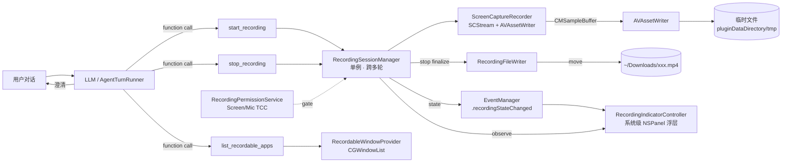

# 屏幕录制插件（Screen Recorder Plugin）实施计划

> **For Claude:** REQUIRED SUB-SKILL: Use superpowers:executing-plans to implement this plan task-by-task.

**Goal:** 在 Lumi 中通过自然语言对话即可录制任意 app 的使用流程（含可选声音），结束后自动把视频输出到下载目录。最终达到生产级别的稳定性：权限完善、异常自恢复、跨多轮会话可靠、不录制到 Lumi 自身、可中途停止。

**Architecture:** 新建一个独立的 Swift Package 插件 `ScreenRecorderPlugin`，遵循现有插件贡献模式（参考 `MindMapPlugin` / `ComputerUsePlugin`）。核心是一个跨多轮对话存活的 `RecordingSessionManager` 单例，驱动一个基于 `SCStream + AVAssetWriter` 的录制引擎；通过三个 `LumiAgentTool`（`start_recording` / `stop_recording` / `list_recordable_apps`）暴露给 LLM；录制期间用一个系统级置顶 `NSPanel` 浮层指示器反馈状态；状态变化经 `KernelLumi` 的 `EventManager` 广播（完全复刻 `WebRequestActivity` 链路）。权限、窗口枚举、路径解析、Downloads 写入全部复用/对照 `ComputerUsePlugin` 已验证的实现。

**Tech Stack:** Swift, SwiftUI, ScreenCaptureKit（`SCStream`/`SCStreamDelegate`/`SCStreamOutput`）, AVFoundation（`AVAssetWriter`/`AVAssetWriterInput`/`AVAssetWriterInputPixelBufferAdaptor`）, CoreGraphics（`CGWindowList`/`CGPreflight/RequestScreenCaptureAccess`）, ApplicationServices（`AXIsProcessTrustedWithOptions`）, AppKit（`NSPanel`）, Swift Package Manager.

---

## 1. 背景与目标

### 背景
用户希望：「帮我录制地图 app 的使用流程」——LLM 在和用户确认细节后开始录制，最后把视频输出到下载目录。Lumi 已具备 ~80% 的基础设施（插件框架、LLM 工具调用、ScreenCaptureKit 单帧截图、Screen Recording 权限申请、Downloads 写入），唯独缺少**连续视频采集 + 编码落盘**（目前只有 `SCScreenshotManager` 单帧）。

### 目标
- LLM 通过对话理解意图、澄清参数，调用 `start_recording` 启动录制（`.high` 风险触发原生确认）。
- 支持两种录制语义：
  - **模式 A（人工走查）**：用户自己操作 app，Lumi 只负责录；用户说「停」或点浮层停止按钮即结束。
  - **模式 B（自动演示，Phase 2）**：LLM 复用现有 `computer_observe`/`computer_act` 工具自动操作 app 走完流程并同步录制。
- 录制可含 app 声音 / 麦克风（可选）。
- 输出到 `~/Downloads`（默认）或指定目录，格式 `.mp4`（H.264 + AAC）。
- 生产级稳定性：权限缺失优雅降级、窗口消失/磁盘满/流中断自动恢复与清理、跨多轮可靠、不录制自身、停止幂等。

### 非目标
- 不做视频后期编辑（裁剪、字幕、转场）——可后续扩展。
- 不实现 DeskPad 式的「虚拟显示器」隔离录制（那是为屏幕共享设计，本需求只需录制真实窗口/显示器）。
- 不做实时推流/直播。
- v1 不做 HEVC 硬件编码调优与多显示器分别录制（先支持单目标，架构预留）。

---

## 2. 现状与可复用资产

| 能力 | 状态 | 复用方式 / 位置 |
|---|---|---|
| 插件注册 LLM 可调用工具 | ✅ 已有 | `LumiPlugin.agentTools(kernel:)` → `LumiAgentTool` 协议 |
| 工具序列化喂给 LLM 并回调 | ✅ 已有 | `AgentTurnRunner` 循环 + LLMKit `LumiToolSchema` |
| 单窗口 ScreenCaptureKit 截图 | ✅ 已有 | `Plugins/ComputerUsePlugin/Sources/Services/ComputerUseService.swift:101-140`（`SCContentFilter(desktopIndependentWindow:)` + `SCScreenshotManager`）|
| 窗口枚举/选择（CGWindowList） | ✅ 已有 | `Plugins/ComputerUsePlugin/Sources/Services/ComputerUseWindowProvider.swift:6-73`（对照实现，新插件自包含）|
| Screen Recording / Accessibility 权限 | ✅ 已有 | `Plugins/ComputerUsePlugin/Sources/Services/ComputerUsePermissionService.swift:1-35`（对照实现薄封装）|
| app 白名单（按 bundleId） | ✅ 已有 | `Plugins/ComputerUsePlugin/Sources/Services/ComputerUseAuthorizationStore.swift`（同款 UserDefaults 模型）|
| Downloads 目录解析 | ✅ 已有 | `Plugins/DownloadPlugin/Sources/DownloadPlugin.swift:34-40`（`urls(for: .downloadsDirectory, ...)`）|
| 沙盒路径校验 | ✅ 已有 | `kernel.isPathAllowed(path)`（`KernelLumi+ToolExecutionContext.swift`，注意是 @TaskLocal）|
| 事件广播 + 浮层 UI 模板 | ✅ 已有 | `WebRequestActivity` → `EventManager` → `WebRequestToastOverlay`（最近刚做的，最佳模板）|
| 系统级置顶浮窗 | ✅ 已有 | `Plugins/ChatScreenshotPlugin/Sources/.../Overlay/ChatScreenshotOverlayWindow.swift`（`NSPanel` + `level`/`collectionBehavior`）|
| screen-capture entitlement | ✅ 已有 | `LumiApp/App.entitlements`（`com.apple.security.screen-capture = true`，且未沙盒）|
| `willSendToLLM` 注入系统提示 | ✅ 已有 | `MindMapPlugin` / `ComputerUsePlugin` 均有示例 |
| `riskLevel == .high` 触发确认门 | ✅ 已有 | `LumiCommandRiskLevel.requiresPermission`（仅 `.high`）|

### 核心缺口（需新建）
1. 连续视频采集（`SCStream` 流式）+ 编码（`AVAssetWriter`）→ `.mp4`。
2. 跨多轮的「录制会话」状态管理 + 系统级置顶录制指示器。
3. 启动/聚焦 app 的能力（`AppService.openApp` / `NSWorkspace` 仅 UI 触发，未暴露成工具——本插件内自包含薄封装）。

> 参考：[DeskPad](https://github.com/Stengo/DeskPad) 的 `SCStream` 连续采集 + 逐帧 `CMSampleBuffer` 处理是本录制引擎的范例，但**不**采用其虚拟显示器（私有 API）部分。

---

## 3. 整体架构



### 组件职责
- **`ScreenRecorderPlugin`**：入口，`onBoot` 注册服务、贡献 `agentTools` / `willSendToLLM` / `promptSuggestions` / 设置页。
- **`RecordingSessionManager`**：`@MainActor ObservableObject` 单例，持有至多一个活跃会话，编排「校验权限 → 选窗口 → 启动引擎 → 广播 → 计时/自动停 → 停止落盘」全流程；直接驱动浮层指示器。
- **`ScreenCaptureRecorder`**：录制引擎，`SCStream` 采帧 + `AVAssetWriter` 编码；`@unchecked Sendable` + 内部串行队列；输出临时 `.mp4`。
- **`RecordingFileWriter`**：临时目录管理、最终文件移动、异常清理。
- **`RecordingPermissionService`**：屏录/麦克风 TCC 预检与申请。
- **`RecordableWindowProvider`**：`CGWindowList` 枚举可用窗口、按 app 名/bundleId 匹配；启动并聚焦目标 app。
- **三个 Agent 工具**：薄封装，仅把请求转发给 manager。
- **`RecordingIndicatorController` + `RecordingIndicatorWindow`**：系统级置顶录制指示器（红点 + 计时 + 停止按钮）。
- **`RecordingActivity`（KernelLumi）**：状态变化事件载荷，复刻 `WebRequestActivity`。

---

## 4. 关键设计决策

### 4.1 录制引擎：SCStream + AVAssetWriter（主路径）
- **为什么不用 `SCRecordingOutput`（macOS 15+）**：它更省代码，但本仓库 `ComputerUsePlugin` 部署目标为 `.macOS(.v14)`，且 `SCStream + AVAssetWriter` 是被 DeskPad 验证、跨版本最稳定、对音视频/停止/异常控制力最强的方案。`SCRecordingOutput` 作为「可选简化」记录在附录，待确认全局部署目标 ≥15.2 后可切换。
- 视频源走 `SCContentFilter(desktopIndependentWindow:)`（窗口模式）或 `SCContentFilter(display:including:excluding:)`（显示器模式，排除自身 PID 窗口）。
- 像素格式 `kCVPixelFormatType_32BGRA`；编码 H.264（`AVVideoCodecType.h264`），AAC 音频。

### 4.2 会话生命周期必须脱离单个 LLM turn
录制天然跨越多轮对话（开始 → 操作 → 停止），因此状态必须住在持久单例（仿 `MindMapStore` / `ComputerUseService.shared`），**不能**放在工具实例或 turn 局部。`start_recording` / `stop_recording` 只是向单例「发命令」。停止有两条入口：聊天工具调用、浮层停止按钮——两者都调用 `manager.stop()`。

### 4.3 沙盒与路径校验的时机（关键细节）
`kernel.isPathAllowed(path)` 读取的是 `@TaskLocal activeToolExecutionState`，它**只在工具的 `execute` 执行期间有效**。而录制落盘发生在 `stop_recording` 的 `execute`（或自动停止的后台任务）里——此时如果是后台自动停止，task-local 上下文已不存在。

**对策**：在 `StartRecordingTool.execute`（上下文存活）内解析并校验 `output_directory`（`kernel.isPathAllowed`，不通过则抛 403），把**已校验的绝对路径 URL** 存入会话 config；引擎/落盘只用该 URL，不再触碰 `isPathAllowed`。`StopRecordingTool.execute` 同理校验（若允许 stop 时改目标路径）。默认输出 `~/Downloads`（无需额外授权，但仍在 start 时走一次校验以保持一致）。

### 4.4 确认 UX：「确认细节后开始」分两层
- **LLM 对话澄清**：靠 `willSendToLLM` 注入的强引导 + 工具描述，让模型主动问清：哪个 app / 录多久或何时停 / 是否含声音 / 文件名 / 输出目录。
- **原生确认门**：`StartRecordingTool.riskLevel` 设为 `.high` → 触发 Lumi 既有的 `LumiPendingToolConfirmation` 权限确认流程（展示目标 app、分辨率、时长、输出路径），用户点确认后才真正开始。

### 4.5 浮层指示器必须是系统级 NSPanel，而非窗口内 overlay
录制期间用户在**别的 app** 里操作，Lumi 主窗可能被遮挡/最小化。`rootOverlays`（窗口内 SwiftUI overlay）此时不可见。因此指示器用 `ChatScreenshotOverlayWindow` 同款的置顶 `NSPanel`（`level = .statusBar`，`collectionBehavior = [.canJoinAllSpaces, .fullScreenAuxiliary, .stationary]`），常驻显示「🔴 录制中 · 0:12 · 停止」。

### 4.6 不录制 Lumi 自身
- 窗口模式：若匹配到的窗口属于 Lumi 自身 PID/bundleId，`start_recording` 直接拒绝并提示。
- 显示器模式：`SCContentFilter(display:including:excluding:)` 的 `excluding` 传入 Lumi 自身 PID 的所有窗口。

### 4.7 自动停止与异常恢复
- `duration_seconds` 到点自动 stop。
- 目标窗口消失（app 退出/窗口关闭）→ 通过轮询 `CGWindowList`（每 ~1s）检测 → 优雅 stop。
- `SCStreamDelegate.stream(_:didStopWithError:)` → finalize writer + 清理 + 通知。
- 磁盘满（`AVAssetWriter.error`）→ stop + 清理 + 友好错误。
- 启动失败（权限/无窗口/编码器初始化）→ 全量回滚（停止流、删除临时文件、清理状态）。
- 启动时清理上次残留的临时文件（崩溃恢复）。
- 停止幂等：重复 `stop()` 安全，仅首次生效。

---

## 5. 录制引擎技术规格（核心，ScreenCaptureRecorder）

### 5.1 数据结构（伪代码）
```swift
final class ScreenCaptureRecorder: NSObject, @unchecked Sendable {
    private var stream: SCStream?
    private var assetWriter: AVAssetWriter?
    private var videoInput: AVAssetWriterInput?
    private var pixelAdaptor: AVAssetWriterInputPixelBufferAdaptor?
    private var audioInput: AVAssetWriterInput?
    private let writerQueue = DispatchQueue(label: "lumi.screenRecorder.writer") // 串行
    private let lock = NSLock()
    private var isRecording = false
    private var sessionStarted = false          // startSession 只调一次
    private var sessionStartPTS: CMTime = .invalid
    // config: 分辨率、fps、含音频、含麦克风
}
```
extension `SCStreamDelegate` 与 `SCStreamOutput`（或用独立 output 对象）。

### 5.2 start(config:) async throws
1. `content = try await SCShareableContent.excludingDesktopWindows(false, onScreenWindowsOnly: true)`。
2. 构建 filter：
   - 窗口：`content.windows.first { $0.windowID == window.id }` → `SCContentFilter(desktopIndependentWindow:)`。
   - 显示器：`SCContentFilter(display:including: [], excluding: lumiWindows)`。
3. `SCStreamConfiguration()`：
   - `width`/`height`：取 `filter.contentRect` × `pointPixelScale`，**强制取偶数**（H.264 要求）并 `max(1, ...)`。
   - `showsCursor`（默认 `true`）。
   - `minimumFrameInterval = CMTime(value: 1, timescale: fps)`。
   - `queueDepth = 6`（内存与流畅平衡）。
   - `capturesShootingOnly` 关闭；`captureMicrophone = includeMic`。
   - 音频：`captureMicrophone`（麦克风）+ app 音频（macOS 13+ 的 `SCStreamOutputType.audio`）。
4. `stream = SCStream(filter:configuration:delegate:)`；`addStreamOutput(self, type: .screen, sampleBufferQueue: writerQueue, handler:)`；音频同理 `type: .audio` / `.microphone`。
5. 临时 URL：`<pluginDataDirectory>/ScreenRecorder/tmp/<uuid>.mp4`。
6. `AVAssetWriter(outputURL:fileType:.mp4)`；`AVAssetWriterInput(mediaType:.video, outputSettings: H.264 设置)`，`expectsMediaDataInRealTime = true`；`AVAssetWriterInputPixelBufferAdaptor(assetWriterInput:sourcePixelBufferAttributes:[kCVPixelBufferPixelFormatTypeKey: kCVPixelFormatType_32BGRA])`；音频 input（AAC）。
7. `guard assetWriter.startWriting() else { throw assetWriter.error }`。
8. `try await stream.startCapture()`；`isRecording = true`。

### 5.3 帧处理（SCStreamOutput 回调，已在 writerQueue 上）
```
guard isRecording else { return }
let pts = sampleBuffer.presentationTimeStamp
if !sessionStarted {
    sessionStartPTS = pts
    assetWriter.startSession(atSourceTime: pts)   // 仅一次
    sessionStarted = true
}
switch type {
case .screen:
    guard videoInput.isReadyForMoreMediaData,
          let pb = sampleBuffer.imageBuffer else { return }   // 满了就丢帧，绝不阻塞
    pixelAdaptor.append(pb, withPresentationTime: pts)
case .audio / .microphone:
    if audioInput?.isReadyForMoreMediaData == true { audioInput?.append(sampleBuffer) }
}
```
> 注意：`startSession` 的「仅一次」由 `sessionStarted` 标志保证，且全部在串行 `writerQueue` 上，无竞态。

### 5.4 stop() async throws -> URL
```
isRecording = false
try await stream?.stopCapture()
// 在 writerQueue 上收尾
videoInput?.markAsFinished(); audioInput?.markAsFinished()
await assetWriter?.finishWriting()
guard assetWriter?.status == .completed else { throw assetWriter?.error ?? RecordingError.encodingFailed }
return tempURL
```
> 鲁棒性：若 `sessionStarted == false`（从未收到帧就 stop），`finishWriting()` 会让 writer 进入失败态——需先判断 `sessionStarted`，为假则直接删除临时文件并抛「无内容」错误（或在 manager 层吞掉返回友好提示）。

### 5.5 H.264 outputSettings（参考）
```swift
[AVVideoCodecKey: AVVideoCodecType.h264,
 AVVideoWidthKey: width,
 AVVideoHeightKey: height,
 AVVideoCompressionPropertiesKey: [
    AVVideoAverageBitRateKey: 8_000_000,          // ~8 Mbps @1080p30，可按分辨率缩放
    AVVideoExpectedSourceFrameRateKey: 30,
    AVVideoMaxKeyFrameIntervalKey: 60,
    AVVideoProfileLevelKey: AVVideoProfileLevelH264HighAutoLevel
 ] as [String: Any]]
```
音频 AAC：`[AVFormatIDKey: kAudioFormatMPEG4AAC, AVSampleRateKey: 44100, AVNumberOfChannelsKey: 2]`。

### 5.6 异常路径
- `stream(_:didStopWithError:)`：在 writerQueue 上 `isRecording=false`，`finishWriting`（best-effort），广播错误，保留临时文件供排查（或按设置删除）。
- `startWriting()` 失败、`startCapture()` 失败、`finishWriting()` 失败：各自抛 `RecordingError`，manager 统一回滚与清理。

---

## 6. 数据模型与事件

### 6.1 模型（插件 `Models/`）
- `RecordingTarget`：枚举 `appWindow(application:String, windowTitle:String?)` / `display(excludeLumi:Bool)`。
- `RecordingConfig`：`target`、`frameRate:Int=30`、`resolutionHeight:Int?=nil`、`includeAppAudio:Bool=false`、`includeMicrophone:Bool=false`、`showCursor:Bool=true`、`maxDurationSeconds:Int?=nil`、`outputDirectory:URL`（已校验）、`filename:String?`、`sessionID:UUID`。
- `RecordingState`：枚举 `idle/recording/stopping/finished/error`。
- `RecordingSession`：`config`、`state`、`startedAt:Date`、`elapsedSeconds:Int`、`outputURL:URL?`、`error:String?`。
- `RecordingResult`：`outputURL`、`durationSeconds`、`fileSizeBytes`、`width`、`height`。
- `RecordingError: LocalizedError`：`.permissionDenied`、`.noSuchWindow`、`.targetIsLumi`、`.alreadyRecording`、`.notRecording`、`.encodingFailed(String)`、`.diskFull`、`.pathDenied`。

### 6.2 事件（KernelLumi，复刻 WebRequestActivity）
新建 `Packages/KernelLumi/Sources/KernelLumi/Types/Activity/RecordingActivity.swift`（对照 `Types/Web/WebRequestActivity.swift`）：
```swift
public struct RecordingActivity: Sendable {
    public enum State: String, Sendable { case idle, recording, stopping, finished, error }
    public let state: State
    public let sessionID: UUID?
    public let targetDescription: String?     // e.g. "Maps (Apple Maps)"
    public let elapsedSeconds: Int?
    public let outputPath: String?
    public let error: String?
    public let timestamp: Date
    // memberwise init
}
enum RecordingActivityNotification { static let activityKey = "RecordingActivity" }
extension Notification { var lumiRecordingActivity: RecordingActivity? { ... } }
```
改动 `KernelEvents.swift`（对照 `webRequestReceived` 全套）：
- `KernelLumiEvent.recordingStateChanged = "com.coffic.lumi.recordingStateChanged"`。
- `Notification.Name.lumiRecordingStateChanged`。
- `View.onLumiRecordingStateChanged { (activity) in }`（复制 `:207-214` 写法）。
改动 `EventManager.swift`（对照 `postWebRequestReceived` `:141-147`）：`postRecordingStateChanged(activity:)`。

---

## 7. Agent 工具规格

所有工具读参数用现有访问器：`arguments.string("x")` / `.int` / `.bool`（`LumiAgentTool.swift` 协议扩展）。每个工具：`static let info`、`init()`、`var inputSchema: LumiJSONValue`、`func displayDescription(arguments:)`、`func execute(arguments:kernel:) async throws -> String`，并按需覆盖 `riskLevel(arguments:kernel:)` 与实例 `var tags: Set<LumiToolTag>`（**注意**：必须声明实例 `var`，不要像 `WriteFileTool` 那样写成 `static let`，否则标签静默失效）。

### 7.1 `start_recording`（risk `.high`，tags `[.sideEffect]`）
inputSchema 关键字段：
```jsonc
{
  "type": "object",
  "properties": {
    "application": { "type": "string", "description": "目标 app 名称或 bundleId（如 '地图' / 'com.apple.Maps'）" },
    "window_title": { "type": "string", "description": "可选，窗口标题子串匹配" },
    "target": { "type": "string", "enum": ["app_window", "display"], "default": "app_window" },
    "duration_seconds": { "type": "integer", "minimum": 1, "maximum": 3600, "description": "可选，自动停止秒数" },
    "include_app_audio": { "type": "boolean", "default": false },
    "include_microphone": { "type": "boolean", "default": false },
    "frame_rate": { "type": "integer", "default": 30 },
    "resolution_height": { "type": "integer", "description": "可选，如 720/1080" },
    "output_directory": { "type": "string", "description": "默认 ~/Downloads" },
    "filename": { "type": "string", "description": "可选，默认 recording-<时间戳>" }
  },
  "required": ["application"]
}
```
execute 流程：
1. `try kernel.checkCancellation()`。
2. 解析参数 → `RecordingTarget`。
3. 解析 `output_directory`（默认 `DownloadPlugin.defaultDownloadDirectory()`）→ `guard kernel.isPathAllowed(path) else { throw .pathDenied }`（沙盒，4.3）。
4. `try await RecordingSessionManager.shared.start(config)`：
   - 预检屏录权限（缺则 `requestScreenRecordingPermission()` + 打开系统设置 + 抛 `.permissionDenied`）。
   - 麦克风按需 `AVAudioApplication.requestRecordPermission`（macOS 14+）。
   - 选窗口：`RecordableWindowProvider.select`；命中 Lumi 自身 → `.targetIsLumi`；未命中 → 尝试 `NSWorkspace` 启动该 app 再重试一次 → 仍无 → `.noSuchWindow`。
   - 聚焦目标 app（`NSRunningApplication.activate`）。
   - 建 `ScreenCaptureRecorder` 并 `start`；置会话为 `recording`；广播 `.recordingStateChanged`；浮层 show；启动计时器 / 自动停 / 窗口存活轮询。
5. 返回双语字符串：「已开始录制 <app>（窗口）… 输出将保存到 <path>。说『停』或点浮层停止按钮结束。」

### 7.2 `stop_recording`（risk `.safe`，tags `[.sideEffect]`）
- 无必填参数。
- execute：`try kernel.checkCancellation()` → `try await manager.stop()` → 返回「已保存到 <path>（时长 Xs，大小 Y MB）」；若无活跃录制 → 返回友好「当前没有正在进行的录制」。

### 7.3 `list_recordable_apps`（risk `.safe`，tags `[.readOnly, .fast]`）
- 可选 `filter`。
- 返回当前带可见窗口的 app 列表（名称 / bundleId / 窗口标题 / 尺寸），供 LLM 消歧与选目标。底层 `RecordableWindowProvider.availableWindows()`。

### 7.4 `willSendToLLM` 引导（注入系统消息，仿 `ComputerUsePlugin`）
教模型：本工具用于录制 app 使用流程并输出到下载目录；工作流 = ①澄清目标 app/时长/声音/文件名/目录 → ②不确定时先 `list_recordable_apps` → ③`start_recording`（会弹确认）→ ④告知用户已开始及如何停（说「停」或点停止按钮）→ ⑤`stop_recording` 后告知文件路径；模式 B 可在录制期间用 `computer_observe`/`computer_act` 自动演示。

### 7.5 `promptSuggestions`
- 「录制 <当前前台 app> 的使用流程」（动态取前台 app 名）。
- 「停止录制并保存到下载目录」（仅在有活跃录制时出现）。

---

## 8. 用户界面

### 8.1 浮层指示器（系统级 NSPanel，仿 `ChatScreenshotOverlayWindow`）
- `RecordingIndicatorWindow: NSPanel`：`styleMask: [.borderless, .nonactivatingPanel]`、`level = .statusBar`、`collectionBehavior = [.canJoinAllSpaces, .fullScreenAuxiliary, .stationary]`、`isOpaque=false`、`backgroundColor=.clear`、`hasShadow=true`、`ignoresMouseEvents=false`（需可点停止按钮）、`isReleasedWhenClosed=false`。圆角药丸内容：🔴 +「录制中 · 0:12」+「停止」按钮。
- `RecordingIndicatorController`：`show(targetDescription:)` / `update(elapsedSeconds:)` / `hide()`；置于主屏顶部居中。由 `RecordingSessionManager` 直接调用（同时广播事件供其他订阅者）。
- 计时由 manager 的 `@Published elapsedSeconds` 驱动（Combine 订阅刷新文本）。

### 8.2 设置页（`ScreenRecorderSettingsView`，仿 `ComputerUseSettingsView`）
- 默认输出目录、默认 fps、是否显示光标、默认是否含 app 音频/麦克风。
- 「测试屏录权限」按钮（调 `RecordingPermissionService`）。
- 「允许录制的 app」白名单（同 `ComputerUseAuthorizationStore` 模型，UserDefaults）。
- 「测试录制 3 秒」按钮（手动验证引擎，便于排错）。

---

## 9. 稳定性与生产级保障清单（实现与验收时逐条核对）
- [ ] 每次启动前预检屏录权限；缺失则请求 + 打开设置 + 友好提示，不硬崩。
- [ ] 麦克风按需申请（`AVAudioApplication`，macOS 14+）。
- [ ] `startSession(atSourceTime:)` 仅一次（`sessionStarted` 标志 + 串行 writerQueue）。
- [ ] 视频宽高强制偶数、`max(1, ...)`；`expectsMediaDataInRealTime = true`。
- [ ] writer 满载时丢帧（`isReadyForMoreMediaData == false` 直接 return），绝不阻塞流回调。
- [ ] `stop` 幂等；`sessionStarted == false` 时直接清理临时文件并返回「无内容」。
- [ ] 单一串行 `writerQueue` 承载所有 `AVAssetWriter` 写入；`SCStreamOutput` 回调也走它（或显式派发到它）。
- [ ] `stream(_:didStopWithError:)` 兜底：finalize（best-effort）+ 广播错误 + 不留悬挂会话。
- [ ] 自动停止：`maxDurationSeconds` 到点 + 目标窗口消失（~1s 轮询 `CGWindowList`）。
- [ ] 全链路异常回滚：任何失败都 `stopCapture` + 删临时文件 + 置 `idle` + 广播。
- [ ] 启动时清理上次残留临时文件（崩溃恢复）。
- [ ] 不录制 Lumi 自身（窗口模式拒绝自身；显示器模式 `excluding` 自身窗口）。
- [ ] 沙盒路径在 `execute`（上下文存活）内校验（4.3）。
- [ ] 同时仅一个活跃会话；重复 `start` → `.alreadyRecording` 提示（或按设置替换，默认拒绝）。
- [ ] `kernel.checkCancellation()` 贯穿 start/stop。
- [ ] `RecordingSessionManager` 为 `@MainActor`，引擎 `@unchecked Sendable` + `NSLock` 保护可变状态（仿 `ComputerUseService`）。
- [ ] 磁盘满：捕获 `AVAssetWriter.error`（`.diskFull` / `NSFileWriteOutOfSpaceError`）→ 停止 + 清理 + 提示。
- [ ] 线程安全：`NSPanel`/计时器/状态全部在 MainActor。
- [ ] 国际化：所有用户可见文案走 `Localizable.xcstrings`（中英双语）。

---

## 10. 实施任务（按依赖分阶段）

> 平台前提：确认全局部署目标为 macOS 15.x（`ChatScreenshotPlugin` 已用 15.2 API）。`Package.swift` 设 `platforms: [.macOS(.v15)]`（或与仓库实际目标一致）。

### Task 1：KernelLumi 录制事件与载荷（基础设施先行）
**Files:**
- Create: `Packages/KernelLumi/Sources/KernelLumi/Types/Activity/RecordingActivity.swift`
- Modify: `Packages/KernelLumi/Sources/KernelLumi/Events/KernelEvents.swift`
- Modify: `Packages/KernelLumi/Sources/KernelLumi/Managers/EventManager.swift`
1. 新建 `RecordingActivity`（§6.2），对照 `WebRequestActivity` 全套（含 `activityKey` + `Notification` 扩展）。
2. `KernelLumiEvent` 增加 `recordingStateChanged` case；加 `Notification.Name.lumiRecordingStateChanged`；加 `View.onLumiRecordingStateChanged`（复制 `onLumiWebRequestReceived` 写法）。
3. `EventManager` 增加 `postRecordingStateChanged(activity:)`（复制 `postWebRequestReceived`）。
4. 编译 KernelLumi 通过。

### Task 2：插件脚手架与数据模型
**Files:**
- Create: `Plugins/ScreenRecorderPlugin/Package.swift`（deps: `KernelLumi`, `LumiUI`, `LocalizationKit`, `SuperLogKit`；`platforms: [.macOS(.v15)]`）
- Create: `Plugins/ScreenRecorderPlugin/Sources/ScreenRecorderPlugin/Models/RecordingModels.swift`（§6.1 全部类型 + `RecordingError`）
- Create: `Plugins/ScreenRecorderPlugin/Sources/ScreenRecorderPlugin/ScreenRecorderPlugin.swift`（最小骨架：identity 字段 + 空 `onBoot`/`onReady`，先返回 `[]`）
1. 仿 `MindMapPlugin.swift:13-44` 写插件骨架（`id = "com.coffic.lumi.plugin.screen-recorder"`、`order = 285`、`policy = .optIn`、`category = .agent`、`stage = .beta`、`SuperLog`）。
2. 定义 §6.1 全部模型与错误枚举（`LocalizedError`，中英 `errorDescription`）。
3. 包可独立编译。

### Task 3：权限服务
**Files:**
- Create: `Sources/ScreenRecorderPlugin/Services/RecordingPermissionService.swift`
1. 对照 `ComputerUsePermissionService.swift` 实现：`hasScreenRecordingPermission`（`CGPreflightScreenCaptureAccess`）、`requestScreenRecordingPermission()`（`CGRequestScreenCaptureAccess`）、`openScreenRecordingSettings()`（深链 `Privacy_ScreenCapture`）。
2. 麦克风：`requestMicrophonePermission()` 用 `AVAudioApplication.requestRecordPermission`（macOS 14+），并提供 `AVCaptureDevice` 兼容回退说明。
3. 单元测试：预检 API 返回 `Bool`（不实际弹窗）。

### Task 4：窗口枚举 + 启动/聚焦
**Files:**
- Create: `Sources/ScreenRecorderPlugin/Services/RecordableWindowProvider.swift`
1. 对照 `ComputerUseWindowProvider.swift` 实现 `availableWindows()`（`CGWindowListCopyWindowInfo([.optionOnScreenOnly, .excludeDesktopElements], ...)`，过滤 layer 0、≥80×60、排除自身 PID、`activationPolicy == .regular`）与 `select(application:windowTitle:)`。
2. `launchIfNeeded(application:)`：`NSWorkspace.shared.urlForApplication(withBundleIdentifier:)` / 名称匹配 → `openApplication(at:configuration:)`；启动后短暂轮询等待窗口出现。
3. `activate(_ window:)`：`NSRunningApplication(processIdentifier:).activate(options: [])`。
4. 自包含，不依赖 `ComputerUsePlugin`。

### Task 5：文件输出
**Files:**
- Create: `Sources/ScreenRecorderPlugin/Services/RecordingFileWriter.swift`
1. `tempURL(for sessionID:)`：`<pluginDataDirectory>/ScreenRecorder/tmp/<uuid>.mp4`。
2. `finalize(tempURL:to outputURL:) async throws`：原子移动 / 跨卷先拷后删；冲突时自动加序号。
3. `purgeStaleTempFiles()`：启动时清理 `tmp/` 下超过 N 小时的残留。
4. 单元测试：冲突命名、跨卷移动（用临时目录模拟）。

### Task 6：录制引擎（核心）
**Files:**
- Create: `Sources/ScreenRecorderPlugin/Services/ScreenCaptureRecorder.swift`
1. 按 §5 全量实现：`SCStream` + `AVAssetWriter` + 串行 `writerQueue` + `startSession` 仅一次 + 丢帧 + `stop/finalize`。
2. 实现 `SCStreamDelegate.stream(_:didStopWithError:)` 兜底。
3. 偶数尺寸、H.264/AAC 设置（§5.5）、`expectsMediaDataInRealTime`。
4. `start` 失败的全量回滚（删临时文件、置状态）。
5. 注释标注「参考 DeskPad 的 sample-buffer 处理」。

### Task 7：会话管理器
**Files:**
- Create: `Sources/ScreenRecorderPlugin/Services/RecordingSessionManager.swift`
1. `@MainActor ObservableObject` 单例（`static let shared`）；`@Published currentSession: RecordingSession?`。
2. `start(config:) async throws`：权限预检 → 选窗口/启动/聚焦 → 引擎 start → 置状态 → 广播 `.recordingStateChanged(recording)` → 浮层 show → 启动计时器、自动停定时器、窗口存活轮询。
3. `stop() async throws -> RecordingResult`：引擎 stop → `RecordingFileWriter.finalize` → 置 `finished` → 广播 → 浮层 hide → 返回结果；异常路径走回滚与广播 `.error`。
4. 自动停 / 窗口消失 / 流中断 各路径收敛到同一 `stop()`（幂等）。
5. 单元测试：并发 start 拒绝（`.alreadyRecording`）、stop 幂等。

### Task 8：浮层指示器
**Files:**
- Create: `Sources/ScreenRecorderPlugin/Views/RecordingIndicatorWindow.swift`（NSPanel）
- Create: `Sources/ScreenRecorderPlugin/Views/RecordingIndicatorController.swift`
1. 仿 `ChatScreenshotOverlayWindow` 实现 NSPanel（§8.1 配置）。
2. `RecordingIndicatorController`：`show/update/hide`；药丸内容（🔴 + 计时 + 停止按钮）；停止按钮回调 `manager.stop()`。
3. 计时文本绑定 manager 的 `@Published elapsedSeconds`。
4. 主屏顶部居中定位。

### Task 9：Agent 工具
**Files:**
- Create: `Sources/ScreenRecorderPlugin/Tools/StartRecordingTool.swift`
- Create: `Sources/ScreenRecorderPlugin/Tools/StopRecordingTool.swift`
- Create: `Sources/ScreenRecorderPlugin/Tools/ListRecordableAppsTool.swift`
- Create: `Sources/ScreenRecorderPlugin/Tools/RecordingToolSupport.swift`（参数解析/本地化助手，仿 `MindMapToolSupport`）
1. 按 §7 实现，`inputSchema` 用 `LumiJSONValue`。
2. start：`riskLevel = .high`、`tags = [.sideEffect]`、沙盒校验（§4.3）、`checkCancellation`。
3. stop/list：`.safe`，list `tags = [.readOnly, .fast]`。
4. 错误统一转双语友好字符串返回给 LLM。

### Task 10：LLM 引导 + 设置页
**Files:**
- Create: `Sources/ScreenRecorderPlugin/Hooks/WillSendToLLM.swift`（§7.4）
- Create: `Sources/ScreenRecorderPlugin/Views/ScreenRecorderSettingsView.swift`（§8.2）
1. 实现 `willSendToLLM` 注入引导（仿 `ComputerUsePlugin`）。
2. `promptSuggestions`：动态「录制 <前台 app>」/「停止录制」（有活跃录制时）。
3. 设置页：默认目录/fps/光标/音频、权限测试、白名单、3 秒测试录制。

### Task 11：插件装配
**Files:**
- Modify: `Sources/ScreenRecorderPlugin/ScreenRecorderPlugin.swift`
1. `onBoot`：`RecordingSessionManager` 单例就绪、`RecordingFileWriter.purgeStaleTempFiles()`（注入 `kernel.storage?.pluginDataDirectory(for:"ScreenRecorder")`）。
2. `agentTools` 返回三工具。
3. `willSendToLLM` 接 `WillSendToLLM` hook；`promptSuggestions` 接建议；`settingsTabItems` 接设置页（SF Symbol `record.circle`）。
4. 其余 hook 空 `[]` 占位（仿 MindMap 的 stub 写法）。

### Task 12：注册到工厂 + entitlement 复核
**Files:**
- Modify: `Packages/FactoryLumi/Sources/FactoryLumi/LumiPluginCatalog.swift`（加 `ScreenRecorderPlugin()` 到数组，仿 MindMap `:304`）
- Verify: `LumiApp/App.entitlements`（`com.apple.security.screen-capture = true` 已有；如未来开沙盒需补 `com.apple.security.device.audio-input`）
1. 注册插件；确认主 app 编译并启动。
2. 验证 entitlement：屏录已声明；麦克风走运行时 TCC（未沙盒），无需额外 entitlement。
3. 如需记录 Apple Events——本插件不发送 AE，无需声明。

### Task 13：国际化
**Files:**
- Create: `Plugins/ScreenRecorderPlugin/Sources/ScreenRecorderPlugin/Resources/Localizable.xcstrings`
1. 所有用户/LLM 可见文案中英双语（仿 `ComputerUsePlugin` 的 xcstrings）。
2. 工具返回字符串、错误描述、设置页、浮层文案全部本地化。

### Task 14：测试与验证
**Files:**
- Create: `Plugins/ScreenRecorderPlugin/Tests/ScreenRecorderPluginTests/` 下：`RecordingConfigTests`、`RecordableWindowProviderTests`、`RecordingFileWriterTests`、`RecordingSessionManagerTests`、`RecordingPermissionServiceTests`
- Create: `Tests/ScreenRecorderPluginTests/ScreenCaptureRecorderIntegrationTests.swift`
1. 单测覆盖：配置校验、窗口匹配、冲突命名/跨卷移动、并发 start 拒绝、stop 幂等、权限预检返回类型。
2. 集成测试（`#if DEBUG` + env flag，CI 默认跳过）：录「访达」窗口 2 秒 → 断言生成非空 `.mp4`、`AVAsset` 可读、时长 ≈2s。
3. 设置页「3 秒测试录制」作手动验收入口。
4. 真机手测清单：屏录权限拒绝→提示、录到一半退出 app→自动停、磁盘满→提示、录到一半说「停」→落盘、浮层停止按钮→落盘、显示器模式排除 Lumi。

### Task 15：生产级稳定性加固（对照 §9 清单全量过）
1. 逐条核对 §9 清单并补齐遗漏的兜底分支。
2. 静态检查：`Sendable`/并发告警清零（`-strict-concurrency`）。
3. 压力：连续 start/stop 20 次、长录 10 分钟、切 Space/最小化目标窗口、多显示器主屏切换。
4. 日志：`SuperLog` 关键节点（start/firstFrame/stop/finalize/error）便于线上排查。

---

## 11. 验收标准（Definition of Done）
- 对话「帮我录制地图 app 的使用流程」→ LLM 澄清（哪个地图/时长/声音/文件名/目录）→ 调 `start_recording` → 弹原生确认 → 录制开始 + 浮层出现。
- 用户操作地图（或说「开始搜索并导航」由 LLM 走模式 B 自动操作）→ 说「停」或点浮层停止 → `.mp4` 出现在 `~/Downloads`，播放正常、音画同步。
- 权限缺失、目标 app 不存在、录到一半退出、磁盘满、重复 start、空录制等异常路径全部有友好提示且不留悬挂状态/临时文件。
- 单测通过；集成测试（手动/env flag）产出有效 mp4；`-strict-concurrency` 无告警。

---

## 12. 风险与缓解
| 风险 | 缓解 |
|---|---|
| `AVAssetWriter` 时间戳/会话管理易出 bug（开头黑帧/音画不同步） | 严格 §5.3「仅一次 startSession」+ 串行队列 + 丢帧策略；集成测试覆盖 2s 录制 |
| SCStream 在 macOS 不同小版本音频 API 命名变化 | 音频默认关闭，作为可选能力；按版本 `if #available` 分支 |
| 录制跨多轮时用户切换会话/重启 app | 单例 + 启动清理残留临时文件；会话状态不持久化（重启即视为无活跃录制） |
| 录到 Lumi 自身或浮层 | 窗口模式拒绝自身；显示器模式 `excluding`；浮层用 `.nonactivatingPanel` 且不纳入采集（独立 NSPanel） |
| 长录制内存膨胀 | `queueDepth` 适度（6）；丢帧；不缓存帧 |
| 权限 UX 反复打扰 | 屏录权限一次授予长期有效；麦克风仅 `include_microphone=true` 时申请 |

---

## 附录 A：可选简化路径——SCRecordingOutput（macOS 15.2+）
若确认全局部署目标 ≥ 15.2，可把 Task 6 的引擎替换为 `SCRecordingOutput`：向 `SCStream` 加 `SCRecordingOutput(outputDirectory:delegate:)`，由系统直接落盘成电影文件，省去 `AVAssetWriter` 编码代码。代价：编码参数控制弱、API 较新（边角 bug 待验证）。**主计划仍推荐 `SCStream + AVAssetWriter`（Task 6）以获得最大稳定性与控制力**；本附录仅作为可选项备案。
