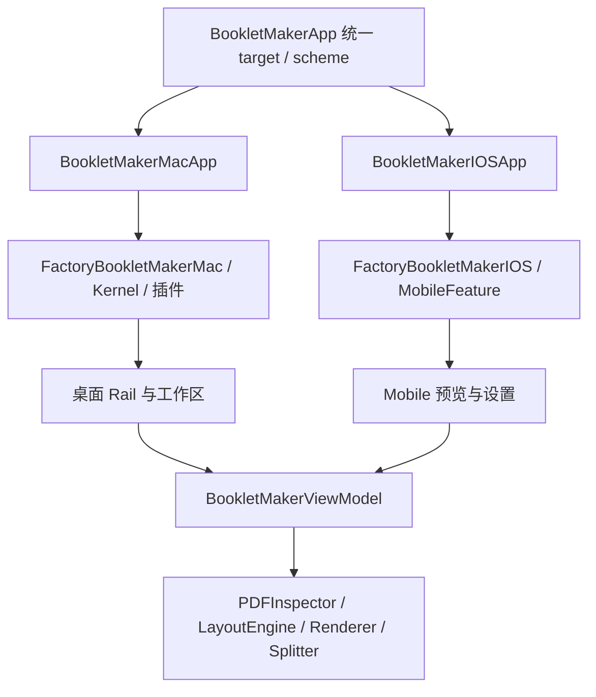
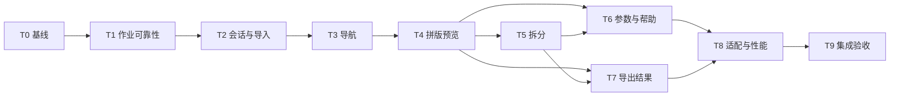

# BookletMaker iOS 功能梳理与重构实施计划

> **执行说明：** 按本文任务逐项实施，每阶段完成对应验收；本次交付仅为计划文档，尚未开始重构。

**Goal:** 保留 BookletMaker 的 PDF 拼版与拆分能力，按 iPhone、iPad 的导航、布局和操作习惯重设计 iOS 版本，形成完整、可靠的导入—编辑—预览—导出流程。

**Architecture:** 保留现有平台独立 App / Factory 入口，复用共享 PDF 模型、拼版算法、检查与导出服务。iOS 在 `Mobile` 内拥有自己的导航和页面，移动端会话管理导入、任务、结果及系统分享；必要的共享服务修复同步回归 macOS。

**Tech Stack:** SwiftUI、UIKit / PDFKit、CoreGraphics、Combine、Swift Package Manager、XCTest / Swift Testing。最低支持 iOS 17；不为此次界面重构提高最低版本。

---

## 1. 结论与范围

推荐采用 **“文档工作区 + 工具页面”**：打开 PDF 后先看到文件概览与两个清晰入口——“制作小册子”“拆分 PDF”；进入具体工具后，以预览为主体、系统表单编辑参数、底部提供主要操作。iPhone 使用 `NavigationStack`，iPad 在空间足够时使用 `NavigationSplitView`。

本次重构有两项同等重要的目标：一是补齐当前 iOS 不可达的工具切换和导出流程；二是取消窄屏上的桌面侧栏式布局，建立符合触屏使用的页面层级。

### 1.1 调研依据与限制

- 调研日期：2026-09-07；代码基线：`9eec3a36c`。调研开始时工作区干净。
- 已检查 App 入口、两个 Factory、BookletMaker 插件的 Mobile / Views / Models / Services / ViewModel、相关测试、构建配置和旧版多平台计划。
- **当前能力与问题依据源码及调用路径确认；没有启动应用进行模拟器或真机体验，也没有在本次规划中运行构建或测试。** 布局溢出、分享崩溃、性能等运行表现用“风险 / 待验证”表述，不作为已复现结论。
- 已查阅 Apple HIG 与开发文档。本文的页面组合、尺寸阈值和性能目标是针对产品的设计决策，不是 Apple 强制要求。
- 用户尚未指定视觉品牌、使用频率和主要设备；默认以 iPhone 单手完成一次 PDF 处理为优先，同时完整支持 iPad 和中英文。

### 1.2 必须交付

1. 当前功能盘点及每项功能在新 iOS 中的去向。
2. 可独立使用的拼版、拆分、参数编辑、预览、导出与再次分享流程。
3. 文件导入、错误恢复、取消、键盘、大字体、iPad 窗口变化等完整状态。
4. iOS 原生组件与语义颜色；共享算法和 macOS 现有能力保持兼容。

### 1.3 本轮不纳入

不增加账户、云同步、最近文件库、项目持久化、OCR、扫描、PDF 合并/删页/重排、密码解锁、右向左装订、批处理、付费体系或自定义纸张。直接打印 / AirPrint、自定义预设、Share Extension、“从其他应用用 BookletMaker 打开”单列后续版本；本轮通过系统文件选择器导入、系统导出/分享交付文件。

这些均是新功能，不应因为“对齐 macOS”或“遵循 iOS 最佳实践”而自动变成重构前置条件。

## 2. 现有功能与平台差异

### 2.1 当前结构



入口已按平台拆分，**无需重新拆 target，也不需要重做整个 Lumi 插件架构**。iOS 的 Factory 当前只负责创建 `BookletMakerMobileFeature`；导航与文件选择由 App 实际持有，MobileFeature 的部分注释与实际归属不一致，实施时同步校正。

### 2.2 功能矩阵

“未接入”表示已有实现但当前 iOS App 没有可达入口；“新增”表示本计划提出的能力。

| 功能 | macOS 当前实现 | iOS 当前可用性 | 新 iOS 去向 |
|---|---|---|---|
| 内置示例 PDF | 默认载入；可预览、导出 | 默认显示示例；未展示导出按钮 | 欢迎页主动选择“使用示例 PDF”，工作区持续显示“示例” |
| 导入一个 PDF | 点击选择、文件拖放 | 顶栏系统文件选择器 | 欢迎页“打开 PDF”；文档菜单“更换 PDF” |
| 当前文件名、页数 | 侧栏及标题 | 文件名在导航栏；页数在部分内容中 | 文档概览统一展示，长名称可查看完整信息 |
| 清除当前文件 | 回到内置示例 | 有 façade 方法，未接入 | “关闭当前 PDF”回欢迎页；不删除原文件 |
| 工具切换 | 侧栏“拆分 PDF / 小册子” | 有 selectedTool，App 未提供切换入口，默认 booklet | 文档概览两个工具入口；返回后切换 |
| 纸张 | A4 / A5 / Letter | 拼版设置可调 | 系统 Form 的 Picker；保留全部选项 |
| 排列方式 | 书册折叠 / 顺序两页并排 | 设置可调 | 拼版参数页；每个选项有用途说明 |
| 边距、页间距 | 各 0–30 mm，步长 1 | 设置可调 | Slider + 精确步进，显示单位，保留范围 |
| 空白页 | 折叠模式强制补齐到 4 的倍数；并排可选补偶数 | 同规则，折叠时禁用开关 | 折叠模式用只读说明；并排模式保留开关 |
| 裁切标记 | 可开关，默认开 | 设置可调 | 参数页“打印辅助”分组 |
| 原始 PDF 预览 | 原稿页面列表 | 纵向页列表 | 系统 PDF 阅读视图，支持缩放、定位页码 |
| 转换后总体布局 | 打印面列表 | 未提供独立总体列表 | “打印布局”中的纸张缩略图列表 |
| 装订前正反面 | 按物理纸张选择并查看正反面 | 复用桌面 SheetPreviewView | 打印布局详情：每张纸的正反面连续阅读 |
| 装订后模拟 | FlipBookView 点击/拖动翻页 | 未接入 | 拼版页“装订效果”二级入口；减少动态效果时静态翻页 |
| 拆分点文本输入 | 逗号、中文逗号、空白分隔；校验范围 | Mobile 设置代码已有；工具当前不可达 | 拆分页直接显示“批量输入页码” |
| 可视化添加拆分点 | 页间选择 | 横向缩略图带与页间按钮已有；未接入 | 纵向页列表，每页下方明确“在第 N 页后拆分” |
| 拆分结果及命名 | 显示页范围；逐份命名 | 结果卡与命名代码已有；未接入 | 拆分页摘要及结果列表；点一行进入重命名 |
| 命名校验 | 空名、重复名、`/`、`:` 拒绝 | 共享校验已有 | 行内说明，定位到错误项，禁用生成 |
| 拼版导出 | 保存面板选择 PDF 路径 | façade 可生成临时 PDF 并分享；无按钮 | “生成 PDF”→结果页→“保存到文件”/“分享” |
| 拆分导出 | 选择文件夹，保存多个 PDF | façade 分享临时目录；无按钮 | “生成 N 个 PDF”→结果页；分享实际文件 URL 数组 |
| 进度、取消、失败 | 共享状态；侧栏组件展示 | 状态/方法已有，主界面未接入 | 页面内进度与取消；失败可重试，保留编辑状态 |
| 导出后预览 | 最多生成 5 张缩略图；主区布局示意独立计算 | 没有独立结果页 | 结果页预览本次实际生成文件；缩略图按需 |
| 手册 / 关于 | 插件注册至文档/设置系统 | 无入口 | 欢迎页/文档菜单“帮助与关于”，重写手机操作说明 |
| 主题等宿主设置 | macOS 装配 ThemePack 等插件 | 未装配桌面设置体系 | 跟随系统外观，保留品牌强调色；不移植宿主插件设置 |
| 中英文 | 插件字符串目录 | 插件可本地化；App 标题/按钮有直接字符串 | 新移动文案统一资源，保留主 bundle 语言声明 |

补充边界：输入不限于 A4，检查器读取 PDF 页数及 CropBox，渲染器按单页比例适配；旧文案“Supports A4 PDF files”不能作为实际能力限制。当前拒绝加密 PDF，不能宣传密码解锁。当前只有左向右阅读，不能因为模型有 ReadingOrder 就声称支持双向装订。

### 2.3 优先解决的问题

| 优先级 | 证据与判断 | 对用户的影响 | 对应任务 |
|---|---|---|---|
| P0 | iOS App 只调用内容/设置/导入，没有 export、selectedTool 的操作连接 | 无法完成导出；拆分不可达 | T3、T7 |
| P0 | importer 忽略失败；主内容未显示通用 errorMessage | 错误没有明确反馈 | T2、T3 |
| P0 | mobile isWorking 只看 isRendering，共享 isBusy 还包括 isPreparingPreview | 任务状态定义不一致 | T1、T7 |
| P0 | renderer 用非 throwing 进度流；VM 以文件存在判断成功；部分异步任务无作业版本隔离 | 取消/换文档后旧结果回写风险；需定向测试 | T1 |
| P0 | splitter 用 detached task；外层 cancel 没有显式向 detached worker 传播 | 取消后继续写文件风险；尚未运行复现 | T1 |
| P0 | SharePresenter 全局找前台窗口且未配置 iPad popover 锚点 | 分享呈现位置/稳定性风险；尚未运行复现 | T7 |
| P1 | SheetPreviewView 左右分栏，纸张列表为非滚动 VStack | 手机预览空间小，长文档纸张入口可能超出可视区 | T4 |
| P1 | 拆分横向长条 + 纵向结果卡 + 设置中输入 | 大 PDF 定位成本高，键盘编辑与浏览割裂 | T5 |
| P1 | App 与 VM 都管理 security scope；失败导入前已清理结果/命名 | 生命周期职责分散；失败替换会丢失部分旧工作状态 | T2 |
| P1 | 预览示意统一取首个源页面比例且有最小边距，不等于真实导出 | 混合尺寸/0 mm/裁切标记可能与最终文件视觉不同 | T4、T7 |
| P1 | 渲染器将完整输出存入 NSMutableData；单页 UIView 同步绘制 PDF | 大扫描件的内存和主线程耗时风险 | T8 |

## 3. 信息架构选择

| 方案 | 适合情况 | 取舍 |
|---|---|---|
| **A. 文档概览 → 工具页面（推荐）** | 围绕同一 PDF 完成一种处理，偶尔切换工具 | 状态归属清楚；iPhone 层级导航自然；iPad 可展开。切换工具多一次返回 |
| B. 两个固定 Tab：小册子 / 拆分 | 用户持续高频切换两个长期功能区域 | 切换快，但需解释跨 Tab 共用文档；底部再放导出操作会占据更多高度 |
| C. 单页工具选择 + 常驻参数和预览 | 大屏熟练用户 | 接近桌面效率，但手机控制密度高，拆分与拼版参数难共用布局 |

按 A 实施。不要为了“像 iOS”硬加“首页 / 工具 / 设置”三 Tab。Tab 适合顶层功能区域，导入、生成、分享属于动作，不放入 Tab；这一职责区分参考 [Apple 导航设计说明](https://developer.apple.com/tutorials/develop-in-swift/organize-your-features)。

### 3.1 目标页面树

```text
欢迎页
├─ 打开 PDF → 系统文件选择器 → 文档概览
├─ 使用示例 PDF → 文档概览（示例标签）
└─ 帮助与关于

文档概览
├─ 制作小册子
│  ├─ 原稿 / 打印布局（二选一视图模式）
│  ├─ 纸张列表 → 单张纸的正反面详情
│  ├─ 拼版参数（sheet）
│  ├─ 装订效果（二级页面，仅折叠模式）
│  └─ 生成 PDF → 导出结果 → 实际 PDF 预览 / 保存 / 分享
├─ 拆分 PDF
│  ├─ 页面列表 + 页后拆分按钮 + 页码定位
│  ├─ 批量输入页码（sheet）
│  ├─ 输出结果列表 → 文件重命名（sheet）
│  └─ 生成 N 个 PDF → 导出结果 → 单份预览 / 保存 / 分享
└─ 文档菜单：文件信息 / 更换 PDF / 关闭当前 PDF / 帮助与关于
```

### 3.2 导航与状态保留规则

- 欢迎页没有伪造的“最近文件”；打开示例是主动操作。底层 VM 可继续初始化示例，移动会话用欢迎态控制可见入口，保留 macOS 启动行为。
- 文档概览是已打开文件的根页面。进入工具用 push，支持系统返回和边缘返回手势；返回概览不清空参数或拆分点。
- 同一 PDF 的拼版设置和拆分草稿独立保留；从一个工具返回再进入另一个工具时，不复制或重复创建 VM。
- 更换 PDF 成功后，保留纸张/间距等拼版偏好，清空拆分点、命名、旧结果，页码重置。选择器取消或新 PDF 检查失败，**旧文档及全部编辑状态保持不变**。
- “关闭当前 PDF”清理当前会话并回欢迎页；有未保存结果或已修改的工作参数时，显示有具体损失说明的确认。不要在普通返回、切工具、查看帮助时打断。
- 本轮不承诺重启恢复。进后台不立即清空会话；系统终止后回欢迎页。结果页注明文件仍需保存到“文件”，不能称为已永久保存。
- 生成中可以浏览当前预览和返回概览；同一会话禁止更换/关闭文件及修改参数、开始另一任务，提供“取消生成”恢复编辑。取消返回完成后再允许新任务。
- 一个 scene 对应一个移动会话，App 根对象在 WindowGroup 的根 View 中创建；不通过全局当前窗口分发结果。即使暂未开放多窗口 UI，也不共享全局可变会话。

## 4. 页面与交互规格

### 4.1 欢迎页与文档概览

欢迎页用 `ContentUnavailableView` 或原生 VStack：简洁 PDF 图形、标题“将 PDF 制作成小册子或拆分成多个文件”，主要按钮“打开 PDF”，次要按钮“使用示例 PDF”。避免进入应用就弹出文件选择器。帮助入口放在导航栏菜单。

文档概览使用 `List` / 分组 Section：文件名、页数、第一页面缩略图；“制作小册子”“拆分 PDF”两行带图标、用途说明和 disclosure。文件为 1 页时，拆分入口仍能解释“至少需要 2 页”，不跳到空白工具页。菜单里提供完整文件名、页数、首个页面尺寸等实际可取得信息，不用输出纸张冒充输入尺寸。

```text
┌────────────────────────────┐
│ 文档                     ⋯ │
│ 手册.pdf                    │
│ 24 页                       │
│                            │
│ 📖 制作小册子             › │
│    调整页序，供折叠装订      │
│ ✂ 拆分 PDF                › │
│    按页码分成多个文件        │
└────────────────────────────┘
```

### 4.2 拼版工作区

导航栏：系统返回、短标题“小册子”、尾部“拼版参数”图标（无障碍名称完整）。文件名与摘要在内容顶部，避免导航栏堆入工具、文件名和多个操作。

内容顺序：文件摘要 → 原生 segmented Picker“打印布局 / 原稿”→ 预览。底部 `safeAreaInset(edge: .bottom)` 放一行摘要和醒目的“生成 PDF”按钮；内容可以滚到按钮上方，不覆盖 Home 指示器。

```text
┌────────────────────────────┐
│ ‹ 文档    小册子     参数   │
│ 手册.pdf · 24 页            │
│ [ 打印布局  |  原稿 ]       │
│                            │
│ 第 1 张 / 共 6 张        ▦  │
│ 正面：24、1                 │
│ ┌─────────┬─────────┐      │
│ │ 第 24 页 │ 第 1 页  │      │
│ └─────────┴─────────┘      │
│ 背面：2、23                 │
│ ┌─────────┬─────────┐      │
│ │ 第 2 页  │ 第 23 页 │      │
│ └─────────┴─────────┘      │
│ 查看装订效果             › │
├────────────────────────────┤
│ A4 · 6 张纸 · 12 个打印面   │
│         生成 PDF            │
└────────────────────────────┘
```

- 默认打印布局，直接展示处理效果。每张纸正反面上下排，纵向滚动；纸张选择器/缩略图总览用于跳转，不在窄屏放常驻左侧列表。
- 所有纸张均可访问；25 张及以上也不能溢出或只展示前几张。列表懒加载；详情只呈现当前及邻近纸张，不一次创建全部高分辨率页视图。
- 小屏或超大字号下，正反面自然超出一屏并滚动，不强制挤到屏内。标签使用“正面 / 背面 / 空白页”，不能显示“第 0 页”。
- 原稿使用 `PDFView` 的连续阅读与捏合缩放；提供“第 N / M 页”和页码定位。不要让父 ScrollView 与 PDFView 同方向嵌套滚动。
- 拼版示意和最终输出区分：“打印布局”是实时示意；生成后的结果预览必须读取输出 PDF。示意不得宣传为像素级一致，裁切标记等差异需在实现中消除或明确标识。
- 顺序两页并排模式显示“输出页”，遵循当前每个输出面视为一张单面纸的逻辑；隐藏“背面”“装订效果”和双面书册说明。

### 4.3 拼版参数 sheet

使用带导航栏的原生 `Form`，默认 large detent，确保小屏和大字号可完整滚动。采用草稿：打开时复制已提交设置，“取消”丢弃，“完成”整体应用；向下关闭等同取消。修改草稿只更新 sheet 内的小型摘要，不在后台写入正式设置。局部任务使用 sheet、明确完成与取消、避免叠加多个 sheet，依据 [Apple Sheets 指南](https://developer.apple.com/design/human-interface-guidelines/sheets?changes=_1_1)。

| 分组 | 控件 / 文案 | 行为 |
|---|---|---|
| 纸张与布局 | “输出纸张”Picker：A4 / A5 / Letter | 行尾值；系统选择列表；不能压缩成过小的横向按钮 |
| 纸张与布局 | “排列方式”Picker：折叠装订 / 顺序并排 | 前者说明“重新排列页码，折叠后按顺序阅读”；后者说明“按原顺序每页放两页” |
| 页面间距 | “四周边距”“两页间距” | 0–30 mm，步长 1；Slider 下配数值及 Stepper，避免滑动难以精调 |
| 打印辅助 | 自动补白 | 折叠时只读：“将补入 N 页空白，使总页数为 4 的倍数”；并排时显示可用的补偶数开关 |
| 打印辅助 | “裁切标记”Toggle | 保留当前默认 true |
| 摘要 | 预计纸张数、打印面数、补白数 | 从共享引擎计算，不在 View 写另一套公式 |

初始默认值维持 A4、折叠装订、边距 5 mm、间距 5 mm、并排补白开启、裁切标记开启。不为了视觉重构改变用户输出结果。

### 4.4 拆分工作区

导航栏“拆分 PDF”，尾部“批量输入”；内容顶部固定简短摘要，主体是纵向懒加载的页面列表。每一行包含缩略图、页码、查看页面入口，以及独立可点选的“在第 N 页后拆分”；最后一页不提供拆分按钮。

```text
┌────────────────────────────┐
│ ‹ 文档   拆分 PDF  批量输入 │
│ 手册.pdf · 24 页   跳至页码 │
│ [ 页面 | 输出文件（3） ]    │
│                            │
│ [缩略图] 第 8 页       查看 │
│ [✓ 在第 8 页后拆分]        │
│ ───────── 拆分点 ───────── │
│ [缩略图] 第 9 页       查看 │
│ [  在第 9 页后拆分]        │
├────────────────────────────┤
│ 2 个拆分点 → 3 个 PDF      │
│       生成 3 个 PDF         │
└────────────────────────────┘
```

- “页面 / 输出文件”是同一拆分任务的视图模式，用 segmented Picker；不占用应用级 Tab。
- 拆分点用选中图标、文字和分隔线共同表达，不能只改变蓝色。切换可轻触反馈；VoiceOver 读出“在第 N 页后拆分，已选择/未选择”。
- 页码定位输入 1…总页数，直接滚动定位，不要求用户横滑数百页。输入无效就地提示。
- 批量输入 sheet 支持既有逗号、中文逗号和空白语法；示例“8, 16”；明确是“在这些页之后拆分”。采用取消/完成草稿，无效时保留输入，不回退显示为“没有拆分点”。
- 未设置拆分点时显示“先添加至少一个拆分点”；生成按钮禁用并有原因。1 页文件显示对应解释，不显示“生成 1 个 PDF”作为拆分完成路径。
- 输出列表显示“文件名 · 第 1–8 页 · 8 页”等；点击行重命名，扩展名 `.pdf` 固定；键盘 Return 用“完成”，有取消和完成按钮，错误就地展示。
- 重命名保留现有以精确页范围为键的映射。拆分点变化后，相同页范围保持名称；新范围使用默认名。清理已失效的范围覆盖，避免后续误恢复。
- 键盘弹出时当前编辑项可见；滚动可交互式收起键盘，工具栏补“收起键盘”。编辑时不把生成按钮悬浮在输入内容上。

### 4.5 装订效果与帮助

装订效果放在拼版二级页，保持“封面—对页—封底”的阅读模拟；保留点击和滑动翻页，但同时提供可聚焦的“上一组 / 下一组”按钮与页码。尊重 Reduce Motion，切换为无 3D 动画的翻页。

现有 FlipBookView 只接收原文档，并不验证真实补白/装订几何。第一版保留为“阅读顺序示意”，明确补白详情以打印布局为准；不得标为真实装订成品。若未来要包含插入空白，另以共享引擎输出建立阅读序列。

帮助内容按移动操作重写：打开 PDF、选工具、调参数/选拆分点、生成、保存。打印说明区分纸张数和输出 PDF 页数；要求试印一张确认页序与翻转方向，不承诺应用已自动控制打印机双面设置。关于页只展示可读取的版本及产品说明，不搬入桌面插件管理界面。

### 4.6 导出结果

“生成”仅负责计算和生成文件，完成后 push 到稳定结果页，再由用户选择“保存到文件”或“分享”。不要一生成就弹出分享面板，使用户丢失成功状态和再次操作入口。

- 拼版：文件名、文件大小、输出页数、实际 PDF 预览入口。名称编辑走相同命名规则；仅更改输出文件名称，不重新渲染内容。
- 拆分：实际生成文件列表，可逐份预览/保存/分享，也可保存全部或分享全部；分享传 `[URL]`，不传目录 URL。默认全选，不引入复杂批量选择器。
- 保存使用系统文档导出器（例如 `UIDocumentPickerViewController(forExporting:asCopy:)` 封装，支持多个 URL）；分享使用 `UIActivityViewController`。目标应用能否接收多个文件由其能力决定，至少始终提供逐份入口。
- 系统分享取消是正常返回；结果仍可预览和再次分享。只有拿到实际成功回调才显示对应完成状态；不把“生成完成”“分享面板关闭”写成“已保存到文件”。
- 参数/拆分点/文件名修改后，本次生成结果标为过期，下一次生成使用新快照。旧文件仅在无预览/分享占用后清理；不得覆盖仍被外部控制器使用的同一路径。

## 5. iPhone / iPad 适配与设计约定

### 5.1 自适应布局

| 环境 | 布局 |
|---|---|
| iPhone 竖屏/横屏 | 一列 NavigationStack；横屏增加预览宽度，不自动复刻侧栏 |
| iPad 窄窗口、分屏或辅助功能超大字体 | 与 iPhone 相同的一列流程 |
| iPad 足够宽的窗口 | NavigationSplitView：主栏文档/工具与当前列表，详情栏当前工具预览；参数仍为 sheet |
| iPad 参数或重命名 | 受系统约束的表单 sheet，控制合理宽度；不把表单拉满整块屏幕 |

双栏初始条件建议为 regular size class 且可用宽度约 820 pt 以上，主栏约 280–340 pt，详情至少约 440 pt；这是待视觉验证的产品阈值。超过辅助功能字号时优先折叠。不能仅按设备型号或横竖屏判断。窗口缩窄再展开时，当前工具、页码、拆分点和导航目的地保持一致。

紧凑 iPhone 避免侧栏的方向参考 [Apple Sidebars 指南](https://developer.apple.com/design/human-interface-guidelines/sidebars?changes=_8)；iPad 需响应窗口尺寸变化参考 [Building a desktop-class iPad app](https://developer.apple.com/documentation/uikit/building-a-desktop-class-ipad-app?changes=_5_4&language=objc)。本文不因后者而采用 Mac Catalyst，项目仍为原生双平台 target。

### 5.2 组件、字色与尺寸

| 项目 | 实施约定 |
|---|---|
| 导航 | NavigationStack / NavigationSplitView、系统返回按钮和 toolbar；禁止自画统一高度顶栏 |
| 列表/设置 | List / Section / Form / Picker / Toggle / Slider / Stepper / TextField |
| 字体 | 系统 `.largeTitle` / `.title2` / `.headline` / `.body` / `.subheadline` / `.footnote`；数字计数可 monospacedDigit；不固定正文像素 |
| 字体方案 | 中英均用系统字体回退；本轮不引入品牌字体或字体组合，优先 Dynamic Type 完整性 |
| 颜色 | systemBackground / secondarySystemGroupedBackground / primary / secondary / separator + accentColor |
| PDF 纸面 | 始终白色；深色模式改变外层画布，不能把真实纸页反色 |
| 间距 | 自定义内容采用 4 / 8 / 12 / 16 / 24 / 32 pt；优先系统列表边距，避免叠加第二层 padding |
| 圆角/阴影 | 文件缩略图可 4–8 pt，少量自定义摘要 12 pt；系统表单和按钮跟随系统；不做多层阴影卡片 |
| 触控 | 产品标准：交互热区至少 44×44 pt；主要生成按钮基准高度约 50 pt且随字号增长 |
| 图标 | SF Symbols + 文字/无障碍名称；仅图标不能承担首次使用说明 |
| 反馈 | 生成进度、取消状态、行内校验、成功结果；无任务反馈的装饰动画不增加 |

无障碍验收覆盖 Dynamic Type、VoiceOver、非颜色状态表达和对比度，参考 [Apple Accessibility](https://developer.apple.com/design/human-interface-guidelines/accessibility)。普通文本对比度以至少 4.5:1、大文本和关键控件辨识以至少 3:1 为本项目验收目标；系统默认色之外的品牌色必须实测。

系统外观由 SDK/系统自动适配。iOS 17 使用可用的标准 API；更新系统上的玻璃效果等采用系统控件自然呈现，不手写仿制效果，也不直接调用更高版本 API 而漏掉 availability 检查。

### 5.3 键盘、焦点与辅助功能

外接键盘用 Tab 遍历工具、字段、按钮，Return 执行动作，Escape 关闭临时编辑；iPad 支持 ⌘O 打开文件，生成可用时提供 ⌘⇧E。错误提交后焦点停留在无效字段；结果生成后 VoiceOver 播报完成并定位结果标题。纸张详情读出“第 1 张，正面，左页 24，右页 1”。PDF 本身的可访问性取决于源文档，应用至少保证导航、页码与操作可访问，不能承诺给扫描件自动添加可读文本。

## 6. 状态、文件与任务设计

### 6.1 状态表

| 状态 | 页面表现 | 允许操作 / 转移 |
|---|---|---|
| welcome | 欢迎内容与打开/示例入口 | 选择文件、查看帮助 |
| importing | “正在读取 PDF…”；有旧文件时仍保留其内容 | 取消此次导入；成功后原子替换，失败回到原状态 |
| ready | 预览与工具操作 | 编辑、生成、切工具、关闭/更换文档 |
| invalidDraft | 当前字段错误及解释 | 修正、取消编辑；不生成、不默默使用空拆分点 |
| generating | 明确进度或无法估计时的等待状态 | 查看当前预览、取消；禁止第二个生成作业与输入变更 |
| cancelling | “正在取消…” | 等待后台 worker 结束与清理；不要立即伪装为空闲 |
| resultReady | 本次实际生成文件、预览/保存/分享入口 | 保存、分享、返回编辑 |
| presentingSystemUI | 系统选择器/导出器/分享 | 系统交互；关闭后回原页面，不丢失结果 |
| failed | 与失败动作有关的可理解原因 | 重试、重新选择文件、返回编辑；取消单独处理 |

`failed` 不需要重建所有页面，应作为当前工作流上的错误结果；一个可选 `presentation` 枚举统一管理 sheet 类型，避免多个 Bool 同时为 true。路由与文档状态分开，弹出参数页不应改变 selectedTool。

### 6.2 目标责任边界

| 层 | 职责 | 不放入的职责 |
|---|---|---|
| BookletMakerIOSApp | WindowGroup、每 scene 根 View 组装 | 参数表单、查找全局 VC、PDF IO |
| FactoryBookletMakerIOS | 创建 mobile feature，提供组装入口 | 持有另一份业务状态或复制算法 |
| BookletMakerMobileFeature | 现有窄接口，拥有共享 VM 与移动会话，提供根内容 | 直接 present UIKit 控制器 |
| MobileWorkspaceState | 欢迎/导入/作业/结果状态、路由、sheet、工具阅读位置 | 拼版页序公式 |
| BookletMakerViewModel | 文档/已提交参数/拆分计划的唯一业务来源，协调共享服务 | 系统导航和分享生命周期 |
| PDFInspector / LayoutEngine / Renderer / Splitter | 检查、映射、渲染、拆分；明确返回成功/失败/取消 | 获取当前窗口、用户提示 |
| Mobile 系统桥接视图 | 原稿 PDFView、保存选择器、分享控制器 | 自行创建新 VM 或全局单例会话 |

这次优先局部重构：不拆新的 Swift Package，不全量改用 Observation，不引入通用 Router/Redux/依赖注入框架。现有 Combine observer 继续可用，但新增移动状态变化也必须被根 View 正确观察；删除 selectedTool 中多余通知前先验证刷新行为。

移动端系统控件尽量直接使用 SwiftUI。保留 LumiUI 包依赖给桌面和公共纸面组件，不为 iOS 重构修改外部 LumiUI 仓库；Mobile 中的 AppSegmentedControl、AppSettingRow、AppInputField 逐项替换为原生组件。

### 6.3 作业协议：生成与取消必须可靠

建议新增共享 `PDFExportJob` / `PDFExportResult` 值类型，包含作业 ID、文档 ID、设置/拆分输出快照、输出目录和实际结果 URL。服务以 `async throws -> ResultValue` 返回结果，进度使用 callback 或 throwing stream；成功只能来自明确返回，不能由“某个路径存在”推断。

1. 一次导入/生成一个 requestID；只有仍匹配当前活动 ID 的请求可更新文档、进度、错误或结果。
2. 生成开始时捕获不可变文档与参数快照；UI 不能在中途修改任务含义。
3. 外层取消通过 cancellation handler 显式传到 detached worker；拆分在页面复制循环和落盘前检查取消，渲染在每个打印面及写入前检查取消。
4. 取消后进入 cancelling，等待 worker 结束再开放新作业。旧任务不准把新任务的 isBusy 重置为 false，也不准触发分享。
5. 取消不显示“导出失败”，不进入结果页；部分输出在本作业目录中清理。磁盘写入失败返回具体错误给用户，不仅写日志。
6. 导出完成与缩略图准备分开。有效 PDF 一旦完整生成即显示结果，缩略图可以后到；缩略图失败不能把成功导出改判为失败。
7. 共享服务签名变化必须同时调整 VM 和 macOS 调用路径；保留原有保存位置和覆盖交互。macOS 拆分现有“拒绝覆盖”语义不变。

### 6.4 文件生命周期

移动端新增 `MobileDocumentStore`，统一拥有输入副本与临时结果目录。导入流程为：系统选取 URL → 申请 security scope → 协调读取/复制到本次会话唯一目录 → 检查副本 → 成功后提交 currentDocument → 释放外部 URL scope。失败/取消删除候选副本，保留旧会话。系统 URL 的 security scope 生命周期要求参考 [Apple fileImporter 文档](https://developer.apple.com/documentation/swiftui/view/fileimporter(ispresented:allowedcontenttypes:allowsmultipleselection:oncompletion:))。

- 输入复制在后台执行；iCloud / File Provider 文件读取需处理下载中、不可用、读取失败，必要时使用 NSFileCoordinator。不是只检查 `fileExists` 后立即判定远端文件不存在。
- 关闭选择器视为取消，不弹错误；失败提示“无法读取此 PDF，请确认文件已下载或重新选择”，能识别具体原因时使用对应说明。
- 本地会话目录建议位于 Caches 下且按 UUID 隔离；输出路径按 job UUID 隔离，保留用户文件名作为最终 basename。原文件始终只读。
- 清理时机：关闭文档、旧结果失效且无人占用、下次启动清理过期会话。不得删除正在预览/保存/分享的 URL，释放引用后延迟清理。
- 长任务在进后台时申请有限系统后台时间以完成或安全取消；到期取消并保留原稿与编辑草稿，不承诺无限后台生成。回前台如任务已终止显示“生成已中断，可重试”。无需引入计划性后台任务或额外后台模式。
- 存储不足、复制失败、文件被系统清理均有明确恢复入口；不要静默 `try?` 后进入成功流程。

### 6.5 预览与性能边界

源文档详情使用 PDFKit；缩略图列表通过有上限的缓存和后台任务按可见页生成，缓存键含文档 ID、页码、像素尺寸，避免同名文件串图。拼版缩略图键再包含设置版本。视图退出或设置快速变化时取消过时预览任务。

目前输出全部积累到 NSMutableData，大扫描件可能出现峰值内存。T8 先测量；若超过本轮验收目标，将渲染输出改为写本作业临时文件的流式 CGDataConsumer，完成后原子发布。共享算法不因此改变。若 PDFKit 拆分的大段 dataRepresentation 仍带来高峰值，记录上限并给出可恢复错误，不能靠静默退出或未经测量的页数限制解决。

## 7. 文件级实施任务

以下路径以当前仓库真实结构为基准；标注“新建”的文件尚不存在。任务可独立提交，按依赖顺序实施。每个任务先核对相关现有行为，再实现，再运行指定验证；UI 外观调整以场景验收为主，新增自动化测试集中覆盖数据正确性、状态竞争和主流程。

### T0. 建立可复现的基线

**文件：**

- 阅读：[iOS 入口](/Users/colorfy/Code/CofficLab/Lumi/BookletMakerApp/BookletMakerIOSApp.swift)、[macOS 入口](/Users/colorfy/Code/CofficLab/Lumi/BookletMakerApp/BookletMakerMacApp.swift)、[配置](/Users/colorfy/Code/CofficLab/Lumi/BookletMakerApp/BookletMaker.xcconfig)。
- 新建实施记录：`/Users/colorfy/Code/CofficLab/Lumi/docs/plans/2026-09-07-booklet-maker-ios-redesign-validation.md`。

**步骤：**

1. 记录当前 Xcode、SDK、模拟器、scheme 与实际构建结果；运行现有包测试。
2. 启动 iPhone、iPad、macOS 各一次，截取示例、导入文件、参数与桌面拆分页面；确认第 2.3 节源码风险是否可复现。
3. 准备 1/4/5/8/24 页、100 页文字、300 页扫描件、混合尺寸/旋转/CropBox、损坏、零页、加密 PDF，以及中文长文件名。测试文件现场生成或用经允许的非敏感样例。
4. 保存现有 8 页和 5 页拼版输出作内容/几何基线，不要求 PDF 二进制完全相同。

**验收：** 有可重复的基线、明确测试设备与失败清单；没有把旧失败误认为本轮回归。

### T1. 修复共享导出结果与取消协议（依赖 T0）

**文件：**

- 修改：`/Users/colorfy/Code/CofficLab/Lumi/Packages/PluginBookletMaker/Sources/Services/BookletRenderer.swift`
- 修改：`/Users/colorfy/Code/CofficLab/Lumi/Packages/PluginBookletMaker/Sources/Services/PDFSplitter.swift`
- 修改：`/Users/colorfy/Code/CofficLab/Lumi/Packages/PluginBookletMaker/Sources/ViewModels/BookletMakerViewModel.swift`
- 新建：`/Users/colorfy/Code/CofficLab/Lumi/Packages/PluginBookletMaker/Sources/Models/PDFExportJob.swift`
- 扩充：`/Users/colorfy/Code/CofficLab/Lumi/Packages/PluginBookletMaker/Tests/BookletMakerViewModelTests.swift`
- 扩充：`/Users/colorfy/Code/CofficLab/Lumi/Packages/PluginBookletMaker/Tests/BookletRendererIntegrationTests.swift`
- 扩充：`/Users/colorfy/Code/CofficLab/Lumi/Packages/PluginBookletMaker/Tests/PDFSplitterTests.swift`

**步骤：**

1. 添加能控制完成顺序的服务替身/测试注入点，写取消 A、开始 B、A 晚完成不得覆盖 B 的测试；先确认旧实现失败。
2. 写取消不产生成功结果、部分拆分文件被清理、写入错误原样传递的测试。
3. 按 6.3 建立明确结果与作业 ID，修复 worker 取消传播，统一忙碌状态。
4. 将缩略图准备从“导出成功”的必要条件移出；保持桌面现有缩略图可用。
5. 跑共享测试与 macOS 构建，检查已有保存/取消/拆分行为。

**验收：** 正常导出正确；取消后无成功跳转、无旧结果污染、无持续写入；macOS 通过回归。此任务是 UI 接入导出的前置条件。

### T2. 建立移动会话与可靠导入（依赖 T1）

**文件：**

- 修改：`/Users/colorfy/Code/CofficLab/Lumi/Packages/PluginBookletMaker/Sources/Mobile/BookletMakerMobileFeature.swift`
- 修改：`/Users/colorfy/Code/CofficLab/Lumi/Packages/PluginBookletMaker/Sources/Observers/BookletMakerFeatureObserver.swift`
- 修改：`/Users/colorfy/Code/CofficLab/Lumi/Packages/PluginBookletMaker/Sources/ViewModels/BookletMakerViewModel.swift`
- 新建：`/Users/colorfy/Code/CofficLab/Lumi/Packages/PluginBookletMaker/Sources/Mobile/MobileWorkspaceState.swift`
- 新建：`/Users/colorfy/Code/CofficLab/Lumi/Packages/PluginBookletMaker/Sources/Mobile/MobileDocumentStore.swift`
- 新建：`/Users/colorfy/Code/CofficLab/Lumi/Packages/PluginBookletMaker/Tests/MobileWorkspaceStateTests.swift`
- 新建：`/Users/colorfy/Code/CofficLab/Lumi/Packages/PluginBookletMaker/Tests/MobileDocumentStoreTests.swift`

**步骤：**

1. 写“失败替换保留文档、拆分命名、结果”“晚返回的旧导入不覆盖新导入”的测试；共享 VM 的已有失败测试目前只验证文档保留，不够覆盖整个草稿。
2. 实现欢迎态、导入态、工具阅读位置、单一 presentation、结果快照；业务值继续从同一个 VM 读取。
3. 实现 security scope 成对管理、后台复制/检查、成功原子提交、失败回滚和清理。
4. 保留 `clear()` 对 macOS 恢复示例的语义；移动端关闭会话另外回欢迎态。
5. 加入 scenePhase 与取消/清理策略；测试移除旧会话时不误删仍在使用的结果。

**验收：** 两种工具共用同一 PDF；导入失败不损失原工作；临时文件有明确所有者；UI 状态通知完整。

### T3. 接入新根导航、欢迎页与文档概览（依赖 T2）

**文件：**

- 修改：`/Users/colorfy/Code/CofficLab/Lumi/BookletMakerApp/BookletMakerIOSApp.swift`
- 修改：`/Users/colorfy/Code/CofficLab/Lumi/Packages/FactoryBookletMaker/Sources/FactoryBookletMakerIOS/FactoryBookletMakerIOS.swift`
- 修改：`/Users/colorfy/Code/CofficLab/Lumi/Packages/PluginBookletMaker/Sources/Mobile/BookletMakerMobileFeature.swift`
- 新建：`/Users/colorfy/Code/CofficLab/Lumi/Packages/PluginBookletMaker/Sources/Mobile/BookletMakerMobileRootView.swift`
- 新建：`/Users/colorfy/Code/CofficLab/Lumi/Packages/PluginBookletMaker/Sources/Mobile/BookletWelcomeView.swift`
- 新建：`/Users/colorfy/Code/CofficLab/Lumi/Packages/PluginBookletMaker/Sources/Mobile/PDFDocumentOverviewView.swift`

**步骤：**

1. 将 per-scene StateObject 放入根 View；App 仅做组装，所有局部页面只接收同一 feature/VM。
2. 实现欢迎页、示例打开、系统导入和行内错误；新建移动根视图时避免 App 与 Mobile 各嵌一层 NavigationStack。
3. 实现概览两个工具入口、返回、文件信息、更换和关闭；先连接旧 Mobile 内容用于验证可达性，再逐个替换。
4. 接入紧凑导航和宽屏 split 选择模型，保证折叠/展开不会复制路径或 VM。

**验收：** 新安装可主动选择示例；两种工具都可进入；返回不清空草稿；取消导入不改变当前内容。

### T4. 重做拼版预览和原稿阅读（依赖 T3）

**文件：**

- 重构：`/Users/colorfy/Code/CofficLab/Lumi/Packages/PluginBookletMaker/Sources/Mobile/BookletPreviewMobileView.swift`
- 新建：`/Users/colorfy/Code/CofficLab/Lumi/Packages/PluginBookletMaker/Sources/Mobile/PDFReaderMobileView.swift`
- 新建：`/Users/colorfy/Code/CofficLab/Lumi/Packages/PluginBookletMaker/Sources/Mobile/BookletSheetListMobileView.swift`
- 新建：`/Users/colorfy/Code/CofficLab/Lumi/Packages/PluginBookletMaker/Sources/Mobile/BookletSheetDetailMobileView.swift`
- 核对并按需提取共用单面绘制：`/Users/colorfy/Code/CofficLab/Lumi/Packages/PluginBookletMaker/Sources/Views/ExplanationDiagrams/SheetPreviewView.swift`
- 核对：`/Users/colorfy/Code/CofficLab/Lumi/Packages/PluginBookletMaker/Sources/Views/PDFDocumentPageView.swift`

**步骤：**

1. 原稿接入 PDFView，包含页码、定位、缩放；避免 UIView update 每次重建 PDFDocument。
2. 打印布局按 PhysicalSheet / OutputSheet 呈现可滚动详情和缩略图跳转，删除 Mobile 对桌面 sheetTabs 的依赖。
3. 用共享引擎产生页码、补白和数量，区分折叠与顺序并排；修正空白页标签与混合页尺寸呈现。
4. 放入 safeAreaInset 的生成操作位；在 T7 接入完成前明确不可进入假成功状态。
5. 在 5 页、100 页、小屏、大字号、横屏上检查纸张入口和标签；对比实际输出几何。

**验收：** 原稿可缩放，任意纸张可跳转；0 页标签不出现；没有不滚动的长侧栏；简单并排不显示误导的背面/装订描述。

### T5. 重做拆分浏览、输入与命名（依赖 T4）

**文件：**

- 重构：`/Users/colorfy/Code/CofficLab/Lumi/Packages/PluginBookletMaker/Sources/Mobile/PDFSplitMobileView.swift`
- 新建：`/Users/colorfy/Code/CofficLab/Lumi/Packages/PluginBookletMaker/Sources/Mobile/SplitCutPointsEditorView.swift`
- 新建：`/Users/colorfy/Code/CofficLab/Lumi/Packages/PluginBookletMaker/Sources/Mobile/SplitOutputNameEditorView.swift`
- 按需修改：`/Users/colorfy/Code/CofficLab/Lumi/Packages/PluginBookletMaker/Sources/ViewModels/BookletMakerViewModel.swift`
- 扩充：`/Users/colorfy/Code/CofficLab/Lumi/Packages/PluginBookletMaker/Tests/PDFSplitPlanTests.swift`
- 扩充：`/Users/colorfy/Code/CofficLab/Lumi/Packages/PluginBookletMaker/Tests/BookletMakerViewModelTests.swift`

**步骤：**

1. 用纵向 LazyVStack/List 重构页面浏览，页码跳转与单页预览复用 T4 阅读组件。
2. 将页后切分做成独立 Button，最后一页无按钮；补齐选中语义和 VoiceOver action。
3. 批量文本与命名 sheet 使用草稿；错误输入不覆盖有效计划，取消不提交。
4. 结果列表复用已有文件名 canonicalization 和 rangeKey；覆盖大小写重复、空名、中文标点、越界输入与范围变化测试。
5. 校验无切分点、1 页文件、超长名字和键盘遮挡的表现。

**验收：** 24 页输入 `8，16` 得到 1–8 / 9–16 / 17–24 三份；文本与点选相互同步；无效草稿不生成错误结果。

### T6. 原生参数、装订效果与帮助（依赖 T4、T5）

**文件：**

- 重构并改名：`/Users/colorfy/Code/CofficLab/Lumi/Packages/PluginBookletMaker/Sources/Mobile/BookletMakerMobileSettingsView.swift` → `/Users/colorfy/Code/CofficLab/Lumi/Packages/PluginBookletMaker/Sources/Mobile/BookletOptionsMobileView.swift`
- 新建：`/Users/colorfy/Code/CofficLab/Lumi/Packages/PluginBookletMaker/Sources/Mobile/BookletBindingPreviewMobileView.swift`
- 新建：`/Users/colorfy/Code/CofficLab/Lumi/Packages/PluginBookletMaker/Sources/Mobile/BookletHelpMobileView.swift`
- 按需修改：`/Users/colorfy/Code/CofficLab/Lumi/Packages/PluginBookletMaker/Sources/Views/ExplanationDiagrams/FlipBookView.swift`
- 更新引用：`/Users/colorfy/Code/CofficLab/Lumi/Packages/PluginBookletMaker/Sources/Mobile/BookletMakerMobileFeature.swift`

**步骤：**

1. 将混合工具“Settings”拆成专属拼版参数 Form；拆分输入已经由 T5 承接。
2. 添加取消/完成草稿提交、Stepper、补白只读说明和动态摘要，保留默认值及范围。
3. 提取可复用翻页状态/按钮能力，Mobile 加入阅读顺序示意页；不复制整份 FlipBookView。
4. 加入 Reduce Motion 和无障碍上一组/下一组，回归 macOS 翻页行为。
5. 移动帮助和关于接入菜单，移除“点击左侧拖放”等桌面措辞。

**验收：** 取消参数编辑不生效；完成后预览与数量一致更新；装订示意有可见按钮且大字体可用；所有现有参数都有去向。

### T7. 完整结果页、保存与分享（依赖 T1、T2、T4、T5）

**文件：**

- 修改：`/Users/colorfy/Code/CofficLab/Lumi/Packages/PluginBookletMaker/Sources/Mobile/BookletMakerMobileFeature.swift`
- 修改：`/Users/colorfy/Code/CofficLab/Lumi/Packages/PluginBookletMaker/Sources/Mobile/MobileWorkspaceState.swift`
- 新建：`/Users/colorfy/Code/CofficLab/Lumi/Packages/PluginBookletMaker/Sources/Mobile/PDFExportResultMobileView.swift`
- 新建：`/Users/colorfy/Code/CofficLab/Lumi/Packages/PluginBookletMaker/Sources/Mobile/PDFShareSheet.swift`
- 新建：`/Users/colorfy/Code/CofficLab/Lumi/Packages/PluginBookletMaker/Sources/Mobile/PDFSavePicker.swift`
- 清理遗留调用：`/Users/colorfy/Code/CofficLab/Lumi/Packages/PluginBookletMaker/Sources/Services/SharePresenter.swift`
- 核对平台分支：`/Users/colorfy/Code/CofficLab/Lumi/Packages/PluginBookletMaker/Sources/BookletMakerPlugin.swift`

**步骤：**

1. 接入底部“生成”按钮与进度/取消；结果只由当前作业成功返回产生。
2. 成功后导航结果页，使用真实文件预览；不自动弹分享。
3. 保存桥接支持单个/多个 URL 的复制导出；分享桥接支持实际 PDF 数组，由当前 scene 的 View 生命周期呈现。
4. iPad 配置合法的 popover sourceView/sourceRect 或 barButtonItem；窗口旋转和缩放后仍有有效锚点。不能依靠全局查找 key window。
5. 处理成功、取消、失败回调，维持临时文件引用到系统操作结束；编辑参数后旧结果失效。
6. 检索所有 SharePresenter 调用：移动独立 App 完全迁走；插件的 iOS 分支若仍保留，使用受控的当前宿主呈现契约。只有确认全部调用迁移后才能删除旧 helper，macOS 保存面板分支不改成移动流程。

**验收：** 两种生成流程可闭环；分享关闭后可再次分享；iPad 不缺锚点；“保存全部”交付多份 PDF 而非目录；失败/取消从不显示假成功。

### T8. iPad、性能、本地化和无障碍收尾（依赖 T3–T7）

**文件：**

- 调整：`/Users/colorfy/Code/CofficLab/Lumi/Packages/PluginBookletMaker/Sources/Mobile/BookletMakerMobileRootView.swift` 及以上具体 Mobile 页面。
- 修改：`/Users/colorfy/Code/CofficLab/Lumi/Packages/PluginBookletMaker/Resources/Localizable.xcstrings`
- 核对：`/Users/colorfy/Code/CofficLab/Lumi/BookletMakerApp/BookletMaker-iOS-Info.plist`
- 若测量需要，新建：`/Users/colorfy/Code/CofficLab/Lumi/Packages/PluginBookletMaker/Sources/Mobile/MobilePDFThumbnailCache.swift`
- 若测量需要，修改：`/Users/colorfy/Code/CofficLab/Lumi/Packages/PluginBookletMaker/Sources/Services/BookletRenderer.swift`

**步骤：**

1. 依据实际可用宽度完善双栏、折叠与选择恢复；同一场景连续缩放窗口，不重置正在编辑的内容。
2. 将所有新文案加入插件资源；入口文案也通过模块本地化函数输出，避免落到没有对应资源的 App bundle。
3. 验证中文、英文、长文件名和复数数量；检查主 bundle 保留 en / zh-Hans，不改系统语言协商机制。
4. 跑 Dynamic Type、VoiceOver、Reduce Motion、深浅色、高对比度与外接键盘；修正触控区域与焦点。
5. 用 Instruments 记录扫描件的内存、主线程耗时和连续操作资源释放；依据 6.5 实施必要缓存/流式写入，重复受影响的算法测试。

**验收：** 达到第 8 节矩阵；没有因布局适配重置文档、任务和阅读位置；移动界面不依赖桌面行控件的固定尺寸。

### T9. 集成测试、清理与交付（依赖 T0–T8）

**文件：**

- 新建：`/Users/colorfy/Code/CofficLab/Lumi/BookletMakerUITests/BookletMakerIOSFlowTests.swift`
- 配置新增 iOS UI test target：`/Users/colorfy/Code/CofficLab/Lumi/Lumi.xcodeproj/project.pbxproj`
- 更新：`/Users/colorfy/Code/CofficLab/Lumi/Lumi.xcodeproj/xcshareddata/xcschemes/BookletMaker.xcscheme`
- 更新实施记录：`/Users/colorfy/Code/CofficLab/Lumi/docs/plans/2026-09-07-booklet-maker-ios-redesign-validation.md`

**步骤：**

1. 为 BookletMaker 添加 iOS UI 测试 target，绑定 host，实际配置 scheme 的 TestAction；当前共享 scheme 的 TestAction 为空，不能假设已有端到端测试。
2. 自动化示例→拼版→生成→结果、示例→拆分→生成→结果、取消→重试三个主流程；用稳定 accessibilityIdentifier，不依赖易变截图坐标。
3. 系统文件选择器、第三方 File Provider、分享目标和实体打印用手工验收记录，不伪装成完全自动化覆盖。
4. 移除不再引用的 mobile makeSettingsView/旧控件路径，检查可见入口矩阵，避免删除仍被 macOS 使用的共享视图。
5. 完成 iOS Simulator 与 macOS 构建、包测试和人工矩阵；记录性能数据、截图、未解决问题及真实设备版本。

**验收：** P0 全部通过，P1 的必要布局和可访问性通过；未通过项有明确影响，不能只凭截图宣布重构完成。

## 8. 验证方法与发布完成标准

### 8.1 可复用的构建和测试命令

以下是后续实施命令，**本次规划未执行**。从仓库根目录运行；环境差异先在 T0 中解决，不把依赖下载/签名错误当作产品测试结果。

```bash
cd /Users/colorfy/Code/CofficLab/Lumi
xcodebuild -list -project Lumi.xcodeproj
xcrun simctl list devices available

swift test --package-path Packages/PluginBookletMaker
swift test --package-path Packages/FactoryBookletMaker

xcodebuild -project Lumi.xcodeproj -scheme BookletMaker \
  -destination 'generic/platform=iOS Simulator' \
  -derivedDataPath /tmp/bookletmaker-ios-redesign-build \
  CODE_SIGNING_ALLOWED=NO build

xcodebuild -project Lumi.xcodeproj -scheme BookletMaker \
  -destination 'platform=macOS' \
  -derivedDataPath /tmp/bookletmaker-macos-redesign-build \
  CODE_SIGNING_ALLOWED=NO build
```

预期：包测试全部通过，两个目标显示 `BUILD SUCCEEDED`。新增测试中引用 iOS 专属类型的部分必须用 `#if os(iOS)` 隔离，不能破坏原包的 macOS 测试编译。macOS 上的 `swift test` 不覆盖这些测试；新增移动包测试需要在 Xcode 中选择包生成的测试 scheme 和 iOS Simulator 执行并记录实际 scheme 名称。UI target 按 T9 配置完毕后，再运行：

```bash
# 将 SIMULATOR_UDID 替换成上面列出的实际设备 ID。
xcodebuild -project /Users/colorfy/Code/CofficLab/Lumi/Lumi.xcodeproj \
  -scheme BookletMaker \
  -destination 'platform=iOS Simulator,id=SIMULATOR_UDID' \
  -only-testing:BookletMakerUITests \
  -resultBundlePath /tmp/bookletmaker-ios-redesign-uitests.xcresult \
  CODE_SIGNING_ALLOWED=NO test
```

该命令在新 UI test target 和 scheme 接线前不构成有效验收；每次测试使用未被占用的新 resultBundle 路径。

### 8.2 必过的数据与流程案例

| 案例 | 预期 |
|---|---|
| 8 页，折叠装订 | 2 张纸、4 个打印面；顺序为 [8,1] / [2,7] / [6,3] / [4,5] |
| 5 页，折叠装订 | 补 3 页空白；2 张纸、4 面；[空白,1] / [2,空白] / [空白,3] / [4,5] |
| 5 页，顺序并排 | 3 个输出面，最后为 [5,空白]；保持补白开关既有模型语义，不误报 2 张双面纸 |
| 24 页，切分 8、16 | 3 份，页范围 1–8、9–16、17–24；输出页数各 8 |
| 拆分输入重复/中文逗号 | 按现有规则去重排序；`8，8 16` 与 `8,16` 一致 |
| 拆分输入 0、总页数、负数、文字 | 显示具体错误；草稿保留；不能生成 |
| 名称空白、大小写重复、非法分隔符 | 指向具体输出项，修正后可生成 |
| 参数取消 / 批量输入取消 | 正式状态不变，返回后预览一致 |
| 导入 B 失败时已有 A 和命名 | A、拆分点、命名、结果全部仍在 |
| 取消 A，完成取消后启动 B | A 无成功结果、无晚回写；B 正常完成 |
| 参数变更后再次生成 | 新唯一目录和新快照；旧文件不冒充新结果 |
| 取消系统分享、取消保存 | 回到结果页，可再次预览和导出 |
| iPad 分享时旋转/改变窗口尺寸 | 呈现属于当前窗口，锚点有效，文件列表正确 |
| 磁盘不足 / 文件不可读 / 加密 PDF | 清楚错误与恢复动作，不丢失原工作，不显示成功 |
| CropBox / 混合尺寸 / 旋转页 | 原稿与导出无裁错、倒置或错误拉伸；发现既有缺陷记录并在影响新预览时修复 |

几何与内容比较检查页序、页数、CropBox、输出纸张尺寸、边距、裁切标记和矢量清晰度；不比较 PDF 时间戳等造成的不稳定字节。8 页测试样张按实际打印设备试印一张正反面，核对折叠阅读顺序。

### 8.3 UI 与设备矩阵

- iOS 17 可用的小屏模拟器（约 375 pt 宽）、现代标准/大屏 iPhone；竖屏与横屏。
- iPad 大小两类窗口，完整窗口、分屏窄窗口、可变窗口尺寸；测试从宽到窄再回宽。
- iOS 17 与测试时已安装的最新正式系统；不存在的运行时不虚报覆盖，在实施记录中列缺口。
- 默认字号、最大普通字号、最大辅助功能字号；中文/英文；浅色/深色；VoiceOver、Reduce Motion、外接键盘。
- 至少一台真实 iPhone 和一台真实 iPad 验证文件导入、内存、分享和保存；模拟器不替代所有文件提供商行为。

### 8.4 性能验收目标

这些是待 T0 建立基线后确认的工程目标，不是当前实测成绩。使用同一真实设备、同一文档记录三次范围，区分本地读取与云文件下载。

| 项目 | 初始目标 |
|---|---|
| 本地普通 100 页文字 PDF | 3 秒内出现可操作首屏；慢操作仍立即给出读取状态 |
| 点击、切换工具、选择拆分点 | 约 100 ms 内有可见反馈，不等待完整 PDF 重渲染 |
| 取消 | 立即出现 cancelling；后台在下一个可取消检查点退出，普通测试文件争取 1 秒内结束；不可中断的系统写入阶段如实显示 |
| 大扫描件 | 300 页样例可处理，无内存警告导致的退出、无长期主线程冻结；记录样例实际 MB 和峰值内存 |
| 连续操作 | 反复打开/关闭 10 次、生成/取消 10 次，临时文件和内存不随次数持续增长 |
| 预览 | 快速滚动时不每帧重新打开 PDF；不可见页不无限保留高分辨率缓存 |

若目标未达到，先定位瓶颈再缩小实现或优化。任何新增文件大小限制都必须在产品文档明示并提供可恢复错误，不能用“支持大文件”替代测量。

## 9. 依赖顺序、里程碑与风险控制



| 里程碑 | 完成内容 | 可检查结果 |
|---|---|---|
| M0 | T0–T2 | 现状记录、可靠导入、取消和结果协议 |
| M1 | T3–T6 | 两种工具的原生页面、参数、预览、示意和帮助 |
| M2 | T7 | 单 PDF 与多 PDF 的完整生成/保存/分享闭环 |
| M3 | T8–T9 | iPad、可访问性、性能、中英文与 macOS 回归通过 |

每个任务建议单独提交便于回退。iOS 根入口在开发分支逐步切换，M3 前不发布未接齐导出的界面；不为短期迁移新建永久 feature flag 系统。用户本次仅要求计划，当前没有执行这些提交或创建实施分支。

主要风险与应对：

1. **共享服务改动影响 macOS。** T1、T4 涉及服务/纸面复用时同时跑桌面测试；iOS 导航不进入 macOS 工厂。
2. **需求扩大为文档管理器。** 欢迎页与单次会话足以支撑本轮；最近记录、云同步、预设留后续。
3. **预览示意被误当真实输出。** 结果读取实际 PDF；阅读模拟明确示意属性；页序由同一引擎生成。
4. **系统分享/文件提供商差异。** 同时提供保存与逐份分享；真机验证；不依赖目录分享。
5. **性能问题延后到最后才发现。** T0 测量大文件，T1 明确取消，T4 使用懒加载，T8 完成定量复测。

## 10. 实施时可追溯的依据

### 10.1 仓库入口与证据

| 文件 | 用途 |
|---|---|
| [BookletMakerIOSApp.swift](/Users/colorfy/Code/CofficLab/Lumi/BookletMakerApp/BookletMakerIOSApp.swift:6) | 当前工具栏、导入与设置接线 |
| [BookletMakerMobileFeature.swift](/Users/colorfy/Code/CofficLab/Lumi/Packages/PluginBookletMaker/Sources/Mobile/BookletMakerMobileFeature.swift:8) | 未接入的工具切换、导出、清除与状态 |
| [BookletMakerViewModel.swift](/Users/colorfy/Code/CofficLab/Lumi/Packages/PluginBookletMaker/Sources/ViewModels/BookletMakerViewModel.swift:23) | 当前文档、导入、导出、拆分、取消与校验 |
| [BookletMakerRailView.swift](/Users/colorfy/Code/CofficLab/Lumi/Packages/PluginBookletMaker/Sources/Views/Railview/BookletMakerRailView.swift) | macOS 完整工具与参数入口 |
| [BookletExplanationView.swift](/Users/colorfy/Code/CofficLab/Lumi/Packages/PluginBookletMaker/Sources/Views/ExplanationDiagrams/BookletExplanationView.swift:12) | macOS 原稿/转换/装订前/装订后四阶段 |
| [SheetPreviewView.swift](/Users/colorfy/Code/CofficLab/Lumi/Packages/PluginBookletMaker/Sources/Views/ExplanationDiagrams/SheetPreviewView.swift:43) | iOS 当前复用的纸张侧栏与示意绘制 |
| [BookletLayoutEngine.swift](/Users/colorfy/Code/CofficLab/Lumi/Packages/PluginBookletMaker/Sources/Services/BookletLayoutEngine.swift:19) | 补白、页序、物理纸张及打印面规则 |
| [BookletRenderer.swift](/Users/colorfy/Code/CofficLab/Lumi/Packages/PluginBookletMaker/Sources/Services/BookletRenderer.swift:57) | 非 throwing 进度流、取消和内存输出 |
| [PDFSplitter.swift](/Users/colorfy/Code/CofficLab/Lumi/Packages/PluginBookletMaker/Sources/Services/PDFSplitter.swift) | 拆分、detached worker、覆盖保护 |
| [SharePresenter.swift](/Users/colorfy/Code/CofficLab/Lumi/Packages/PluginBookletMaker/Sources/Services/SharePresenter.swift:11) | 当前全局窗口分享呈现 |
| [旧多平台计划](/Users/colorfy/Code/CofficLab/Lumi/docs/plans/2026-08-13-booklet-maker-multiplatform.md) | 历史目标；Factory 名称以当前源码为准 |

### 10.2 Apple 官方参考与适用方式

- [Designing for iOS](https://developer.apple.com/design/human-interface-guidelines/designing-for-ios/)：平台输入和使用情境的设计背景。
- [Layout](https://developer.apple.com/design/human-interface-guidelines/layout?changes=lat_3__1_2)：系统边距、安全区域和动态布局；本计划采用系统容器而非固定屏幕尺寸。
- [Explore navigation design for iOS](https://developer.apple.com/videos/play/wwdc2022/10001/)：层级导航和顶层区域选择；支持本计划区分文档、工具与局部预览模式。
- [Sheets](https://developer.apple.com/design/human-interface-guidelines/sheets?changes=_1_1)：局部任务和完成/取消语义；对应参数及文本草稿编辑。
- [Accessibility](https://developer.apple.com/design/human-interface-guidelines/accessibility)：字号、可辨识性和辅助功能；对应第 5、8 节验收。

参考资料核对日期为 2026-09-07。实施时核对所用 API 的 iOS 17 可用性；系统新样式与具体 SDK 功能分开处理。
