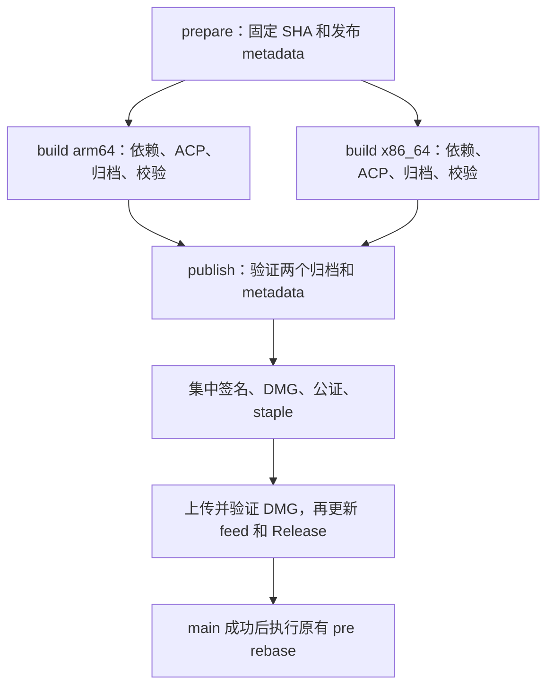

# Lumi 发布构建提速与稳定性 Implementation Plan

> **For Claude:** REQUIRED SUB-SKILL: Use superpowers:executing-plans to implement this plan task-by-task.
>
> 执行说明：上句为 writing-plans 技能的模板标记；本环境对应已安装的 `executing-plans` 技能，不依赖未安装的 superpowers 插件。本文件是执行方案，不表示已经修改或验证了线上发布流程。

**Goal:** 在保持 Apple Silicon / Intel 双架构、版本一致性、签名、公证和更新通道正确性的前提下，降低 Lumi 发布等待时间，并使失败可定位、可恢复。

**Architecture:** 先建立可测量的串行基线，修正 ACP 独立构建的架构与依赖锁定问题，再添加源码依赖缓存。最后将发布拆为一次准备、两个隔离的架构构建、一次集中签名与发布；编译产物缓存独立实验，不作为第一轮上线条件。

**Tech Stack:** GitHub Actions、macos-26 ARM64 runner、Xcode 26.3、SwiftPM、Developer ID、notarytool、Sparkle 2.9.1、现有 R2 上传服务。

---

## 1. 结论、范围与稳定性承诺的边界

推荐顺序为：**测量 → ACP 架构/依赖确定性 → 源码依赖缓存 → 双架构独立 job → 可选编译缓存**。

不能直接把现有 `for arch` 改成 matrix 后认定完成。当前归档内部还有独立 SwiftPM 构建，Intel 归档的耗时可能受前一次 ARM64 归档的缓存影响；拆分后两台机器都需要独立完成这部分工作。必须先解决正确性问题，并用同一提交的冷、热构建验证真实收益。

本方案可以规定避免已识别故障的机制和上线门槛，不能在未执行双架构构建、公证、安装和升级验证前保证“绝对无问题”。**所有必要验收项通过前，不替换稳定版生产路径。** 测试中的任何功能、架构、签名或更新回归优先于速度收益。

本次只新增本文档，不修改 workflow、工程配置或用户现有代码，不触发发布。后续实施分阶段提交，每阶段可单独回退。

第一轮明确不做：取消 Intel 支持、把 Release 改为 Debug、关闭优化或符号文件、跳过公证、升级 Xcode/Sparkle、扩大机器规格、重构业务模块、把两个完整归档后台并发放进同一个 runner。

## 2. 调研基准与证据

调研日期：2026-09-20，时间数据来自 GitHub Actions API 和日志，表中时长不依赖时区。

- 工作区 HEAD：`fbc8f83793a9162d245dc782cd807e07bcf77778`。
- 最新成功发布提交：`3e210c64819c01abe90e65b5ba13b5493730f9f4`。
- 两个提交间的 `release.yml`、`project.pbxproj`、`ACPBootstrap/Package.swift` 无差异；下述关键流程分析适用于该次成功发布。
- 工作区另有用户正在进行的编辑器修改；本文不把这些未提交变更作为已发布版本的行为证据。
- runner 日志实际标识：`macos-26-arm64`；workflow 固定 Xcode `26.3`。
- 本地 Xcode 是 `26.2 / 17C52`；本地帮助用于核对参数名称，不替代 CI 26.3 验证。
- 缓存 API `repos/CofficLab/Lumi/actions/caches` 调研时返回 `total_count: 0`。

### 2.1 最近五次运行

| 运行 | 依赖解析 | Build App (Archive) | 整次运行 | 最终结果 |
|---|---:|---:|---:|---|
| [09-20 / 35478096636](https://github.com/CofficLab/Lumi/actions/runs/35478096636) | 6:10 | 65:42 | 76:36 | 成功 |
| [09-19 / 35447301574](https://github.com/CofficLab/Lumi/actions/runs/35447301574) | 4:59 | 50:43 | 58:20 | Notary 失败，归档成功 |
| [09-18 / 35319956328](https://github.com/CofficLab/Lumi/actions/runs/35319956328) | 7:07 | 78:51 | 87:53 | Create DMG 失败，归档成功 |
| [09-18 / 35310766259](https://github.com/CofficLab/Lumi/actions/runs/35310766259) | 4:33 | 33:40 | 43:10 | 成功 |
| [09-17 / 35209753413](https://github.com/CofficLab/Lumi/actions/runs/35209753413) | 7:24 | 58:00 | 69:41 | 成功 |

五次归档都成功，时长跨度约 34–79 分钟，中位数为 58 分钟。不同提交、依赖和 runner 状态可能共同影响耗时，不能据此直接归因于 runner 性能或某个依赖。两次后处理失败说明应保存成功的归档产物，避免签名/打包/公证故障导致重新编译。

最新一次日志的架构分界：

| 事件 | UTC 时间 | 区间耗时 |
|---|---|---:|
| 开始 arm64 | 00:17:41.848 | — |
| 开始 x86_64 | 01:02:05.722 | arm64 约 44:24 |
| 归档步骤完成 | 01:23:23 | x86_64 约 21:17 |

这里的 44:24 和 21:17 是两次 `xcodebuild archive` 的外部区间，包含其依赖解析、脚本、编译、链接等，不等于纯编译 CPU 时间。09-18 较快一次的两个区间约 18:03 / 15:36，进一步说明需要受控对照。

### 2.2 已确认的流程问题

| 事实 | 代码定位 | 影响 |
|---|---|---|
| 两架构在同一 job 串行 archive | `.github/workflows/release.yml` 的 `Build App (Archive)` | 等待时间相加 |
| 无 actions/cache；解析前删除 SourcePackages | 同文件的 `Resolve SPM Dependencies` | 每次重新准备源码依赖；仅添加 cache 而保留删除操作无效 |
| 主工程有 66 个远程锁定依赖 | `Lumi.xcodeproj/project.xcworkspace/xcshareddata/swiftpm/Package.resolved` | 下载、解析和编译成本显著；缓存必须按实际依赖输入隔离 |
| 本地 Packages 下有 235 个顶层 Package.swift | 调研时文件清点 | 工程规模较大，但不代表 235 个包全部参与 Lumi archive |
| Lumi → LumiACP → Build ACP Executable | `Lumi.xcodeproj/project.pbxproj` 的目标依赖及脚本阶段 | archive 内嵌独立 SwiftPM 图，而非只有 Xcode 的 SourcePackages |
| ACP 脚本执行 `swift build ... -c release --product ACPBootstrap` | 同上 | 默认工作区为 `Packages/ACPBootstrap/.build`，没有显式目标 triple |
| ACP 锁文件未跟踪，且被忽略 | `.gitignore` 中 `Packages/*/Package.resolved` | 主工程锁文件不能单独约束 ACP 的独立解析 |
| 三个嵌入/构建脚本标记 alwaysOutOfDate | `project.pbxproj` | 每次运行；不能只取消标记而缺少完整输入/输出声明 |
| scheme 和工程已启用目标并行 | `Lumi.xcscheme`、`BuildIndependentTargetsInParallel` | 不是简单增加 `-parallelizeTargets` 就能解决 |
| Release 使用 wholemodule 和 dSYM | `LumiApp/Config/Project-Release.xcconfig` | 不应为 CI 速度牺牲发布优化与崩溃定位能力 |
| 成功归档日志只留在 runner 文件中 | `temp/archive-${arch}.log` | 没有上传日志和结果包，无法回溯最慢模块 |
| 签名阶段只用 lipo 检查主程序是否包含架构 | `Codesign App` | 不能证明 `lumi-acp`、Finder 扩展、动态库架构正确 |
| checkout 使用可移动分支名 | `actions/checkout` 的 `ref: github.ref_name` | 排队期间分支推进时，实际构建可能不是触发提交；拆 job 后更危险 |

安装 `xcpretty` 约 1 秒，后续又没有使用它；可清理，但不是主要收益来源。`FIRST_ARCH` 变量没有实际控制作用，也不是已经实现的缓存策略。

### 2.3 重要推断，不能当作已验证事实

1. **ACP 重复编译可能占据大量时间。** `FactoryLumiACP` 引用了大量本地模块，与主 App 依赖存在重叠，Xcode 和独立 SwiftPM 的编译目录不同；尚无成功运行的完整内部日志证明具体占比。
2. **Intel 包可能嵌入宿主架构的 ACP。** runner 是 ARM64，独立 `swift build` 未接收 Xcode 的目标架构参数。须直接检查归档内 `lumi-acp`，不能仅凭成功归档断言 Intel 功能完整。
3. **后一次归档可能受益于 ACP `.build` 复用。** 因此 21 分钟不能直接当作独立 Intel job 的耗时预测。修正 helper 为 Intel 后也可能增加此前没有正确发生的编译工作。
4. MLX 等依赖可能影响 ARM64 的关键路径，但现有证据不足以认定某个模块是主因，不因名字或包体大小直接删减功能。

## 3. 官方最佳实践与采用方式

以下来源于本次核对的官方资料；具体仓库设计是基于本项目的工程判断。

- [Apple：Building Faster in Xcode](https://developer.apple.com/videos/play/wwdc2018/408/)：用 timing summary 定位构建活动。采用 `-showBuildTimingSummary`，同时记录墙钟时间；并行任务的累计时间不能直接当作整体耗时。
- [Apple：Demystify parallelization in Xcode builds](https://developer.apple.com/videos/play/wwdc2022/110364/)：关注依赖图、脚本阶段和资源竞争。采用隔离 runner 的架构级并行，先测量嵌套构建，不盲目增大 `-jobs`。
- [Apple：Swift packages in CI](https://developer.apple.com/documentation/xcode/building-swift-packages-or-apps-that-use-them-in-continuous-integration-workflows)：在 CI 使用受版本控制的解析结果。主工程与 ACP 分别锁定依赖，发布不自动更新版本。
- [GitHub：矩阵任务](https://docs.github.com/en/actions/how-tos/write-workflows/choose-what-workflows-do/run-job-variations)：用 matrix 创建架构任务；聚合 job 依赖两个结果。
- [GitHub：缓存](https://docs.github.com/en/actions/reference/workflows-and-actions/dependency-caching)：缓存条目不可原地更新、访问有分支范围。缓存作为可丢失的加速数据，不存发布凭据；键包含兼容性维度，缓存 miss 必须可正确构建。
- [GitHub：Artifact Action](https://github.com/actions/upload-artifact#permission-loss)：普通压缩上传不保留原始文件权限。先将 `.xcarchive` 打包为 tar，再作为单文件传输，恢复后重新检查结构与可执行权限。
- [GitHub：并发控制](https://docs.github.com/en/actions/how-tos/write-workflows/choose-when-workflows-run/control-workflow-concurrency)：保留跨 main/pre 的全局发布互斥。默认只保留一个 pending run，`cancel-in-progress: false` 不代表每个 push 都保证排队执行；本次不改变排队策略。
- [Apple：公证工作流](https://developer.apple.com/documentation/security/customizing-the-notarization-workflow)、[Sparkle 文档](https://sparkle-project.org/documentation/)：保留签名、公证、staple 和更新签名链；先生成最终 DMG，再生成与其字节内容对应的更新元数据。

新增 Action 的实际版本在实施时核对官方 release 与 runner 要求，并固定已审查的完整提交 SHA，旁注版本。本文不提供未经解析确认的 SHA；也不为了“最新”而同时升级所有现有 Action。

## 4. 必须保持的发布不变量

1. 同一次发布只有一份 metadata：源 SHA、marketing version、build number、build floor、tag、channel、下载根路径、两个锁文件摘要和工具链标识。
2. 两架构 checkout 完全相同的提交 SHA；准备阶段的临时 xcconfig 修改通过明确的版本注入重新执行，不依赖跨 job 工作目录共享。
3. stable 和 preview 继续共用 workflow 级 `release-lumi` 锁，`cancel-in-progress: false`。不要给两个 matrix job 再套同名全局锁。
4. 全部构建、产物、签名与公证校验通过，才允许发布新 feed；任何缺失架构不能降级为“发布成功”。
5. 缓存可以随时清空。缓存恢复失败不得放宽依赖锁定、跳过校验或用旧 App 代替新构建。
6. `arm64` 与 `x86_64` 的归档/构建目录独立；SwiftPM 宿主工具与目标代码的角色要区分，不能把宿主工具架构强行改成目标架构。
7. bundle identifier、entitlements、团队、运行时安全选项、嵌入资源、DMG 外观、Sparkle key 和通道 URL 保持兼容。**新 DMG 文件名改为包含 marketing version、build number 和架构**（例如 `Lumi_6.0.0_20260920123456_arm64.dmg`），确保每个 build 的下载 URL 不可变；沿用已有 appcast 中历史 URL，不重命名或删除旧文件。
8. 架构改变后保留同版本 dSYM 并核对主程序 UUID；不能以删除符号文件来换速度。
9. 发布凭据只在集中签名/发布 job 中注入；缓存和 artifacts 使用精确路径白名单，不包含钥匙串、p12、p8、私钥或整个 HOME。
10. 发布前复查线上最高构建号。旧 run 的重跑如果已经落后于线上版本，停止，不自动修改已经构建好的包的版本号。

## 5. 目标流程与任务边界



### 5.1 prepare

- 初版仍用 `macos-26`，保持现有版本脚本的运行环境，避免同时引入 Linux/BSD 工具行为差异；任务很短，后续再评估是否迁往 Linux。
- checkout `${{ github.sha }}`，`fetch-depth: 0`，记录 `git rev-parse HEAD` 并断言相等；读取 tags、线上 feed 后只计算一次版本。
- 输出 metadata job outputs，并上传一份 JSON，字段严格验证。构建号保存为字符串，避免日期型大整数在不同语言处理时被格式化。
- `prepare` 不创建公开 tag、不写 feed、不上传公开 DMG。branch/channel 由受支持事件映射，未知 ref 立即失败。
- 全量历史只留给确实需要历史的准备/发布阶段；普通 build checkout 可以较浅，但目标 SHA 必须一致。

### 5.2 build matrix

结构约束示例（不是可直接替换整个文件的完整 workflow）：

```yaml
build:
  needs: prepare
  runs-on: macos-26
  permissions:
    contents: read
  timeout-minutes: 120
  strategy:
    fail-fast: false
    max-parallel: 2
    matrix:
      arch: [arm64, x86_64]
```

- 初版两种目标均使用现有 ARM64 runner 和 Xcode 26.3；暂不同时切换 Intel runner，避免混入工具链差异。x86_64 的执行验证另安排 Intel 机器。
- `fail-fast: false` 为诊断保留另一架构的结果；失败依然阻断发布。
- 每个 job 恢复依赖缓存、严格解析、注入同一版本、构建对应 ACP、单次 archive、验证、打包并上传归档；不能从缓存直接拿最终 App 发布。
- Xcode 路径采用 `DerivedData/${arch}`；独立 SwiftPM 采用 `build/ci-acp/${arch}`。开发者日常的 `.build` 不作为 CI 的隐式输入。
- ad-hoc 构建沿用现有 `CODE_SIGN_IDENTITY=-` 等语义。公开的 team ID 可从受控配置读取，不需要先导入 Developer ID 私钥。必须以真实 archive 证明这在所有嵌入目标上可行。
- 任一构建失败都保留日志；不能把整个 job 设为 `continue-on-error`。超时先设 120 分钟，采样后再调整，不能用“目标 45 分钟”直接作为超时值。

### 5.3 publish

- `needs: [prepare, build]`，正常依赖成功条件即可。不能用无条件 `always()` 绕过 build 失败；`always()` 仅用于必要诊断、凭据清理等步骤。
- 在新 macOS runner 上准备相同工具链，下载两个精确命名的归档，检查 manifest、SHA256、架构、版本、UUID、可执行权限和资源。
- 集中安装签名环境，复用现有签名、DMG、公证、Sparkle 脚本。初版继续串行处理两个 DMG，避免同时改变 Finder 自动化、公证和挂载行为。
- 顶层 env 不再包含所有 secrets；按步骤传递给实际使用者。完成或失败后清除临时钥匙串和 p8/p12 文件。
- `rebase.needs` 从旧 `release_pipeline` 改为 `publish`，仍仅 main 发布成功后执行，保留原有冲突处理语义。

## 6. 执行任务与阶段门槛

### Task 0：建立基线与诊断产物（不改并行方式）

**修改：** `.github/workflows/release.yml`。
**新增：** `.github/scripts/archive-lumi.sh`、`.github/scripts/collect-build-metrics.sh`。
**测试：** `.github/scripts/test-archive-lumi.sh`。

1. 把现有单架构 archive 调用提取成脚本，保留既有签名设置、Release 设置和双架构串行顺序；脚本拒绝 `arm64/x86_64` 之外的目标。
2. 为每次归档增加 `-showBuildTimingSummary` 和独立 `-resultBundlePath temp/results-${arch}.xcresult`；开始前确认目标结果路径为空。
3. 原始日志继续完整保存；错误时保留 `xcodebuild` 的真实退出码，不能被日志过滤/上传覆盖。
4. 记录开始/结束时间、归档秒数、Xcode/Swift/SDK/runner image、CPU/内存、磁盘余量、archive 大小和源码 SHA。ACP 脚本增加自身的开始/结束计时。
5. 上传日志和打包后的 result bundle；仅上传允许目录，保留 14 天。取消和 runner 失联时日志上传不保证发生，不把诊断上传当作构建成功的证据。
6. 用假的 xcodebuild 退出码测试失败传递、目录冲突、架构参数和日志生成；再做一次真实双架构基线。

**验收：** GitHub 页面上可区分依赖解析、ACP 构建、外层归档、打包传输；失败有日志；产物行为不变。失败诊断测试预期非零，不能误报通过。

### Task 1：先解决 ACP 的架构和依赖确定性

**修改：** `.gitignore`、`Lumi.xcodeproj/project.pbxproj`。
**新增：** `Packages/ACPBootstrap/Package.resolved`、`.github/scripts/build-acp-helper.sh`、`.github/scripts/verify-release-archive.sh`、`.github/scripts/verify-package-locks.py`。
**测试：** `.github/scripts/test-build-acp-helper.sh`、`.github/scripts/test-verify-release-archive.sh`、`.github/scripts/test-verify-package-locks.py`。

1. 在忽略规则后为 ACP 的锁文件增加唯一例外：`!Packages/ACPBootstrap/Package.resolved`。不要跟踪所有库包的临时 lock。
2. 使用 CI 对应 Xcode 26.3 在干净目录解析 ACP 的依赖，审查并提交 lock。主工程与 ACP lock 对交集 identity 比较 repository URL / revision；不同解析图允许有不同条目集合，但同一共享依赖版本不能无意分叉。
3. 若共享版本冲突，先解决约束并更新两个 lock，不把主工程 lock 直接复制给 ACP 当作已验证结果。两套解析都开启锁定模式，构建后比较 lock 内容摘要不能变化。
4. 把 Build ACP Executable 内联脚本迁出为可测试脚本。CI 显式传入单个目标架构、SDK、deployment target、scratch path；两个 swift 命令（实际 build 与 `--show-bin-path`）必须使用同一参数数组。
5. 为目标指定 `--triple "${arch}-apple-macosx${deployment_target}"`、`--sdk "$(xcrun --sdk macosx --show-sdk-path)"`、`--scratch-path "$scratch"`、`--force-resolved-versions`。部署目标从构建设置读取，当前为 14.0。使用选定工具链的 `xcrun swift`。
6. build 完成后必须 `lipo -verify_arch "$arch" "$helper"`；再复制 executable 和其资源 bundle。开发者 Debug、多架构本地归档的原有路径须单独回归：CI 的单架构参数不得无条件覆盖这些调用；多架构应显式逐架构构建/合并或明确失败，不静默选择宿主架构。
7. 不把 `swift build --show-bin-path` 视为第二次完整编译；对其耗时单独测量。不要仅因出现两条命令就删除路径查询。
8. 保留 alwaysOutOfDate，直至可以完整描述本地传递源码、资源和配置输入。第一轮优先保证正确，不用只声明 Package.swift 的方式跳过源文件变更。

单架构 CI 调用的参数模板：

```bash
case "$arch" in arm64|x86_64) ;; *) exit 2 ;; esac
args=(
  --package-path "$PWD/Packages/ACPBootstrap"
  -c release --product ACPBootstrap
  --scratch-path "$PWD/build/ci-acp/$arch"
  --triple "${arch}-apple-macosx${deployment_target}"
  --sdk "$(xcrun --sdk macosx --show-sdk-path)"
  --force-resolved-versions
)
xcrun swift build "${args[@]}"
bin_dir="$(xcrun swift build "${args[@]}" --show-bin-path)"
lipo -verify_arch "$arch" "$bin_dir/ACPBootstrap"
```

这是 CI 单架构路径的核心模板，实施时需补输入验证、计时和资源复制；它不是对现有多架构开发流程的完整替代。实际用 26.3 验证 cross compilation、宏/插件宿主工具和 MLX 等传递依赖。若 Intel 编译暴露不兼容，先解决或暂停并行阶段，不能把 ARM64 helper 放进 Intel 包绕过错误。

**归档校验必查：**

- `Products/Applications/Lumi.app/Contents/MacOS/Lumi`：只含预期主架构。
- `Contents/MacOS/lumi-acp`：存在、可执行、包含预期架构；本项目构建的 helper 应为单架构。
- Finder appex 的实际 `CFBundleExecutable`、`Contents/Frameworks/vec0.dylib`：包含预期架构。
- 遍历 bundle 中运行时 Mach-O 的架构，包括 framework/XPC/helper；允许第三方 universal binary，禁止缺失目标 slice。开发工具、静态数据不误当作运行时依赖。
- 主 App `CFBundleShortVersionString` / `CFBundleVersion` 与 metadata 一致；需要版本一致的自有扩展按各自配置规则验证。
- 资源 bundle、Sparkle framework、RAG 库存在；主程序与 dSYM 的 UUID 按目标架构匹配。

**验收：** 两种架构 helper 校验通过；锁文件缺失、过期或共享 revision 冲突时明确失败；真实 Intel 环境验证 ACP 初始化与一次基础交互。仅 `lipo` 通过、仅代码签名通过或仅在 ARM Mac 启动主 App 都不够。

### Task 2：引入源码依赖缓存（继续串行）

**修改：** `.github/workflows/release.yml`、`.github/scripts/archive-lumi.sh`、`.github/scripts/build-acp-helper.sh`。
**新增：** `.github/scripts/resolve-ci-packages.sh`、`.github/scripts/test-resolve-ci-packages.sh`。

采用两类独立缓存，不从第一天就缓存编译数据库：

| 缓存 | 初版允许路径 | 不包含 |
|---|---|---|
| Xcode source packages | 显式指定的 `SourcePackages` 根目录（含源码、仓库及已验证包 artifacts） | DerivedData/Build、Index、最终 App |
| ACP dependency downloads | 显式 `--cache-path` 的 SwiftPM 下载缓存目录，实测确认内容 | 整个 HOME、钥匙串、ACP Release 编译输出 |

建议键结构：`spm-src-v1-{OS}-{hostArch}-{XcodeBuild}-{SDK}-{targetArch}-{dependencyHash}`。初版保守按目标架构分开，避免二进制 artifacts 或后续目录变更带来交叉污染；验证后再评估仅纯源码层的跨架构共享。

`dependencyHash` 由以下受 Git 跟踪的输入稳定排序后计算：主工程 lock、ACP lock、`Packages/*/Package.swift`、`project.pbxproj`。不能用无限递归的 `**/Package.resolved` 把 `.build/checkouts` 内部文件算进去。缺失必要 lock 要失败，不能以空 hash 命中旧缓存。

实施步骤：

1. 删除无条件 `rm -rf DerivedData/SourcePackages`；resolve 和 archive 都传同一个 `-clonedSourcePackagesDirPath`，避免恢复到 A、实际读取 B。
2. restore 后无论 `cache-hit` 如何都执行严格解析。Xcode 使用 `-onlyUsePackageVersionsFromResolvedFile`；archive 同样禁止隐式升级。`-skipPackageUpdates` 是附加性能选项，不替代 lock 校验。
3. ACP resolve/build 都使用同一专用下载缓存目录，且其 lock 被严格约束。外层 Resolve SPM 的成功不能代表 ACP 已完成解析。
4. 初版不配置宽泛 restore-keys。只在完全兼容键下恢复；后续如放宽纯源码回退，仍必须严格解析到锁定 revision。
5. 用独立 restore/save 操作，两个解析及锁校验成功后即可保存源码缓存，不等到公证成功。不要保存半解析失败状态；非可信 PR 不拥有生产缓存写入能力。
6. 缓存服务不可用按冷路径继续；疑似缓存损坏时清空受控缓存目录，仅重新严格解析一次并保留原错误。不反复清缓存重跑整个 archive；确定性的缺锁/约束冲突直接失败。
7. 记录恢复、解析、保存各自耗时与体积；依赖缓存收益用这些步骤总和比较，不能只展示 resolve 的缩短。

**验收：** 同一 SHA 冷启动与命中缓存都成功；更新一个 lock 后不能复用旧兼容键；故意放坏缓存能恢复或清楚失败且不发布；main/pre 的命中情况分别观察，不能假设两分支任意互相读取缓存。

### Task 3：抽取一次性 metadata 和可验证产物协议

**新增：** `.github/scripts/prepare-release-metadata.sh`、`.github/scripts/inject-lumi-version.sh`、`.github/scripts/package-release-archive.sh`、`.github/scripts/verify-release-inputs.py`。
**测试：** `.github/scripts/test-release-metadata.sh`、`.github/scripts/test-release-artifacts.py`。
**修改：** `.github/workflows/release.yml`。

1. 搬迁现有版本、日期构建号、tag/channel 逻辑，保留线上与历史最大值比较、stable feed 读取失败即停止的语义；先写 fixture 测试覆盖边界。
2. 准备阶段输出的 metadata 不包含 secret：`schema_version/source_sha/run_id/marketing_version/build_number/build_floor/tag/channel/download_root/xcode_version/lock_hashes`。
3. 构建 job 读取 metadata 并重新执行现有 xcconfig 版本注入，只允许改 Lumi 两份配置；不能误改独立 app。
4. 每个归档有 manifest：复制公共 metadata，加上 `target_arch/actual_xcode_build/sdk/runner_image/archive_sha256/main_uuid/helper_archs`。实际工具链须与两个架构之间兼容一致。
5. `.xcarchive` 先 tar 再传递，tar 成员限定在预期归档根目录，禁止绝对路径或 `..` 跳出。解包前校验摘要与路径，解包后再次校验 executable、symlink 和 bundle 结构。
6. 普通传输模式可用 tar.gz + artifact `compression-level: 0`，避免重复压缩；比较压缩/传输成本后决定级别。归档保留 7 天，完整日志保留 14 天，缺文件必须失败。
7. artifacts 名称包含 run_id、build_number、arch，禁止下载“最近成功的一份”。两个架构不能向同一个 artifact 名称写入。metadata/manifest 同样校验来源，不只相信文件名。

**验收：** 缺一个架构、摘要不符、SHA/version 不同、目标架构错、同名旧产物、丢失可执行位、丢资源均阻断发布。以小型含符号链接和 executable 的测试 bundle 验证打包恢复，再验证真实 xcarchive。

### Task 4：拆分为 prepare → build matrix → publish

**修改：** `.github/workflows/release.yml`、`.github/workflows/release.md`。
**新增：** `.github/workflows/release-build-validation.yml`、`.github/scripts/test-release-workflow.py`。

1. 先创建不发布的验证 workflow，使用同一组脚本和参数；只支持手工/测试分支验证，不向 stable 或 preview feed 写入。不要维护一套与生产不同的编译命令。
2. 将矩阵限制为两个架构；版本信息通过 prepare outputs/metadata 传递。所有 build checkout 固定 SHA，publish 的 changelog 和 tag 目标也固定该 SHA。
3. 把原来的 Codesign App 及后续步骤迁入 publish；恢复后目录保持现有脚本预期的 `temp/Lumi-${arch}.xcarchive`，减少不必要改写。
4. 配置两个架构均成功才允许进入 publish，检查缺少 metadata 输出时明确失败；修改 rebase 的依赖。
5. 构建 job 只读权限，publish 最小所需写权限；将全局 secrets 移至使用它们的步骤。GitHub token 的用途和权限分别检查。
6. 注意 pinned SHA checkout 是 detached HEAD。原 preview 自动提交步骤不能照搬：在独立发布工作目录读取最新 `pre`，只应用三个预览 feed 文件，创建普通提交并非强制推送；遇并发推进有限重试，不能重写用户代码。该提交仅在公开 DMG 已验证后执行。
7. GitHub Release 显式指向 source SHA；不能由正在移动的分支头决定 tag。版本已存在且内容不同则停止。
8. 更新 DMG 生成、updates 路径、appcast enclosure、R2 key、GitHub Release asset、恢复 manifest 与验收脚本，全部从同一个唯一文件名字段取值，不能分别拼接。确认客户端跟随 appcast enclosure 下载，检查仓库和服务中没有按旧 DMG 命名规则生成 URL 的硬编码路径。
9. 原有 URL 保持可读，不删除/覆盖用户已发布的旧文件；新 feed 指向新文件名。更新 `.github/workflows/release.md` 中的文件格式和稳定/预览通道行为说明。
10. 更新文档的旧说法：当前实际代码会提交 preview appcasts，不能继续写成“所有 appcast 均不提交”。

**验收：** 同一 SHA 三组以上受控对照；包括冷缓存、热缓存、单个源码改动。功能与产物检查全部通过，且总等待时间确实下降，再进入 preview 灰度。

### Task 5：发布顺序、故障恢复与上线

**修改：** `.github/workflows/release.yml`、`.github/workflows/release.md`。
**新增：** `.github/scripts/verify-published-assets.py`、`.github/scripts/test-release-publish-order.py`。

先保持现有上传服务，不假设 R2 或 GitHub 能提供跨服务原子事务。规定以下顺序和恢复规则：

1. 所有本地产物均通过验收；签名后创建使用唯一 build number 的 DMG。Apple 状态明确为 Accepted 后 staple/validate，再生成最终 Sparkle 元数据。检查 `codesign`、hardened runtime、timestamp 和 Gatekeeper；任何失败禁止发布 feed。
2. 上传两个最终 DMG 到当前通道对应的不可变版本文件名。HTTP 使用失败状态检测，结构化解析 JSON，不用 grep 一段 success 文本作为唯一成功依据。
3. 下载或读取服务端可靠摘要，验证公开可下载内容与本地最终 DMG 一致；仅 HEAD 200 或长度一致不足以证明字节相同。两个 DMG 都验证后，才允许任何新 feed 对外可见。
4. 准备好包含两架构 DMG、dSYM、appcasts 的完整 GitHub Release，显式固定 tag 目标；首次发布可先创建 draft 并验证 assets，再开放。公开 Release 前，下载 URL 必须已经可用。
5. 更新 R2 的架构 feeds，再更新 legacy/default feed；preview 的仓库 fallback feed 提交放在 DMG 可用之后。更新顺序及失败点记录到发布日志，重试前读取真实线上状态。
6. feeds 逐文件更新不是原子事务。允许短时间不同架构看到新旧版本，但每一份可见 feed 必须指向已可用、已签名的对应架构 DMG。若要求两个架构瞬间同步，需要后续单独建设服务端事务式 manifest，不能由 workflow 假装保证。

重跑协议：

| 场景 | 允许操作 | 禁止操作 |
|---|---|---|
| build 失败，尚未上传归档 | 复用原 prepare metadata，重跑失败架构 | 另一架构单独重新计算版本 |
| 归档已上传但后续诊断失败 | 查找同 run/build/arch 的已存在归档并校验；一致则复用 | 直接覆盖已存在 artifact 或混用另一 run |
| 两归档成功，签名/公证失败且未公开 | 重跑 publish，按原 metadata 下载现有归档 | 重新编译全部源码作为默认恢复手段 |
| 已有部分 DMG/feed/Release 公开 | 只使用保存的最终 DMG 和 manifest 向前恢复，核对公开状态 | 重新签名同名 DMG 后覆盖已有字节，或回退 build number |
| 旧 run 重试，但线上已有更高 build | 停止，创建基于当前代码的新正常发布 | 用旧 appcast 覆盖新版本 |
| artifacts 过期或 provenance 不匹配 | 放弃旧发布恢复，创建新 build/version 流程 | 从跨 run 的“latest”混拼产物 |

为支持发布失败后的恢复，**首次公开写入前**保存最终签名且 stapled 的 DMG、dSYM、appcast 和 SHA256 manifest 到独立 final-assets artifact。重跑 publish 的第一步先探测该 artifact：存在且一致则直接进入状态核对/上传阶段，不重新签名或公证。Artifact 上传失败时禁止公开写入。相同 artifact 名称已存在的路径采用“验证并复用”，不启用盲目 overwrite。

公证超时记录 submission ID，先查询原提交状态再决定是否重新提交；超时不等于 Invalid，也不等于可发布。公证等待时间的调整与编译性能优化分开评估。

同一 run 部分重跑保留 prepare 的原始结果；手工 rerun all 会重新执行 prepare，因此不能当作已部分公开发布的恢复路径。版本 metadata 一旦绑定产物不得重算。若线上同一 build 已存在，只能在所有摘要、通道和源 SHA 相同的情况下进行幂等补齐。

**验收：** 对每个公开写入边界做故障注入；重跑能复用同字节产物，不出现 feed 指向不存在文件、不覆盖更高 build、不混合架构版本。

### Task 6：可选编译缓存实验（不阻塞第一轮）

**候选修改：** `.github/workflows/release-build-validation.yml`；通过后再迁入生产。

- 第一优先候选是隔离后的 ACP scratch build，随后才考虑 Xcode DerivedData/Build；两者分别测量，不合成巨型缓存。
- key 必须加入 Xcode build、SDK、宿主/目标架构、Release 配置、依赖摘要、工程和构建脚本摘要以及源码快照标识。为滚动更新使用新 key，兼容 restore prefix 不能跨工具链、架构或配置。
- 新 checkout 的时间戳、绝对路径、宏插件、资源变化、生成的版本配置都可能让缓存失效。先测真实命中和重编译任务，不通过触摸时间戳伪造“未修改”。
- 不恢复旧 xcconfig、旧最终 App 或旧发布 metadata。归档仍需执行，且验证新版本和实际源码改动已进入产物。
- 覆盖删除/重命名源文件、资源变更、依赖更新、版本更新和工具链变化；暖构建产物与冷构建做语义/结构/UUID关联与功能比较，签名时间戳不同不要求最终二进制逐字节一致。
- 建议晋级门槛：至少三组代表性对照净节省达到 10%，且无正确性回归、下载/上传与存储成本可接受。未达标保持关闭，不增加发布维护负担。

## 7. 测试、检查命令与明确预期

以下命令是实施后的本地验收入口。脚本测试与静态检查已执行；真实签名、公证、公开发布及双架构真机验收仍须在受控 CI/preview 环境完成，不能由 mock 测试替代。

### 7.1 本地静态与脚本测试

```bash
actionlint .github/workflows/release.yml .github/workflows/release-build-validation.yml
bash -n .github/scripts/archive-lumi.sh
bash -n .github/scripts/build-acp-helper.sh
bash .github/scripts/test-archive-lumi.sh
bash .github/scripts/test-build-acp-helper.sh
bash .github/scripts/test-verify-release-archive.sh
bash .github/scripts/test-resolve-ci-packages.sh
bash .github/scripts/test-release-metadata.sh
python3 .github/scripts/test-verify-package-locks.py
python3 .github/scripts/test-release-artifacts.py
python3 .github/scripts/test-published-assets.py
python3 .github/scripts/test-release-workflow.py
python3 .github/scripts/test-release-publish-order.py
bash .github/scripts/test-calculate-version.sh
bash .github/scripts/test-ci-version-injection.sh
bash .github/scripts/test-install-sparkle-tools.sh
git diff --check
```

预期：全部退出 0；失败注入用例由测试框架断言被测程序退出非零。实施时使用与新增 YAML 语法兼容的 actionlint 版本；调研环境未发现该命令，不把“工具未安装”当作检查通过。脚本 mock 不替代真实 macOS 构建。

### 7.2 测试矩阵

| 维度 | 必测输入/故障 | 通过标准 |
|---|---|---|
| 架构 | arm64、x86_64、helper slice 错误 | 正常通过，错误在公开发布前被阻断 |
| 依赖 | 冷缓存、热缓存、lock 变化、缺锁、损坏缓存 | 正确依赖稳定；不隐式升级 |
| 版本 | 同秒、时钟回退、stable/pre、旧 run 重试 | 单调递增且两架构完全一致 |
| 源码 | 分支在排队/构建时推进 | 两架构、changelog 和 tag 仍指向 metadata SHA |
| 产物 | 缺架构、错 SHA、错 hash、缺 bundle/dSYM | publish 不运行或在公开写入前失败 |
| 传输 | tar 往返、symlink、可执行位、路径穿越 | 结构正确；非法包不解压 |
| 签名 | 主 App、ACP、Finder 扩展、RAG 动态库 | Developer ID、entitlements、runtime、timestamp 正确 |
| 公证 | Accepted、Invalid、超时、staple 失败 | 只有完整成功链能进入公开发布 |
| 更新 | Intel/ARM × stable/preview | URL、版本、签名、升级后功能正确 |
| 发布失败 | 第二个 DMG 上传失败、feed 更新中断、Release API 失败 | 无悬空下载；按原 manifest 幂等恢复 |
| 回退 | 关闭 cache、恢复串行 job | 不改变版本规则、不重写已公开产物 |

### 7.3 真实机器验收

至少使用一台 Apple Silicon 和一台 Intel Mac，覆盖项目支持的最低系统条件或明确登记尚未覆盖的系统版本：

- 从最终 DMG 安装/首次启动，检查 Gatekeeper 和签名；从 DMG 内的实际 App 验证，不只检查打包前目录。
- ACP 初始化与一次基础请求/响应；核对资源加载和子进程退出行为。
- Finder 扩展、项目 RAG 向量库加载、基本编辑/保存功能。
- 从一个现有发布版本通过 Sparkle 升级，验证当前架构的 stable 与 preview 通道，确认不会跨通道或下载错误架构。
- MLX 在支持硬件上的初始化，以及 Intel 上原有不支持行为的正确提示；不要因为构建通过就假定所有功能可运行。

## 8. 性能目标、成本与测量方法

旧路径近似：`T_prepare + T_resolve + T_arm_first + T_intel_second + T_post`。

新路径近似：`T_prepare + max(T_queue_arm + T_resolve_arm + T_arm_isolated + T_upload_arm, T_queue_intel + T_resolve_intel + T_intel_isolated + T_upload_intel) + T_download_verify + T_post`。

这里的 `T_intel_isolated` 不能直接取旧路径的 21:17：独立 ACP 构建和缓存复用条件已经变化。ACP 架构正确性修复后的串行版本才是并行实验的有效基线。

- 之前“整次约 50 分钟”的估计仅在两架构独立耗时不增加、可立即获得两个 runner、传输成本很低时成立；本方案撤回将其当作确定上线指标的用法。
- 第一轮性能目标建议：与**相同 SHA、相同正确性修复、相同工具链**的串行基线相比，至少三组对照的总等待时间中位数降低 20% 以上；这是验收目标，不是已实现效果。
- 同时报告最快/最慢值与失败率，不用五个不同提交的历史数据计算看似精确的 p95。稳定性样本不足时继续观察，不能将“3 次成功”解释为零故障保证。
- 对照组分开测冷缓存与暖缓存；不要把正确性修复带来的额外工作算成并行方案退化，也不要把消失的错误构建工作算成优化收益。
- 每次记录总墙钟时间、队列时间、各 job 分项、总 runner-minutes、cache/artifact GB 和传输时间。并行减少等待不必然减少计费分钟；主/辅构建重复可能增加总资源用量。
- runner 配额、缓存/产物存储空间和 Intel 验收机器可用性是实施前检查项。本次未查清账户配额/账单，文档不假定并发和存储无限。

## 9. 灰度、回退与放行标准

### 分阶段放行

1. Task 0 可独立上线：只有诊断，不改发布行为。
2. Task 1 作为正确性修复独立审核；锁文件和双架构 helper 验证通过后建立新基线。
3. Task 2 串行验证冷/热缓存，缓存恢复出问题可独立关闭。
4. Task 3–4 在无发布副作用的验证 workflow 完成至少三组对照。
5. Task 5 先 preview 灰度，至少连续三次完整成功，并完成双架构安装/升级与恢复演练；再使用下一次正常版本号进入 stable。
6. Task 6 单独实验，不随第一轮捆绑启用。

实施期间将旧串行流程保留为一个明确的版本控制回退点，不保留两条会同时向生产写入的活动发布路径。验证流程不获得 R2/Sparkle 发布密钥。端到端签名/公证演练通过受控测试流程完成，不在公开 fork PR 上开放发布凭据。

### 回退动作

- 源码缓存异常：关闭 restore/save 或提升 cache epoch；保留严格锁定和架构校验，冷构建继续。
- 并行后收益不足或产物传输不稳：回到已通过 Task 1–2 的串行实现；不能回退到可能带错误 helper 架构的旧实现。
- 新增编译缓存异常：只关编译缓存，不连带撤销源码缓存、日志和正确性校验。
- 已对外发布新 build 后出现问题：基于修复或旧业务代码生成**更高 build number** 的新版本。不能简单降低 appcast 版本，也不能覆盖已签名的同名 DMG。
- 部分公开失败：按 Task 5 使用 final-assets 向前补齐；必要时暂停后续发布，不能假装跨 R2/GitHub/分支提交已原子回滚。

### 最终签收清单

- [ ] 两套锁文件受版本控制，严格解析且共享依赖 revision 一致。
- [ ] ACP 和所有运行时二进制含正确目标架构，Intel 真机测试通过。
- [ ] 两架构同 SHA / version / build，tag 指向固定 SHA。
- [ ] 冷缓存正确，暖缓存无陈旧代码，损坏/缺失缓存有明确定义。
- [ ] archive 传输保持权限、链接、资源、符号文件与完整性。
- [ ] 双架构依赖门禁、签名、公证、staple、Gatekeeper 全通过。
- [ ] stable/preview 四条架构更新组合通过真实升级验证。
- [ ] 上传中断、公证超时、旧 run 重试和部分发布恢复演练通过。
- [ ] 关键路径与净收益有受控对照数据，达到商定目标。
- [ ] 缓存/产物存储及总 runner 成本可接受。
- [ ] 串行回退点和恢复步骤可实际执行，日志与文档同步更新。

### 实施状态（2026-09-21）

Task 0–5 的代码、自动化门禁、无发布验证 workflow 与运维文档已经实现。Task 6 的编译产物缓存仍按方案保持关闭；它是独立的可选实验，不阻塞第一轮源码依赖缓存和架构级并行上线。

本地已完成：脚本故障注入测试、YAML/actionlint 检查、两套 lock 来源与 revision 比较、严格解析、ACP 的 arm64/x86_64 实际构建、Lumi arm64 Release 实际构建，以及真实 App 目录的架构、dSYM、资源与符号链接门禁验证。发布代码现在使用固定 SHA、唯一 metadata、两个隔离 build job、可验证 tar/manifest、发布前 final-assets 恢复包、不可变 DMG、公开字节校验、GitHub Release 草稿和最后更新 feed 的顺序。

仍需在启用生产路径前由仓库维护者完成的外部验收是：GitHub Actions 上至少三组冷/热/源码变更对照、真实 Developer ID 签名与 Apple 公证、Apple Silicon 与 Intel 真机安装/升级、ACP/Finder/RAG/MLX 功能和视觉验收。它们需要 CI secrets、Apple 服务与两类真实硬件，不能由本地静态测试替代。首次应通过 `release-build-validation.yml` 和 preview 灰度执行；未通过时按 `.github/workflows/release.md` 回退，不放宽锁定、架构或发布门禁。

## 10. 建议提交边界

按依赖顺序拆成可审核的小提交，不把业务代码变化混入：

1. `ci: preserve archive diagnostics and build timings`
2. `fix: pin ACP dependencies and validate release architectures`
3. `ci: cache locked Swift package downloads`
4. `ci: define release metadata and archive artifact validation`
5. `ci: build release architectures in isolated jobs`
6. `fix: make release publication and recovery artifact-consistent`
7. `docs: record release performance validation and rollback results`

每个提交附真实测试记录；若某一前置门槛未满足，停在当前阶段，不用后面的性能优化掩盖前面的正确性问题。
