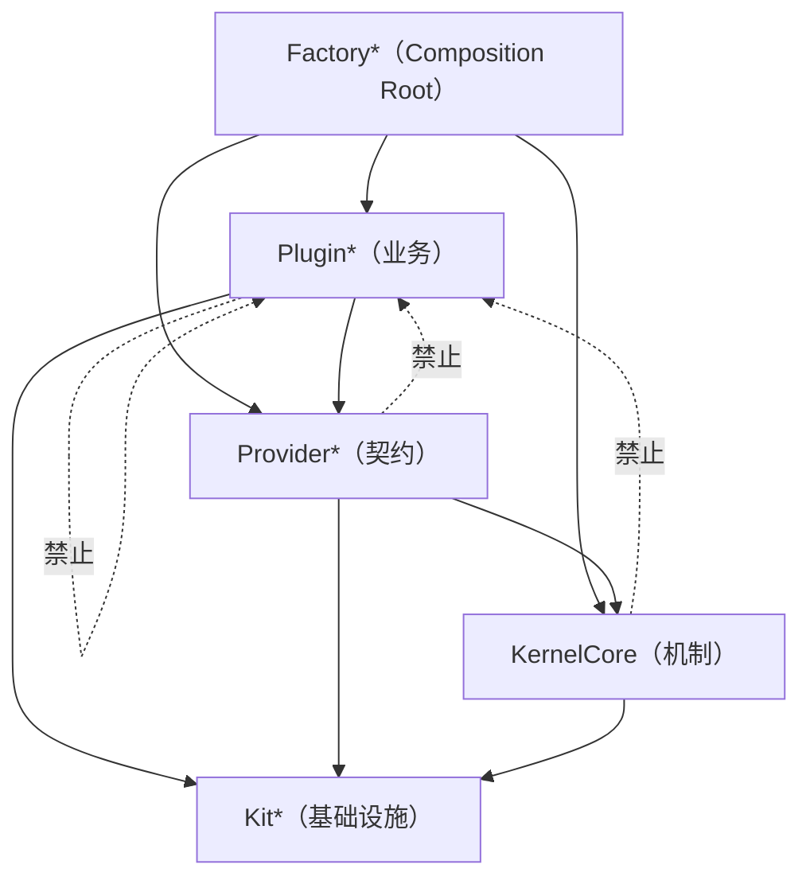

# 把功能当作数据：Lumi 的插件优先架构是怎么长出来的

> 一篇写给同行的架构复盘。不是「最佳实践宣言」，而是一条真实路径的记录：
> 一个单人主导、AI 深度参与的 macOS 桌面应用，如何在 8 个月、1 万次提交之后，
> 把 200 多个功能收敛成 225 个可独立装配的 Swift Package。
>
> 文中所有数字、代码、结论都来自仓库当前状态（2026-09）。

---

## 0. 先说结论

如果你只有两分钟，这里是全部要点：

1. **内核只做两件事**：按协议类型注册/解析实现，管理插件的生命周期。它不知道「对话」「编辑器」「LLM」是什么。整个容器 `KernelCore.swift` 只有 85 行。
2. **能力用协议声明，实现用插件注入**。应用不是「一个会调用各种功能的程序」，而是一个「装配表 + 一堆可插拔能力」。
3. **插件之间禁止互相引用**。需要共享 → 下沉到 `Provider*` 契约包；需要协调 → 走内核事件或共享 Host。这条规则不是靠 CI 强制，而是写成规则文档、由 AI 助手在每次改动时持续执行（第 8 节）。
4. **唯一的 Composition Root**。所有装配集中在一个 `PluginFactory` 的数组里，146 个插件一目了然地排队启动。
5. **同一份插件目录，可以装配出不同的 App**。主 App、图标设计器、CAD 设计器、数据库管理器、iOS 小册子工具共享全部业务包，只换装配表。
6. **代价是真实的**：协议先行、包数量膨胀、初期开发更慢。这笔钱只在「功能会持续增长 + 需要多形态交付」时才值得付。

---

## 1. 起点：一个正在失控的 macOS 应用

Lumi 最初的样子和大多数桌面应用没有区别：一个 Xcode 工程，业务代码按「界面 / 模型 / 工具」分目录，功能之间直接互相调用。

功能列表在这样一条曲线上增长（提交数按月）：

```text
2026-01   19        （起步）
2026-02  360
2026-03  1012
2026-04  519
2026-05  1803       （架构重构开始）
2026-06  1373
2026-07  1731
2026-08  2581
2026-09  754        （仅半个月）
```

最终的产品功能长这样：

- 25 家 LLM 供应商集成
- 带工具调用的 Agent（文件读写、Shell、浏览器、电脑控制、图片理解、向用户提问）
- 内置代码编辑器（tree-sitter 高亮、LSP、大纲、引用、调用层级、问题面板）
- 终端、Git、Docker、数据库客户端、端口管理、hosts 管理
- 剪贴板历史、磁盘/网络监控、屏幕录制、OCR、显示器控制、防休眠
- 19 套内置主题、项目级 RAG、Agent 规则、技能、记忆
- 若干独立设计器（App 图标、App Store 促销图、CAD、PDF 小册子、简历、思维导图）
- 100+ 个默认装配的插件

问题不是「功能太多」，而是**每一次加功能都在提高所有已有功能的耦合度**。

典型的腐烂路径是这样的：

```text
1. 新功能 A 需要「当前项目路径」
   → 直接读全局单例 ProjectVM.shared

2. 新功能 B 也需要
   → 再读一次，顺手加一行 A 的逻辑

3. 某天 A 要改成「支持多项目」
   → 发现 37 个地方直接依赖了 A 的内部状态
   → 只能整体重构，或者放弃改
```

真正致命的不是耦合本身，而是**耦合让「假设」变成了事实**：

- 「当前一定有一个打开的项目」
- 「工具箱一定只有一个实例」
- 「这个功能一定在主窗口里」

一旦这些假设散落在几百个文件里，产品形态就被锁死了。想做一个「只包含图标设计器」的独立 App？想把工具集跑到 iOS 上？想支持运行时禁用插件？每一个都变成重写。

所以重构的目标从一开始就不是「代码更整洁」，而是非常具体的三个问题：

1. **能不能只改一处，就改变应用包含哪些功能？**
2. **能不能加一个新功能，完全不碰任何已有功能的代码？**
3. **能不能用同一套业务代码，装配出形态完全不同的 App？**

---

## 2. 第一原则推导：功能是数据，应用是解释器

先放下「架构模式」，回到最基本的问题。

### 2.1 应用到底是什么

一个桌面应用，剥到底只有三件事：

```text
① 一组能力（能做的事）
② 一张装配表（这次启动包含哪些能力、按什么顺序）
③ 一个宿主外壳（窗口、菜单、生命周期）
```

绝大多数应用的代码里，① 和 ② 是**混在一起**的：能力自己决定要不要注册、什么时候注册、注册到哪。于是「一张装配表」这种事根本不存在——它是涌现出来的，无法被审阅、无法被替换。

如果我们强行把 ② 抽出来，就会得到一个很反直觉的结论：

> **功能不是代码结构，而是数据。**
>
> 应用不是「实现了这些功能的程序」，而是「解释了这张装配表的解释器」。

这个视角一转，很多设计决定就变成推导结果，而不是风格偏好：

| 问题 | 从「功能是数据」推导出的答案 |
| --- | --- |
| 新功能怎么加？ | 往装配表里加一行。不改任何已有代码。 |
| 功能之间怎么通信？ | 不能直接引用——数据项之间没有「代码级引用」的概念。必须通过宿主提供的契约。 |
| 怎么支持运行时禁用？ | 数据项可以被移除。前提是它的所有副作用都能被完整撤回。 |
| 怎么做出不同形态的 App？ | 换一张装配表。同一批数据项，不同子集。 |
| 内核该有多大？ | 内核只负责「解释这张表」。它不应该知道任何一项数据是什么。 |

### 2.2 于是内核被压到 85 行

`KernelCore` 的全部职责是：

```swift
@MainActor
public final class KernelCoreContainer: SuperLog {
    // 一张 Provider 注册表：协议类型 → 实现
    var providers: [ObjectIdentifier: Any] = [:]
    // Provider 归属哪个插件（用于卸载时自动撤回）
    var providerOwners: [ObjectIdentifier: String] = [:]

    // 一张插件注册表：插件 id → 插件实例
    var plugins: [String: any SuperPlugin] = [:]
    var pluginStartOrder: [String] = []

    // 贡献所有权：插件写入共享 Host 的每一项，由内核持有并负责撤回
    var contributionTokens: [String: [PluginContributionToken]] = [:]

    public private(set) var lifecycleState: KernelLifecycleState = .stopped
}
```

注意这里的**缺席**：没有 `Storage`、没有 `Project`、没有 `Conversation`、没有任何具体领域名词。

内核里出现的第一条设计原则，是直接写在类注释里的：

> **KernelCore 只提供「注册 Provider 与访问 Provider」的通用机制，不定义、不包含任何具体 Provider。具体 Provider 协议由上层或具体 App 声明，实现由插件注入。**

这行注释比任何架构图都重要。它是一条**可以被机械检查**的规则：在内核源码里搜索任何领域名词，搜到就是违规。

整个 `KernelCore` 包 1608 行，其中真正的「机制」只有四块：

```text
KernelCore+Provider.swift     — 注册 / 解析 / 注销 / 归属查询
KernelCore+Plugin.swift       — 注册 / 依赖排序 / 原子启动 / 回滚 / 启停
KernelCore+AsyncPlugin.swift  — 异步生命周期 + 超时 + 取消
KernelCore+Contribution.swift — 贡献的登记与按插件撤回
KernelCore+Events.swift       — 类型化事件总线 + 旧通知桥接
```

一个能做 200+ 功能的应用，内核只有这些。这不是极简主义美学，而是「功能是数据」这个前提的必然结果。

### 2.3 Provider 解析是一个 40 行的字典

```swift
public func registerProvider<T>(_ type: T.Type, _ provider: T) throws {
    let key = ObjectIdentifier(type)
    guard providers[key] == nil else {
        throw KernelCoreError.providerAlreadyRegistered(type: type)
    }
    providers[key] = provider
    if let activePluginID {
        providerOwners[key] = activePluginID   // 记录归属，卸载时自动撤回
    }
}

public func resolveProvider<T>(_ type: T.Type = T.self) -> T? {
    guard let provider = providers[ObjectIdentifier(type)] as? T else { return nil }
    return provider
}
```

用协议类型本身作为 key，而不是字符串。这样做的收益在一个 200+ 功能的应用里非常具体：

- **编译期保证**：「解析一个不存在的 Provider」不会变成运行时字符串拼写错误，而是 `nil` + 一次带上下文的错误日志。
- **不引入 DI 框架**：没有容器 DSL、没有反射、没有启动时的运行时代码生成。可读性和可调试性都留在了编译器里。
- **归属自动管理**：注册时记下「当时正在 Boot 哪个插件」，卸载时按归属整批撤回。插件不需要写一长串 `removeXxx`。

---

## 3. 四层包结构

真实的包结构是这样的（`Packages/` 下 225 个包）：

| 前缀 | 数量 | 职责 | 允许依赖 |
| --- | ---: | --- | --- |
| `KernelCore` | 1 | 注册表 + 生命周期 | 只依赖 `KitSuperLog` |
| `Provider*` | 47 | 能力**契约**（协议 + DTO + 默认实现） | `KernelCore`、`Kit*` |
| `Kit*` | 17 | 无业务语义的基础设施（Shell、Keychain、Markdown、LLM 内核、HTML 预览…） | 尽量无依赖 |
| `Plugin*` | 148 | 业务实现与外部集成 | 只依赖「它需要的」`Provider*` + `Kit*` + LumiUI |
| `Editor*` | 6 | 编辑器独立分层（渲染 → 视图 → 内核 → 门面） | 严格自下而上 |
| `Factory*` | 5 | Composition Root：装配表 + 宿主外壳 | 全部 |

依赖方向是**严格单向**的：



用文字写下来的禁令只有两条，但它们是整个体系的承重墙：

> **规则一：内核不得依赖插件。**
> **规则二：插件不得依赖其他插件。**

这两条规则被写进了仓库的 `.agent/rules/core-plugin-boundary-rules.md`，并且**同时是给人和给 AI 读的**（后面第 10 节会展开）。

### 3.1 为什么「插件不能依赖插件」值得付出代价

这是整套设计里最难执行、也最反直觉的一条。

反直觉的地方在于：功能 A 和功能 B 明明有很强的关联。比如「会话标题自动生成」需要读会话列表，「工具管理器」需要读会话的自动化等级。按直觉，让 A 引用 B 是最省事的。

但一旦允许，你立刻失去三样东西：

1. **装配自由度**：不能只装 A 不装 B。而「只装一个子集」正是第 6 节里多形态 App 的基础。
2. **卸载完整性**：禁用 B 会让 A 编译失败或运行时崩溃，于是「运行时禁用插件」这个功能自动作废。
3. **审阅可行性**：146 个插件两两之间的依赖关系是 10000+ 条边，没人能审阅。禁止后就只剩「插件 → 契约」这一种边，任何一次改动的影响面都是可枚举的。

实际执行下来，需求会收敛到三类，每一类都有干净的解：

| 你的需求 | 正确做法 | 错误做法 |
| --- | --- | --- |
| A 和 B 都需要同一份逻辑 | 下沉到 `Provider*` 契约包或 `Kit*` | 让 A 引用 B |
| A 需要知道 B 做了什么 | 内核类型化事件总线 | A 直接调 B 的方法 |
| A 需要在 B 的 UI 上放东西 | 双方各自向共享 Host 贡献 | A 拿到 B 的 View 往里插 |

第三条尤其重要。Lumi 里「消息列表」「工具栏」「侧边栏」「活动栏」「设置页」这些都是**共享 Host**，由 Provider 承载，多个插件向同一个 Host 各自贡献条目：

```swift
// 每个插件在自己的 onBoot 里贡献，互不知道对方存在
contentView?.setContentView(AnyView(BookletMakerMainView(viewModel: sharedViewModel)))

if let activityBar = kernel.resolveProvider((any ActivityBarProviding).self) {
    activityBar.addItems([
        ActivityBarItem(id: entryID, title: name, systemImage: "doc.on.doc", order: order) { state in
            // 激活时的 UI 编排：工具栏分类、侧栏可见性、内容区视图……
        },
    ])
}
```

`BookletMakerPlugin` 不知道还有什么插件也在往 `ActivityBar` 里加东西。它只知道契约。

---

## 4. Provider：能力契约，以及两种「收窄」

Provider 层的设计里有三个值得单独讲的点。

### 4.1 契约、DTO、默认实现分层

一个 `Provider*` 包里通常有三类东西：

```swift
// ① 协议：能力边界
@MainActor
public protocol ToolManagerProviding: AnyObject {
    func submit(_ toolCalls: [ToolCall], policy: ToolExecutionPolicy,
                conversationID: UUID, turnID: UUID?) -> [ToolJob]
    func add(_ tool: any SuperAgentTool, pluginID: String)
    func authorizationDecision(for toolCall: ToolCall,
                              conversationID: UUID) -> ToolAuthorizationDecision
    // …
}

// ② Sendable DTO：跨模块传递的值类型
public struct ToolJob: Sendable, Equatable { /* … */ }
public enum ToolAuthorizationDecision: Sendable { case autoApproved, requiresUserApproval }

// ③ 默认实现：让应用在「插件还没装」时也能跑
public final class DefaultToolManagerProviding: ToolManagerProviding { /* … */ }
```

③ 这一点经常被忽略但极其关键：**默认实现让内核可以在没有任何业务插件的情况下启动**。

`FactoryLumi` 的装配顺序是：

```text
1. ProviderFactory 注册所有 Provider 的「默认实现」
2. Kernel 启动全部插件
3. 插件用 unregisterProvider + registerProvider 替换掉它负责的那个默认实现
```

于是启动路径永远是可运行的：即使某个插件 Boot 失败、或者用户把它禁用了，对应的 Provider 仍然有一个「退化但合法」的实现，应用不会崩在一个 nil 上。

真实代码长这样：

```swift
// PluginToolManager.onBoot —— 用真实实现替换默认实现
kernel.unregisterProvider((any ToolManagerProviding).self)
try kernel.registerProvider((any ToolManagerProviding).self, service)
```

`PluginAgentLoop` 用同样的模式替换 Agent 循环：

```swift
// 1. 解析所有必需依赖，缺任何一个就优雅降级并记日志，绝不 fatalError
guard let messages = kernel.resolveProvider((any MessageManaging).self) else {
    Self.logger.error("\(Self.emoji)MessageManaging not found, skip AgentLoop replacement")
    return
}
guard let toolManager = kernel.resolveProvider((any ToolManagerProviding).self) else { /* … */ }

// 2. 创建自定义实现，挂上事件观察者
let agentLoop = AgentLoopManager(messages: messages, llmManager: llmManager, /* … */)
toolJobObserver = ToolJobObserver(toolManager: toolManager) { [weak agentLoop] event in
    agentLoop?.handleToolJobEvent(event)
}

// 3. 替换默认实现
kernel.unregisterProvider((any AgentLoopProviding).self)
try kernel.registerProvider((any AgentLoopProviding).self, agentLoop)
```

> **可迁移的经验**：「每个契约都有默认实现，插件负责替换」比「插件负责注册」更健壮。前者让系统在任何子集下都可运行，后者让系统在缺少插件时直接坏掉。

### 4.2 收窄之一：Capabilities（接口收窄）

这是从实践中被逼出来的模式。

契约包定义的协议是**面向整个应用**的。比如 `ProjectProviding` 有几十个成员：项目列表、当前项目、最近项目、bookmark、Git worktree、切换事务……

但一个「项目列表插件」的 ViewModel 其实只用到 5 个成员。让它持有整个 `ProjectProviding`，会有两个后果：

1. 业务层对契约包的完整面产生依赖，契约一改就波及所有消费方；
2. 单测必须构造一个完整的 Provider mock，成本高到没人愿意写。

解法是在插件自己的目录里声明**它需要的最小能力**，并写一个 Adapter 收窄：

```swift
// PluginProjects/Sources/PluginProjects/Capabilities/ProjectsProjectCapability.swift

/// Projects 插件需要的最小项目能力边界。
/// ViewModel 通过该协议读写项目列表与当前项目，不直接持有具体 Provider 类型。
@MainActor
protocol ProjectsProjectCapability: AnyObject {
    var projects: [ProjectInfo] { get }
    var currentProject: ProjectInfo? { get }
    func synchronizeProjects(_ projects: [ProjectInfo])
    func openProject(at path: String, reason: ProjectChangeReason) async throws
    func closeProject(reason: ProjectChangeReason) async
}

/// 唯一 import 契约包的业务侧文件。
@MainActor
final class ProjectsProjectCapabilityAdapter: ProjectsProjectCapability {
    private let project: any ProjectProviding
    init(project: any ProjectProviding) { self.project = project }

    var projects: [ProjectInfo] { project.projects }
    var currentProject: ProjectInfo? { project.currentProject }
    func synchronizeProjects(_ projects: [ProjectInfo]) { project.synchronizeProjects(projects) }
    func openProject(at path: String, reason: ProjectChangeReason) async throws {
        try await project.openProject(at: path, reason: reason)
    }
    func closeProject(reason: ProjectChangeReason) async { await project.closeProject(reason: reason) }
}
```

目录规范随之固定下来：

```text
PluginFoo/
└── Sources/PluginFoo/
    ├── FooSuperPlugin.swift          # 唯一装配入口：resolve → makeCapability → inject
    ├── Capabilities/
    │   └── FooProjectCapability.swift # 能力协议 + Adapter（同文件）
    ├── Observers/
    │   └── FooProviderObserver.swift  # 状态入口
    ├── ViewModels/
    │   └── FooViewModel.swift         # 只依赖能力协议
    └── Views/
        └── ...                        # 只依赖 ViewModel
```

于是每个插件的依赖面变成一句话可以说完的：

```text
插件入口          → 可以持有 Provider 协议（负责装配）
Capabilities/     → 唯一允许 import 契约包的业务侧文件
Observers/        → 可以持有 Provider 事件面
ViewModel/View/Service/Tool → 禁止直接持有 Provider 协议
```

### 4.3 收窄之二：Observer（状态收窄）

接口收窄解决了「调用」，还需要解决「状态」。

早期版本里，Provider 是 `ObservableObject`，插件直接订阅 `objectWillChange` 或者裸 Combine Publisher。这带来一个严重问题：**任何一处状态变化都会让订阅者整体失效**，在 200+ 功能的规模下表现为大面积无意义重渲染。

现在的规则是：

> **Provider 的跨模块状态变化只能通过类型化的 `add...Observer` + `ObserverHandle` 通知。**
> Provider 内部可以继续用 `@Published` 存状态，但**不得**把它作为跨模块的监听协议。

```swift
// 契约：注册一个类型化观察者，返回可取消的句柄
@MainActor
public protocol ToolManagerProviding: AnyObject {
    func addToolJobObserver(
        _ callback: @escaping (ToolJobEvent) -> Void
    ) -> any ToolJobObserverHandle
}

// 插件侧：在插件入口持有 Observer，事件转成 ViewModel 状态
@MainActor
final class ToolCallsObserver {
    private var agentLoopObserver: (any AgentLoopObserverHandle)?

    init(agentLoop: any AgentLoopProviding, conversations: any ConversationManaging, service: ToolManager) {
        self.agentLoopObserver = agentLoop.addAgentLoopObserver { [weak self] event in
            self?.handle(event)
        }
    }

    func cancel() { agentLoopObserver?.cancel(); agentLoopObserver = nil }
}
```

配套的两条推论也一起定了下来：

- **句柄在插件入口创建，在 `onShutdown` 取消。** View 和 ViewModel 不得注册插件级的外部监听。
- **系统级通知（`NotificationCenter`、`NSEvent` monitor）只能作为 Observer 的私有输入**，不得直接漏进业务层。

### 4.4 两者的分工

这套设计最终收敛成一张对照表：

| 层 | 职责 | 能否持有 Provider 协议 |
| --- | --- | --- |
| 插件入口 | 解析 Provider、装配 Adapter / Observer / ViewModel | ✅ |
| `Capabilities/` | 声明最小接口边界，Adapter 收窄 | ✅ |
| `Observers/` | 订阅事件 → 更新 ViewModel | ✅ |
| ViewModel / View / Service / Tool | 业务逻辑 | ❌ 只依赖能力协议 |

一句话总结分工：

> **Observer 管「状态怎么进来」，Capabilities 管「接口怎么收窄」。**

---

## 5. Plugin：七个阶段的生命周期

插件协议本身刻意保持很小：

```swift
@MainActor
public protocol SuperPlugin: AnyObject {
    var id: String { get }                      // 稳定标识
    var order: Int { get }                      // 数值越小越先 Boot，默认 200
    var dependencies: [String] { get }          // 必须先启动的插件 id
    var metadata: PluginMetadata { get }        // 名称/分类/成熟度/启用策略/权限

    func onRegister(kernel: KernelCoreContainer) throws    // 目录型贡献（提示词、元数据）
    func onBoot(kernel: KernelCoreContainer) throws        // 注入能力
    func onReady(kernel: KernelCoreContainer) throws       // 全部 Boot 完成后，可安全跨插件解析
    func onEnable(kernel: KernelCoreContainer) async throws
    func onDisable(kernel: KernelCoreContainer) async throws
    func onShutdown(kernel: KernelCoreContainer) throws
    func onUnregister(kernel: KernelCoreContainer) throws
}
```

七个阶段不是设计出来的，而是被需求逼出来的。理解它们最好的方式是看「为什么不能合并」：

| 阶段 | 存在的理由 |
| --- | --- |
| `onRegister` | 有些贡献（提示词、目录项）**必须**在禁用状态下仍然可见，否则用户看不到「可以开启什么」。 |
| `onBoot` | 注入能力。此时其他插件可能还没启动，**不能**解析别人的贡献。 |
| `onReady` | 全部 Boot 结束，依赖图稳定。跨插件的事件订阅必须放在这里。 |
| `onEnable` / `onDisable` | 运行时启停。禁用后内核自动撤回该插件登记的贡献。 |
| `onShutdown` | 撤回外部副作用、取消 Observer。 |
| `onUnregister` | 撤回 `onRegister` 的目录型贡献。 |

### 5.1 启动是原子的

`KernelCore.start(plugins:)` 不是简单循环调用 `onBoot`。它做四件事：

```swift
public func start(plugins incomingPlugins: [any SuperPlugin]) throws {
    // 1. 彻底排除 policy == .disabled 的插件：不注册、不启动、不展示
    let activePlugins = incomingPlugins.filter { $0.metadata.policy != .disabled }

    // 2. 校验重复 id、缺失依赖、依赖环，得到稳定拓扑序
    let sorted = try sortedForStartup(activePlugins)

    setLifecycleState(.starting)
    var bootedIDs: [String] = []
    do {
        for plugin in sorted {
            try registerPlugin(plugin)
            bootedIDs.append(plugin.id)          // 3. 先记账，再执行

            // 用户已禁用的插件：注册但跳过 Boot，等运行时 enable
            guard isPluginEnabled(id: plugin.id) else { continue }

            activePluginID = plugin.id
            activePluginLifecyclePhase = .boot
            try plugin.onBoot(kernel: self)
            activePluginLifecyclePhase = nil
            activePluginID = nil
            pluginStartOrder.append(plugin.id)
        }

        for plugin in sorted where isPluginEnabled(id: plugin.id) {
            activePluginID = plugin.id
            try plugin.onReady(kernel: self)
            activePluginID = nil
        }
        setLifecycleState(.running)

    } catch {
        // 4. 任何一个失败 → 逆序 Shutdown 已启动的插件 + 撤销本批注册的 Provider
        rollbackStartup(bootedIDs: bootedIDs, attemptedIDs: sorted.map(\.id))
        setLifecycleState(previousState == .running ? .running : .failed)
        throw error                          // 错误必须向上抛，不能静默半启动
    }
}
```

三个细节值得单独指出：

**① 失败必须显式。** `start` 抛错后，宿主 App 展示失败视图而不是退化成一个空内核：

```swift
// LumiApp.init()
do {
    let assembledKernel = try KernelFactory.makeKernel()
    kernel = assembledKernel
    mainView = (try? KernelFactory.makeMainView(kernel: assembledKernel))
        ?? AnyView(BootstrapFailureView(message: "Failed to assemble main view"))
} catch {
    kernel = KernelCoreContainer()
    bootstrapErrorDescription = error.localizedDescription
    mainView = AnyView(BootstrapFailureView(message: error.localizedDescription))
}
```

**② Boot 中断也要给一次清理机会。** 注释里写得很清楚：「即使 `onBoot` 中途失败，也必须给插件一次 Shutdown 清理机会」。所以 `bootedIDs.append` 发生在 `onBoot` **之前**。

**③ 归属记录在 Boot 期间完成。** `activePluginID` 在调用 `onBoot` 前置位，于是插件在这一刻注册的所有 Provider / 贡献都自动打上归属标签。卸载时 `removeProviders(ownedByPlugin:)` 一次性收回，插件作者不需要维护一张「我注册了什么」的清单。

### 5.2 异步生命周期与超时

需要做数据库迁移、启动子进程、拉起 Language Server 的插件，用 `AsyncSuperPlugin`：

```swift
public protocol AsyncSuperPlugin: SuperPlugin {
    func onBootAsync(kernel: KernelCoreContainer) async throws
    func onReadyAsync(kernel: KernelCoreContainer) async throws
    func onShutdownAsync(kernel: KernelCoreContainer) async throws
}
```

配套的超时是可配置的，并且**超时不是「放着不管」，而是取消任务并让内核进入失败回滚**：

```swift
public struct KernelLifecycleTimeout: Sendable {
    public var boot: Duration      // 默认 30s
    public var ready: Duration     // 默认 30s
    public var shutdown: Duration  // 默认 15s
}
```

有一点在注释里被诚实地承认了：

> 无法取消的外部同步调用不会被强杀，但其结果不会被当作生命周期成功。

这是异步生命周期在 Swift 里的真实边界，写下来比假装没有更有用。

### 5.3 贡献所有权：把「清理」从插件作者手里拿走

手动清理是插件系统里最容易腐烂的部分。一个贡献了 6 处 UI + 2 个工具 + 1 条 Web 路由的插件，`onShutdown` 要写 9 行 `remove`，其中任何一行写错都会留下残留。

Lumi 的做法是引入 `PluginContributionToken`：插件把「怎么撤回」交给内核，内核按归属统一管理。

```swift
public extension KernelCoreContainer {
    /// 将一项共享贡献归属到当前生命周期回调中的插件。
    @discardableResult
    func trackContribution(
        ownerPluginID: String? = nil,
        cleanup: @escaping () -> Void
    ) throws -> PluginContributionToken { /* … */ }

    /// 撤回指定插件的全部共享贡献。逆注册顺序执行，便于恢复嵌套 UI/资源。
    func cancelContributions(ownedBy pluginID: String) {
        for token in (contributionTokens.removeValue(forKey: pluginID) ?? []).reversed() {
            token.cancel()
        }
    }
}
```

还有事务版本，用于「要么全成功、要么全撤回」的场景：

```swift
let tx = PluginContributionTransaction()
tx.addCleanup { activityBar.removeItems(ids: [entryID]) }
tx.addCleanup { railView.removeTabs(ids: [railTabID]) }
tx.addCleanup { toolManager.remove(id: "pdf_inspect") }
try tx.commit(to: kernel)     // commit 后由内核接管；未 commit 则析构时自动回滚
```

> **可迁移的经验**：让「撤回」成为一个**被内核持有的值**，而不是散落在插件里的若干行代码。这直接把「忘记清理」从一类 bug 变成了一类编译期问题。

---

## 6. Composition Root：装配表本身是唯一的

整个应用只有一处知道「有哪些功能」：

```swift
// Packages/FactoryLumi/Sources/FactoryLumi/PluginFactory.swift
@MainActor
public struct DefaultPluginFactory: PluginFactory {
    public func makePlugins() -> [any SuperPlugin] {
        [
            // 核心基础插件：必须最先启动
            try! StorageSuperPlugin(),
            CommandPlugin(),
            PluginToolbar(),          // 替换默认 ToolbarProviding，必须早于所有解析它的插件
            ToastSuperPlugin(),
            // …
            PluginToolManager(),      // 替换默认 ToolManagerProviding，必须早于 PluginAgentLoop(order=8)
            AiRouterProviderPlugin(),
            AliyunProviderPlugin(),
            AnthropicProviderPlugin(),
            // … 25 个 LLM 供应商插件
            LLMProviderSettingsPlugin(),
        ]
    }
}
```

146 项，一个数组。这一屏代码就是**这个应用的完整功能清单**。

它的价值不在于「简洁」，而在于它让三件原本很难的事变得平凡：

**① 审阅功能边界。** 想知道「这个 App 包含什么」，读一个文件。

**② 有序性变成显式契约。** 数组里的注释记录着真实的顺序约束：

```text
PluginToolbar      → 必须早于所有解析 ToolbarProviding 的插件
PluginActivityBar  → 必须早于所有 onBoot 中调用 addItems 的业务插件
PluginToolManager  → 必须早于 PluginAgentLoop(order=8)
PluginSettingView  → 必须早于各设置入口贡献插件
```

这些约束如果藏在 146 个插件的 `order` 数字里，没人能推演出来。

**③ 装配可以被替换。** 这是下一节。

### 6.1 一份业务代码，五种应用形态

这是整套架构最终兑现的东西。

```swift
// ① 主 App：默认全量
try KernelFactory.makeKernel(
    providerFactory: DefaultProviderFactory(),
    pluginFactory: DefaultPluginFactory()
)

// ② App 图标设计器：只保留设计器需要的能力
public struct DefaultPluginFactory: PluginFactory {
    public func makePlugins() -> [any SuperPlugin] {
        [
            try! StorageSuperPlugin(),
            CommandPlugin(),
            PluginSettingView(),
            PluginLogoManager(),
            PluginToolManager(),
            PluginActivityBar(),
            SettingGeneralPlugin(),
            LogoCofficPlugin(),
            ThemeManagerPlugin(),
            ThemePackPlugin(),
            AlwaysOnPlugin(AppIconDesignerPlugin()),   // 提升为 always-on
        ]
    }
}

// ③ CAD 设计器：只装 CAD
private struct DedicatedPluginFactory: PluginFactory {
    func makePlugins() -> [any SuperPlugin] {
        [DedicatedAlwaysOnPlugin(CADDesignerSuperPlugin())]
    }
}

// ④ 数据库管理器：编辑器宿主 + 数据库插件
[
    DedicatedAlwaysOnPlugin(CodeEditorHostSuperPlugin()),
    DedicatedAlwaysOnPlugin(DatabaseManagerSuperPlugin()),
]

// ⑤ iOS 小册子工具：完全不用内核，直接调用插件暴露的 façade
public enum FactoryBookletMakerIOS {
    public static func makeMobileRootView() -> BookletMakerMobileRootView {
        BookletMakerMobileRootView(feature: BookletMakerMobileFeature())
    }
}
```

同一个 `PluginBookletMaker` 包，在 macOS 上是一个完整的插件（贡献活动栏、侧边栏、工具栏、内容区、Agent 工具、技能），在 iOS 上是直接实例化的 `@StateObject`：

```swift
// FactoryBookletMakerIOS.swift
#if os(iOS)
import BookletMakerPlugin
import SwiftUI

/// BookletMaker 的 iOS 组装入口：移动端业务 façade。
/// App 只调用组装入口；移动会话（feature）在根视图中以 @StateObject 持有。
@MainActor
public enum FactoryBookletMakerIOS {
    public static func makeMobileFeature() -> BookletMakerMobileFeature {
        BookletMakerMobileFeature()
    }
}
#endif
```

注意关键点：**插件本身没有变**。iOS 宿主只是不启动内核，直接调用包内已有的业务服务。多形态交付不是「多写一套」，而是「装配表不同 + 包内已有的 façade」。

还有一个实用的中间形态：`SelectedPluginFactory` 按显式 allow-list 过滤生产目录。

```swift
public struct SelectedPluginFactory: PluginFactory {
    public let allowedPluginIDs: Set<String>
    public func makePlugins() -> [any SuperPlugin] {
        base.makePlugins().filter { allowedPluginIDs.contains($0.id) }
    }
}
```

过滤发生在内核启动**之前**，被排除的插件永远不会 Boot、不会产生 UI 贡献。这样「裁剪版 App」和「完整版 App」共享同一份生产目录定义，不会漂移。

---

## 7. 一个完整案例：从零加一个功能

抽象讲完了，看一个真实的功能是怎么落地的。

**需求**：做一个原型设计器。用户在项目里描述需求，Agent 生成一组 HTML 屏幕（低保真线框 / 高保真），可以点击跳转、可以导出 PNG，还要能在画布上右键某个区块「发给助手」继续修改。

这个功能的实现被劈成两个包，**按「是否有业务语义」切**：

```text
KitPrototype/                          ← 纯机制，无 UI、无 Provider 依赖（1580 行）
  PrototypeModels.swift                ← 337 行：设备、样式、屏幕、热点、项目
  PrototypeDocumentStore.swift         ← 558 行：磁盘布局、CRUD、原子批量替换
  PrototypeHTMLLinter.swift            ← 168 行：HTML 静态校验（禁 script / iframe / 远程资源）
  PrototypeHTMLExporter.swift          ← 161 行：HTML → 精确像素 PNG（WKWebView）
  PrototypeTemplateFactory.swift       ← 266 行：起始模板
  PrototypeAssetImporter.swift         ←  90 行：素材导入与路径规范化

PluginPrototypeDesigner/               ← 业务：UI + Agent 工具 + 技能（2971 行）
  Tools/*.swift                        ← 17 个 Agent 工具 + 1 个共享 support 层
  ViewModels/WorkspaceStore.swift
  Views/*.swift                        ← Rail / 画布 / 工具栏 / 树 / 帮助 / 引导
  Observers/PrototypeDesignerProjectObserver.swift
  Resources/Skills/prototype-designer/ ← SKILL.md + metadata.json
```

合计约 4500 行。它没有碰任何已有功能的代码。

### 7.1 事实源只有一个

设计里最关键的一个决定：**HTML 是画面的唯一真相**。

```swift
/// 事实源只有一个：**HTML 是画面的唯一真相**，`manifest.json` 里的 `hotspots`
/// 是从 HTML 反向解析出的索引缓存，每次写入 HTML 时同步刷新。
public struct PrototypeDocumentStore: @unchecked Sendable {
    // …
}
```

磁盘布局：

```text
.lumi/prototype/tasks/<project-slug>/
  manifest.json               ← 项目元数据（设备、样式、屏幕顺序、起始屏、热点索引）
  assets/                     ← 项目级共享素材（屏幕用 ../assets/x.png 引用）
  <screen-slug>/
    index.html                ← 这一屏的完整 HTML
```

为什么把 HTML 当事实源，而不是把「元素树」序列化成 JSON？因为**Agent 的强项是写 HTML，人的强项也是读 HTML**。如果引入中间表示，就要维护「中间表示 ↔ HTML」的双向转换，而转换本身会成为新的 bug 来源。

代价是每次改 HTML 都要重新解析一遍热点。解法是把它降级为**缓存**：`hotspots` 字段是从 HTML 反向解析出来的，写入时同步刷新，读的时候不信任它。

这个「事实源 vs 缓存」的显式区分，是设计文档里最重要的一句话。

### 7.2 跳转不写 JS，只写 data 属性

原型要能点击跳转。最直觉的做法是让 Agent 生成 `<script>`，但那就意味着给模型开放了任意脚本执行。

Lumi 的做法是：**模型只声明，宿主执行**。

```swift
public enum PrototypeHTMLAttributes {
    /// 跳转目标屏幕：`data-prototype-link="screen-02-detail"`
    public static let link = "data-prototype-link"
    /// 跳转控件展示标签：`data-prototype-label="进入详情"`
    public static let label = "data-prototype-label"
    /// 区块标识（供右键选区定位）：`data-block="headline"`
    public static let block = "data-block"
}
```

Linter 把 `<script>` 判为**错误**，而不是警告：

```swift
if lower.range(of: #"<\s*script\b"#, options: .regularExpression) != nil {
    add(.error, "script_forbidden",
        "Scripts are not allowed. Declare screen jumps with data-prototype-link instead; "
        + "the host injects the navigation script.")
}
```

这个模式的收益远超原型场景：

- **可校验**：跳转目标是否存在，可以静态检查。
- **可回放**：没有脚本，就没有不可预测的行为。
- **可迁移**：同一份 HTML，在预览器、导出器、Agent 上下文里表现一致。

跳转热点的解析也是纯文本：

```swift
public static func parse(fromHTML html: String) -> [PrototypeHotspot] {
    // 逐个抓取标签，再从标签里取属性，避免跨标签误配
    let tagPattern = #"<[a-zA-Z][^>]*"# + PrototypeHTMLAttributes.link + #"\s*=\s*["']([^"']+)["'][^>]*>"#
    // …按出现顺序去重
}
```

### 7.3 原子批量替换

Agent 改 HTML 用的是「精确、唯一的文本替换」，而不是重写整个文件：

```swift
/// 对一屏应用一批精确、唯一的文本替换（原子操作）。
///
/// 任一条 `oldText` 缺失或出现多次即整体失败，不做部分应用。
public func patchScreenHTML(
    operations: [PrototypePatchOperation],
    storagePath: String, projectSlug: String, screenSlug: String
) throws -> PrototypeResolvedScreen {
    let current = try readScreen(/* … */)
    var candidate = current.html
    for operation in operations {
        let count = candidate.components(separatedBy: operation.oldText).count - 1
        guard count > 0 else { throw PrototypeStoreError.patchTextMissing(operation.oldText) }
        guard count == 1 else { throw PrototypeStoreError.patchTextNotUnique(operation.oldText) }
        candidate = candidate.replacingOccurrences(of: operation.oldText, with: operation.newText)
    }
    return try replaceScreenHTML(candidate, /* … */)
}
```

三个设计决定都在注释里说清了：

1. **要求唯一匹配**。`oldText` 出现多次就是歧义，宁可失败也不猜。这避免了「模型以为改的是 A，实际改了 B」的静默错误。
2. **整批原子**。任何一条失败，全部不写入。测试里专门验证了「先成功一条、再失败一条，整体不得写入」。
3. **失败信息携带上下文**。错误里截取 `oldText` 前 80 字符，模型能看到自己哪里猜错了。

> **可迁移的经验**：给模型提供的写操作接口，应该「宁可失败也不歧义」。一个静默的错误修改，比一次明确的失败昂贵得多。

### 7.4 校验前置到每一次写入

`replaceScreenHTML` 在写盘**之前**跑 linter：

```swift
private func validate(html: String, project: PrototypeProject,
                      screen: PrototypeScreen, directory: URL) throws {
    let report = linter.lint(html: html, documentDirectory: directory,
                             knownScreenIDs: Set(project.screens.map(\.id)))
    guard report.isValid else { throw PrototypeStoreError.invalidHTML(report.errors) }
}
```

注意 `knownScreenIDs` 参数：**跳转目标的有效性依赖于整个项目的屏幕集合**。这意味着校验必须拿到项目上下文，不能只校验单屏。这类「需要跨对象上下文的校验」在工具接口设计里很容易被漏掉，漏掉的后果是原型「看起来没问题但点不通」。

校验规则分成两级，这个分级也是刻意的：

| 级别 | 例子 | 理由 |
| --- | --- | --- |
| **error**（阻断写入） | 缺 doctype、缺 viewport、有 script/iframe、有远程资源、跳转目标不存在、素材路径逃逸 | 会导致渲染错误、安全风险或功能失效 |
| **warning**（写日志放行） | 有动画（导出时会关掉）、缺 `data-block` 标注、没有声明任何跳转 | 存量手写 HTML 仍应可预览 |

### 7.5 导出也要能回滚

`prototype_export` 做的事是「把每一屏渲染成 PNG 写到一个外部目录」。最直觉的实现是循环渲染 + 写文件，但那样会在中途失败时留下半成品：一半新图、一半旧图。

真实实现是**先全部渲染到暂存目录，再原子安装**：

```swift
// 先在暂存目录渲染，全部成功后再原子安装，避免半成品导出。
let stagingDirectory = outputParent.appendingPathComponent(".prototype-export-\(UUID().uuidString)", isDirectory: true)
defer { try? fileManager.removeItem(at: stagingDirectory) }

// 阶段一：只渲染，不碰目标目录
for screen in project.sortedScreens {
    let data = try await PrototypeHTMLExporter.exportPNG(
        html: resolved.html, fileURL: resolved.htmlURL, device: device
    )
    try data.write(to: stagedURL, options: .atomic)
}

// 阶段二：逐个安装，被覆盖的旧文件先移到 backups
do {
    for (index, export) in staged.enumerated() {
        if fileManager.fileExists(atPath: export.destinationURL.path) {
            let backupURL = backupDirectory.appendingPathComponent("\(index).png")
            try fileManager.moveItem(at: export.destinationURL, to: backupURL)
            backups.append((export.destinationURL, backupURL))
        }
        try fileManager.moveItem(at: export.stagedURL, to: export.destinationURL)
        installedURLs.append(export.destinationURL)
    }
} catch {
    // 回滚：逆序删掉已安装的，再逆序恢复备份
    for installedURL in installedURLs.reversed() { try? fileManager.removeItem(at: installedURL) }
    for backup in backups.reversed() { try? fileManager.moveItem(at: backup.backup, to: backup.original) }
    throw error
}
```

同样的模式在 `booklet_make` 里出现过一次，注释说明了理由：

```swift
// 先渲染到同目录的临时文件，成功后再替换目标：覆盖已有文件时
// 若渲染失败，用户的旧文件必须原封不动。
let stagingURL = parentDirectory.appendingPathComponent(".booklet-\(UUID().uuidString).pdf")
```

> **可迁移的经验**：任何「批量写文件」的工具都应该走「暂存 → 校验 → 原子安装 → 失败回滚」四步。尤其当操作对象是用户已有的文件时，「旧文件必须原封不动」是一条底线而不是优化。

### 7.6 工具 + 技能，一对搭档

17 个 Agent 工具（外加一个共享 `PrototypeToolSupport` 层）是业务能力的入口。它们的接口设计遵循几条固定的约定。

**风险等级由参数决定，而不是由工具决定**：

```swift
public func permissionRiskLevel(arguments: [String: ToolArgument]) -> CommandRiskLevel {
    BookletToolSupport.bool(arguments, "overwrite", default: false) ? .high : .medium
}
```

**能否并行由工具声明，默认保守串行**：

```swift
/// Unknown/custom tools are serialized by default because their side
/// effects cannot be inferred safely from the protocol alone.
public var executionCapability: ToolExecutionCapability { .serialSideEffect }
```

**面向用户的描述必须由工具自己提供**（不然 UI 只能显示原始参数）：

```swift
func displayDescription(for arguments: [String: ToolArgument]) -> String
```

**默认实现让旧工具不需要改就能编译**：

```swift
/// 提供默认实现以保持旧实现（未迁移 execute 的工具）可编译；
/// 新工具必须实现 `execute(arguments:)`，否则执行时返回该错误。
public func execute(arguments: [String: ToolArgument]) async throws -> String {
    throw ToolExecutionError.executionFailed(toolName: name, reason: "...")
}
```

和工具配对的是一份 **Skill**：一段 Markdown 里写清楚「什么时候用、按什么顺序用、概念是什么」。原型设计器的 `metadata.json`：

```json
{
  "name": "prototype-designer",
  "title": "Prototype Designer",
  "description": "指导 AI 使用 Prototype Designer 的 Agent 工具创作产品原型图：选择设备画板与视觉风格、逐屏生成 HTML、连接屏幕跳转、预览渲染结果、校验并导出。",
  "triggers": ["prototype", "原型", "原型图", "wireframe", "线框图", "mockup", "UI 草图", "页面设计", "界面设计", "交互流程", "低保真", "高保真", "产品原型", "screen design"],
  "version": "1.0.0"
}
```

而 `SKILL.md` 的正文里，有一句话比所有工具说明都重要：

> **核心工作方式：用聊天描述界面 → 你写 HTML → 调用 preview 看渲染结果 → 自己判断是否需要修 → 修改 → 再看。这个视觉自检回路是质量的唯一保证。**

这句话做的事是**改变模型的工作循环**，而不只是告诉它有哪些 API。同一份 `SKILL.md` 还顺手把工具的用法约束写成了规则：

```text
| prototype_read_html   | 读取一屏完整 HTML（**编辑前必须先读**） |
| prototype_replace_html| 用完整 HTML 文档原子替换（大幅重写用） |
| prototype_patch_html  | 批量精确文本替换（局部修改用，≤20 条） |
```

对比一下另一份技能里的表格，风格完全一致：

```text
| pdf_inspect     | 读取页数/尺寸/加密状态，并给出拼版计划 | 低 |
| booklet_make    | 把 PDF 拼版为可打印的小册子 PDF        | 中（overwrite=true 为高） |
| pdf_split       | 按切点拆成多个文件                     | 中 |
| booklet_preview | 渲染前几个印刷面为 PNG 附件            | 低 |

标准工作流：
1. pdf_inspect(path)     → 确认页数/尺寸，查看拼版计划
2. booklet_preview(...)  → 视觉确认页序与留白（可选但推荐）
3. booklet_make(...)     → 生成小册子 PDF
```

这个组合值得单独强调：

> **工具定义「能做什么」，技能定义「怎么用」。**
>
> 只给工具，模型会试探；只给技能，模型没有执行能力。
> 更关键的是：技能可以直接改变模型的工作循环（「先预览再交付」），而这**不需要改一行代码**。
>
> 技能是纯文本，可以在不重新编译、不重启的情况下迭代——这是整套架构里迭代速度最快的层。

### 7.7 插件入口长什么样

最后看装配入口。它只有两件事：解析依赖、注入贡献。

```swift
public func onBoot(kernel: KernelCoreContainer) throws {
    // 依赖注入：拿到本插件的数据目录
    BookletMakerRuntimeBridge.directoryURL = kernel
        .resolveProvider((any ProviderStorage.StorageProviding).self)?
        .pluginDataDirectory(for: id)

    // 向 Agent 贡献工具与技能；宿主没装配对应 Provider 时降级为仅 UI
    registerAgentTools(kernel: kernel)
    registerSkill(kernel: kernel)

    // 向共享 Host 贡献 UI
    let contentView = kernel.resolveProvider((any ContentViewProviding).self)
    let railView = kernel.resolveProvider((any RailViewProviding).self)
    let activityBar = kernel.resolveProvider((any ActivityBarProviding).self)
    // …按各自契约贡献条目
}
```

注意那个降级注释：

> 宿主未装配对应 Provider 时（如 iOS 专用宿主、独立测试）降级为仅启动 UI，不阻塞插件生效。

这就是第 4.1 节说的「默认实现 + 可选解析」在真实代码里的样子。**同一个插件包在五种宿主里都能启动**，靠的不是 if-else 分支，而是「解析不到就跳过这一部分」的一致约定。

---

## 8. 工程配套：规则、AI 协作与自测

架构不是靠一次设计确立的，而是靠**持续执行边界**维持的。这一节讲的是执行机制——对于一个 AI 深度参与的项目，这部分的重要性不亚于架构本身。

### 8.1 规则即文档，同时给人读也给 AI 读

仓库里有一个 `.agent/rules/` 目录，22 份规范，全部是 Markdown：

```text
core-plugin-boundary-rules.md   ← 承重墙：内核/插件边界
plugin-directory-rules.md       ← 插件目录结构、中间件放哪、命名规范
plugin-storage-rules.md         ← 数据存在哪、用什么格式、如何原子写
plugin-order-rules.md           ← UI 项 order 必须派生自插件 order
middleware-rules.md             ← 中间件禁止访问全局单例
minimal-functionality.md        ← 只实现当前需要的功能
first-principles-thinking.md    ← 从基本真理推导，而不是类比
swift-code-organization.md / swift-log.md / swift-comment.md / swift-event.md
unit-test-rules.md / automation-system-rules.md
```

这份清单里有两个非典型的条目，值得展开。

**① `first-principles-thinking.md` 是硬性规范，不是心灵鸡汤。**

它把「至少问 3 层为什么」写成了可执行流程，并给了具体判据：

| 场景 | 类比思维（避免） | 第一性原理（推荐） |
| --- | --- | --- |
| 技术选型 | 「别人都在用这个框架」 | 「我的问题本质是什么？」 |
| 性能优化 | 「加缓存、升级服务器」 | 「时间花在哪？瓶颈是 CPU/IO/网络？」 |
| 解决报错 | 「复制粘贴解决方案」 | 「从数据流和执行流程推导根源」 |

还配了一张适用场景优先级表，明确写出「简单任务、重复工作可以用经验提效」——这一点很重要，否则「第一性原理」会退化成「所有事都要重新推导」的表演。

**② `minimal-functionality.md` 明确禁止「以防万一」。**

> - ❌ 添加「以防万一」的功能
> - ❌ 创建通用的工具类（除非确实需要）
> - ❌ 实现「未来可能用到」的接口
> - ❌ 创建复杂的抽象层（除非当前确实需要）

在一个「抽象先行」的架构里，这条规则是必需的平衡项。插件系统本身就容易诱发「先把扩展点建好」。这条规则把闸门拉回来。

### 8.2 让 AI 读规则，而不是读提示词

`.agent/rules/` 里的每一份文档都被 AI 编程助手（Claude Code / Cursor / 其他）自动加载。`.cursor/rules/*.mdc` 是同一批规则的另一份投影，`.agent/commands/` 提供 `/plan`、`/commit`、`/refactor-clean`、`/build-fix` 这类操作流程。

这套机制解决了一个具体问题：**在 146 个插件里，人无法同时记住所有边界规则。**

举个真实的例子。`plugin-order-rules.md` 规定「插件的所有 UI 项 order 必须派生自插件自身的 order」。这条规则有一个反例表格，记录了已修复的历史违规：

| 案例文件 | 违规描述 | 修复方式 |
| --- | --- | --- |
| `IdleTimePlugin.swift:51` | `LumiRootOverlayItem(order: 96)` 硬编码，巧合等于 `info.order` | 改为 `order: info.order` |
| `CaffeinatePlugin.swift:37` | `LumiMenuBarPopupItem(order: -1)` 魔法数字 | 改为 `order: .max` 并加注释 |
| `MessageRendererPlugin.swift` | 8 个 renderer 全部硬编码 `330/320/300/...` | 改为 `info.order + delta` |
| LLM Provider Renderers（30+ 处） | 各 Provider 错误渲染器硬编码 | 改为 `info.order + 200/210/...` |

把「违规案例 + 修复方式」写进规则文档，收益是双重的：人看到时会想起上下文，AI 看到时会知道**同类问题在别处是怎么修的**。这比一条抽象的「禁止硬编码」有效得多。

### 8.3 构建产物也必须能被 AI 驱动

对于「需要看到 UI 才能验证」的功能，Lumi 内置了一个本地自动化服务器：

```text
curl / 脚本
  → POST http://localhost:18765/api/action   （JSON: action + payload）
  → AutomationServer 解析并分发
  → AutomationController 路由到处理器（直接改 VM 或写共享状态）
```

关键点是**不依赖 Accessibility 注入**：

> 通过本地 HTTP API 驱动应用行为，用于脚本或大模型验证功能，无需 Accessibility 注入。

验证流程被写成了固定套路（`.agent/rules/automation-system-rules.md`）：

```text
1. 启动应用（Debug 即可，自动拉起 Automation Server）
2. POST 动作，步骤之间 sleep 1–5 秒
3. 优先跑 scripts/test-automation-*.sh 回归脚本
4. 用磁盘日志确认行为
```

第 4 步有一个很容易被忽略的细节：

> **通过标准**：HTTP 返回 `ok`，且末尾日志中有 `Routing action`、🤖 或该场景预期的业务输出；**仅看 HTTP 响应不够**。

以及一条针对 AI 的显式提醒：

> 自动化相关日志需对动态字符串使用 `privacy: .public`，否则日志中为 `<private>`。

这类「AI 会踩的坑」如果不写进规则，每一次新会话都会重踩一遍。

### 8.4 磁盘日志作为主要调试信道

在一个 200+ 插件的应用里，「在哪加断点」这件事本身就成了负担。Lumi 的做法是把结构化日志当作一等调试手段：

```swift
@MainActor
public final class PluginToolManager: SuperPlugin, PluginDataMigrating, SuperLog {
    nonisolated static let logger = Logger(
        subsystem: "com.coffic.lumi.plugin.tool-manager",
        category: "Plugin"
    )
    public nonisolated static let emoji = "🔧"
}
```

每个类型有自己的 emoji 前缀，日志可以按 emoji 一眼区分来源。加上 `verbose` 静态开关控制细节输出，日志目录按 Debug / Production 分离。

配套的 `debug-with-disk-logs.md` 把「怎么用日志定位问题」也写成了规范，包括「只读最新日志文件的末尾几行，不必扫全文件」这种具体的效率建议。

> **可迁移的经验**：日志规范的重点不是「用什么 API」，而是**让日志可以被机器（包括 AI）当作输入**：稳定的前缀格式、明确的读取路径、避免 `<private>` 吞掉关键字段。

---

## 9. 迁移：怎么把一个跑着的应用换掉地基

前面讲的都是目标状态。真实的挑战是：**应用在跑，用户在用，怎么换。**

仓库里有一份 `lumi-v2-zero-difference-migration-plan.md`，把验收标准写到了近乎苛刻的程度：

### 9.1 「零差异」不等于「功能大致相同」

> 这次升级不是「功能大致相同」，而是以用户无感为标准替换应用内部架构。

具体拆成五类验收：

**① 功能零差异**

> 对每个旧版插件建立行为清单，覆盖：入口、命令、快捷键、设置、菜单栏、工具、Provider、文件打开、后台任务、通知、网络请求和插件间联动。新版必须逐项通过，**不能以占位页或 no-op Provider 代替**。

**② 数据零损失**

> - 新版首次启动前后，旧数据原件不得被原地破坏。
> - 迁移必须可重复执行、可中断恢复、可校验条数与关联关系。
> - 每个迁移写入版本标记、来源版本、完成时间和校验摘要；**不得仅用一个布尔值代表全部数据成功**。
> - 失败时显示可操作错误，并保持旧版仍可启动。

**③ UI 与交互零差异**（这一条最硬）

> - 截图像素差异：核心窗口区域自动比对，动态内容建立 mask；未经批准的结构差异为失败。
> - Accessibility Tree：控件角色、标题、层级、顺序、enabled/focused/value 保持一致。
> - 输入行为：键盘导航、IME、焦点、拖放、右键菜单、hover、popover、sheet、alert、滚动锚点和窗口 resize 一致。
> - 主题：所有内置主题以及浅色/深色/系统模式逐一验收。

**④ 性能不回退**

> 任何核心路径回退超过 10% 都要有明确批准；**滚动掉帧、输入阻塞和主线程 I/O 视为阻断问题**。

**⑤ 构建与发布一致**

> - 保持生产 Bundle ID、Display Name、URL Scheme、文档类型、Entitlements、App Group、Keychain service、Sparkle 配置和签名能力。
> - 新版必须接管旧版产品身份，**不能以一个临时 Bundle ID 作为正式升级包发布**。

### 9.2 迁移台账

迁移不是「一个个搬」，而是先建立机器可读的台账：

```
为每个旧插件记录：
  旧 ID、order、policy、category、stage、依赖、Provider、贡献面、存储、权限
  + 迁移目标包、负责人、状态、测试用例
```

配套的硬性退出条件：

> 任一旧版入口都能在 ledger 中找到 owner、迁移目标、测试和状态；**没有「未知插件」**。

以及一条反自欺的规定：

> 「已经创建新版包」不等于「迁移完成」。只有通过功能、数据、界面、交互、性能五类验收，插件才可标记为完成。

这条规则明确针对的是一个真实失败模式：**把「包存在」误判成「迁移完成」**。文档里甚至点名了当时的误判：

> 给当前 14 个新版插件做反向差距审计，**删除「包存在即完成」的误判**。

### 9.3 分阶段，按依赖顺序

```text
Phase 0  建立迁移台账和 Golden Master
         （截图基线、AX tree 基线、性能基线、行为录屏）

Phase 1  补齐 KernelCore 生命周期和贡献基础设施
         （异步生命周期、metadata、运行时启停、贡献事务、事件桥）

Phase 2  按 Provider 分批迁移能力（存储 → 项目 → 对话 → 消息 → …）

Phase 3  按插件迁移业务，每个插件走完五类验收

Phase 4  切换生产入口，保留回滚观察期
```

Phase 1 必须在 Phase 3 之前完成，原因写得很直白：

> 旧版插件具有完整的异步生命周期、运行时启停、元数据、菜单、标题栏、Panel、Rail、StatusBar、ChatSection、设置、Overlay、Onboarding、Logo、WebRoute、外部文件打开、Turn Hook 和编辑器贡献能力。
> 新版 `SuperPlugin` 当前只有同步 `onBoot`、`onReady`、`onShutdown`、依赖和顺序。
> **若直接逐个复制插件，会把旧版业务耦合重新塞入插件或 Factory，必须先补齐可组合的 Provider/Host 能力。**

这是迁移里最容易被低估的一条：

> **不能先搬业务，再补机制。** 顺序反了，补机制时会发现业务代码已经绕过了它。

### 9.4 一条关于「不要照搬旧协议」的建议

同一份文档里还有一条诚实的设计建议：

> 不应把旧 `LumiPlugin` 的几十个方法原样复制到 `SuperPlugin`。各类贡献应由独立 Host 接收，例如 `WorkspaceContributionHosting`、`ChatContributionHosting`、`CommandContributionHosting`、`LLMRegistryProviding` 和 `EditorExtensionHosting`。

对比一下最终的 `SuperPlugin`——7 个方法，全部是「生命周期」，没有一个是「贡献类型」。贡献通过契约包里的 Host 协议表达。这是刻意的：

> **插件协议只描述「生命周期的什么阶段」，不描述「能做哪些事」。**
> 「能做哪些事」属于契约包，可以独立演进、独立版本化、独立复用。

---

## 10. 代价：什么时候不该这么做

诚实地列一下账单。

### 10.1 显性成本

| 成本 | 具体表现 |
| --- | --- |
| **包数量膨胀** | 225 个包，`Package.swift` 的依赖列表动辄 15+ 项；新增一个 LLM 供应商要复制一整个包 |
| **协议先行** | 想加能力必须先在 `Provider*` 定义协议、DTO、默认实现，再去插件实现——三步走 |
| **跳转成本高** | 读一个功能的行为要跨 3–5 个包（插件 → 能力 Adapter → 契约 → 实现） |
| **样例代码重复** | 25 个 LLM 供应商插件结构高度相似，靠脚本生成（`Scripts/gen-llm-provider-packages.py`）维持一致性 |
| **初期进度慢** | 机制补齐阶段（Phase 1）没有可见的产品产出 |

### 10.2 隐性成本（更值得警惕）

**① 「跨边界」的判断需要持续判断力。**

「两个插件都需要这段逻辑」→ 下沉到契约包。但如果只有两个插件需要，下沉到契约包是不是过度抽象？

这类判断没有机械规则。实践中采用的判据是「是否会被多处复用且不破坏边界时，再抽到契约包」——但这本质上还是一个需要人来做的判断。

**② 抽象会掩盖真实的顺序依赖。**

插件 `order` + 依赖 + 默认实现替换，构成了一张复杂的启动图。`KernelCore` 会校验重复 id、缺失依赖和依赖环，但「插件 A 必须在 B 之前替换 Provider」这类**语义顺序**约束只能靠注释维护。这是这套架构里最脆弱的部分。

**③ 契约包会成为新的耦合中心。**

禁止了「插件依赖插件」，但所有插件都可能依赖同一个契约包。如果契约包设计得不够窄，它会变成新的上帝对象。`Capabilities` 收窄模式正是对这个问题的事后补救。

**④ 单功能小项目会得不偿失。**

如果一个产品只有一个明确的形态、功能数量在 20 以内、没有多端需求，那么：内核 + 契约包 + 装配表 + 能力收窄这一整套基础设施，投入产出比是负的。

### 10.3 什么时候值得

判断标准可以收敛成三个问题：

```text
① 功能会持续增长吗？
   会 → 装配表 + 边界规则的价值随时间复利增长
   不会（一次性交付）→ 不值得

② 需要多种交付形态吗？
   需要（独立 App / iOS / 裁剪版 / 白标）→ 收益立刻兑现
   不需要 → 收益只剩「好维护」，很难论证

③ 边界违反能被自动发现吗？
   能（有规则文档 + AI 助手持续执行）→ 架构能维持
   不能（只有几个人靠自觉）→ 三个月后会退化回大泥球
```

第 ③ 点在最前面几节里没有充分展开，但它可能是整篇文章最重要的结论：

> **在 146 个插件、22 条边界规则、1 万次提交的规模上，架构的维持靠的不是纪律，而是「让 AI 读规则」。**
>
> 人记不住 22 条规则，但可以保证每条规则只写一次、写清楚、带反例。

---

## 11. 可迁移的清单

最后把可以带走的东西整理成一份清单。按「收益 / 成本」排序。

### 立刻可做（低成本，高收益）

1. **给每个契约写默认实现。** 让系统在任何插件子集下都能启动，把「缺少插件」从崩溃变成降级。
2. **把装配表抽成一个数组。** 哪怕不引入完整插件系统，先让「这个 App 包含什么」变成一个可读的文件。
3. **区分事实源和缓存。** 每个持久化模型都明确回答「哪个字段是真相，哪些是派生」。派生字段一律可重建、不可信任。
4. **写清楚「宁可失败也不歧义」的写接口。** 面向模型的写操作要求唯一匹配 + 整批原子，拒绝静默猜测。
5. **插件协议只描述生命周期，不描述能力。** 能力进契约包。

### 值得投入（中成本）

6. **引入 ContributionToken 管理清理。** 把「怎么撤回」变成内核持有的值，而不是插件里的若干行 remove。
7. **Capabilities 收窄。** 在插件目录里声明最小能力协议 + Adapter，业务层不再持有完整契约类型。
8. **Observer 收窄状态。** 禁止跨模块订阅 `objectWillChange` / 裸 Publisher，改为类型化 `add...Observer` + 可取消句柄。
9. **在插件入口显式管理生命周期。** Observer 在入口创建、在 shutdown 取消，View/ViewModel 不注册外部监听。
10. **实现本地自动化驱动入口。** 一个 `POST /api/action` 式的本地接口，让脚本和 AI 都能触发并验证 UI 行为。
11. **工具 + 技能成对交付。** 工具定义能力，Markdown 技能定义用法。技能可以在不重新编译的情况下迭代。

### 大投入（只在确认需要时）

12. **内核保持无知。** 内核里不出现任何领域名词，并让这条规则可以被机械检查。
13. **插件之间禁止引用。** 需求收敛到「下沉契约 / 事件总线 / 共享 Host」三条路径。
14. **多宿主装配。** 同一份业务包，用不同装配表产出多种 App 形态（含移动端 façade 路径）。
15. **零差异迁移方法论。** 功能 / 数据 / UI / 交互 / 性能五类验收 + 机器可读台账 + Golden Master 基线。
16. **规则即文档，且给人读也给 AI 读。** 每条规则带真实反例和修复方式。

---

## 附：当前仓库的关键数字

| 项目 | 数值 |
| --- | --- |
| 提交总数 | 10,152 |
| `Packages/` 包数量 | 225（`Plugin*` 148、`Provider*` 47、`Kit*` 17、`Editor*` 6、`Factory*` 5、`KernelCore` 1、`OpenInKit` 1） |
| 默认装配插件数 | 146 |
| 源码文件（`Sources/`） | 2,379 |
| 测试文件（`Tests/`） | 456 |
| 内核总行数 | 1,608（核心容器 85 行） |
| Composition Root 行数 | 2,342 |
| 应用形态 | macOS 主 App、App 图标设计器、CAD 设计器、数据库管理器、iOS 小册子工具 |
| LLM 供应商插件 | 25 |
| Agent 规则文档 | 22 |
| 技术栈 | Swift 6.0+、SwiftUI、macOS 14+、SPM（无根 `Package.swift`，App 由 `Lumi.xcodeproj` 构建） |

---

## 相关文档

- [`docs/editor-architecture.md`](./editor-architecture.md) — 编辑器子系统的分层与扩展点（本文第 3 节 `Editor*` 分层的展开）
- [`docs/lumi-v2-zero-difference-migration-plan.md`](./lumi-v2-zero-difference-migration-plan.md) — 零差异迁移总计划（本文第 9 节的依据）
- [`docs/agent-tool-job-operations.md`](./agent-tool-job-operations.md) — Tool Job 运行模型、取消/超时语义、重启恢复
- [`docs/plans/2026-09-03-plugin-observer-only.md`](./plans/2026-09-03-plugin-observer-only.md) — Observer 所有权迁移
- [`docs/plans/2026-09-06-plugin-capabilities-directory.md`](./plans/2026-09-06-plugin-capabilities-directory.md) — Capabilities 收窄设计与迁移
- [`docs/plans/2026-09-02-robust-context-compaction-design.md`](./plans/2026-09-02-robust-context-compaction-design.md) — 上下文压缩的预算 / 阈值 / 降级设计
- [`.agent/rules/core-plugin-boundary-rules.md`](../.agent/rules/core-plugin-boundary-rules.md) — 内核与插件边界规范

---

*本文描述的是 Lumi 在 2026-09 的架构状态，是一个仍在演进中的系统，不是终态。文中提到的所有约束都有例外，所有结论都附带适用条件。*
