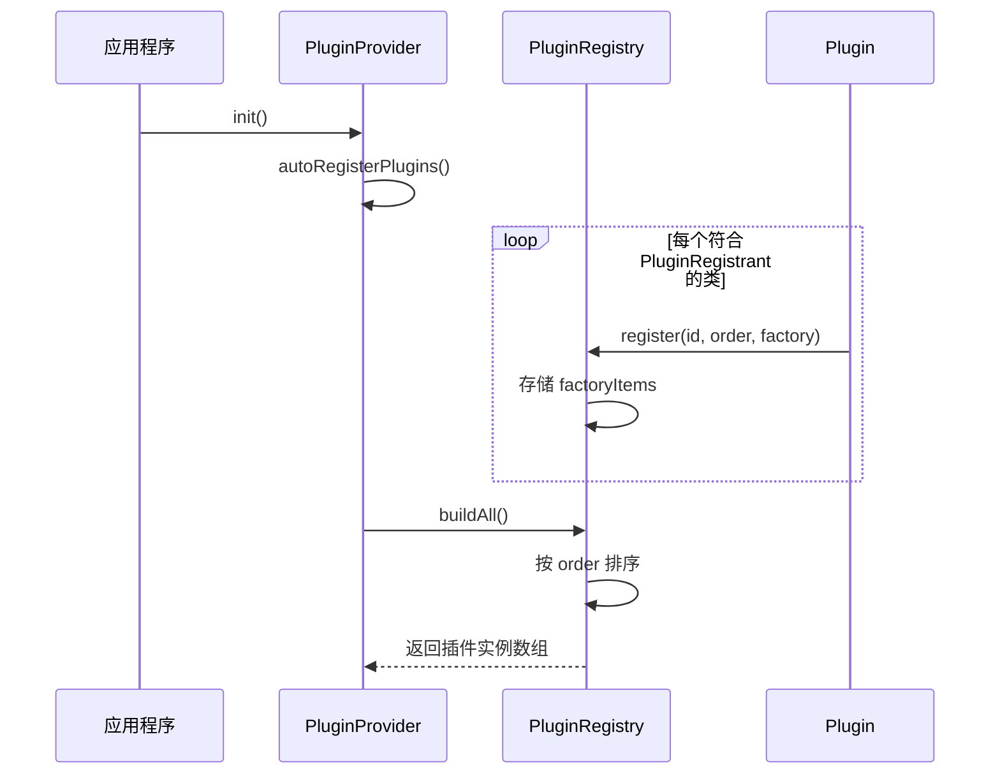

# 插件系统设计文档

## 目录

- [概述](#概述)
- [核心架构](#核心架构)
- [插件注册机制](#插件注册机制)
- [插件协议](#插件协议)
- [视图系统](#视图系统)
- [事件系统](#事件系统)
- [插件生命周期](#插件生命周期)
- [最佳实践](#最佳实践)
- [完整示例](#完整示例)

---

## 概述

插件系统是一个基于协议导向编程（Protocol-Oriented Programming）的可扩展架构，允许开发者通过插件方式为应用添加功能，而无需修改核心代码。

### 设计目标

1. **模块化**：插件独立开发和维护，与核心应用解耦
2. **可扩展性**：轻松添加新功能，无需修改现有代码
3. **类型安全**：使用 Swift 协议确保编译时检查
4. **自动发现**：通过 Objective-C 运行时自动注册插件
5. **性能优化**：延迟加载和视图缓存机制

### 核心特性

- 🔄 **自动注册**：插件在启动时自动发现和注册
- 🎯 **多区域贡献**：插件可向工具栏、状态栏、侧边栏等多个 UI 区域贡献视图
- 📋 **标签页支持**：插件可创建独立的主标签页
- ⚡ **线程安全**：使用 Actor 模式确保并发安全
- 🔧 **可配置**：支持在设置中启用/禁用插件

---

## 核心架构

### 系统组件

```
┌─────────────────────────────────────────────────────────────┐
│                        应用程序                              │
├─────────────────────────────────────────────────────────────┤
│  PluginProvider (插件提供者)                                 │
│  - 管理所有插件实例                                          │
│  - 提供插件查询接口                                          │
│  - 区分标签页插件                                            │
└──────────────────┬──────────────────────────────────────────┘
                   │
                   │ 注册
                   ▼
┌─────────────────────────────────────────────────────────────┐
│  PluginRegistry (插件注册表) - Actor                         │
│  - 线程安全的插件注册中心                                     │
│  - 存储插件工厂和排序优先级                                   │
│  - 构建插件实例                                               │
└──────────────────┬──────────────────────────────────────────┘
                   │
                   │ 发现
                   ▼
┌─────────────────────────────────────────────────────────────┐
│  PluginRegistrant (插件注册协议)                             │
│  - 自动发现机制                                               │
│  - static register() 方法                                    │
└──────────────────┬──────────────────────────────────────────┘
                   │
                   │ 实现
                   ▼
┌─────────────────────────────────────────────────────────────┐
│  SuperPlugin (插件协议)                                      │
│  - 定义插件接口                                              │
│  - 提供默认实现                                              │
└──────────────────┬──────────────────────────────────────────┘
                   │
                   │ 继承
                   ▼
        ┌──────────────────────┐
        │   具体插件实现         │
        │ - GitPlugin          │
        │ - CommitPlugin       │
        │ - BranchPlugin       │
        │ - ...                │
        └──────────────────────┘
```

### 关键类说明

#### PluginRegistry（插件注册表）

```swift
actor PluginRegistry {
    static let shared = PluginRegistry()

    private var factoryItems: [FactoryItem] = []

    func register(id: String, order: Int = 0, factory: @escaping () -> any SuperPlugin)

    func buildAll() -> [any SuperPlugin]
}
```

**职责：**

- 作为单例提供全局访问点
- 存储插件工厂（而非实例）以支持延迟初始化
- 按优先级排序插件
- 使用 Actor 模式确保线程安全

#### PluginProvider（插件提供者）

```swift
class PluginProvider: ObservableObject {
    @Published var plugins: [any SuperPlugin] = []
    var tabPlugins: [any SuperPlugin] { /* 筛选 isTab == true 的插件 */ }

    func registerAndBuildAllPlugins()
}
```

**职责：**

- 管理所有已加载的插件实例
- 区分标签页插件和普通插件
- 为 UI 提供插件查询接口

---

## 插件注册机制

### 自动发现流程



### 注册代码示例

每个插件通过实现 `PluginRegistrant` 协议来注册自己：

```swift
extension GitPlugin {
    @objc static func register() {
        guard enable else { return }

        Task {
            await PluginRegistry.shared.register(id: "Git", order: 0) {
                GitPlugin.shared
            }
        }
    }
}
```

### 注册参数说明

- **id**: 插件的唯一标识符
- **order**: 加载优先级（数字越小越优先）
- **factory**: 返回插件实例的闭包（支持单例模式）

### 常见插件优先级

| 插件 | Order | 说明 |
|------|-------|------|
| GitPlugin | 0 | 核心 Git 功能，最先加载 |
| BranchPlugin | 22 | 分支管理 |
| CommitPlugin | 23 | 提交历史 |
| ProjectPickerPlugin | 24 | 项目选择器 |

---

## 插件协议

### SuperPlugin 协议定义

```swift
protocol SuperPlugin {
    // 静态属性
    static var label: String { get }
    static var id: String { get }
    static var displayName: String { get }
    static var description: String { get }
    static var iconName: String { get }
    static var isConfigurable: Bool { get }
    static var enable: Bool { get }

    // 实例属性
    var instanceLabel: String { get }
    var isTab: Bool { get }

    // 视图方法
    func addListView(tab: String, project: Project?) -> AnyView?
    func addDetailView() -> AnyView?
    func addToolBarLeadingView() -> AnyView?
    func addToolBarTrailingView() -> AnyView?
    func addStatusBarLeadingView() -> AnyView?
    func addStatusBarCenterView() -> AnyView?
    func addStatusBarTrailingView() -> AnyView?
}
```

### 协议扩展默认实现

```swift
extension SuperPlugin {
    var instanceLabel: String { Self.label }
    var isTab: Bool { false }

    func addListView(tab: String, project: Project?) -> AnyView? { nil }
    func addDetailView() -> AnyView? { nil }
    func addToolBarLeadingView() -> AnyView? { nil }
    func addToolBarTrailingView() -> AnyView? { nil }
    func addStatusBarLeadingView() -> AnyView? { nil }
    func addStatusBarCenterView() -> AnyView? { nil }
    func addStatusBarTrailingView() -> AnyView? { nil }
}
```

**设计理念：**

- 插件只需实现需要的方法
- 提供合理的默认值
- 支持渐进式采用

### 必需实现的属性

```swift
class MyPlugin: SuperPlugin, PluginRegistrant {
    static let label = "MyPlugin"           // 内部标识符
    static var id: String = "MyPlugin"      // 设置管理用 ID
    static var displayName: String = "我的插件"  // 用户界面显示名称
    static var description: String = "插件功能描述"
    static var iconName: String = "star.fill"
    static var isConfigurable: Bool = false // 是否可在设置中配置
    static let enable = true                // 是否启用插件
    static let shared = MyPlugin()          // 单例实例

    private init() {}
}
```

---

## 视图系统

### UI 区域划分

```text
┌─────────────────────────────────────────────────────────────┐
│  工具栏 (ToolBar)                                           │
│  [Leading Views] [Tab Picker] [Trailing Views]             │
├─────────────────────────────────────────────────────────────┤
│ ┌─────────┬───────────────────────────────────────────────┐ │
│ │         │                                               │ │
│ │ List    │  Detail View                                  │ │
│ │ Views   │  (来自当前选中标签的插件)                       │ │
│ │         │                                               │ │
│ │ (侧边栏) │                                               │ │
│ └─────────┴───────────────────────────────────────────────┘ │
├─────────────────────────────────────────────────────────────┤
│  状态栏 (StatusBar)                                          │
│  [Leading] [Center] [Trailing]                             │
└─────────────────────────────────────────────────────────────┘
```

### 视图类型详解

#### 1. 列表视图 (addListView)

**位置：** 侧边栏（标签页左侧）

**用途：** 显示项目相关列表，如提交历史、分支列表

**上下文感知：**

```swift
func addListView(tab: String, project: Project?) -> AnyView? {
    // 只在 Git 标签页且项目存在时显示
    if tab == GitPlugin.label, let project = project, project.isGitRepo {
        return AnyView(CommitList.shared)
    }
    return nil
}
```

#### 2. 详情视图 (addDetailView)

**位置：** 主内容区域

**用途：** 插件的主要功能界面

**示例：**

```swift
func addDetailView() -> AnyView? {
    AnyView(GitDetail.shared)
}
```

#### 3. 工具栏视图

**前置视图 (Leading)：**

```swift
func addToolBarLeadingView() -> AnyView? {
    AnyView(ProjectPickerView())
}
```

**后置视图 (Trailing)：**

```swift
func addToolBarTrailingView() -> AnyView? {
    AnyView(BranchPickerView())
}
```

#### 4. 状态栏视图

```swift
func addStatusBarLeadingView() -> AnyView? {
    // 显示当前分支
}

func addStatusBarCenterView() -> AnyView? {
    // 显示文件统计
}

func addStatusBarTrailingView() -> AnyView? {
    // 显示同步状态
}
```

### 视图缓存机制

`ContentView` 使用缓存提高性能：

```swift
@State private var pluginListViews: [(plugin: SuperPlugin, view: AnyView)] = []

func updateCachedViews() {
    // 更新插件列表视图
    pluginListViews = p.plugins.compactMap { plugin in
        if let view = plugin.addListView(tab: tab, project: g.project) {
            return (plugin, view)
        }
        return nil
    }
}
```

**缓存触发时机：**

- 项目切换
- 标签页切换
- 插件加载完成

---

## 事件系统

### NotificationCenter 通信

插件通过 Apple 的 `NotificationCenter` 进行解耦通信：

#### 定义事件

```swift
extension Notification.Name {
    static let myCustomEvent = Notification.Name("myCustomEvent")
}
```

#### 发送事件

```swift
NotificationCenter.default.post(
    name: .myCustomEvent,
    object: self,
    userInfo: ["key": "value"]
)
```

#### 监听事件

```swift
struct MyView: View {
    var body: some View {
        VStack {}
            .onReceive(NotificationCenter.default.publisher(for: .myCustomEvent)) { notification in
                // 处理事件
            }
    }
}
```

### 便捷扩展

创建视图扩展简化事件监听：

```swift
extension View {
    func onMyCustomEvent(perform action: @escaping (Notification) -> Void) -> some View {
        self.onReceive(NotificationCenter.default.publisher(for: .myCustomEvent), perform: action)
    }
}

// 使用
struct MyView: View {
    var body: some View {
        VStack {}
            .onMyCustomEvent { notification in
                // 处理事件
            }
    }
}
```

### 常用系统事件

```swift
// 项目事件
extension Notification.Name {
    static let projectDidAddFiles = Notification.Name("projectDidAddFiles")
    static let projectDidCommit = Notification.Name("projectDidCommit")
    static let projectDidPush = Notification.Name("projectDidPush")
    static let projectDidPull = Notification.Name("projectDidPull")
    static let projectDidMerge = Notification.Name("projectDidMerge")
    static let projectDidUpdateUserInfo = Notification.Name("projectDidUpdateUserInfo")
    static let projectDidChangeBranch = Notification.Name("projectDidChangeBranch")
}

// 应用事件
extension Notification.Name {
    static let appReady = Notification.Name("appReady")
    static let appDidBecomeActive = Notification.Name("appDidBecomeActive")
    static let appWillBecomeActive = Notification.Name("appWillBecomeActive")
}
```

---

## 插件生命周期

### 初始化阶段

```text
1. App 启动
   ↓
2. PluginProvider.init()
   ↓
3. autoRegisterPlugins()
   ↓
4. 扫描所有符合 PluginRegistrant 的类
   ↓
5. 调用每个插件的 register() 静态方法
   ↓
6. PluginRegistry.register()
   ↓
7. PluginRegistry.buildAll()
   ↓
8. 插件实例创建完成
```

### 运行阶段

```text
┌─────────────────────────────────────────────────────────┐
│  插件运行期                                              │
├─────────────────────────────────────────────────────────┤
│                                                         │
│  ┌──────────────────┐      ┌──────────────────┐        │
│  │  视图缓存更新     │◄─────┤  项目/标签切换    │        │
│  └──────────────────┘      └──────────────────┘        │
│           │                                           │
│           ▼                                           │
│  ┌──────────────────┐                                │
│  │  插件方法调用     │                                │
│  │  - addListView   │                                │
│  │  - addDetailView │                                │
│  └──────────────────┘                                │
│           │                                           │
│           ▼                                           │
│  ┌──────────────────┐                                │
│  │  事件响应         │                                │
│  │  - 监听通知       │                                │
│  │  - 更新状态       │                                │
│  └──────────────────┘                                │
│                                                         │
└─────────────────────────────────────────────────────────┘
```

### 配置管理

插件可通过设置启用/禁用：

```swift
class PluginSettingsStore {
    func isPluginEnabled(_ pluginId: String) -> Bool {
        UserDefaults.standard.bool(forKey: "plugin_\(pluginId)_enabled")
    }

    func setPluginEnabled(_ pluginId: String, enabled: Bool) {
        UserDefaults.standard.set(enabled, forKey: "plugin_\(pluginId)_enabled")
    }
}
```

---

## 最佳实践

### 1. 使用单例模式

```swift
class MyPlugin: SuperPlugin {
    static let shared = MyPlugin()

    private init() {}
}
```

**原因：**

- 插件通常只需要一个实例
- 方便从其他地方访问
- 避免重复初始化

### 2. 条件性视图贡献

```swift
func addListView(tab: String, project: Project?) -> AnyView? {
    // 检查标签页
    guard tab == GitPlugin.label else { return nil }

    // 检查项目存在
    guard let project = project else { return nil }

    // 检查项目类型
    guard project.isGitRepo else { return nil }

    // 返回视图
    return AnyView(MyListView())
}
```

### 3. 使用环境对象

```swift
struct MyPluginView: View {
    @EnvironmentObject var data: DataProvider
    @EnvironmentObject var app: AppProvider

    var body: some View {
        VStack {
            // 访问项目数据
            if let project = data.project {
                Text(project.title)
            }
        }
    }
}
```

### 4. 遵循协议扩展模式

```swift
// MARK: - Action
extension MyPlugin {
    func performAction() {
        // 业务逻辑
    }
}

// MARK: - Event Handler
extension MyPlugin {
    func onProjectChange() {
        // 事件处理
    }
}
```

### 5. 适当的优先级设置

```swift
// 核心/基础插件：order 0-10
// 功能插件：order 10-50
// 辅助插件：order 50+

await PluginRegistry.shared.register(id: "MyPlugin", order: 30) {
    MyPlugin.shared
}
```

### 6. 使用日志记录

```swift
struct MyPlugin: SuperPlugin, SuperLog {
    nonisolated static let emoji = "🔌"
    nonisolated static let verbose = true

    func someMethod() {
        if Self.verbose {
            os_log("\(self.t)🔌 Some method called")
        }
    }
}
```

---

## 完整示例

### 示例：待办事项插件

```swift
import Foundation
import MagicKit
import OSLog
import SwiftUI

// MARK: - Plugin Definition

class TodoPlugin: SuperPlugin, PluginRegistrant, SuperLog {
    // MARK: - SuperProtocol

    nonisolated static let emoji = "✅"
    nonisolated static let verbose = true

    static let label = "Todo"
    static var id: String = "Todo"
    static var displayName: String = "待办事项"
    static var description: String = "管理项目待办事项"
    static var iconName: String = "checkmark.circle.fill"
    static var isConfigurable: Bool = true
    static let enable = true

    static let shared = TodoPlugin()

    var isTab: Bool = true

    private init() {}

    // MARK: - View Providers

    func addDetailView() -> AnyView? {
        AnyView(TodoListView())
    }

    func addToolBarTrailingView() -> AnyView? {
        AnyView(AddTodoButton())
    }
}

// MARK: - Plugin Registration

extension TodoPlugin {
    @objc static func register() {
        guard enable else { return }

        Task {
            if Self.verbose {
                os_log("\(Self.t)🚀 Register TodoPlugin")
            }

            await PluginRegistry.shared.register(id: "Todo", order: 10) {
                TodoPlugin.shared
            }
        }
    }
}

// MARK: - Views

struct TodoListView: View {
    @EnvironmentObject var data: DataProvider
    @State private var todos: [TodoItem] = []

    var body: some View {
        List {
            ForEach(todos) { todo in
                HStack {
                    Image(systemName: todo.isDone ? "checkmark.circle.fill" : "circle")
                    Text(todo.title)
                }
            }
        }
        .navigationTitle("待办事项")
        .onAppear {
            loadTodos()
        }
    }

    private func loadTodos() {
        guard let project = data.project else { return }
        // 加载待办事项
    }
}

struct AddTodoButton: View {
    @State private var showingSheet = false

    var body: some View {
        Button(action: { showingSheet = true }) {
            Image(systemName: "plus")
        }
        .sheet(isPresented: $showingSheet) {
            AddTodoSheet()
        }
    }
}

struct AddTodoSheet: View {
    @Environment(\.dismiss) var dismiss
    @State private var title = ""

    var body: some View {
        Form {
            TextField("待办事项", text: $title)
            Button("添加") {
                // 添加待办事项
                dismiss()
            }
        }
    }
}

// MARK: - Models

struct TodoItem: Identifiable, Codable {
    var id: UUID = UUID()
    var title: String
    var isDone: Bool = false
}
```

### 注册插件的多种方式

#### 方式 1：静态注册（推荐）

```swift
extension MyPlugin {
    @objc static func register() {
        Task {
            await PluginRegistry.shared.register(id: "MyPlugin", order: 10) {
                MyPlugin.shared
            }
        }
    }
}
```

#### 方式 2：动态注册

```swift
class SomeManager {
    func loadPlugin() {
        Task {
            await PluginRegistry.shared.register(id: "MyPlugin", order: 10) {
                MyPlugin.shared
            }
        }
    }
}
```

---

## 总结

插件系统提供了一个强大而灵活的架构，使得：

1. **开发者**可以轻松扩展应用功能
2. **核心代码**保持简洁和稳定
3. **插件**可以独立开发和维护
4. **用户**可以根据需要启用/禁用功能

通过遵循本文档的设计模式和最佳实践，您可以：

- 创建符合规范的插件
- 与其他插件良好协作
- 提供一致的用户体验
- 保持代码的可维护性

---

## 附录

### 相关文件

- `PluginRegistry.swift` - 插件注册表实现
- `PluginProvider.swift` - 插件提供者实现
- `ContentView.swift` - 主视图，展示如何使用插件
- `GitPlugin.swift` - 示例标签页插件
- `CommitPlugin.swift` - 示例列表视图插件

### 参考资源

- [Swift Protocols](https://docs.swift.org/swift-book/LanguageGuide/Protocols.html)
- [Actor Concurrency](https://docs.swift.org/swift-book/LanguageGuide/Concurrency.html)
- [NotificationCenter](https://developer.apple.com/documentation/foundation/notificationcenter)
